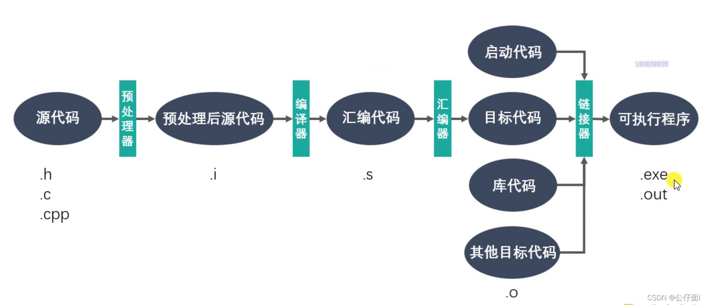
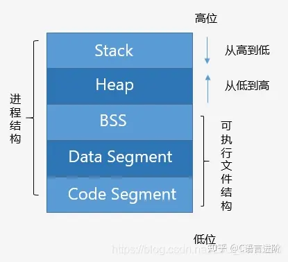
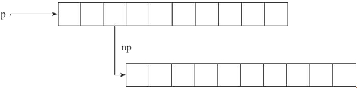
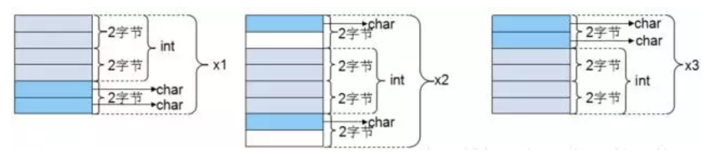
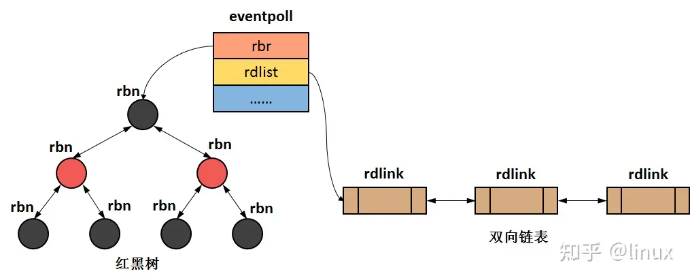
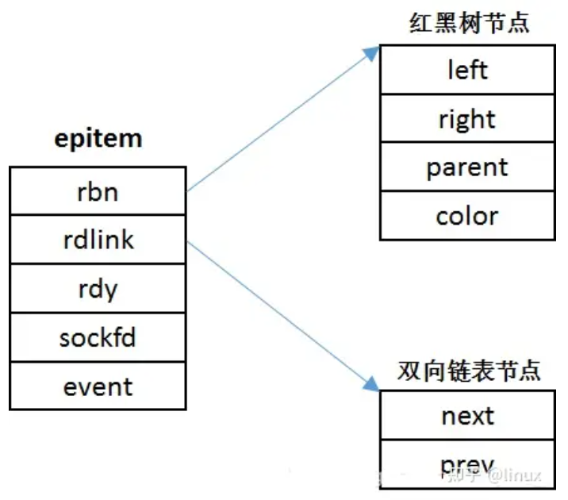
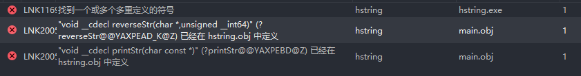
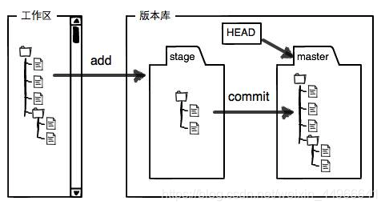
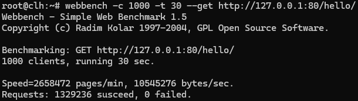

# c++基础

## class 和struct的区别

在C语言中struct是一种数据类型，不能包含任何函数。面向过程的编程认为，数据和操作是分离开的。但是到了面向对象的c++时，struct得到了很大的扩充，其可以包括成员函数、可以实现继承、可以实现多态。

那么在C++中struct和class的主要区别有：

+ 默认的继承访问权限。class默认的是private，struct默认的是public。在C++中class可以继承struct，struct也可以继承class。
+ 默认访问权限。struct作为数据结构的实现体，默认的数据访问控制是public，而class作为对象的实现体，默认的成员变量访问控制是private。
+ class关键字可以用于定义模板参数，例如 `template<class T>等效与template<typename T>`，而struct不能。
  > 综和以上三点，C++中struct更适合看成是一个数据结构的实现体，class更适合看成是一个对象的实现体。
  >
+ 在使用大括号上的区别。两者如果定义了构造函数的话，都不能用大括号进行初始化。如果没有定义构造函数，且所有成员变量全是public的话，都可以用大括号初始化。
  > PS：因此也不算是区别，知识struct成员默认是public，所以更多情况下都可以用大括号初始化。
  >

两者最大的区别就在于思想上，C语言编程单位是函数，语句是程序的基本单元。而C++语言的编程单位是类。从C到C++设计由以过程设计为中心向以数据组织为中心转移。

虽然感觉struct是多余的，但是考虑到“对C兼容性”，就将struct保留了下来，并做了一些扩展使其更适合面向对象，因此C++中的struct也不再是C中的struct。

## 输入流

+ `cin >> ch`会忽略任何空白字符（空格、制表符、换行符），`cin.get(ch)`读取每个字符以及空白字符。
+ 在命令行中，需要手动输入 EOF 来终止输入。在 Windows 上，可以通过按 `Ctrl+Z` 然后回车来发送 EOF；在 Unix/Linux/Mac 系统上，可以通过按 `Ctrl+D` 来发送 EOF。

## 编译

```
g++ -o hello hello.cpp	//编译输出一个可执行文件
```

`-o hello`选项告诉编译器将输出（一个可执行文件）命名为"hello"，没有错误将不会产生任何输出。

```
./hello		//执行可执行文件
```

## 指向指针的引用

```
int v = 1;
int *p = &v;
int *&rp = p;
```

`&`说明rp是一个引用。`*`确定rp引用的类型是一个指针。

## GCC编码过程



## 全局变量和局部变量

### 默认初始化

只要是变量，不赋初值，编译器就会默认初始化，但是

+ 全局变量默认初始化为0，之后可以使用。
+ 而局部变量默认初始化为随机数（但也有很大可能是0），不能作右值使用（报错），作左值只会警告，但是由于是随机数也没意义。

int 数组在局部变量

## 关键字

### explicit

```
#include <iostream>
using namespace std;

class Point {
public:
    int x, y;
    Point(int x = 0, int y = 0)
        : x(x), y(y) {}
};

void displayPoint(const Point& p) 
{
    cout << "(" << p.x << "," 
         << p.y << ")" << endl;
}

int main()
{
    //如果构造函数不加explicit，发生隐式转换，输出(1,0)。 如果加上，则会报错：不存在从int转换到point的适当构造函数
    displayPoint(1);
    Point p = 1;
}
```

### enum

## 内存管理

### 内存分布



**Code Segment（代码区）**

也称Text Segment，存放可执行程序的机器码。

**Data Segment (数据区）**

存放已初始化的全局和静态变量， 常量数据（如字符串常量）。

**BSS（Block started by symbol)**

存放未初始化的全局和静态变量。（默认设为0）

**Heap（堆）**

从低地址向高地址增长。容量大于栈，程序中动态分配的内存在此区域。

**Stack（栈）**

从高地址向低地址增长。由编译器自动管理分配。程序中的局部变量、函数参数值、返回变量等存在此区域。

### 内存泄露

+ 内存溢出OMM（out of memory），是指程序在申请内存的时候，没有足够的内存空间供其使用，会出现out of memory。如：申请一个int，但给它存了long才能存的下的数，会导致内存溢出。
+ 内存泄露（memory leak），是指程序向操作系统申请分配内存（`new`），但是使用完后不释放已申请的内存空间（`delete`），导致操作系统无法再次将它分配给需要的程序。一次内存泄露危害可以忽略，但内存泄露不断堆积，最终会导致OOM。

> **造成内存泄露的三种常见情况：**

1. 指针重新赋值。指针重新赋值后，原来指向的内存空间没有被释放。示例如下

   ```
   char * p = (char *)malloc(10);
   char * np = (char *)malloc(10);
   p=np;
   ```
2. 错误的内存释放。释放结构化的元素，该元素又包含指向动态分配的内存位置的指针时，如果只释放该结构化的元素，会导致其中的元素所指向的内存空间无法释放。

   ```
   free(p);
   ```

   
3. 返回值的不正确处理。某些函数会返回对动态分配的内存的引用（指针），但调用函数的地方未对返回值进行处理，之后也无法找到指向该内存的指针，自然也无法释放。

   ```
   char *f(){
   	return (char *)malloc(10);
   }
   void f1(){
   	f();
   }
   ```

**避免内存泄露的方法：**

1. 对指针赋值时，确保没有内存的位置会变孤立
2. 释放结构化元素（该元素又包含指向动态分配的内存位置的指针），应该先遍历释放子内存位置，最后再释放结构化元素。
3. 正确处理返回动态分配的内存的引用的函数返回值。

### 内存对齐

**为什幺要内存对齐**：尽管内存是以字节为单位，但是大部分处理器并不是按字节块来存取内存，其一般会以2字节、4字节、8字节等内存存取细粒度来存取。因此，如果没有内存对齐机制，数据可以任意存放，在32位系统上的，一个int变量放在从1开始的地址中，处理器去取数据时，首先会从0地址开始读取一个4字节块，剔除不需要的字节（0地址），然后再从地址4开始读取下一个4字节块，同样剔除不要的字节（4，5，6地址），最后才能将数据合并放入寄存器，这需要很多工作。

#### 内存对齐规则

每个平台的编译器都有自己的默认“**对齐系数**”（也叫对齐模数），gcc中默认 #pragma pack(4)。

**有效对齐值**：是#pragma pack(4)、结构体中最长数据类型长度两者中较大的那个。也叫对齐单位。

**内存对齐规则**：

1. 结构体第一个成员的偏移量（offset）为0，以后每个成员相对于首地址的偏移量都是该成员大小和有效对齐值两者中较小那个的整数倍。如有需要编译器会在成员之间加上填充字。
2. 结构体的总体大小为**对齐系数**的整数倍，如有需要编译器会在最末一个成员之后填充字节。

在32位系统和 `#pragma pack(2)`下三个结构体的内存分布



#### alignof和 alignas

 `alignof`可以计算出类型的对齐方式，`alignas`可以指定结构体的对齐方式（即指定对齐系数）。

```
struct alignas(4) Info2 {
  uint8_t a;
  uint16_t b;
  uint8_t c;
};

std::cout << sizeof(Info2) << std::endl;   // 8  4 + 4
std::cout << alignof(Info2) << std::endl;  // 4
```

注意：若 `alignas`小于自然对齐的最小单位，则被忽略。原因参考有效对齐值。

如果想使用单字节对齐的方式，使用 `alignas`是无效的。应该使用 `#pragma pack(push,1)`或者使用 `__attribute__((packed))`。

```
#if defined(__GNUC__) || defined(__GNUG__)
  #define ONEBYTE_ALIGN __attribute__((packed))
#elif defined(_MSC_VER)
  #define ONEBYTE_ALIGN
  #pragma pack(push,1)
#endif

struct Info {
  uint8_t a;
  uint32_t b;
  uint8_t c;
} ONEBYTE_ALIGN;

#if defined(__GNUC__) || defined(__GNUG__)
  #undef ONEBYTE_ALIGN
#elif defined(_MSC_VER)
  #pragma pack(pop)
  #undef ONEBYTE_ALIGN
#endif

std::cout << sizeof(Info) << std::endl;   // 6 1 + 4 + 1
std::cout << alignof(Info) << std::endl;  // 1
```

#### 指定成员所占位数

指定结构体中每个成员所占位数

```
#if defined(__GNUC__) || defined(__GNUG__)
  #define ONEBYTE_ALIGN __attribute__((packed))
#elif defined(_MSC_VER)
  #define ONEBYTE_ALIGN
  #pragma pack(push,1)
#endif

/**
* 0 1   3     6   8 9            15
* +-+---+-----+---+-+-------------+
* | |   |     |   | |             |
* |a| b |  c  | d |e|     pad     |
* | |   |     |   | |             |
* +-+---+-----+---+-+-------------+
*/
struct Info {
  uint16_t a : 1;	//指定只占1位
  uint16_t b : 2;	//指定只占2位
  uint16_t c : 3;
  uint16_t d : 2;
  uint16_t e : 1;
  uint16_t pad : 7;
} ONEBYTE_ALIGN;

#if defined(__GNUC__) || defined(__GNUG__)
  #undef ONEBYTE_ALIGN
#elif defined(_MSC_VER)
  #pragma pack(pop)
  #undef ONEBYTE_ALIGN
#endif

std::cout << sizeof(Info) << std::endl;   // 共占16位，2字节
std::cout << alignof(Info) << std::endl;  // 1
```

## 容器

### String

#### npos

string::npos就是一个公有的静态的常量类型的成员变量。成员函数返回该值时，说明函数没有找到你期望找的值。

#### 成员函数

String拥有find成员函数，如果找到返回下标，如果找不到返回-1(npos)。

### 自定义排序规则

**全局函数指针定义规则**

```
#include<iostream>
#include<algorithm>
using namespace std;

bool cmp(int x,int y){
	return x < y ;
}

int main(){
	int num[10] = {65,59,96,13,21,80,72,33,44,99};
	sort(num,num+10,cmp);
	for(int i=0;i<10;i++){
		cout<<num[i]<<" ";
	}

	return 0;

} 
```

请注意：定义的排序函数必须是全局函数，不能写在某个类或其他函数中。

**函数对象定义规则**

```
struct myclass {
  bool operator() (int x,int y) 
  { 
   return x<y;
  }
};

int main(){
	int num[10] = {65,59,96,13,21,80,72,33,44,99};
	sort(num,num+10,myclass());
	for(int i=0;i<10;i++){
		cout<<num[i]<<" ";
	}

	return 0;

} 
```

注意：重载的是()，myclass()表示临时对象，此方法下传入sort的必须是一个函数对象。

## 基本数据类型

### char、signed char、unsigned char

+ 三者都占1个字节。
+ signed char取值范围是 -128 到 127(有符号位)。unsigned char 取值范围是 0 到 255。
+ 内存中一串二进制，它的含义，就是这个类型来说明的。
+ 所谓signed char 和 unsigned char 其实是相对“运算”而说的，已经脱离了我们字面含义“字符”，表示的范围有限。

## 类

### 成员变量初始化

默认成员初始化器是包含于成员声明中的花括号或者等号初始化器。

即在类定义时初始化类成员变量，只能用等号或者初始化列表。

### RAII机制

RAII(Resource Acquisition is Initialization)，是C++语言的一种资源管理、避免内存泄露的惯用方法。利用C++构造的对象最终会被销毁的原则。使用局部对象来管理资源的技术称为资源获取即初始化。

RAII做法是使用一个对象，在其构造时获取对应的资源，在对象生命期内控制对资源的访问，使之始终保持有效，最后在对象析构时，释放构造时获取的资源。

优点：由于系统资源有限，其又不具有自动释放的功能，而C++中的类具有自动调用析构函数的功能。因此，可以把资源用类封装起来，在类构造函数中申请资源，对资源的操作也都封装在内部，在析构函数中释放资源。这样，在需要使用资源时创建该对象进行操作，当该局部变量生命周期结束时，它的析构函数就会被自动调用，资源也就会被自动释放。

## 内置函数

### std::async

普通线程创建方法：

```
void f(int n)
std::thread t(f,n+1);
t.join();
```

普通创建方法如果想获取线程函数返回的结果时需要先定义一个变量，在线程函数中给其赋值，然后join，最后得到结果。

而异步接口std::async会自动创建一个线程去调用线程函数，它返回一个std::future，这个future中存储了线程函数返回的结果，当我们需要线程函数的结果时，直接从future中获取，非常方便。函数原型如下：

```
template <class Fn, class... Args>
future<typename result_of<Fn(Args...)>::type> async (launch policy, Fn&& fn, Args&&... args);
```

+ launch policy：
  + `std::launch::async` ：保证行为是异步的 - 传入函数在单独的线程中执行；
  + `std::launch::deferred` ：行为是非异步的 - 会在其他线程调用 future 的 `get()` 时被调用传入的回调函数
  + `std::launch::async | std::launch::deferred` ：程序会根据系统情况自动决定是同步还是异步，开发者无法手动控制。
+ Fn&& fn ：线程执行的函数。
+ Args&&... args：执行函数的参数。
+ 返回值：返回一个 `std::future<T>`，存储 `std::async()` 调用的函数对象的返回值。

使用示例：

```
#include <iostream>
#include <string>
#include <chrono>
#include <thread>
#include <future>

using namespace std::chrono;

std::string fetchDataFromDB(std::string recvdData)
{
    // 模拟耗时的数据库查询操作，让该函数运行五秒
    std::this_thread::sleep_for(seconds(5));

    return "DB_" + recvdData;
}

std::string fetchDataFromFile(std::string recvdData)
{
    // 模拟耗时的本地数据读取操作，让该函数运行五秒
    std::this_thread::sleep_for(seconds(5));

    return "File_" + recvdData;
}

int main()
{
    // 获取开始时间
    system_clock::time_point start = system_clock::now();

    std::future<std::string> resultFromDB = std::async(std::launch::async, fetchDataFromDB, "Data");

    // 从本地文件获取数据
    std::string fileData = fetchDataFromFile("Data");

    // 从数据库获取数据
    // 代码会在此处阻塞，直到 future<std::string> 对象中的数据就绪
    std::string dbData = resultFromDB.get();

    // 获取结束时间
    auto end = system_clock::now();

    auto diff = duration_cast < std::chrono::seconds > (end - start).count();
    std::cout << "总耗时 = " << diff << " 秒" << std::endl;

    // 混合数据
    std::string data = dbData + " :: " + fileData;

    // 打印混合数据
    std::cout << "Data = " << data << std::endl;

    return 0;
}
```

**内部具体操作**，std::async先将异步操作用std::packaged_task包装起来，然后将异步操作的结果放到std::promise中，这个过程就是创造未来的过程。外面再通过future.get/wait来获取这个未来的结果。

#### std::future

其中存储了线程函数返回的结果，可以通过查询future的状态（future_status）。future_status有三种状态：

+ deferred：异步操作还没开始；
+ ready：异步操作已经完成；
+ timeout：异步操作超时。

示例如下：

```
do {
        std::future_status status = future.wait_for(std::chrono::seconds(1));
        if (status == std::future_status::deferred) {
            std::cout << "deferred\n";
        } else if (status == std::future_status::timeout) {
            std::cout << "timeout\n";
        } else if (status == std::future_status::ready) {
            std::cout << "ready!\n";
        }
} while (status != std::future_status::ready);
```

获取future结果的方式：

+ get：等待异步操作结束并返回结果；
+ wait：等待异步操作完成，没有返回值；
+ wait_for：超时等待返回结果。

#### std::promise

在线程函数中给外面传来的promise赋值，其取值也是间接的通过promise内部提供的future来获取的。示例如下：

```
std::promise<int> pr;
    std::thread t([](std::promise<int>& p){ p.set_value_at_thread_exit(9); },std::ref(pr)); //std::ref(pr)表示pr的引用
    std::future<int> f = pr.get_future();
    auto r = f.get();
```

#### std::packaged_task

包装一个可调用的目标（如function、lambda expression、bind expression、or another function object），以便异步调用。与promise相似，不过promise保存了一个共享状态的值，pacakged_task保存的是一个函数。示例如下：

```
    std::packaged_task<int()> task([](){ return 7; });
    std::thread t1(std::ref(task)); 
    std::future<int> f1 = task.get_future(); 
    auto r1 = f1.get();
```

[深入浅出 c++11 std::async - 程远春 - 博客园 (cnblogs.com)](https://www.cnblogs.com/chengyuanchun/p/5394843.html)

[C++ 11 多线程 (9) - std::async 教程及示例 - 知乎 (zhihu.com)](https://zhuanlan.zhihu.com/p/633462603)

### 使用示例-异步加载模型	

```
#include <iostream>
#include <future>
#include <onnxruntime_cxx_api.h>

// 模型加载函数
Ort::Session load_model(const std::string& model_path, Ort::Env& env) {
    Ort::SessionOptions session_options;
    session_options.SetIntraOpNumThreads(1);
    session_options.SetGraphOptimizationLevel(GraphOptimizationLevel::ORT_ENABLE_EXTENDED);
  
    // 加载模型
    Ort::Session session(env, model_path.c_str(), session_options);
    return session;
}

int main() {
    // 初始化 ONNX Runtime 环境
    Ort::Env env(ORT_LOGGING_LEVEL_WARNING, "ONNXRuntime");

    // 异步加载模型
    std::string model_path = "path/to/your/model.onnx";
    std::future<Ort::Session> future_model = std::async(std::launch::async, load_model, model_path, std::ref(env));

    // 你可以在这里进行其他操作，例如处理输入数据或进行其他初始化
    std::cout << "Loading model asynchronously..." << std::endl;

    // 获取加载的模型
    Ort::Session session = future_model.get();
    std::cout << "Model loaded successfully." << std::endl;

    // 模型加载完成后可以继续进行其他操作，例如推理
    // ...
  
    return 0;
}

```

## 其他

### \n\t

Windows点一下回车，效果是回车换行，为\n\r

Unix系统下回车以下就是\n

回车换行（\n\r）：每次光标移到下一行的行首位置处

换行（\r）：每次光标移动到本行的行首位置处

### 有限状态机

有限状态机（Finite State Machine）是一种理论模型，用于表示、处理具有一定数量状态的系统，用于描述一个系统在有限个特定状态之间的转换。在任何特定时间点，FSM只能处于这些状态中的一个。状态的变更通常由事件（event）或条件触发。回调函数作为状态的响应机制，对特定事件做出反应。

线程池

```
#include <iostream>
#include <vector>
#include <queue>
#include <thread>
#include <mutex>
#include <condition_variable>
#include <functional>
#include <future>

class ThreadPool {
public:
    // 构造函数，初始化线程池
    ThreadPool(size_t threads);

    // 析构函数，销毁线程池
    ~ThreadPool();

    // 添加新任务到任务队列
    // F 是函数类型，Args 是参数类型
    template<class F, class... Args>
    auto enqueue(F&& f, Args&&... args) -> std::future<typename std::result_of<F(Args...)>::type>;

private:
    // 工作线程列表
    std::vector<std::thread> workers;

    // 任务队列
    std::queue<std::function<void()>> tasks;

    // 同步任务队列的互斥锁
    std::mutex queue_mutex;

    // 条件变量，用于通知工作线程有新任务到来
    std::condition_variable condition;

    // 线程池停止标志
    bool stop;
};

// 构造函数，创建指定数量的工作线程
ThreadPool::ThreadPool(size_t threads) : stop(false) {
    for (size_t i = 0; i < threads; ++i) {
        workers.emplace_back([this] {
            for (;;) {
                std::function<void()> task;

                {
                    std::unique_lock<std::mutex> lock(this->queue_mutex);

                    // 等待直到有任务到来或线程池停止
                    this->condition.wait(lock, [this] { return this->stop || !this->tasks.empty(); });

                    if (this->stop && this->tasks.empty())
                        return;

                    // 获取任务队列中的一个任务
                    task = std::move(this->tasks.front());
                    this->tasks.pop();
                }

                // 执行任务
                task();
            }
        });
    }
}

// 析构函数，停止所有工作线程并清理资源
ThreadPool::~ThreadPool() {
    {
        std::unique_lock<std::mutex> lock(queue_mutex);
        stop = true;
    }

    // 通知所有工作线程停止
    condition.notify_all();

    // 等待所有工作线程完成
    for (std::thread &worker : workers)
        worker.join();
}

// 添加新任务到任务队列
template<class F, class... Args>
auto ThreadPool::enqueue(F&& f, Args&&... args) -> std::future<typename std::result_of<F(Args...)>::type> { //？？
    using return_type = typename std::result_of<F(Args...)>::type;

    // 创建一个任务，打包为 std::packaged_task
    auto task = std::make_shared<std::packaged_task<return_type()>>(std::bind(std::forward<F>(f), std::forward<Args>(args)...));

    std::future<return_type> res = task->get_future();
    {
        std::unique_lock<std::mutex> lock(queue_mutex);

        if (stop)
            throw std::runtime_error("enqueue on stopped ThreadPool");

        // 将任务添加到任务队列中
        tasks.emplace([task]() { (*task)(); });
    }

    // 通知一个工作线程有新任务到来
    condition.notify_one();
    return res;
}
```


# 网络编程

## I/O多路复用

单线程或单进程同时监测若干个文件描述符是否可执行I/O操作的能力。

### 问题分析

利用多线程、进程来表示执行流，去执行多个事件流，可以做到事件流并发进行。

> 逻辑控制流在时间上的重叠叫做并发。

但多线程/进程的操作会导致额外的成本，主要有：

+ 线程/进程的创建成本
+ CPU切换不同线程/进程的成本（context switch）
+ 多线程的资源竞争

因此，如何在单线程/进程中处理事件流，就是I/O多路复用要解决的问题。I/O多路复用解决的本质问题是用更少的资源完成更多的事。

Linux提供的5种I/O处理模型：

+ 阻塞I/O
+ 非阻塞I/O
+ I/O多路复用
+ 信号驱动I/O
+ 异步I/O

> 同步IO vs 异步IO
>
> 1. 同步IO指的是IO操作会阻塞当前程序的执行，程序会一直阻塞到IO操作完成（如read、write）
> 2. 异步IO指的是IO操作不会阻塞当前程序的继续执行
>
> 因此，以上五种模型中，只有异步IO是完成了数据的全部拷贝流程后才通知应用程序进行处理，没有阻塞的数据读写过程。其它四种均为同步IO。

### 非阻塞I/O

### 阻塞I/O

### I/O多路复用

#### select

流程图


#### epoll

底层实现：

+ 用户调用epoll_create()，会创建eventpoll对象（包含一个红黑树和一个双向链表）
+ 用户调用epoll_ctr()，会对eventpoll中的红黑树结点（epitem对象）进行操作（添加、删除、修改）。
+ 系统会利用epoll_event_callback()管理对象。当有事件被触发时，操作系统调用epoll_event_callback()函数，将对应epitem添加到双向链表中。函数原型为： `int epoll_event_callback(struct eventpoll *ep, int sockid, uint32_t event)`。触发该调用的5中情况有：

  1. 客户端connec()连入，服务器处于SYN_RCVD状态时
  2. 三次握手完成，服务器处于ESTAB-lished状态时
  3. 客户端close()断开连接时
  4. 客户端send/write()数据，服务器可读时
  5. 服务器可写时

  其中，4、5为epoll中常见的情况。

涉及的数据结构如下：

1、eventpoll



2、epitem



IO多路复用效率高的原因：操作系统提供了这样的系统调用（select、poll、epoll），使得原来用户态while循环里的多次系统调用，变成了一次系统调用+内核层遍历这些文件描述符。

### 信号驱动I/O

### 异步I/O

参考链接：

[一文看懂IO多路复用 - 知乎 (zhihu.com)](https://zhuanlan.zhihu.com/p/115220699)

[你管这破玩意叫 IO 多路复用？ (qq.com)](https://mp.weixin.qq.com/s?__biz=Mzk0MjE3NDE0Ng==&mid=2247494866&idx=1&sn=0ebeb60dbc1fd7f9473943df7ce5fd95&chksm=c2c5967ff5b21f69030636334f6a5a7dc52c0f4de9b668f7bac15b2c1a2660ae533dd9878c7c&scene=21#wechat_redirect)

[【底层原理】epoll源码分析，还搞不懂epoll的看过来 - 知乎 (zhihu.com)](https://zhuanlan.zhihu.com/p/552580039)

# 设计模式

整个设计模式的意义？没理解具体意义？

## 创建型模式

### 单例模式

单例模式(Singleton Pattern，也称为单件模式)，使用最广泛的设计模式之一。其意图是保证一个类仅有一个实例，并提供一个访问它的全局访问点，该实例被所有程序模块共享。

**单例类特点：**

1. 私有化构造函数和析构函数，禁止外部构造和析构，防止外界创建单例类的对象；
2. 私有化拷贝函数和赋值构造函数，禁止外部拷贝和赋值，确保实例的唯一性；
3. 使用类的私有静态指针变量指向类的唯一实例（可选，一般都有）；
4. 提供一个公有的静态方法获取该实例。

**单例模式的优点：**

1. 节省资源。一个类只有一个实例，不存在多份实例，节省资源。
2. 方便控制。在一些操作公共资源的场景时，避免了多个对象引起的复杂操作。

**保证线程安全：**

实现单例模式时，需要考虑到线程安全的问题。

> 什么是线程安全？
>
> 假如有一个共享数据供多条线程使用，多条线程在并行执行的过程中，线程安全的代码会通过同步机制保证各个线程都可以正常且正确的执行和访问共享数据，不会出现数据污染等意外情况。

保证线程安全的方法如下：

1. 给共享的资源加把锁。保证每个资源变量每时每刻至多被一个线程占用。
2. 让线程也拥有资源。使其不用去共享进程中的资源。如：使用threadlocal可以为每个线程维护一个私有的本地变量。

**单例模式分类**

可以分为懒汉式和饿汉式，两者的区别在于创建实例的时间不同。

+ 懒汉式：程序运行中，实例并不存在，只有当需要使用该实例时，才回去创建并使用该实例。该方式需要考虑线程安全。
+ 饿汉式：程序已运行，就初始化创建实例，当需要时，直接调用即可。该方式本身线程安全。

#### 懒汉式单例实现

**普通懒汉式单例（线程不安全）**

这种情况是线程不安全的，不作详细介绍。

**加锁的懒汉式单例（线程安全）**

使用互斥锁保证线程安全。

有返回普通指针和智能指针两种方式。返回智能指针的方式如下：

```
#include <iostream>
#include <memory>
#include <mutex>


class Singleton {

public:

    static std::shared_ptr<Singleton> getSingleton();

    void print() {
        std::cout << "Hello World." << std::endl;
    }

    ~Singleton() {
        std::cout << __PRETTY_FUNCTION__ << std::endl;
    }

private:

    Singleton() {
        std::cout << __PRETTY_FUNCTION__ << std::endl;
    }
};

static std::shared_ptr<Singleton> singleton = nullptr;
static std::mutex singletonMutex;

std::shared_ptr<Singleton> Singleton::getSingleton() {
    if (singleton == nullptr) {
        std::unique_lock<std::mutex> lock(singletonMutex);
        if (singleton == nullptr) {
            volatile auto temp = std::shared_ptr<Singleton>(new Singleton());
            singleton = temp;
        }
    }
    return singleton;
}

```

**静态局部变量的懒汉单例（C++11线程安全）**

头文件：

```
///  内部静态变量的懒汉实现  //

class Single
{

public:
    // 获取单实例对象
    static Single& GetInstance();

	// 打印实例地址
    void Print();

private:
    // 禁止外部构造
    Single();

    // 禁止外部析构
    ~Single();

    // 禁止外部拷贝构造
    Single(const Single &single) = delete;

    // 禁止外部赋值操作
    const Single &operator=(const Single &single) = delete;
};
```

源文件：

```
Single& Single::GetInstance()
{
    /**
     * 局部静态特性的方式实现单实例。
     * 静态局部变量只在当前函数内有效，其他函数无法访问。
     * 静态局部变量只在第一次被调用的时候初始化，也存储在静态存储区，生命周期从第一次被初始化起至程序结束止。
     */
    static Single single;
    return single;
}

void Single::Print()
{
    std::cout << "我的实例内存地址是:" << this << std::endl;
}

Single::Single()
{
    std::cout << "构造函数" << std::endl;
}

Single::~Single()
{
    std::cout << "析构函数" << std::endl;
}
```

#### 饿汉式单例（线程安全）

头文件：

```
class Singleton
{
public:
    // 获取单实例
    static Singleton* GetInstance();

    // 释放单实例，进程退出时调用
    static void deleteInstance();
  
    // 打印实例地址
    void Print();

private:
    // 将其构造和析构成为私有的, 禁止外部构造和析构
    Singleton();
    ~Singleton();

    // 将其拷贝构造和赋值构造成为私有函数, 禁止外部拷贝和赋值
    Singleton(const Singleton &signal);
    const Singleton &operator=(const Singleton &signal);

private:
    // 唯一单实例对象指针
    static Singleton *g_pSingleton;
};
```

源文件：

```
// 代码一运行就初始化创建实例 ，本身就线程安全
Singleton* Singleton::g_pSingleton = new (std::nothrow) Singleton();

Singleton* Singleton::GetInstance()
{
    return g_pSingleton;
}

void Singleton::deleteInstance()
{
    if (g_pSingleton)
    {
        delete g_pSingleton;
        g_pSingleton = nullptr;
    }
}
```

#### C++11 std::call_once 实现单例

```
#include <iostream>
#include <memory>
#include <mutex>

class Singleton {
public:
    static std::shared_ptr<Singleton> getSingleton();

    void print() {
        std::cout << "Hello World." << std::endl;
    }

    ~Singleton() {
        std::cout << __PRETTY_FUNCTION__ << std::endl;
    }

private:
    Singleton() {
        std::cout << __PRETTY_FUNCTION__ << std::endl;
    }
};

static std::shared_ptr<Singleton> singleton = nullptr;
static std::once_flag singletonFlag;

std::shared_ptr<Singleton> Singleton::getSingleton() {
    std::call_once(singletonFlag, [&] {
        singleton = std::shared_ptr<Singleton>(new Singleton());
    });
    return singleton;
}
```

### 工厂模式

工厂模式适用于大量的产品需要创建，并且这些产品具有共同的接口。

**大致分为3类：**

+ 简单工厂模式。定义一个创建对象的类，由这个类来封装实例化对象的行为。缺点：类的创建依赖工厂类，如果想要扩展程序，必须对工厂类修改，这违背了开闭原则。
+ 工厂方法模式。定义一个创建对象的抽象方法，由子类决定要实例化的类。工厂方法模式将对象的实例化推迟到子类。
+ 抽象工厂模式。定义一个接口用于创建相关或有依赖关系的对象族，而无需明确指定具体类。

**工厂模式的使用选择：**

+ 简单工厂 ： 用来生产同一等级结构中的任意产品。（不支持拓展增加产品）
+ 工厂方法 ：用来生产同一等级结构中的固定产品。（支持拓展增加产品）
+ 抽象工厂 ：用来生产不同产品族的全部产品。（支持拓展增加产品；支持增加产品族）

## 行为型模式

### 观察者模式

定义： 定义对象间的一种一对多的依赖关系，当一个对象的状态发生改变时，所有依赖于它的对象都得到通知并被自动更新。

主要解决：一个对象状态改变给其他对象通知的问题，而且要考虑到易用和低耦合，保证高度的协作。

何时使用：一个对象（目标对象）的状态发生改变，所有的依赖对象（观察者对象）都将得到通知，进行广播通知。

**优点：**

1. 察者和被观察者是抽象耦合的。
2. 建立一套触发机制。

**缺点：**

1. 如果一个被观察者对象有很多的直接和间接的观察者的话，将所有的观察者都通知到会花费很多时间
2. 如果在观察者和观察目标之间有循环依赖的话，观察目标会触发它们之间进行循环调用，可能导致系统崩溃。
3. 观察者模式没有相应的机制让观察者知道所观察的目标对象是怎么发生变化的，而仅仅只是知道观察目标发生了变化。

# 操作系统

## 进程、线程见通讯方式

**进程间通信方式：**

+ **管道（pip）**：半双工通信方式，由操作系统管理，只能用于父子进程间通信；
+ **有名管道（namepip）**：半双工通讯方式，......，可用于普通进程间的通信；
+ **信号量（semophore）**：信号量是一个计数器，可以控制多个进程对共享资源的访问，经常作为一种锁机制。分为命名信号量和无名信号量，其工作原理相同，但创建和销毁的形式不同。
  + **无名信号量**：存在于进程的地址空间中，不关联任何外部的名称，因此在多个线程或进程之间共享无名信号量，必须借助共享的内存区域。无名信号量的生命周期与包含它的进程相同，进程终止时，无名信号量就不存在了。因此，其更适用于线程间同步，进程间的同步需要借助共享内存。
  + **命名信号量**：命名信号量由一个与其关联的名称标识，通常在某种文件系统（如/dev/shm/）中实现，这使得它可以在不相关的进程间共享。其生命周期不随进程终止而终止，只有调用sem_unlink()删除它，生命周期才会结束。因此更适合于进程间同步，线程同步也可以用。
+ **消息队列**：是消息的链表，在内核中并带有消息队列标识符。其客服了信号量传递的信息少、管道只能承载无格式字节流和缓冲区大小受限的缺点。
+ **共享内存**：映射一段能被其他进程所访问的内存，其由一个进程创建，其他进程都可以访问。共享内存是最快的IPC方式，通常与其它通信机制，如信号量配合使用，实现进程间的同步和通信。
+ **socket**：用于不同设备间的进程通信。
+ **信号**：用于通知接进程某个事件已经发生，比较复杂。

**线程间通信方式**

+ **锁机制**：包括互斥锁、条件变量、读写锁
+ **信号量**：见进程
+ **信号**：见进程

线程间的通信往往用于线程同步，因此是没有像进程通信中用于数据交换的通信机制，其实也不需要类似通信机制，因为线程间可借助它们共享的进程内存进行数据交换。

# 未解答的疑问

## C++primer书

### 练习4.21（p135）

```
vector<int> v1 = { 1,2,3,4,5,6,7,8,9 };
it = v1.begin();
while (it != v1.end())
{
	(*it) % 2 == 1 ? *it++ *= 2 : *it++;	//冒号后边不能为it++，为什么？


}
```

## 自定义命名空间

### 重定义错误

在其中写类没问题，但在其中写函数基本都会报重定义错误，如下图。除非在每个函数前边加上inline修饰。为什么？



# Ubuntu相关命令

查看gcc的安装路径

```
gcc -print-search-dirs
```

# 工具

## git安装使用

### 本地配置

安装

```
sudo apt-get install git
```

配置用户名和邮箱

```
git config --global user.name "clh"
git config --global user.email "1317754301@qq.com"

//查看用户名和邮箱
git config user.name
git config user.email
```

配置SSH公钥，输入后连按回车

```
ssh-keygen -C 'example@example.com' -t rsa
```

复制公钥

```
cd ~/.ssh
cat id_rsa.pub

//如果没有该文件，创建一个
mkdir ~/.ssh
```

在Github中 `settings->SSH and GPG keys->New SSH Key`输入复制的公钥，Title为名字（可任意取）

进入需要git的文件下

```
git init 
```

创建文件

```
touch README.txt
vim README.txt
# 写入 Learning Git: New File.
cat README.txt # 查看文件内容
# 输出 Learning Git: New File.
```

将文件添加到仓库

```
git add README.txt
```

将文件提交到仓库

```
git commit -m "Submit a new file." 	# 双引号内是本次提交的注释，原则上可以随便写，但是尽量能表达出本次提交的改动。
```

### 远程仓库配置

Github创建仓库

本地添加远程仓库

```
git remote add <origin> git@github.com:<adenialzz/learngit.git>
```

提交到远程仓库

```
git push -u <origin> master	//第一次需要-u
git push <origin> master	//之后不用
```

更新到本地

```
git pull <远程主机名> <远程分支名>:<本地分支名>
git pull <orign> <remote>:<master>	//示例
```

### git版本控制原理



+ 工作区（Working Directory），创建的文件所在的目录就是一个工作区。
+ 版本库，仓库（Repository），工作区有个隐藏目录 .git ，这个不算工作区，而是 Git 的版本库。
+ 版本库里面的 index(stage) 文件叫暂存区，还有Git为我们自动创建的第一个分支 master ，以及指向 master 的一个指针叫做 HEAD。

关系：

1. `git add` 把文件添加进去，实际就是将文件**修改**添加到暂存区
2. `git commit`提交更改，把暂存区的所有内容提交到当前分支

### 撤销修改操作

1. 如果修改后还没有add，说明修改仅仅在工作区，使用 `git checkout -- <README.txt>`撤销修改。
2. 如果修改后add过，说明修改已经保存在暂存区，使用 `git reset <HEAD README.txt>`将暂存区的修改退回到工作区，此时恢复到了第一种情况，再使用 `git checkout -- <README.txt>`即可撤销修改。
3. add并commit后，此时修改已经提交到仓库，只能用版本回退，`git reset --hard HEAD^`

### 文件删除、恢复操作

在工作区中直接删除文件

```
rm <test.py>
```

确实要删除仓库中对应的文件

```
gitrm test.py
```

删除操作提交到仓库

```
git commit -m "delete test"
```

如果在工作区中误删文件，使用 `git checkout -- <test.py>`撤销删除

### 其他指令

```
git status	//查看仓库当前状态
git diff	//查看文件改动，可单独使用，也可以按顺序指定两个文件
//diff举例
git diff HEAD -- readme.txt	//查看版本库和工作区文件的区别

git log 	//查看仓库的修改日志
git log --pretty=oneline	//简化版日志
git reset --hard HEAD^		//版本回退，HEAD表示当前版本，HEAD^表示上一个版本，HEAD^^表示上上版本
git reset --hard <版本号>	//回退到指定版本
which git	//查看git的安装地址
git ls-files	//列出跟踪的文件
git rm --cached <文件名>	//删除文件的跟踪
```

### 忽略指定文件

```
touch  .gitignore     #创建gitignore隱藏文件  
vim    .gitignore     #编辑文件，加入指定文件
```

输入内容示例如下：

```
# 此为注释 – 将被 Git 忽略
*.a       # 忽略所有 .a 结尾的文件
!lib.a    # 但 lib.a 除外
/TODO     # 仅仅忽略项目根目录下的 TODO 文件，不包括 subdir/TODO
build/    # 忽略 build/ 目录下的所有文件
doc/*.txt # 会忽略 doc/notes.txt 但不包括 doc/server/arch.txt
```

如果已经push了，删除本地缓存

```
git rm -r --cached 文件/文件夹名字
```

## webbench

webbench最多可以模拟3万个并发连接去测试网站的负载能力

1.安装依赖exuberant-ctags

```
sudo apt-get install exuberant-ctags
```

2.下载源码并安装

```
wget http://blog.s135.com/soft/linux/webbench/webbench-1.5.tar.gz  
tar zxvf webbench-1.5.tar.gz  
cd webbench-1.5  
make && sudo make install
```

3.开始测试

```
webbench -c 1000 -t 30 --get http://127.0.0.1:80/hello/
```

其中hello为请求的文件名，会写在http请求行

可选参数信息如下：

```
webbench [option]... URL
  -f|--force               Don't wait for reply from server.
  -r|--reload              Send reload request - Pragma: no-cache.
  -t|--time <sec>          Run benchmark for <sec> seconds. Default 30.
  -p|--proxy <server:port> Use proxy server for request.
  -c|--clients <n>         Run <n> HTTP clients at once. Default one.
  -9|--http09              Use HTTP/0.9 style requests.
  -1|--http10              Use HTTP/1.0 protocol.
  -2|--http11              Use HTTP/1.1 protocol.
  --get                    Use GET request method.
  --head                   Use HEAD request method.
  --options                Use OPTIONS request method.
  --trace                  Use TRACE request method.
  -?|-h|--help             This information.
  -V|--version             Display program version.
```

结果分析：



Speed：每分钟的处理2658472个请求；每秒的处理数据量：10545276字节
Requests：处理的请求中成功1329236，失败0
