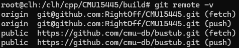

## CMU15-445/645 Database Systems

### 环境配置

GitHub上创建一个私有库

**项目克隆到本地**

```
git clone --bare https://github.com/cmu-db/bustub.git bustub-public
cd bustub-public
git push git@<github.com:J/CMU15445.git> master //push到自己的远程仓库，记得换成你自己的！
```

**删除本地克隆，拉去自己的**

```
cd ..
rm -rf bustub-public
git clone git@github.com:J/CMU15445.git # 记得换成你自己的！
```

**以下用来更新官方文件**

```
git remote add public https://github.com/cmu-db/bustub.git
```

**检查是否添加成功**

```
git remote -v
```



**build安装包**

```
sudo build_support/packages.sh
```

遇到报clang的错可以不管

**更换版本**

2023 Spring

```
git checkout 32b059b01912f5cf9ced9930b1b02db5b5b8b1a7
```

**构建项目**

```
mkdir build
cd build
cmake ..
make
```

报 `cannot find -liberty`、`cannot find -lz`错误

```
sudo apt-get install libiberty-dev
sudo apt-get install zlib1g-dev
```

**[gradescope](https://www.gradescope.com/)注册帐号**

课程号填 ~PXWVR5（2022 FALL）~ ，2KJRB5（2023 SPRING），学校填Carnegie Mellon University。

**测试**

```
cd build
make check-tests
```

### part01
