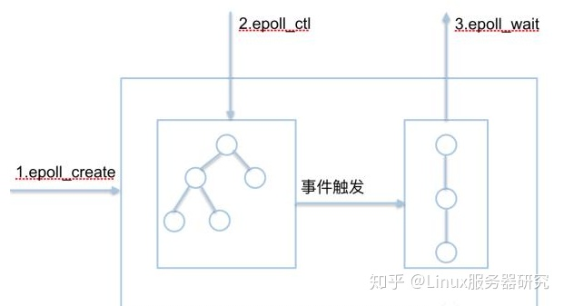
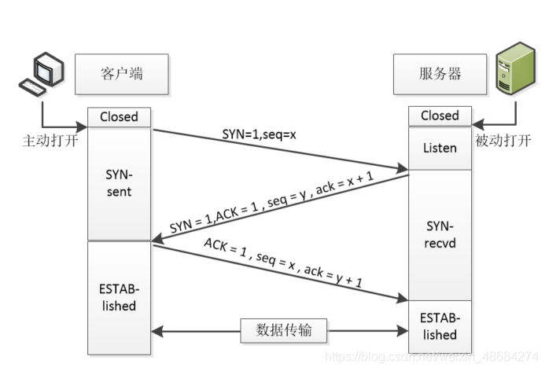
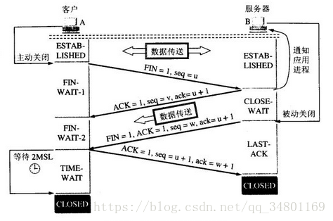
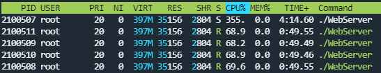
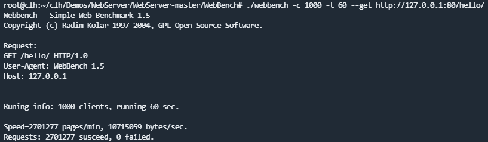
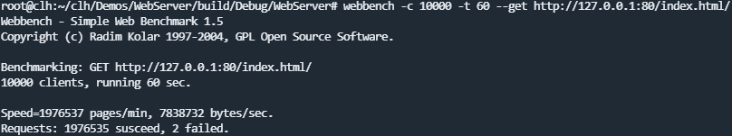
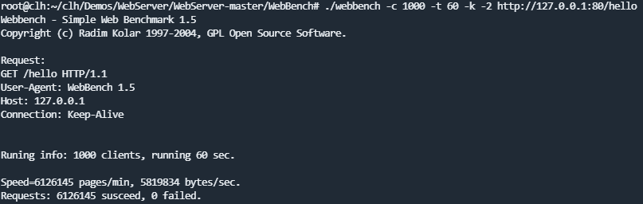

## WebServer

### Introduction

#### 并发模式：半同步/半异步

#### 事件处理模式：Reactor

### HTTPClient

### Channel

#### 事件

+ 可读事件，当文件描述符关联的内核读缓冲区可读，则触发可读事件。(可读：内核缓冲区非空，有数据可以读取)
+ 可写事件，当文件描述符关联的内核写缓冲区可写，则触发可写事件。(可写：内核缓冲区不满，有空闲空间可以写入）

#### epoll

epoll是一种I/O事件通知机制，是linux 内核实现IO多路复用的一个实现。采用通知机制，就是当事件发生的时候，则主动通知（通知机制的反面，就是轮询机制）。

epoll通俗解释是一种通知机制。当文件描述符的内核缓冲区非空的时候，发出可读信号进行通知；当写缓冲区不满的时候，发出可写信号通知。

核心数据结构是：1个红黑树和1个链表



##### 三个API

**1、**`b`

功能：内核会产生一个epoll 实例数据结构并返回一个文件描述符，这个特殊的描述符就是epoll实例的句柄，后面的两个接口都以它为中心（即epfd形参）。

size参数表示所要监视文件描述符的最大值，不过在后来的Linux版本中已经被弃用。

**2、**`int epoll_ctl(int epfd， int op， int fd， struct epoll_event *event)`

功能：将被监听的描述符添加到红黑树或从红黑树中删除或者对监听事件进行修改。

op可选参数说明操作类型：

+ EPOLL_CTL_ADD：向interest list添加一个需要监视的描述符
+ EPOLL_CTL_DEL：从interest list中删除一个描述符
+ EPOLL_CTL_MOD：修改interest list中一个描述符

epoll_event：该结构描述一个文件描述符的epoll行为。

```
typedef union epoll_data {
void ptr; / 指向用户自定义数据 /
int fd; / 注册的文件描述符 /
uint32_t u32; / 32-bit integer /
uint64_t u64; / 64-bit integer */
} epoll_data_t;

struct epoll_event {
uint32_t events; /* 描述epoll事件 /
epoll_data_t data; / 见上面的结构体 */
};
```

其中，events域是bit mask，描述一组epoll事件，在epoll_ctl调用中解释为：描述符所期望的epoll事件，可多选。

常用的epoll事件描述如下：

+ EPOLLIN：描述符处于可读状态
+ EPOLLOUT：描述符处于可写状态
+ EPOLLET：将epoll event通知模式设置成edge triggered
+ EPOLLONESHOT：第一次进行通知，之后不再监测
+ EPOLLHUP：本端描述符产生一个挂断事件，默认监测事件
+ EPOLLRDHUP：对端描述符产生一个挂断事件
+ EPOLLPRI：由带外数据触发
+ EPOLLERR：描述符产生错误时触发，默认检测事件

**3、**`int epoll_wait(int epfd， struct epoll_event *events， int maxevents， int timeout)`

功能：阻塞等待注册的事件发生，返回事件的数目，并将触发的事件写入events数组中。

参数详解：

+ 返回值：发生相应监听事件的文件描述符个数。
+ events：用来记录被触发的events，其大小应该和maxevents一致。
+ maxevents：返回的events的最大个数。
+ timeout：在函数调用中阻塞时间上限，单位是ms。
  + timeout = -1表示调用将一直阻塞，直到有文件描述符进入ready状态或者捕获到信号才返回；
  + timeout = 0用于非阻塞检测是否有描述符处于ready状态，不管结果怎么样，调用都立即返回；
  + timeout > 0表示调用将最多持续timeout时间，如果期间有检测对象变为ready状态或者捕获到信号则返回，否则直到超时。

events和maxevents两个参数描述一个由用户分配的struct epoll event数组。其中，struct epoll event结构中的events域在这里的解释是：在被监测的文件描述符上实际发生的事件。

运行机制：处于ready状态的那些文件描述符会被复制进ready list中，`epoll_wait`调用返回时，内核将ready list复制到这个数组中，并将实际复制的个数作为返回值。注意，如果ready list比maxevents长，则只能复制前maxevents个成员；反之，则能够完全复制ready list。

##### 两种触发方式

epoll支持水平触发（level trigger，LT)或边缘触发(edge trigger，ET)，默认的工作模式是LT模式。select和poll只支持LT工作模式。

**1、水平触发(LT)的时机**

+ 对于读操作。只要缓冲内容不为空，LT模式返回读就绪。
+ 对于写操作。只要缓冲区还不满，LT模式会返回写就绪。

当被监控的文件描述符上有可读写事件发生时，epoll_wait()会通知处理程序去读写。如果这次没有把数据一次性全部读写完(如读写缓冲区太小)，那么下次调用 epoll_wait()时，它还会通知你在尚没读写完的文件描述符上继续读写，当然如果一直不去读写，它会一直通知你。

造成的缺点：如果系统中有大量你不需要读写的就绪文件描述符，而它们每次都会返回，这样会大大降低处理程序检索自己关心的就绪文件描述符的效率。

**2、边缘触发(ET)的时机**

+ 对于读操作：
  + 当缓冲区由不可读变为可读时（即缓冲区由空变为不空的时候）；
  + 当有新数据到达时（即缓冲区中的待读数据变多的时候）；
  + 当缓冲区有数据可读，且应用进程对相应的描述符进行EPOLL_CTL_MOD 修改EPOLLIN事件时。
+ 对于写操作：
  + 当缓冲区由不可写变为可写时；
  + 当有旧数据被发送走，即缓冲区中的内容变少的时候；
  + 当缓冲区有空间可写，且应用进程对相应的描述符进行EPOLL_CTL_MOD 修改EPOLLOUT事件时。

在ET模式下， 缓冲区从不可读变成可读，会唤醒应用进程，缓冲区数据变少的情况，则不会再唤醒应用进程。

当被监控的文件描述符上有可读写事件发生时，epoll_wait()会通知处理程序去读写。如果这次没有把数据全部读写完(如读写缓冲区太小)，那么下次调用epoll_wait()时，它不会通知你，也就是它只会通知你一次，直到该文件描述符上出现第二次可读写事件才会通知你。

边缘触发比水平触发效率高，系统不会充斥大量你不关心的就绪文件描述符。

##### epoll与select、poll的对比

**1、用户态将文件描述符传入内核的方式**

+ select：创建3个文件描述符集（类型为fd_set，名称为readset、writeset、exceptset，集合下标值为文件描述符的值，集合内容为0或1）并拷贝到内核中，分别监听读、写、异常动作。受到单个进程可以打开的fd数量限制，默认是1024。
+ poll：将传入的struct pollfd结构体数组拷贝到内核中进行监听。
+ epoll：执行epoll_create会在内核的高速cache区中建立一颗红黑树以及就绪链表(该链表存储已经就绪的文件描述符)。接着用户执行的epoll_ctl函数添加文件描述符会在红黑树上增加相应的结点。

**2、内核态检测文件描述符读写状态的方式**

+ select：采用轮询方式，遍历所有fd，最后返回一个描述符读写操作是否就绪的mask掩码，根据这个掩码给fd_set（传入的文件描述符集合）赋值。
+ poll：同样采用轮询方式，查询每个fd的状态，如果就绪则在等待队列中加入一项并继续遍历。
+ epoll：采用回调机制。在执行epoll_ctl的add操作时，不仅将文件描述符放到红黑树上，而且也注册了回调函数，内核在检测到某文件描述符可读/可写时会调用回调函数，该回调函数将文件描述符放在就绪链表中。

**3、找到就绪的文件描述符并传递给用户态的方式**

+ select：将之前传入的fd_set拷贝传出到用户态并返回就绪的文件描述符总数。用户态并不知道是哪些文件描述符处于就绪态，需要遍历来判断。
+ poll：将之前传入的fd数组拷贝传出用户态并返回就绪的文件描述符总数。用户态并不知道是哪些文件描述符处于就绪态，需要遍历来判断。
+ epoll：epoll_wait只用观察就绪链表中有无数据即可，最后将链表的数据返回给数组 `events`并返回就绪的数量。内核将就绪的文件描述符放在传入的数组中，所以只用遍历依次处理即可。

**4、重复监听的处理方式**

+ select：将新的监听文件描述符集合拷贝传入内核中，继续以上步骤。
+ poll：将新的struct pollfd结构体数组拷贝传入内核中，继续以上步骤。
+ epoll：无需重新构建红黑树，直接沿用已存在的即可。

##### epoll更高效的原因

1. select和poll的动作基本一致，只是poll采用链表来进行文件描述符的存储，而select采用fd标注位来存放，所以select会受到最大连接数的限制，而poll不会。
2. select、poll都需要将有关文件描述符的数据结构拷贝进内核，最后再拷贝出来。而epoll创建的有关文件描述符的数据结构本身就存于内核态中。
3. select、poll采用轮询的方式来检查文件描述符是否处于就绪态，而epoll采用回调机制。造成的结果就是，随着fd的增加，select和poll的效率会线性降低，而epoll不会受到太大影响，除非活跃的socket很多。
4. select、poll、epoll虽然都会返回就绪的文件描述符数量。但是select和poll并不会明确指出是哪些文件描述符就绪，而epoll会。因此，系统调用返回后，调用select和poll的程序需要遍历监听的整个文件描述符找到是谁处于就绪，而epoll则直接处理 `events`即可。
5. epoll如果采用边缘触发模式效率高，系统不会充斥大量不关心的就绪文件描述符。select和poll没有边缘触发模式。

例外情况：虽然epoll的性能最好，但是在连接数少并且连接都十分活跃的情况下，select和poll的性能可能比epoll好，毕竟epoll的通知机制需要很多函数回调。

### EventLoop

#### eventfd

`eventfd` 实现多进程或多线程之间的事件通知，也可以由内核通知用户空间应用程序事件。

##### 创建方法

```
#include <sys/eventfd.h>
int eventfd(unsigned int initval, int flags);
```

eventfd在内核里的核心是一个计数器counter（一个 uint64_t 的整形变量，初始值为initval）

* initval：创建eventfd时它所对应的64位计数器的初始值；
* flags： eventfd文件描述符的标志，用以改变 eventfd 的行为。
  * EFD_CLOEXEC：
    * 类似FD_CLOEXEC 标志，即 close-on-exec，在该进程被切换（调用exec）后，自动关闭文件描述符。
    * O_CLOEXEC，文件设置中的标志，创建子进程（fork）时不继承父进程的文件描述符。
  * EFD_NONBLOCK：设置文件描述符为非阻塞，如果没有数据可读，返回一个EAGAIN错误，不会一直阻塞。
  * EFD_SEMAPHORE：提供类似信号量语义的read操作，简单说就是计数值count递减1。可以多次read。

##### 操作方法

**read()**

消费者需要对信号量进行down操作时，调用read。

* read函数会从eventfd对应的64位计数器中读取一个8字节的整型变量；
* read函数设置的接收buf的大小不能低于8个字节，否则read函数会出错，erro为EINVAL;
* read函数返回的值是按小端字节序的；

read返回值：

+ flags设置为 `EFD_SEMAPHORE`，每次read返回1，对应计数器count减一。
+ flags没有设置 `EFD_SEMAPHORE`，每次read或直接返回计数器中的值，对应计数器直接置为0。
+ flags设置为 `EFD_NONBLOCK`，当计数器为0时，当计数器为0继续read，返回EAGAIN错误。
+ flags没有设置为 `EFD_NONBLOCK`，当计数器为0继续read，就会阻塞。

**write()**

#### 值类别和变量类型

##### 两者区别

+ 值只有类别*(category)*的划分，变量 只有类型*(type)*的划分
+ 值不一定拥有身份*(identity)*，也不一定拥有变量名（例如 表达式中间结果 `i + j + k`）

##### 左值引用 vs 右值引用 vs 常引用

+ 左值 *(lvalue, loactor value)* 是能被取地址、不能被移动的值。loactor value 英文意为存储在内存中、有明确存储地址（可寻址）的数据。
+ 右值(rvalue, read value) 是表达式中间结果/函数返回值，read value 英文意为那些可以提供数据值的数据（不一定可以寻址，例如存储于寄存器中的数据）。
+ 左值引用 *(l-ref, lvalue reference)* 用 `&` 符号引用左值（但不能引用右值），常量左值引用既可以引用左值，也可以引用右值。
+ 右值引用 *(r-ref, rvalue reference)* 用 `&&` 符号引用右值（也可以指向移动左值），右值引用可以对右值进行修改。和声明左值引用一样，右值引用也必须立即进行初始化操作，且只能使用右值进行初始化。C++ 语法上是支持定义常量右值引用的，但无实际用处。
+ 常引用  *(c-ref, const reference)* ，同时接受左值/右值进行初始化。

C++11 标准将右值分为纯右值（Pure value，简称 pvalue）和将亡值（eXpiring value，简称 xvalue ），将亡值则指的是和右值引用相关的表达式（比如某函数返回的 T && 类型的表达式）

C++11 标准新增的移动语义主要解决std::unique_ptr所有权转移的问题，同时可以避免先拷贝再释放资源的问题。

C++11 标准新增的右值引用是用来配合移动语义，实现移动构造函数和移动赋值函数功能。

#### 移动构造函数和移动赋值操作符

C++11 标准引入的移动语义的概念，通过移动构造函数和移动赋值操作符，更高效地管理对象资源。

其借助 `std::move()`/`std::forward()`显式的**移动转发**或**完美转发**（针对不同左右值参数的转发），将变量“还原”为右值（右值引用类型）。

##### 移动构造函数（Move Constructor）

移动构造函数使用右值引用作为参数，能够从一个右值引用（rvalue reference）创建新的对象，而无需进行深拷贝（deep copy）。其将原始对象的资源直接转移到新对象中，而不是进行复制。转移后原始对象内容被删除（手动编写）。

可以理解为快速的拷贝构造函数。

基本格式：

```
ClassName(ClassName&& other) noexcept	//在构造函数后面写noexcept，表示不会抛出
{
    // Move the resources from 'other' to the new object，进行资源所有权的转移
    // ...
}

```

示例如下：

```
#include <iostream>

class MyObject {
private:
    int* data;

public:
    MyObject() : data(nullptr) {
        std::cout << "Default Constructor" << std::endl;
    }

    MyObject(int value) : data(new int(value)) {
        std::cout << "Regular Constructor" << std::endl;
    }

    // 移动构造函数
    MyObject(MyObject&& other)noexcept : data(other.data) {
        other.data = nullptr;	//原始对象中的内容被删除
        std::cout << "Move Constructor" << std::endl;
    }

    void printData() const {
        if (data != nullptr) {
            std::cout << "Data: " << *data << std::endl;
        } else {
            std::cout << "Data is null" << std::endl;
        }
    }
};

int main() {
    MyObject obj1(10);
    obj1.printData();
   
    MyObject obj2(std::move(obj1));  // 使用std::move调用移动构造函数
    obj2.printData();
  
    obj1.printData();  // obj1的data现在为null

    return 0;
}

/*输出如下：
Regular Constructor
Data: 10
Move Constructor
Data: 10
Data is null
*/

```

##### 移动赋值操作符（Move Assignment Operator）

移动赋值操作符也是用右值引用作为参数。将源对象的资源直接转移到目标对象中，同时将源对象恢复到一种可安全销毁或重新赋值的状态。

基本格式：

```
ClassName& operator=(ClassName&& other) noexcept
{
    // Move the resources from 'other' to the current object
    // ...
    return *this;
}
```

示例代码：

```
class MyObject {
private:
    int* data;

public:
    MyObject() : data(nullptr) {
        std::cout << "Default Constructor" << std::endl;
    }

    MyObject(int value) : data(new int(value)) {
        std::cout << "Regular Constructor" << std::endl;
    }

    // 移动构造函数
    MyObject(MyObject&& other) noexcept : data(other.data) {
        other.data = nullptr;
        std::cout << "Move Constructor" << std::endl;
    }

    // 移动赋值操作符
    MyObject& operator=(MyObject&& other) noexcept {
        if (this != &other) {
            delete data;
            data = other.data;
            other.data = nullptr;
        }
        std::cout << "Move Assignment Operator" << std::endl;
        return *this;
    }

    void printData() const {
        if (data != nullptr) {
            std::cout << "Data: " << *data << std::endl;
        } else {
            std::cout << "Data is null" << std::endl;
        }
    }
};

int main() {
    MyObject obj1(10);
    obj1.printData();

    MyObject obj2;
    obj2 = std::move(obj1);  // 使用std::move调用移动赋值操作符
    obj2.printData();

    obj1.printData();  // obj1的data现在为null

    return 0;
}
/*输出结果
Regular Constructor
Data: 10
Default Constructor
Move Assignment Operator
Data: 10
Data is null
*/
```

##### 总结

移动构造函数（move constructor）和移动赋值操作符（move assignment operator）的作用是允许将临时对象或资源所有权从一个对象转移给另一个对象，而无需执行深层的数据拷贝和分配新资源。

通过使用右值引用（&&）来标识移动语义，并使用std::move()函数将对象转换为右值。

两者的优点：

+ 减少不必要的数据拷贝和资源分配，提高程序的性能和效率。
+ 在处理大型对象或大量数据时，减少内存的占用和提高程序的响应速度。
+ 支持对不可拷贝的对象进行移动操作，使得这些对象也可以被移动和管理。

两者使用时的注意要点：

+ 移动操作并不会自动删除或释放资源，只是转移资源的所有权关系。移动后的对象需要负责管理和释放资源。
+ 被移动的对象进入一个 **合法但未指定状态**  *(valid but unspecified state)* ，调用该对象的方法（包括析构函数）不会出现异常，甚至**在重新赋值后可以继续使用**。
+ 构造函数应该具有noexcept规定，表示它们不会抛出异常。

#### emplace_back和push_back

+ `emplace_back`是在末尾直接构造元素，而非先构造一个临时对象再将其复制（或移动）到容器中。与push_back相比，其核心优势在于减少了不必要的对象拷贝或移动操作，提升了效率。此外，如果添加的对象有多个构造函数，`emplace_back`可以根据传入的参数灵活调用对应的构造函数，示例如下

  ```
  std::vector<MyClass> vec;
  vec.emplace_back(arg1, arg2, arg3); // 直接在容器末尾构造对象，arg1、arg2和arg3是传递给MyClass构造函数的参数
  ```
+ `push_back`首先会创建这个元素的一个副本或者移动构造（如果支持的话），然后将该副本或移动后的对象插入到容器中。这个过程涉及到至少一次的对象构造和可能的一次额外的对象拷贝或移动。

对比示例如下：

```
class testDemo
{
public:
    testDemo(int num):num(num){
        std::cout << "调用构造函数" << endl;
    }
    testDemo(const testDemo& other) :num(other.num) {
        std::cout << "调用拷贝构造函数" << endl;
    }
    testDemo(testDemo&& other) :num(other.num) {
        std::cout << "调用移动构造函数" << endl;
    }
private:
    int num;
};
int main()
{
    cout << "emplace_back:" << endl;
    std::vector<testDemo> demo1;
    demo1.emplace_back(2);  

    /*
      以上输出为：
      emplace_back:
      调用构造函数
    */

    cout << "push_back:" << endl;
    std::vector<testDemo> demo2;
    demo2.push_back(2);
    /*
      push_back:
      调用构造函数
      调用移动构造函数
    */
}
```

`push_back() `在底层实现时，会优先选择调用移动构造函数，如果没有才会调用拷贝构造函数。

### EventLoopThread

one loop one thread的两个结构就是 **EventLoop** 和 **Thread，所以EventLoopThread是此结构的面向对象的实现。**

### Timer

#### 处理逻辑

#### priority_queue

```
priority_queue<int,vector <int>,less <int>> q;
```

底层实现为堆，默认为大根堆，队列中的元素按优先级由大到小排列（大根堆下固定不变的规则）。

重载小于示例如下：

```
struct node
{
	int x,y;
	bool operator < (const node & a) const
	{
		return x<a.x;
	}
};
```

重载后的规则为x小者小，在默认优先队列中意思为x小的优先级小。

##### less和greater

```
priority_queue <int,vector<int>,less<int> > p;
priority_queue <int,vector<int>,greater<int> > q;   
//注意，以上>号不要拼在一起
```

+ less `<int>` 表示数字大的优先级越大，默认优先队列中从大到小排列
+ greater `<int>` 表示数字小的优先级越大，默认优先队列中从小到大排列。

### util

当往一个写端关闭的管道中连续写入数据时会引发SIGPIPE信号，引发SIGPIPE信号的写操作将设置errno为EPIPE。

在TCP通信中，当通信的双方中的一方close一个连接时，若另一方接着发数据，根据TCP协议的规定，会收到一个RST响应报文，若再往这个服务器发送数据时，系统会发出一个SIGPIPE信号给进程，告诉进程这个连接已经断开了，不能再写入数据。

SIGPIPE信号的默认行为是结束进程，一般将其

### HttpData

#### handleRead处理逻辑

1. 以引用形式获取Channel所关注的事件，供之后修改。
2. 进入while循环处理

   1. 创建连接是否关闭的标志zero，调用readn（封装read）读取缓冲区数据，readn中会判断若读取到数据为0，则证明连接关闭。
   2. 跳出循环情况：如果连接状态为断开连接，清理待输出的字符串，跳出循环。
   3. 跳出循环情况：如果读取到的字符小于0，错误状态标记为true，调用错误处理函数，传入400错误信息，跳出循环。
   4. 跳出循环情况：如果zero为true，设置连接状态为断开连接。如果本次循环没有读到数据，跳出循环。
   5. 解析URI，处理请求行数据，设置请求方法（POST、GET、HEAD），如果收到的信息不全，跳出循环。
   6. 处理消息头。解析Header，会将其中的信息放入map中。如果接收的消息不全，跳出循环。如果收到的是POST请求，继续处理消息体，如果收到的是GET、HEAD请求，不用接收消息体，直接到响应处理。
   7. 处理消息体。判断消息体信息长度，如果长度大于接收数组，跳出循环；否则正常进行相应处理。
   8. 响应处理。分析处理请求，调用analysisRequest函数，如果为GET、HEAD，进行相应内容的写入，如果为POST，本项目不做处理。如果处理完成，跳出循环。
3. 如果输出buff中还有数据，继续调用handleWrite输出
4. 如果错误标志为false且处理阶段为完成，重置该HttpData。再判断输入buf是否还有数据，如果有，再次调用handleRead处理剩余数据。
5. 如果处理阶段补是完成阶段，继续监听可读事件，处理之前因接收缓冲区满导致不再接收的情况

#### HTTP传输

##### 请求、响应报文格式

请求报文格式


响应报文格式


##### 三次握手和四次挥手

三次握手



1. 客户端发送带有SYN（同步序列编号）标志的数据包，并发送一个起始序号值，请求建立连接。消耗掉一个序号。
2. 服务器收到SYN数据包后，发送一个带有SYN和ACK标志的数据包作为响应，同时也发送一个起始序号值seq，和ack确认号。只有ACK标志为1时，确认序号字段才有效。
3. 客户端接收到连接确认数据包后，会发送一个ACK确认包，序号seq加1、ack确认号加1后发送。

四次挥手



1. 客户端发起，客户端没有数据传送，请求断开连接，发送报文FIN=1，序号seq，客户端进入FIN-WAIT-1(终止等待1)状态。
2. 服务器收到断开连接报文后，返回确认信息，ACK=1，发送相应序号seq和确认号ack，服务器进入CLOSE-WAIT（关闭等待）状态。这个阶段客户端不能给服务器发送报文，只能接收，客户端处于FIN-WAIT-2（终止等待2）状态，等待服务器发送连接释放报文。
3. 服务器没有可传信息后，向客户端发送带有FIN和ACK标志的结束报文，并立即启动超时重传计时器，服务器进入LAST-ACK（最终确认）状态。
4. 客户端收到FIN报文后，返回确认报文，并立即启动时间等待计时器，客户端进入TIME-WAIT（时间等待状态），等待两个时间周期后关闭。服务器在收到客户端的确认报文后直接进入关闭状态。

为什么要等待两个时间周期？

+ 保证客户端发送的最后一个ACK报文段能到达服务器。因为如果该确认报文丢失，服务器会重传FIN-ACK，接着客户端可以重传ACK报文段，重新启动等待计时器。因此，假设客户端不等待2MSL，如果ACK报文丢失，服务器就无法进入关闭状态。
+ 方式已失效的报文段。客户端在发送最后一个ACK之后，再经过2MSL，就可以使被连接持续时间内所产生的所有报文段都从网络中消失。从而保证在连接关闭后还有网络中滞留的报文段去骚扰服务器。

整体连接、断开图


#### pthread_once

保证某一函数在本进程执行序列中仅执行一次。实现方式：Linux Threads 使用互斥锁和条件变量来保证只执行一次。

```
int pthread_once(pthread_once_t *once_control, void (*init_routine) (void))；
```

+ `once_control`：表示该函数是否执行过。其初值为PTHREAD_ONCE_INIT（Linux Threads定义为0），如果初值为其他，则会出现问题。
+ `init_routine`：指定要执行的函数。

使用范围：

+ 某个被多线程调用的模块（但只需创建一次的情况下）使用前的初始化，由于无法判断哪个线程先执行，不知道把初始化代码放在哪的情况。
+ 一般做法是把初始化函数放在main里，创建线程之前来完成，但是如果程序最终不是可执行程序而是编译成库的形式，那么就只能采取该方法。

在Linux Threads中，“一次性函数”的执行状态有是那种：NEVER(0)、IN_PROGRESS(1)、DONE(2)。

+ 如果once_control的初值设为1，则由于所有pthread_once()都都会陷入永久的等待中。
+ 如果once_control的初值设为2，则表示该函数已经执行一次，其他pthread_once()都会立即返回0。

#### shared_from_this()

功能为返回一个当前类的std::share_ptr，需要该类继承 `std::enable_shared_from_this`。示例如下：

```
class HttpData : public std::enable_shared_from_this 
```

#### Static

##### 静态成员变量

静态成员本质属于全局变量，是所有实例化以后的对象所共享的。

使用sizeof运算符计算对象的大小，得到的结果是不包含静态成员变量在内的。

#### mmap

mmap采用内存映射方式，直接将磁盘上的文件映射到内存（准确的说是虚拟内存）中，不需要其他额外空间，对内存映射区的修改可以与磁盘文件保持同步，故 mmap 的读写速度非常快。

注意两点：

* 仅支持 linux 系统
* mmap 映射区域大小必须是物理页大小（page size）的整倍数（32 位系统中通常是 4k 字节）

```
#include <sys/mman.h>
#include <fcntl.h>

//  开启映射
void *mmap(void *start, size_t length, int prot, int flags, int fd, off_t offset);

//  关闭映射
int munmap(void *start, size_t length);
```

函数形参含义：

+ *start: 指向欲映射的内存起始地址，通常设为 NULL，表示让系统自动选定地址，映射成功后返回该地址
+ length: 表示将文件中多大的部分映射到内存，即映射区的长度
+ prot: 映射区域的保护方式，不能与文件的打开模式冲突。可以为以下一种或几种方式，多种方式使用 or 组合（"|"）
  + PROT_EXEC: 映射区域可被执行
  + PROT_READ: 映射区域可被读取
  + PROT_WRITE: 映射区域可被写入
  + PROT_NONE: 映射区域不能存取
+ flags: 影响映射区域的各种特性，指定映射对象的类型，映射选项和映射页是否可以共享。在调用 mmap() 时必须要指定 MAP_SHARED 或 MAP_PRIVATE，flags 可以是以下一个或者多个值：
  + MAP_FIXED: 如果参数 start 所指的地址无法成功建立映射时，则放弃映射，不对地址做修正。通常不鼓励这样设置
  + MAP_SHARED: 对映射区域的写入数据会复制回文件内，而且允许其他映射该文件的进程共享。与其它所有映射这个对象的进程共享映射空间。对共享区的写入，相当于输出到文件。直到 msync() 或者 munmap() 被调用，文件实际上不会被更新
  + MAP_PRIVATE: 对映射区域的写入操作会产生一个映射文件的复制，即私人的“写入时复制”（copy on write）对此区域作的任何修改都不会写回原来的文件内容，写入不会影响到原文件。这个标志和 MAP_SHARED 是互斥的，只能使用其中之一
  + MAP_ANONYMOUS: 建立匿名映射。此时会忽略参数fd，不涉及文件，而且映射区域无法和其他进程共享。
  + MAP_DENYWRITE: 只允许对映射区域的写入操作，其他对文件直接写入的操作将会被拒绝
  + MAP_LOCKED: 将映射区域锁定住，这表示该区域不会被置换（swap），从而防止页面被交换出内存
  + MAP_NORESERVE: 不为这个映射保留交换空间。当交换空间被保留，对映射区修改的可能会得到保证。当交换空间不被保留，同时内存不足，对映射区的修改会引起段违例信号
  + MAP_GROWSDOWN: 用于堆栈，告诉内核 VM 系统，映射区可以向下扩展
  + MAP_POPULATE: 为文件映射通过预读的方式准备好页表。随后对映射区的访问不会被页违例阻塞
  + MAP_NONBLOCK: 仅和 MAP_POPULATE 一起使用时才有意义。不执行预读，只为已存在于内存中的页面建立页表入口
+ fd: 要映射到内存中的文件描述符
+ offset: 文件映射的偏移量，通常设置为 0，表示从文件起始位置对应，offset 必须是 page size 的整数倍

函数返回值：

* 若映射成功，mmap() 返回映射区的内存起始地址，munmap() 返回 0
* 若映射失败，mmap() 返回 MAP_FAILED，其值为(void *)-1，munmap() 返回 -1

#### MIME类型

MIME (Multipurpose Internet Mail Extensions) 是描述消息内容类型的标准，用来表示文档、文件或字节流的性质和格式。

MIME 消息能包含文本、图像、音频、视频以及其他应用程序专用的数据。

浏览器通常使用 MIME 类型（而不是文件扩展名）来确定如何处理URL，因此 We b服务器在响应头中添加正确的 MIME 类型非常重要。如果配置不正确，浏览器可能会无法解析文件内容，网站将无法正常工作，并且下载的文件也会被错误处理。

### +++++base+++++

### MutexLock

#### explicit关键字

作用：用来防止由构造函数定义的隐式转换。

一个参数的构造函数（或者除第一个参数其余参数都带默认值的构造函数），承担两部分功能：构造和默认且隐含的类型转换操作符。

使用示例如下：

```
#include <iostream>
using namespace std;
class Test1
{
public :
	Test1(int num):n(num){}
private:
	int n;
};
class Test2
{
public :
	explicit Test2(int num):n(num){}     //explicit禁止隐式转换
private:
	int n;
};
 
int main()
{
	Test1 t1 = 12;	//发生模糊隐式转换
	Test2 t2(13);	//正常构造
	Test2 t3 = 14;	//报错：无法从“int”转换为“Test2”

	return 0;
}
```

PS：当类的声明和定义分别在两个文件中时，explicit只能写在声明中，不能写在定义中。

### Thread

#### std::function

std::function是一个可调用的对象包装器，通过类实现，在编码时可以通过指定模板参数使用统一的方式处理函数、函数指针并可以当做回调函数使用。使用场景如下：

+ 绑定一个函数（普通函数或者静态函数）

  ```
  #include <functional>
  //普通函数
  void func(void)
  {
  std::cout << __FUNCTION__ << std::endl;
  }

  //静态类成员函数
  class Foo
  {
  public:
  static int foo_func(int a)
  {
  std::cout << __FUNCTION__ << "(" << a << ") ->:" ;
  return a;
    }
  };

  int main(void)
  {
  std::function<void(void)> fr = func;
    fr();
  std::function<int(int)> fr1 = Foo::foo_func;
  std::cout << fr1(456) << std::endl;
    }
  ```
+ 实现回调函数

  ```
  #include <functional>
  class A
  {
  std::function<void()> callback_;
  public:
    A(const std::function<void()>& f) :callback_(f) {};
  void notify(void)
  {
      callback_();
    }
  };

  class Foo {
  public:
  void operator()(void)
  {
  std::cout << __FUNCTION__ << std::endl;
    }
  };

  int main(void)
  {
    Foo foo;
  A aa(foo);
    aa.notify();
  }
  ```

  std::function可以取代函数指针，使得函数延迟执行，因此可以当回调函数使用。
+ 作为参数入参

  ```
  #include <functional>
  void call_when_even(int x, const std::function<void(int)>& f)
  {
  if (!(x & 1))
    {
      f(x);
    }
  }
  void output(int x)
  {
  std::cout << x << " ";
  }
  int main(void)
  {
  for (int i = 0; i < 10; ++i)
    {
      call_when_even(i, output);
    }
  std::cout << std::endl;
  }
  ```

综上，std::function比普通的函数指针更加灵活方便。

#### pthread_join

pthread_join()用途：

+ 可以用来获取某个线程执行结束时返回的数据。
+ 释放线程资源。对于一个默认属性的线程A来说，线程占用的资源并不会因为执行结束而得到释放，而通过其他线程中执行pthread_join(A, NULL)，可以轻松实现“及时释放线程A所占资源”的目的。

```
#include <pthread.h>
int pthread_join(pthread_t thread, void ** retval);
```

+ thread参数，用于指定接收哪个线程的返回值
+ retval参数，存储接收线程结束时的返回值，如果没)有返回值或者不需要接收，可以置为NULL

pthread_join()函数会一直阻塞调用它的线程，直到目标线程执行结束（接收到目标线程的返回值），阻塞才会接触。如果成功等到了目标线程执行结束（成功获取到目标线程的返回值），该函数返回值为0；反之如果执行失败会根据失败原因返回非0值，失败原因有：

+ EDEADLK：检测到线程发生死锁。
+ EINVAL：一种原因是之前已经有线程调用phread_join()函数获取到了目标线程的返回值；另一种是目标线程本身不允许其它线程获取它的返回值。
+ ESRCH：找不到指定的thread线程。

#### pthread_detach

```
int pthread_detach(pthread_t thread)
```

返回值：成功：0；失败：错误号

**作用：** 从状态上实现线程分离，转变为线程分离状态。（注意：不是指该线程独自占用地址空间）

**线程分离状态**：一般情况下，线程终止后，其终止状态会一直保留，直到有其他线程调用pthread_join获取它的状态或者进程终止导致其被回收为止。在线程分离状态下，线程与主控线程断开关系。线程终止后，立即回收其所占用的资源（自己清理掉PCB的残留资源），不保留终止状态，因此也不需要其他线程获取该状态。

此外，也可以在线程创建时就设置为线程分离状态。相关示例如下：

```
/*通过线程属性来设置游离态（分离态）*/
pthread_attr_t attr;   
pthread_attr_init(&attr);
pthread_attr_setdetachstate(&attr, PTHREAD_CREATE_DETACHED);
pthread_create(&tid, &attr, tfn, NULL);

//手动让线程分离  
pthread_create(&tid, NULL, tfn, NULL);
pthread_detach(tid);  

//以上两种均自动退出,无系统残留资源
```

**注意事项：**

+ 线程创建时修改线程属性也可以直接实现线程分离。但该方法可能会在线程创建函数还未返回时，子线程就提前结束，导致返回的线程号是错误的线程号。
+ 利用 `pthread_detach`实现线程分离，应当先创建线程（`pthread_create`），然后再使用 `pthread_detach`实现该线程的分离。该方法不会存在返回错误线程号的问题，即使在子线程创建完成前子线程就提前结束，但是其未处于线程分离状态，因此其PCB的残留信息依然存在，线程号依然由其占有。
+ 对于分离状态的线程进行回收（调用pthread_join），会导致该调用返回EINVAL错误（错误编号22）
+ 进程不具有该分离机制

### MutexLock

pthread_mutex是一种基于线程的锁机制，用于保护共享资源，防止多个线程同时访问这些资源的同时进行修改。

```
int pthread_mutex_init(pthread_mutex_t * mutex, const pthread_mutexattr_t * attr);
```

+ mutex参数，是一个指向pthread_mutex_t结构体的指针，用来指定要初始化的线程锁；
+ attr参数，是一个可选的指向pthread_mutexattr_t的指针，用来指定线程锁的属性，例如锁的类型、锁的进程共享属性等。不需要指定可以设置为NULL。常用属性如下：

  + PTHREAD_PROCESS_SHARED：表示创建的互斥锁可以在多个进程间进行共享，即该互斥锁可以被多个进程同时占用和修改。使用该选项需要确保使用的操作系统支持进程间共享，否则将会发生错误。使用场景为：多个进程需要协同工作，同时使用共享资源时，需要使用该选项创建可进程共享的互斥锁。
  + PTHREAD_MUTEX_RECURSIVE：表示创建的互斥锁是可递归的，即同一线程可以多次获取该互斥锁而不会发生死锁。递归锁经常用于模块内部实现，确保模块内部的可重入性。使用场景为：在同一个线程内，需要多次获取同一个互斥锁跨内部操作的时候使用。
  + PTHREAD_MUTEX_ERRORCHECK：表示创建的互斥锁是错误检查的，即如果一个线程尝试多次获取同一个互斥锁，则会报错并返回一个错误码。对错误检查不够谨慎的程序可能会出现死锁问题。使用场景：在多线程应用程序的开发过程中，如果需要确保同一时间只有一个线程可以访问共享资源，但是其它线程尝试获取锁时，出现了错误，则使用该选项可以使应用程序在运行时发现这种错误情况，帮助定位调试问题。

如果使用 `pthread_mutex_init`初始化的锁为 `NULL`，则表示创建的是一个进程内的锁（也称为“进程内锁”或“线程锁”），只能在同一个进程内的不同线程之间使用，无法在多个进程之间共享。

**获取互斥锁**

```
pthread_mutex_lock(&mutex);
```

如果其他线程此时获取互斥锁，则会阻塞。

**释放互斥锁**

```
pthread_mutex_unlock(&mutex);
```

销毁互斥锁

```
pthread_mutex_destroy(&mutex);
```

在程序结束时，还要通过pthread_mutex_destroy函数销毁互斥锁。

### Condition

概念：

* 条件变量是线程可用的**另一种同步机制**
* 条件变量**给多个线程**提供了一个会合的场所
* 条件变量**与互斥量一起使用**时，允许线程以**无竞争的方式等待**特定的条件发生
* 条件变量是线程中的东西，就是等待某一条件的发生，和信号一样

使用场景：

* 条件变量要与互斥量一起使用，条件本身是由互斥量保护的。线程在**改变条件状态之前**必须首**先锁住**互斥量
* 其他线程在获得互斥量之前**不会察觉**到这种改变，因为互斥量必须在锁定以后才能计算条件

**初始化条件变量**

```
#include <pthread.h>
//静态初始化
pthread_cond_t cond;
cond=PTHREAD_COND_INITIALIZER;

//动态初始化
int pthread_cond_init(pthread_cond_t* restrict cond,const pthread_condattr_t* restrict attr);

//销毁条件变量
int pthread_cond_destroy(pthread_cond_t* cond);
```

**等待条件变量**

```
int pthread_cond_wait(pthread_cond_t* restrict cond,pthread_mutex_t* restrict mutex);

//可以指定超时时间，传入的是绝对值（当前时间加上期望时间）
int pthread_cond_timedwait(pthread_cond_t* cond,pthread_mutex_t* restrict mutex,const struct timespec* restrict tsptr);
```

pthread_cond_timedwait如果超时到期之后，条件还没有出现，此函数将重新获取互斥量，然后返回错误ETIMEOUT。

**条件变量信号发送**

```
int pthread_cond_signal(pthread_cond_t* cond);	//至少能唤醒一个等待该条件的线程

int pthread_cond_broadcast(pthread_cond_t* cond); //唤醒等待该条件的所有线程


//返回值：成功返回0；失败返回错误编号
```

* 这两个函数用于通知线程条件变量已经满足条件（变为真）。在调用这两个函数时，是在给线程或者条件发信号。
* **必须注意：** 一定要在改变条件状态以后再给线程发信号。


### FileUtil

#### fwrite()

将指定数量的字符写入给定的输出流。

```
size_t fwrite(const void * buffer, size_t size, size_t count, FILE * stream);
```

* `buffer` ：指向其内容被写入的内存块的指针。
* `size`：每个对象的大小(以字节为单位)。
* `count` ：要读取的对象数。
* `stream` ：要写入数据的文件流。
* 返回值：返回成功返回写入的对象数。

#### fflush()

函数说明：作用为更新缓冲区。调用fflush()函数会将缓冲区的内容写到stream所指定的文件中去。

```
#include
int fflush(FILE *stream);
```

+ `stream`：文件流。若stream为NUL，则会将所有打开的文件进行数据更新。

输入输出缓冲区示例：

+ `fflush(stdin)`：刷新标准输入缓冲区，把输入缓冲区里的东西丢弃。一般不用，有些编译器中是错误语法 `while(getchar()!='/n');`代替。
+ `fflus(stdout)`：刷新标准输出缓冲区，把输出缓冲区里的东西强制打印到标准输出设备上。在多进程中作用较大，示例如下：

  ```
  #include<stdio.h>
  #include<unistd.h>
  int main()

      printf("hello");
      //fflush(stdout);
      fork();
      return 0;
  }
  ```

  + `printf("hello")`：在fork之前hello还在缓冲区，因此父子进程都会输出hello。而如果加上 `fflus(stdout)`则会在父进程直接输出，子进程不输出。
  + `printf("hello\n")`：printf打印到标准输出时，终端是行缓存，遇到 `\n` 就将缓存输出，因此只有父进程输出hello

### 面经

[Tinywebserver——服务器常问面试题！ - 知乎 (zhihu.com)](https://zhuanlan.zhihu.com/p/368154495)

[web服务器项目常见面试题目（C++）_webserver面试-CSDN博客](https://blog.csdn.net/weixin_47887421/article/details/125838311)

### 压力测试

用WebBench测试，在根目录/下创建文档 index.html ，其内容为Hello World!

可以直接/hello

测试命令为：

```
./webbench -c 1000 -t 60 --get http://127.0.0.1:80/hello/
```

#### 短连接

1K个客户端 CPU负载：



1K个客户端，运行60秒，webbench测试结果：



QPS: 2701277 / 60 = 45021


1W个客户端，运行60秒，webbench测试结果：



QPS: 1976535/60 = 32942

#### 长连接

```
./webbench -c 1000 -t 60 -k -2 http://127.0.0.1:80/hello
```

1K个客户端，运行60秒，webbench测试结果：



QPS: 6126145 / 60 = 102102

1W个客户端，运行60秒，webbench测试结果：
