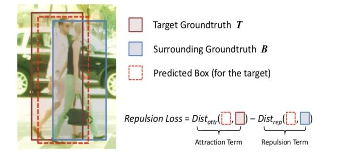
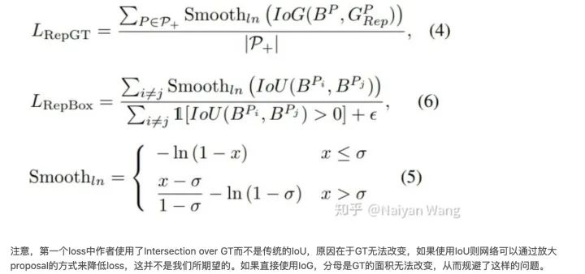
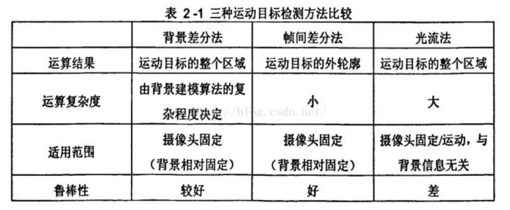
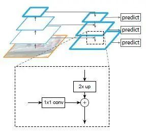
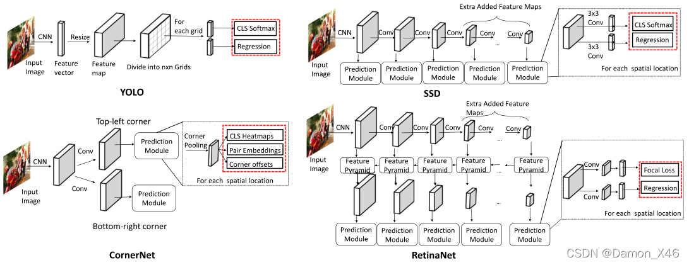

# 目标检测

## 检测算法共性问题总结与详解

### 目标检测两阶段和一阶段的核心区别

目标检测技术从阶段上分为两种，一阶段和二阶段。

+ 二阶段的核心思想是首先提出proposal框，通过第一阶段的网络回归出目标框的大概位置、大小及时前景的概率，第二阶段是通过另一个网络回归出目标框的位置、大小及类别；
+ 一阶段网络的核心是，对于输入图像，通过网络直接回归初目标大小、位置和类别。

### 目标检测两阶段比一阶段的算法精度高的原因

1.正负样本的不均衡性

当某一类别的样本数量特别多的时候，训练出来的网络对该类的检测精度往往会比较高。而当某一类的训练样本较少的时候，模型对该类目标的检测精度就会有所下降，这就是所为样本的不均衡导致的检测精度的差异。

+ 对于一阶段的目标检测来说，它既要做定位又要做分类，最后几层中1×1的卷积层的loss都混合在一起，没有明确的分工，哪部分专门做分类，哪部分专门做预测框的回归，这样的话对每个参数来说，学习的难度就增加了。
+ 对于二阶段的目标检测来说（Faster RCNN），在RPN网络结构中进行了前景和背景的分类，这个过程与一阶段的目标检测直接一上来就进行分类和预测简单的多，有了前景和背景的区分，就可以选择性的挑选样本，使得正负样本变得更加的均衡，然后重点对一些参数进行分类训练。训练的分类难度会比一阶段目标检测直接做混合分类和预测框回归要求的简单很多。

> 疑问：Faster RCNN检测的流程，proposal的流程？

2.样本的不一致性

在RPN获得多个anchors的时候，会使用一个NMS。在进行回归操作的时候，预测框和gt的IoU同回归后预测框和gt的IoU相比，一般会有较大的变化，但是NMS使用的时候用的是回归的置信度，这样就会导致一些回归后高IoU的预测框被删除。这就使得回归前的置信度并不能完全表征回归后的IoU大小。这就导致算法精度的下降。

在第一次使用NMS时候这种情况会比较明显，第二次使用的时候就会好很多，因此一阶段只使用一次NMS是会对精度有影响的，而二阶段目标检测中会在RPN之后进行一个更为精细的回归，在该处也会用到NMS，此时检测的精度就会好很多。

### 如何解决目标检测中密集遮挡问题

遮挡本身可以分为两种类型：一种是由于非目标造成的遮挡（occlusion），另一种是由于也是待检测目标造成的遮挡（crowded）。

+ 对于occlusion，很难有针对性的方法去解决，最好的办法是使用更多的数据和更强的feature。可以从训练数据入手。加掩模，加扰动，提高算法对遮挡的应对能力。
+ 对crowded，有两个针对这个问题的loss：通过设置损失函数的方式，即Repulision Loss，使预测框和所负责的真实框的距离缩小，而使得其与周围非负责目标框（包含真实目标框和预测框）的距离加大。如下式，如果与周围目标的距离越大，损失会越小。

  

  除了常用的smooth L1使回归目标与GT接近之外，这两个loss一个的目标是使proposal要尽量远离和它overlap的第二大的GT，另一个目标是要和被assign到不同GT的proposal之间尽量远离。通过这两个loss，不仅仅使得proposal可以向正确的目标靠近，也可以使其远离错误的目标，从而减少NMS时候的误检。

  

> 疑问：smooth和Repulision Loss的关系是什么？

### “狭长形状”目标检测有什么合适方法

使用可旋转bonding box进行标注

手工设计anchors

### 如何解决动态目标检测

1.光流法

光流是空间运动物体被观测面上的像素点运动产生的瞬时速度场，包含了物体表面结构和动态行为的重要信息。光流计算法大致可分为三类：

+ 基于匹配的光流计算方法，包括基于特征和基于区域的两种。基于特征的方法是不断地对目标主要特征进行定位和跟踪，对大目标的运动和亮度变化具有鲁棒性，存在的问题是光流通常很稀疏，而且特征提取和精度匹配也十分困难；基于区域的方法先对类似的区域进行定位，然后通过相似区域的位移计算光流，这种方法在视频编码中得到了广泛的应用，但它计算的光流仍不稠密。
+ 基于频域的方法利用速度可调的滤波组输出频率或相位信息，虽然能获得很高精度的初始光流估计，但往往涉及复杂的计算，而且可靠性评估也十分苦难。
+ 基于梯度的方法利用图像序列的时空微分计算2D速度场（光流）。由于计算简单和较好的实验结果，基于梯度的方法得到了广泛应用。

2.相邻帧差法

相邻帧差法是在运动目标检测中使用的最多的一类算法。原理就是将前后两帧图像对应的像素值相减，在环境亮度变化不大的情况下，如果对应像素相差值很小，可以认为此处景物是静止的，反之，则是运动物体。

相邻帧差法对于动态环境具有较强的自适应性，鲁棒性较好，能够适应各种动态环境，但一般不能完全提取出所有相关的特征像素点，这样在运动实体内部容易产生空洞现象。

3.背景差法

背景差法师常用的运动目标检测方法之一。它的基本思想是将输入图像与背景模型进行比较，通过判定灰度等特征的变化，或用直方图等统计信息的变化来判断异常情况的发生和分割运动目标。

与帧差法比较，背景差法可以检测视频中停止运动的物体，其缺点是背景的更新导致算法的复杂性增加，实时性变差。



4.基于事件相机

事件相机是具有微秒反应时间的仿生传感器，可记录每像素亮度变化的异步流，称为“事件”。

事件相机通过检测每个像素的亮度变化来生成一个事件，相比于传统相机，更适合在高动态和高速度的环境下使用，具有高动态范围（HDR）、高时间分辨率和无运动模糊的优势。

+ 高动态范围：对于传统相机来说，在黑暗的情况下，传统的相机几乎没有办法使用，但对于事件相机来说，只检测正在运动的物体，所以无论是黑暗情况还是有光亮的情况，事件相机都可以发挥作用。
+ 低时延：相邻事件之间的事件可以小于1毫秒
+ 无运动模糊：即使是告诉运动的物体，事件相机也可以捕获到。

> 动态目标检测？？判断是否是动态的么?

### FPN的作用

FPN是图像金字塔的在卷积神经网络中应用。图像金字塔在多尺度识别中有重要的作用，尤其是小目标检测。顶层特征上采样后和低层特征融合，每层独立预测。

FPN设计动机：

+ 高层特征向低层特征融合，增加低层特征表达能力，提升性能。
+ 不同尺度的目标可以分配到不同层预测，达到分而治之。



FPN每层做特征融合的特征图有两个，首先是前向传播，然后取每个特征图做上采样（最近邻插值），与对应前向传播的特征图做融合。

融合的方式是：通过1×1卷积调整通道数，然后直接add。之后进行3×3卷积操作，目的是消除上采样的混叠效应。

实际上，FPN真正起作用的是分而治之的策略，特征融合的作用其实很有限，此外FPN存在消耗大量显存，降低推理速度。

### FPN采用融合以后效果比pyramidal feature hierarchy方式更好

卷积虽然能够高效地向上提取语义，但是也存在像素错位问题，通过上采样还原特征图很好地缓解了像素不准的的问题。

backbone可以分为浅层网络和深层网络，浅层网络负责提取目标边缘等底层特征，而深层网络可以构建高级的语义信息，通过使用FPN这种方式，让深层网络更高级语义的部分的信息能够融合到稍浅层的网络，指导浅层网络进行识别。

从感受野的角度思考，浅层特征的感受野比较小，深层特征的感受野比较大，浅层网络主要负责小目标的检测，深层网络负责大目标的检测（比如人脸检测中的SSH就使用到了这个特点）。

### FPN在RPN中的应用

RPN在faster RCNN 中用于生成proposals，原版RPN在每个image的最后一张特征图上生成3×3个proposal。但实际上，小目标下采样到最后一个特征图时已经很小了。

FPN可以在之前的多个特征图上获得proposal，具体做法是：在每个feature map上获得1:1、1:2、2:1长宽比的框，尺寸｛32^2、64^2、128^2、256^2、512^2｝分别对应｛P2、P3、P4、P5、P6｝这五个特征层。其中，P6是专门为了RPN网络而设计的，用来处理512大小的候选框，经由P5下采样得到。

> FPN生成了3*5=15个候选框？

### 如何解决小目标识别问题

通用的定义来自COCO数据集，定义小于32×32pix的为小目标。

小目标检测的难点：可利用特征少，现有数据集中小目标占比少，小目标聚集问题。

首先小目标自身分辨率低，图像模糊，携带的信息少。由此所导致特征表达能力弱，也就是在提取特征的过程中，能提取的特征非常少，这不利于对小目标的检测。另外，通常网络为了减少计算量，都使用到了下采样，而下采样过多，会导致小目标的信息在最后的特征图上只有几个像素（甚至更少），信息的损失较多。

解决方法有：

+ 提高图像采集的分辨率。基于GAN的方法解决的也是小目标本身判别性特征少的问题，其简单有效的想法为：利用GAN生成高分辨率图片或者高分辨率特征。‘’
+ data augment。一些很有用的小目标检测增强技术有：随机剪裁、随机旋转和马赛克增强。利用copy pasting可以增加小目标数量。利用缩放与拼接，增加中小目标数量。
+ 修改模型输入的尺寸。提高模型的输入分辨率，通过tiling将图像切割后形成batch，推理时也需要tiling，然后把目标还原到原图，整体做一次NMS。这样可以在保持小输入分辨率的同时提升小目标检测。
+ 修改Anchor。适合小目标的Anchor。
+ Anchor Free。
+ 多尺度学习。FPN、空洞卷积，通过多尺度将下采样前的特征保留，尽可能保留小目标。
+ 减小下采样率。比如对于YOLOv5的stride为32，可以调整其stride来减小下采样率，从而保留某些比较小的特征。
+ SPP模块。增加感受野，对小目标有效果，SPP size的设置（解决输入feature map的size可能效果更好）。
+ 损失函数。赋予小目标更大的权重，也可以尝试Focal Loss。

> tiling是什么操作

### RCNN系列和YOLO系列的区别

YOLO所属类别为one-stage，Faster-RCNN为two-stage

+ two stage：先进行区域生成，该区域生成region proposal（RP，一个可能包含物体的预选框），再通过卷积神经网络进行样本分类，精度高，适合做高检测精度的任务。
  任务流程：特征提取——生成RP——分类/定位回归。

  
+ one stage：不用RP，直接在网络中提取特征来预测物体的分类和位置，速度非常快，适合做实时检测任务，但效果不会太好。
  任务流程：特征提取——分类/定位回归

  

### YOLO和SSD区别

YOLO将物体检测这个问题定义为bounding box 和分类置信度的回归问题。其将整张图片作为输入，划分为S×S个grid，每个cell预测B个bounding box（x,y,w,h）及对应的分类置信度（class=specific confidence score）。分类置信度是bounding box 为物体的概率与其真实值IOU相乘的结果。

SSD将物体检测这个问题的解空间抽象为一组预先设定好的bounding box（尺度，长宽比，1，2，3，1/2，1/3）。在每个bounding box，预测分类label以及box offset，从而更好地框出物体。对一张图片，结合多个大小不同的feature map的预测结果，能够处理大小不同的物体。

两者区别：YOLO(v1)在卷积后接全连接层，即检测时只利用最高层Feature maps。而SSD采用金字塔结构，即利用了大小不同的feature maps，在多个feature maps上同时进行softmax分类和位置回归。此外，SSD还加入了Prior box（先验框）。

### 前景背景样本不均衡解决方案

Focal Loss，GHM与PISA

前景背景类不平衡的解决方案分为四类：（1）硬采样法，（2）软抽样方法（Soft Sampling Methods），(3)无抽样方法，（4）生成方法。

#### 1.软抽样方法

软抽样调整每个样本在训练过程中迭代的权重，与硬采样不同，没有样本被丢弃。该方法也可以应用在分类任务中。

1.1 Focal Loss

为解决正负样本不均衡问题，乘以权重α：

$$
\begin{array}{c}
L_{C E} = \left\{\begin{array}{ll}
-\log (p), & y = 1 \\
-\log (1-p), & y = \text { otherwise }
\end{array}\right.
\\
L_{F L} = \left\{\begin{array}{ll}
-\alpha \log (p), & y = 1 \\
-(1-\alpha) \log (1-p), & y = 0
\end{array}\right.
\end{array}
$$

一般根据各类别数据占比，对α进行取值，即当class_1占比为30%时，α=0.3，但是这个并不能解决所有问题。因为根据正负难易，样本一共可以分为以下四类：

|    | 难   | 易   |
| -- | ---- | ---- |
| 正 | 正难 | 正易 |
| 负 | 负难 | 负易 |

虽然α平衡了正负样本，但对难易样本的不平衡没有任何帮助。其中易分样本（即：置信度高的样本）对模型的提升效果非常小，即无法从中学习大量的有效信息。所以模型应该主要关注于那些难分样本。（这个假设有问题，在GHM中对其进行了改进）。我们希望模型能够更关注容易错分的数据，反向思考，就是让模型别那么关注容易分类的样本。因此，Focal Loss的思路就是，把高置信度的样本的损失降低：

$$
L_{F L} = \left\{\begin{array}{ll}
-\alpha (1-p)^{\gamma }\log (p), & y = 1 \\
-(1-\alpha) p^{\gamma } \log (1-p), & y = 0
\end{array}\right.
$$


当样本被误分类时，p很小，$(1-p)^{\gamma}$很大，loss不怎么受影响。当样本被正确分类时，p很大，$(1-p)^{\gamma}$变小，loss衰减。比如，当α为1，p为0.9时，Focal Loss 为：

$$
L_{FL}=-(1-0.9)^{2}*log(0.9)=0.01*L_{CE}
$$

这个容易分类的样本，损失和cross-entropy相比，衰减了100倍。

实验表明γ取2，α取0.25的时候效果最佳。

|    | 难           | 易               |
| -- | ------------ | ---------------- |
| 正 | 正常         | 正常，γ衰减     |
| 负 | 负难，α衰减 | 负易，γ和α衰减 |

### 如何解决训练数据样本过少的问题

1. 利用预训练模型进行迁移微调（fine-tuning），预训练模型通常在特征上拥有很好的语义表达。此时，只需要将模型在小数据集上进行微调就能取得不错的效果。这也是目前大部分小数据集常用的训练方式。在视觉领域内，通常会在ImageNet上训练完成的模型。在自然语言处理领域，也有BERT模型等预训练模型可以使用。
2. 单样本或者少样本学习（one-shot，few-shot leaning），这种方式适用于样本类别远远大于样本数量这一极端情况。例如有1000个类别，每个类别只提供1-5个样本。
   少样本学习同样也需要借助预训练模型，但有别于微调的地方在于，微调通常仍然在学习不同类别的语义，而少样本学习通常需要学习样本之间的距离度量。例如孪生网络（Siamese Neural Networks）就是通过训练两个同种结构的网络来判别输入的两张图片是否属于同一类。
3. 此外，还有些常用的方式：数据集增强、正则或者半监督学习等方式来解决小样本数据集的训练问题。

> 样本之间的距离度量如何理解?

### 如何解决类别不平衡的问题

机器学习中，解决样本不均衡问题主要有2钟思路：数据角度和算法角度。从算法角度出发，可以采用扩大数据集、数据类别均衡采样等方法。

在算法层面，目标检测方法目前使用的方法主要有：

+ Faster RCNN、SDD等算法在正负样本的筛选时，根据样本与真实物体的IoU大小，设置了3：1的正负样本比例，这一点缓解了正负样本的不平衡，同时也对难易样本不均衡起到了作用。
+ Faster RCNN在RPN模块中，通过前景得分排序筛选出了2000个左右的候选框，这也会将大量的负样本与简单样本过滤掉，缓解了前两个不均衡问题。
+ 权重惩罚：对于难易样本与类别间的不均衡，可以增大难样本与少类别的损失权重，从而增大模型对这些样本的惩罚，缓解不均衡问题。
+ 数据增强：从数据侧入手，可以在当前数据集上使用随机生成和添加扰动的方法，也可以利用网络爬虫数据等增加数据集的丰富性，从而缓解难易样本和类别间样本不均衡的问题。可以参考SSD的数据增强方法

近年来，也有学者针对样本不均衡问题进行深入研究，主要有：

1. OHEM：在线难例挖掘。
   OHEM算法（online hard example mining，发表于2016年的CVPR）主要是针对训练过程中的困难样本自动选择，其核心思想是根据输入样本的损失进行筛选，筛选出困难样本（即对分类和检测影响较大的样本），然后将筛选得到的这些样本应用在随机梯度下降中训练。
   其缺点是会丢弃loss比较低的样本，使得这些样本无法被学习到。
2. Focal Loss：专注难样本
   为了解决一阶段网络中样本的不均衡问题，何凯明等人首先改善了分类过程中的交叉熵函数，提出了可以动态调整权重的Focal Loss。其对正负样本进行加权，使得全部的样本可以得到学习，容易分类的负样本赋予低权值，难分类的样本赋予高权值。
   其弊端是在所有的anchor examples中，除了大量易分类的负样本外，还存在着很多的outlier，Focal Loss对这些outlier并没有相关的处理策略。并且Focall Loss存在两个超参，根据不同的数据集，调试两个超参需要大量的实验，一旦参数确定便无法改变，不能根据数据的分布动态的调整。
3. GHM：损失函数梯度均衡化机制
   GHM的主要思想：从样本的梯度范数出发，通过梯度范数所占的样本比例，对样本进行动态的加权，使得具有小梯度的容易分类的样本降权，具有中梯度的hard example升权，具有大梯度的outlier降权。

### 手撕IoU代码

在常见的图像处理中，矩形框的坐标是左上角和右下角的像素坐标。左上角的像素坐标是矩形框的起始位置，而右下角的像素坐标是矩形框的结束位置。

```
import numpy as np


def iou(box1, box2):
    # 计算相交框坐标，其中box1[0]、[1]为左上角坐标，box1[2]、box1[3]为右下角坐标,box2同理
x1 = np.max([box1[0], box2[0]])
    y1 = np.max([box1[1], box2[1]])
    x2 = np.min([box1[2], box2[2]])
    y2 = np.min([box1[3], box2[3]])
    s_1 = (box1[2] - box1[0]+1) * (box1[3]-box1[1]+1)
    s_2 = (box2[2] - box2[0]+1) * (box2[3]-box2[1]+1)
    interArea = np.max([x2-x1+1, 0])*np.max([y2-y1+1, 0])
    unionArea = s_1 + s_2 - interArea
    print(unionArea)
    return iou


boxA = [1,1,3,3]
boxB = [2, 2, 4, 4]
Iou = iou(boxA, boxB)
print(Iou)
```

### 手撕NMS代码

1.对整个bboxes排序的写法

```
import numpy as np


def nms(dets, iou_thred, cfd_thred):
    if (len(dets) == 0):
        return []
    bboxes = np.array(dets)
    # 对整个bboxes排序
bboxes = bboxes[np.argsort(bboxes[:, 4])]
    pick_bboxes = []
    while bboxes.shape[0] and bboxes[-1][-1] >= cfd_thred:
        bbox = bboxes[-1]
        x1 = np.maximum(bbox[0], bboxes[:-1, 0])
        y1 = np.maximum(bbox[1], bboxes[:-1, 1])
        x2 = np.minimum(bbox[2], bboxes[:-1, 2])
        y2 = np.minimum(bbox[3], bboxes[:-1, 3])

        inters = np.maximum(x2 - x1 + 1, 0) * np.maximum(y2 - y1 + 1, 0)
        unions = (bbox[2] - bbox[0] + 1) * (bbox[3] - bbox[1] + 1) + (bboxes[:-1, 2] - bboxes[:-1, 0] + 1) * (
                    bboxes[:-1, 3] - bboxes[:-1, 1] + 1) - inters
        ious = inters / unions
        keep_indices = np.where(ious < iou_thred)
        bboxes = bboxes[keep_indices]
        pick_bboxes.append(bbox)

    return np.asarray(pick_bboxes)


dets = [[187, 82, 337, 317, 0.9], [150, 67, 305, 282, 0.75], [246, 121, 368, 304, 0.8]]
dets_nms = nms(dets, 0.5, 0.3)
print(dets_nms)
```

2.不改变bboxes，维护orders的写法。始终维护orders：代表到原bboxes的映射（map）。优化如下：

+ 仅维护orders，不改变原bboxes
+ 提前计算好bboxes的面积，以免在循环中多次重复计算

```
import numpy as np


# 仅维护orders，不改变原bboxes
# 提前计算好bboxes的面积，以免在循环中多次重复计算
def nms(dets, iou_thred, cfd_thred):
    if (len(dets) == 0):
        return []
    bboxes = np.array(dets)
    pick_bboxes = []
    # 排序
orders = np.argsort(bboxes[:, 4])
    x1 = bboxes[:, 0]
    y1 = bboxes[:, 1]
    x2 = bboxes[:, 2]
    y2 = bboxes[:, 3]
    areas = (x2 - x1 + 1) * (y2 - y1 + 1)

    while orders.shape[0] > 0 and bboxes[orders[-1], -1] >= cfd_thred:
        bbox = bboxes[orders[-1]]
        xx1 = np.maximum(bbox[0], x1[orders[:-1]])
        yy1 = np.maximum(bbox[1], y1[orders[:-1]])
        xx2 = np.minimum(bbox[2], x2[orders[:-1]])
        yy2 = np.minimum(bbox[3], y2[orders[:-1]])

        inters = np.maximum(xx2 - xx1 + 1, 0) * np.maximum(yy2 - yy1 + 1, 0)
        unions = areas[orders[-1]] + areas[orders[:-1]] - inters
        ious = inters / unions
        keep_indices = np.where(ious < iou_thred)
        orders = orders[keep_indices]
        pick_bboxes.append(bbox)

    return np.asarray(pick_bboxes)


dets = [[187, 82, 337, 317, 0.9], [150, 67, 305, 282, 0.75], [246, 121, 368, 304, 0.8]]
dets_nms = nms(dets, 0.5, 0.3)
print(dets_nms)
```

### NMS改进思路

1. 根据手动设置阈值的缺陷，通过自适应的方法在目标稀疏时使用小阈值，在目标稠密时使用大阈值。例如Adaptive NMS。
2. 将低于阈值的直接设置为0的做法太hard，通过将其依据IoU大小进行惩罚衰减，则变得更加sot。例如Soft NMS，Softer NMS。
3. 只能在CPU上运行，速度太慢，改进思路有三个：
   + 设计在GPU上的NMS，如CUDA NMS
   + 设计更快的NMS，如Fast NMS
   + 设计一个神经网络来实现NMS，如ConvNMS
4. IoU的做法存在一定缺陷，改进思路是将目标尺度、距离引进IoU的考虑中。如DIoU。

### IoU相关优化

GIOU、DIOU、CIOU（见基础学习笔记中IoU部分）
