# 开始前的总结

**YOLO v1：直接回归出位置。**

**YOLO v2：全流程多尺度方法。**

**YOLO v3：多尺度检测头，resblock darknet53**

**YOLO v4：cspdarknet53，spp，panet，tricks**

## 评估参数

### Precision、Recall


例题：


### mAP

综合了Precision、Recall后的评价指标。为下边阴影部分的面积，最好的情况是全面积即1.0×1.0

# CNN

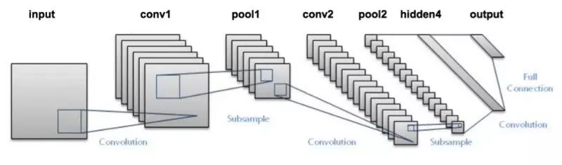

向网络中输入一张图片，接着将它传递到多个卷积和池化层中，最后输出目标所属的类别。

CNN能检测图片中多种目标。

## CNN工作流程

1.首先，我们把下面的图片用作输入：


2.之后，我们将图片分成多个区域：


3.将每个区域看作单独的图片。

4.把这些区域照片传递给CNN，将它们**分到不同类别**中。

5.当我们把每个区域都分到对应的类别后，再把它们结合在一起，完成对原始图像的目标检测：


## 缺点

使用这一方法的问题在于，图片中的物体可能有不同的长宽比和空间位置。例如，在有些情况下，目标物体可能占据了图片的大部分，或者非常小。目标物体的形状也可能不同。

有了这些考虑因素，我们就需要分割很多个区域，需要大量计算力。所以为了解决这一问题，减少区域的分割，我们可以使用基于区域的CNN（RCNN），它可以进行区域选择。

# RCNN

和在大量区域上工作不同，RCNN算法提出在图像中创建多个边界框，检查这些边框中是否含有目标物体。RCNN使用选择性搜索来从一张图片中提取这些边框。

## 选择性搜索

什么是选择性搜索？以及它是如何辨别不同区域的？

组成目标物体通常有四个要素：变化尺度、颜色、结构（材质）、所占面积。选择性搜索会确定物体在图片中的这些特征，然后基于这些特征突出不同区域。下面是选择搜索的一个简单案例：

* 首先将一张图片作为输入：


* 之后，它会生成最初的sub-分割，将图片分成多个区域：


* 基于颜色、结构、尺寸、形状，将相似的区域合并成更大的区域：


* 最后，生成最终的目标物体位置（Region of Interest）

## RCNN工作流程

1. 我们首先取一个预训练卷积神经网络。
2. 根据需要检测的目标类别数量，训练网络的最后一层。
3. 得到每张图片的感兴趣区域（Region of Interest），对这些区域重新改造，以让其符合CNN的输入尺寸要求。
4. 得到这些区域后，我们训练支持向量机（SVM）来辨别目标物体和背景。对每个类别，我们都要训练一个二元SVM。
5. 最后，我们训练一个线性回归模型，为每个辨识到的物体生成更精确的边界框。

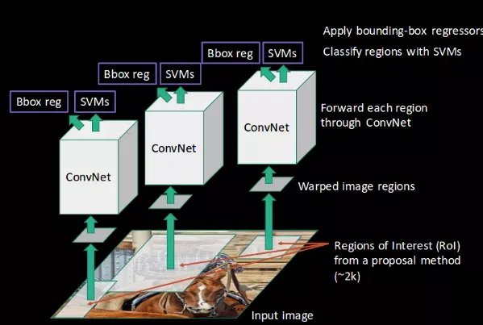

## 缺点

训练一个RCNN模型非常昂贵，并且步骤较多：

1. 根据选择性搜索，要对每张图片提取2000个单独区域么，用CNN提取每个区域的特征。假设我们有N张图片，那么CNN特征就是N*2000；
2. 用RCNN进行目标检测的整个过程有三个模型：

* 用于特征提取的CNN
* 用于目标物体辨别的线性SVM分类器
* 调整边界框的回归模型

这些过程合并在一起，会让RCNN的速度变慢，通常每个新图片需要40—50秒的时间进行预测，基本上无法处理大型数据集。

# Fast RCNN

**解决方法**：在每张图片上只使用一次CNN即可得到全部的重点关注区域。

RCNN的作者Ross Girshick提出了一种想法，在每张照片上只运行一次CNN，然后找到一种方法在2000个区域中进行计算。在Fast RCNN中，我们将图片输入到CNN中，会相应地生成传统特征映射。利用这些映射，就能提取出感兴趣区域。之后，我们使用一个Rol池化层将所有提出的区域重新修正到合适的尺寸，以输入到完全连接的网络中。

## 工作流程

1. 输入图片。
2. 输入到卷积网络中，它生成感兴趣区域。
3. 利用Rol池化层对这些区域重新调整，将其输入到完全连接网络中。
4. 在网络的顶层用softmax层输出类别。同样使用一个线性回归层，输出相对应的边界框。

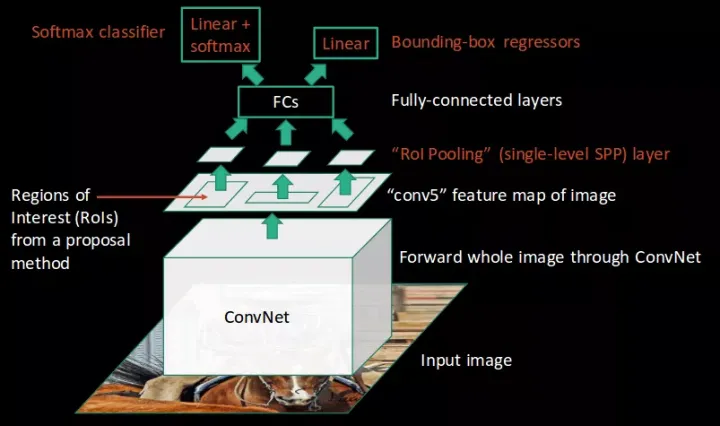

## 缺点

它同样用的是选择性搜索作为寻找感兴趣区域的，这一过程通常较慢。与RCNN不同的是，Fast RCNN处理一张图片大约需要2秒。但是在大型真实数据集上，这种速度仍然不够理想。

# Faster RCNN

Faster RCNN是Fast RCNN的优化版本，二者主要的不同在于感兴趣区域的生成方法，Fast RCNN使用的是选择性搜索，而Faster RCNN用的是Region Proposal网络（RPN）。RPN将图像特征映射作为输入，生成一系列object proposals，每个都带有相应的分数。

## 工作流程

1. 输入图像到卷积网络中，生成该图像的特征映射。
2. 在特征映射上应用Region Proposal Network，返回object proposals和相应分数。
3. 应用Rol池化层，将所有proposals修正到同样尺寸。
4. 最后，将proposals传递到完全连接层，生成目标物体的边界框。


那么Region Proposal Network具体是如何工作的呢？

首先，将CNN中得来的特征映射输入到Faster RCNN中，然后将其传递到Region Proposal Network中。RPN会在这些特征映射上使用一个滑动窗口，每个窗口会生成具有不同形状和尺寸的k个anchor box：


Anchor boxes是固定尺寸的边界框，它们有不同的形状和大小。对每个anchor，RPN都会预测两点：

* 首先是anchor就是目标物体的概率（不考虑类别）
* 第二个就是anchor经过调整能更合适目标物体的边界框回归量

现在我们有了不同形状、尺寸的边界框，将它们传递到Rol池化层中。经过RPN的处理，proposals可能没有所述的类别。我们可以对每个proposal进行切割，让它们都含有目标物体。这就是Rol池化层的作用。它为每个anchor提取固定尺寸的特征映射：


之后，这些特征映射会传递到完全连接层，对目标进行分类并预测边界框。

## 缺点

目前为止，以上所讨论的所有目标检测算法都用区域来辨别目标物体。网络并非一次性浏览所有图像，而是关注图像的多个部分。这就会出现两个问题：

* 算法需要让图像经过多个步骤才能提取出所有目标
* 由于有多个步骤嵌套，系统的表现常常取决于前面步骤的表现水平

# 算法总结：CNN、RCNN、Fast RCNN、Faster RCNN


# YOLO v1

YOLO v1

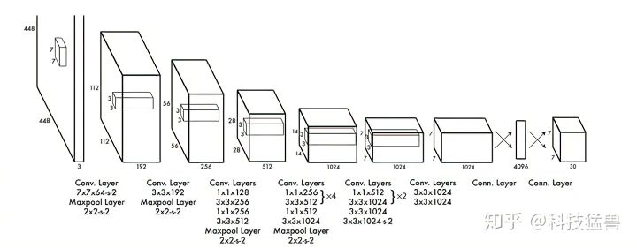

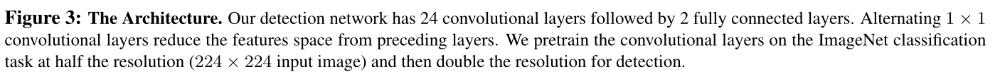

train的时候用的小图片，检测的时候用的是大图片(肯定是经过了无数次试验证明了效果好)。

## 损失函数

**YOLO v1损失函数**

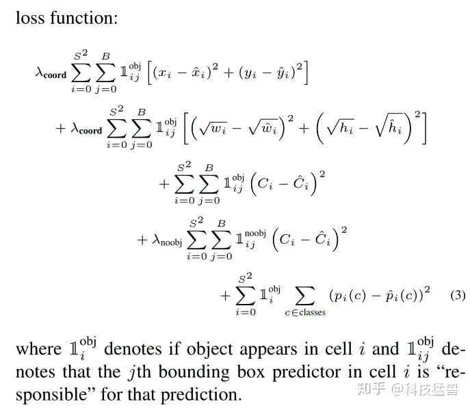

* 前2行计算前景的geo_loss。
* 第3行计算前景的confidence_loss。
* 第4行计算背景的confidence_loss。
* 第5行计算分类损失class_loss。

为什么w，h开根后计算？

> 为了使模型更关心小框。大框的些许差异产生的实际差异不大，但产生的loss绝对值很大；小框就算实际差异很大，但是产生的loss绝对值是比较小的。因此开根号后可以缓解大框产生的loss过高，小框产生的loss过低。（大小框相对来讲）

**单类的目标**

损失函数伪代码：

```
loss = 0
for img in img_all:
   for i in range(4):
      for j in range(4):
         loss_ij = lamda_1*(c_pred-c_label)**2 + c_label*(x_pred-x_label)**2 +\
                     c_label*(y_pred-y_label)**2 + c_label*(w_pred-w_label)**2 + \
                     c_label*(h_pred-h_label)**2
         loss += loss_ij
loss.backward()
```

**多类的目标**

img → cbrp16→ cbrp32→ cbrp64→ cbrp128→ ...→ fc256-fc[5+2]*N → [c,x,y,w,h,one-hot]*N

损失函数伪代码：*class_loss = 1/m * mse_loss(p_pred, p_label)   ？？？*

```
loss = 0
for img in img_all:
   for i in range(3):
      for j in range(4):
         c_loss = lamda_1*(c_pred-c_label)**2
         geo_loss = c_label*(x_pred-x_label)**2 +\
                     c_label*(y_pred-y_label)**2 + c_label*(w_pred-w_label)**2 + \
                     c_label*(h_pred-h_label)**2
         class_loss = 1/m * mse_loss(p_pred, p_label)
         loss_ij =c_loss  + geo_loss + class_loss
         loss += loss_ij
loss.backward()
```

## NMS（非极大值抑制）

2个框重合度很高，大概率是一个目标，那就只取一个框。

重合度的计算方法：交并比IoU=两个框的交集面积/两个框的并集面积。

具体算法：

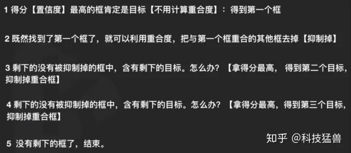

## 不足之处

YOLO v1虽然快，但是预测的框不准确，很多目标找不到：

* 预测的框不准确：准确度不足。
* 很多目标找不到：recall不足。
* 样本不均衡的问题：没有计算背景的geo_loss，只计算了前景的geo_loss，这个问题YOLO v1回避了，依然存在。

# YOLO v2

YOLO v2 相对YOLO v1改进对比图

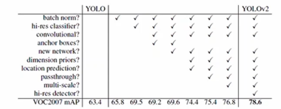

## Batch Normalization

如果能够以某种方式对来自每个前一层的activations进行归一化，那么梯度下降会在训练期间更好收敛。 这正是 Batch Norm 层所做的。

Batch Norm 只是插入在隐藏层和下一个隐藏层之间的另一个网络层。 它的工作是从第一个隐藏层获取输出并在将它们作为下一个隐藏层的输入传递之前对其进行标准化。


Batch Norm 层也有自己的参数：两个可学习的参数， beta 和 gamma。

两个不可学习的参数保存为批正则化层“状态”的一部分。

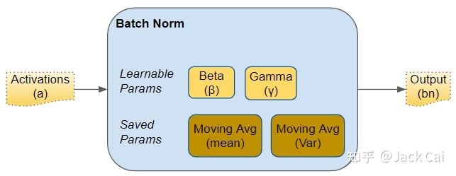

Batch Norm 层按如下方式处理其数据：

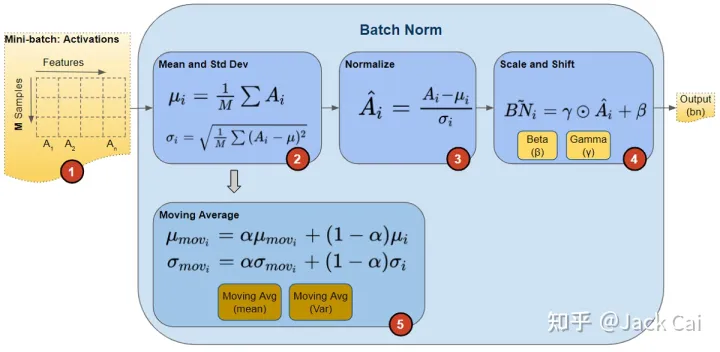

归一化公式总结为：

$$
\hat{x_i}=\gamma \frac{x_i-\mu }{\sqrt{\sigma ^2+\epsilon } }  +\beta \hat{x_i}
$$

注意：均值和方差都是每个channel单独计算，$β$是平移系数，$γ$是缩放系数。均值和方差都是可以求出来的，$β$和$γ$是学出来的，$\varepsilon$是防止除数为0。

1. **激活**。来自前一层的激活作为输入传递给 Batch Norm。数据中的每个特征都有一个激活向量。
2. **计算均值和方差**。每个激活向量分别计算 mini-batch 中所有值的均值和方差。
3. **规范化**。使用相应的均值和方差计算每个激活特征向量的归一化值。这些归一化值现在有零均值和单位方差。
4. **规模和转移**。这一步是 Batch Norm 引入的创新点。与要求所有归一化值的均值和单位方差为零的输入层不同，Batch Norm 允许将其值移动（到不同的均值）和缩放（到不同的方差）。它通过将归一化值乘以因子 gamma 并添加因子 beta 来实现此目的。这里是逐元素乘法，而不是矩阵乘法。创新点在于，这些因素不是超参数（即模型设计者提供的常数），而是网络学习的可训练参数。每个 Batch Norm 层都能够为自己找到最佳因子，因此可以移动和缩放归一化值以获得最佳预测。
5. **移动平均线**。Batch Norm 还保持对均值和方差的指数移动平均线 (EMA) 的运行计数。训练期间它只是计算这个 EMA，但不做任何处理。在训练结束时，它将该值保存为层状态的一部分，以在推理阶段使用。移动平均线计算使用由下面的 alpha 表示的标量“动量”。这是一个仅用于 Batch Norm 移动平均线的超参数，不应与优化器中使用的动量混淆。

### 归一化

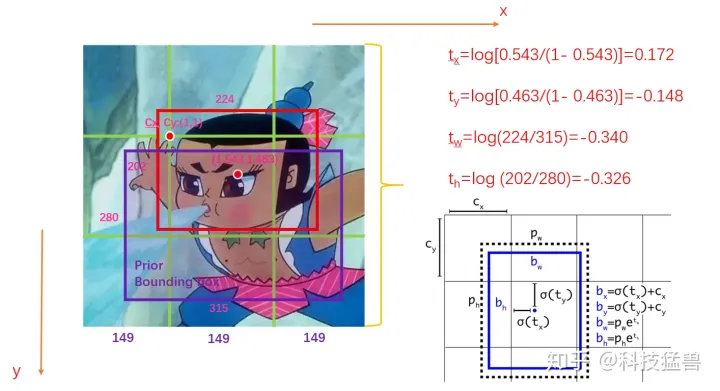

在yolov3中每个grid cell在feature map中的宽和高均为1，因而上图中的c_x=1、c_y=1，b_x、b_y为相对于左上角坐标的偏移b_x=(230-149)/149=0.543、b_y=(218-149)/149=0.463

归一化之后你会发现，要预测的值就变为了：

t~x~,t~y~,t~w~,t~h~=0.172,−0.148,−0.340,−0.326

这是一个偏移量，且值很小，有利于神经网络的学习。

## 更大分辨率

v1训练时用的是224×224，测试时用的是448×448，可能导致模型水土不服。

因此v2训练时额外又进行了10次448×448的微调，使用高分辨率分类器后，YOLOv2的mAP提升了约4%。

## 网络结构

+ 使用新的网络DarKNet19(指 19个卷积层)，实际输入为416×416（一般输入应该可以被32整除）。
+ 没有FC层，5次下采样后为13×13。（原图分辨率的$\frac{1}{2^5} $）
+ 1×1卷积节省了很多参数。

## 聚类提取先验框（Anchor Box）

作者参考faster-rcnn系列，faster-rcnn系列有9个先验框，其选择的先验框比例都是常规的，但是不一定完全合适数据集。

因此采用K-means聚类，其中的距离定义是：$d(box,centroids)=1-IOU(box,centroids)$，其中k=5。


> 通过引入anchor boxex，使得预测的box数量更多（13×13×n）。

然而，通过增加至5个anchor，实际map值反而有些微下降，但recall提升很高，这也是为什么要做此改进的原因。

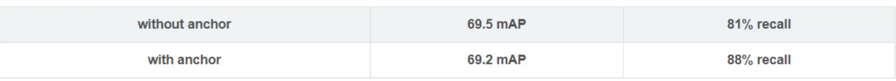

## Directed Location Predition

### 解决1：预测的框不准确

基于grid的偏移量和基于anchor的偏移量：

* 基于anchor的偏移量的意思是，anchor的位置是固定的，偏移量=目标位置-anchor的位置 。
* 基于grid的偏移量的意思是，grid的位置是固定的， 偏移量=目标位置-grid的位置 。

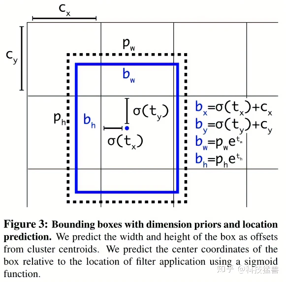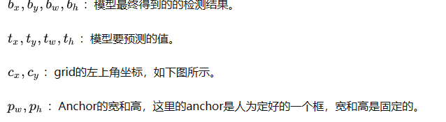

位置上不使用Anchor框，宽高上使用Anchor框。

c_x、c_y为grid坐标（取值为：0、1、2、3...），p_w、p_h为先验Anchor值；

b_x、b_y为预测框中心坐标；

b_w、b_h为预测框值。

例题：


### 为什么YOLO v2改预测偏移量而不是直接去预测 (x,y,w,ℎ)？

作者看到了同时代的R-CNN，人家预测的是偏移量。另一个重要的原因是：直接预测位置会导致神经网络在一开始训练时不稳定，使用偏移量会使得训练过程更加稳定，性能指标提升了5%左右。

## 感受野


## Fine-Grained Features

特征融合

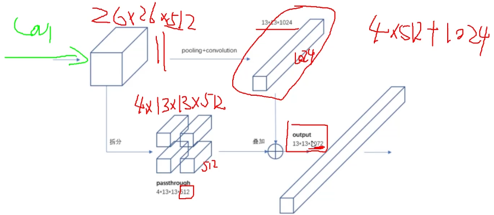

## Multi-Scale

网络中去除全连接层FC，可以使得输入尺寸不受限制。

## 解决2：很多目标找不到

YOLO v2 13×13个区域，每个区域有5个anchor，且每个anchor对应着1个类别，那么，输出的尺寸就应该为：[N,13,13,125]。

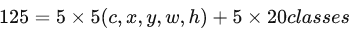

从数据集中预先准备几个几率比较大的bounding box，再以它们为基准进行预测。这就是Anchor的初衷。

### 每个区域的5个anchor是如何得到的？

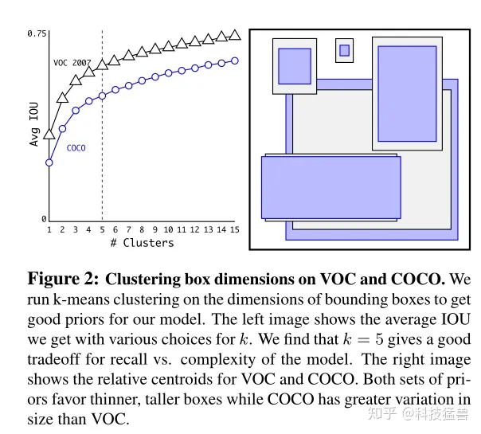

方法：对于任意一个数据集，就比如说COCO吧(紫色的anchor)，先对训练集的GT bounding box进行聚类，聚成几类呢？作者进行了实验之后发现**5**类的**recall vs. complexity**比较好，现在聚成了**5**类，当然9类的mAP最好，预测的最全面，但是在复杂度上升很多的同时对模型的准确度提升不大，所以采用了一个比较折中的办法选取了5个聚类簇，即使用5个先验框。

所以到现在为止，有了anchor再结合刚才的 t~x~,t~y~,t~w~,t~h~ ，就可以求出目标位置。

**anchor是从数据集中统计得到的(Faster-RCNN中的Anchor的宽高和大小是手动挑选的)。**

### 损失函数

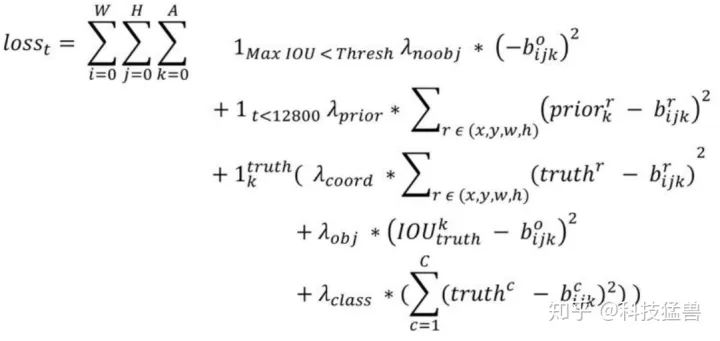

这里的W=13,H=13,A=5。
每个 � 都是一个权重值。c表示类别，r表示rectangle，即(x,y,w,h)。
第1,4行是confidence_loss，注意这里的真值变成了0和IoU(GT, anchor)的值，你看看这些细节。。。
第5行是class_loss。
第2,3行：t是迭代次数，即前12800步我们计算这个损失，后面不计算了。这部分意义何在？
意思是：前12800步我们会优化 **预测的(x,y,w,h)与anchor的(x,y,w,h)的距离+预测的(x,y,w,h)与GT的(x,y,w,h)的距离** ，12800步之后就只优化**预测的(x,y,w,h)与GT的(x,y,w,h)的距离，为啥？因为这时的预测结果已经较为准确了，anchor已经满足我了我们了，而在一开始预测不准的时候，用上anchor可以加速训练。**
你看看这操作多么的细节。。。
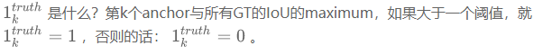

YOLO v2做了这么多改进，整体性能大幅度提高，但是小目标检测仍然是YOLO v2的痛。直到kaiming大神的ResNet出现，backbone可以更深了，所以darknet53诞生。

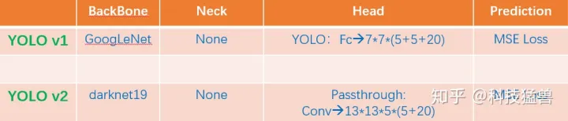

# YOLO v3

YOLOv3的核心就是新的darknet以及fpn结构。

论文中与其他算法的对比图。突出速度快的优点。

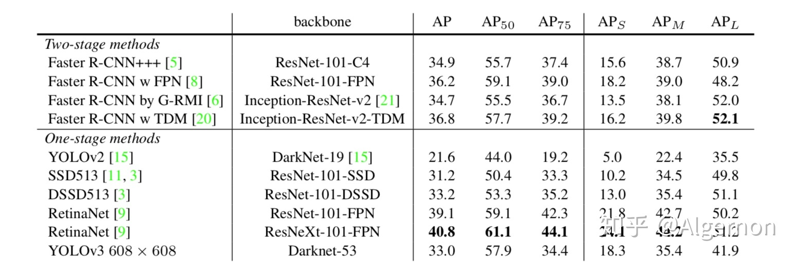

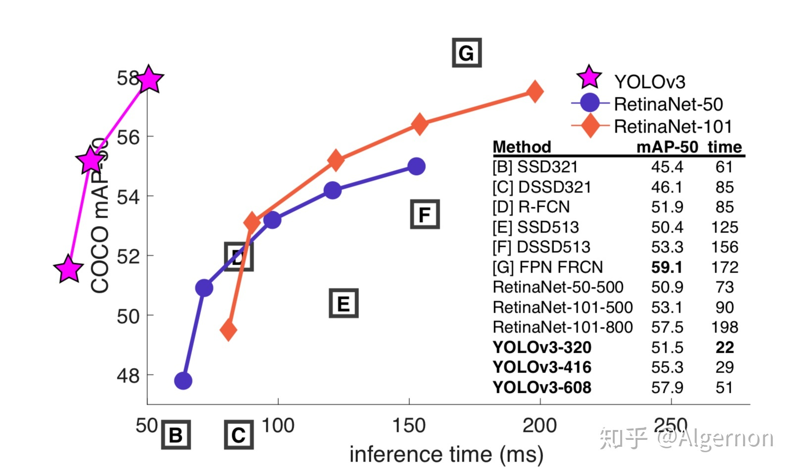

结论：Yolov3精度与SSD相比略有小优，与Faster R-CNN相比略有逊色，几乎持平，比RetinaNet差。但是速度是SSD、RetinaNet、Faster R-CNN至少2倍以上。输入尺寸为320*320的Yolov3，单张图片处理仅需22ms，简化后的Yolov3 tiny可以更快。

## 核心网络架构

+ 去掉池化和全连接，网络全部卷积
+ 通过下采样(设置stride为2)达到特征图缩小$\frac{1}{2} $
+ 3种scale，更多先验框

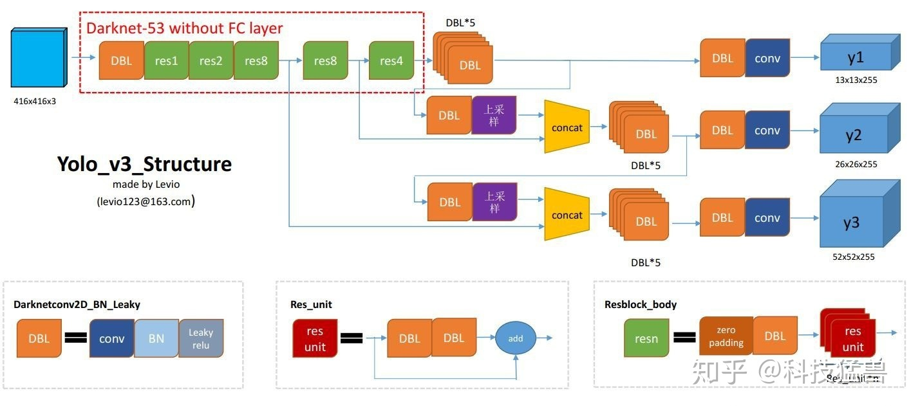

检测头是 **DBL** ，定义在图上，没有了FC。

还有一种画法，更加直观一点：

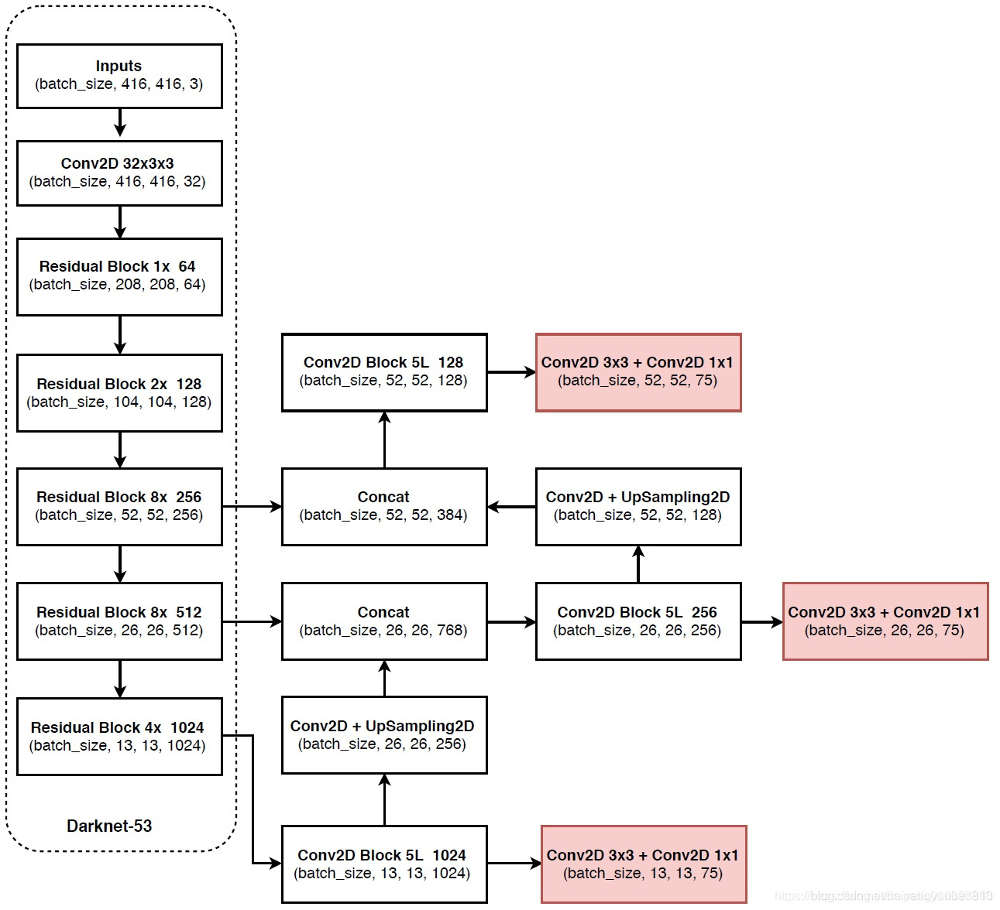

## 多scale检测头

YOLO v3检测头，多scale思想

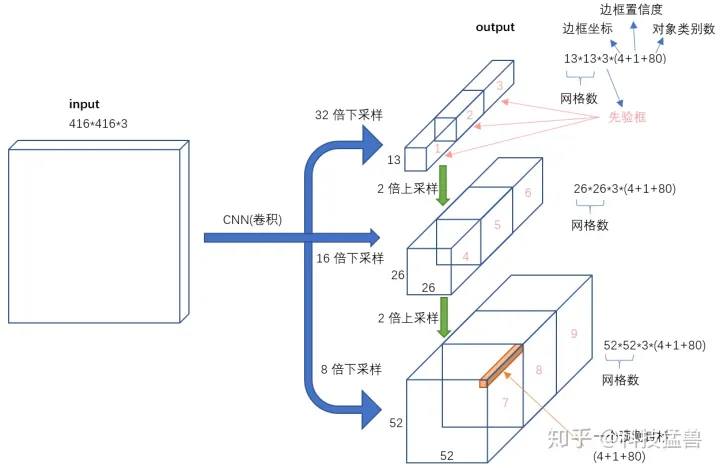

因为**32倍下采样**每个点感受野更大，所以去预测**大目标，8倍下采样**每个点感受野最小，所以去预测**小目标。专人专事。**

图中的123456789是什么意思？

> **答：框** 。每个grid设置9个先验框，3个大的，3个中的，3个小的。

| 特征图 |             13×13             |           26×26           |          52×52          |
| :----: | :----------------------------: | :-------------------------: | :-----------------------: |
| 感受野 |               大               |             中             |            小            |
| 先验框 | (116x90)、(156x198)、(373x326) | (30x61) 、(62x45)、(59x119) | (10x13)、(16x30)、(33x23) |

anchor和YOLO v2一样，依然是从数据集中统计得到的。**为确定priors** ，应用 **k均值聚类** 。然后它 **预先选择9个聚类簇** 。9个priors根据它们的尺度分为3个不同的组。在检测目标时，给一特定的特征图分配一个组。

## 特征图融合

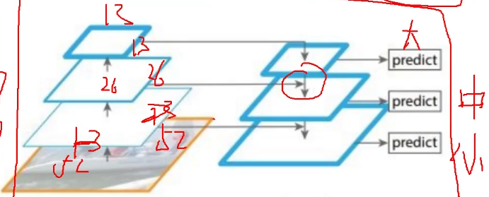

## ResNet(残差连接)

v3采用resnet的思想，堆叠更多的层来进行特征提取。

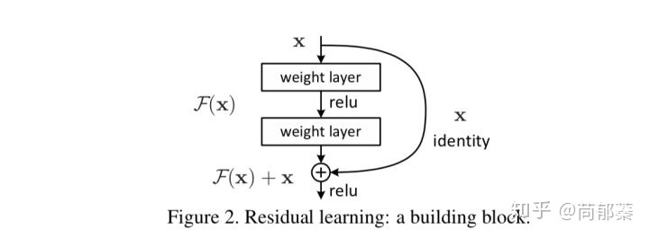

## Softmax

物体检测任务中可能一个物体有多个标签，因此用logistic激活函数，预测每一个类别的概率（对每一个类别做二分类）。然后选择概率大于设定阈值的类再进行处理。

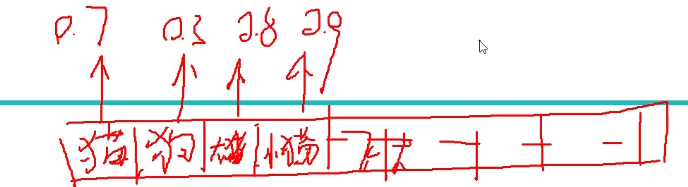

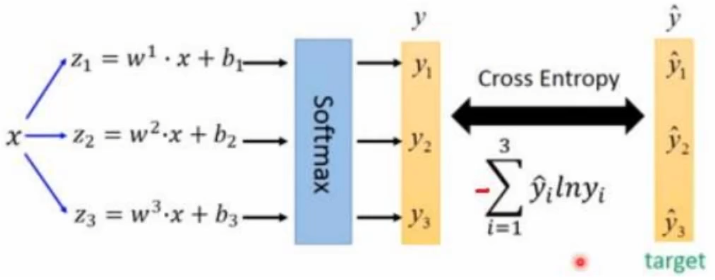

## 损失函数

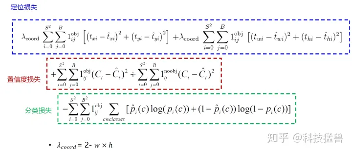

第4行说明：loss分3部分组成：
第1行代表geo_loss，S代表13,26,52，就是grid是几乘几的。B=5。
第2行代表confidence_loss，和YOLO v2一模一样。
第3行代表class_loss，和YOLO v2的区别是改成了交叉熵。

## 边界框预测和代价函数的计算

YOLO v3使用多标签分类，用多个独立的logistic分类器代替softmax函数，以计算输入属于特定标签的可能性。在计算分类损失进行训练时，YOLO v3对每个标签使用**二元交叉熵损失**。

## 正负样本的确认

如果 **边界框先验（锚定框）与 GT 目标比其他目标重叠多** ，则相应的 **目标性得分应为 1** 。
对于 **重叠大于等于0.5的其他先验框(anchor)** ，忽略， **不算损失** 。Box-Level Active Detection
每个 GT 目标 **仅与一个先验边界框相关联** 。 如果没有分配先验边界框，则不会导致Box-Level Active Detection**分类和定位损失，只会有目标性的置信度损失。**
使用 **tx和ty(** 而不是 bx 和by **)** 来计算损失。

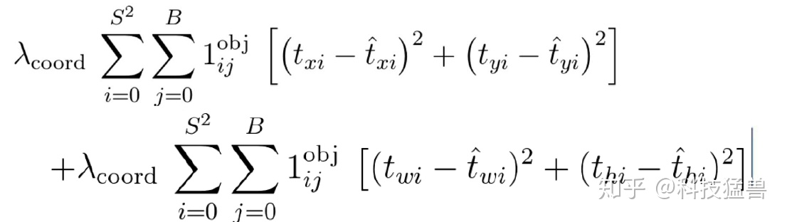

<center>使用tx和ty(而不是 bx 和by)来计算损失</center>

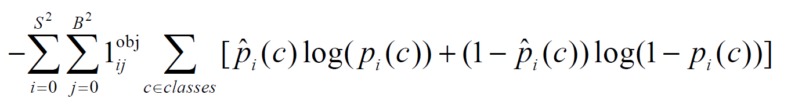

<center>交叉熵损失</center>

**总结起来就是下面4句话：**

* 正样本：与GT的IOU最大的框。
* 负样本：与GT的IOU<0.5 的框。
* 忽略的样本：与GT的IOU>0.5 但不是最大的框。
* 使用 tx 和ty （而不是 bx 和by ）来计算损失。

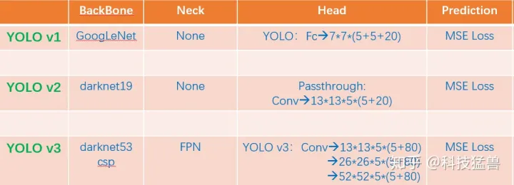

# YOLO v4

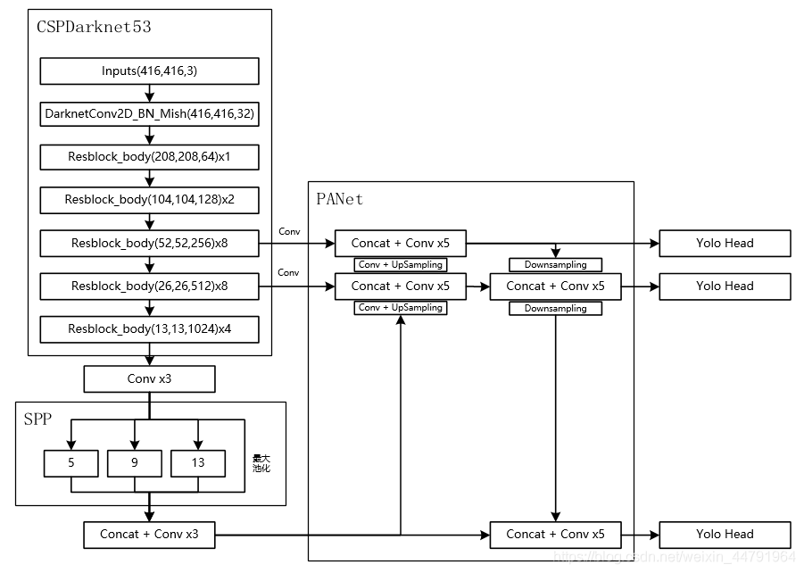

v4贡献：

+ 单GPU即可达到很好的训练效果，很多小模块的改进就是这个出发点
+ 两大核心方法，从数据层面和网络设计层面进行改善
+ 大量的消融实验，全部是单GPU完成

## Bag of freebies(BOF)

+ 增加训练成本，显著提高精度，并不影响推理速度。
+ 数据增强：调整亮度、对比度、色调、随机缩放、剪切、翻转、旋转。
+ 网络正则化的方法：Dropout、Dropblock等。
+ 类别不均衡，损失函数设计。

## Mosaic data augmentation

1. 马赛克数据增强：参考CutMix然后四张图像拼接成一张进行训练。改进来源：Mixup、Cutout、CutMix，如下图

   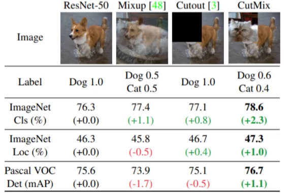
2. Random Erase：用随机值或训练集的平均像素值替换图像的区域。

   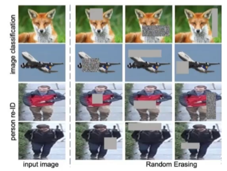
3. Hide and Seek：根据概率设置随机隐藏一些补丁。

   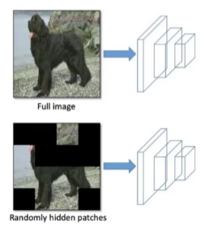
4. self-adversarial-training(SAT)：通过引入噪音点来增加难度。

   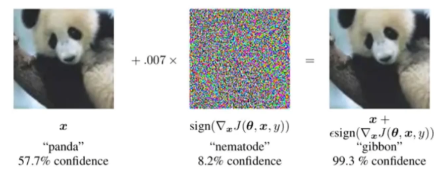
5. DropBlock：之前的dropout是随机选择点去除，现在去除一个区域。

   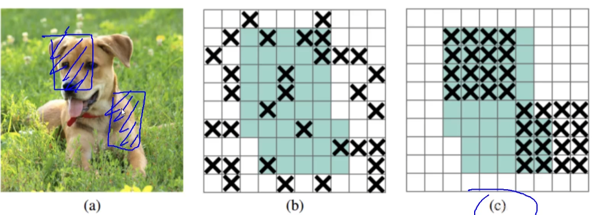

## Label Smoothing

神经网络最大缺点：容易过拟合。通过Label Smoothing，将原来的(0,1)标签进行变换，如：$ [0,1]×(1-0.1)+0.1/2=[0.05,0.95]$。标签平滑使用后效果分析(右图)：族内更紧密，簇间更分离。

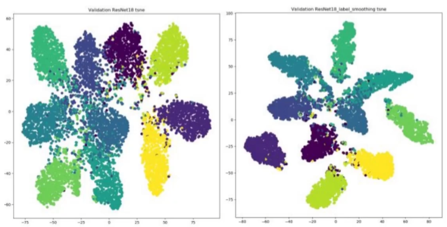

## 损失函数

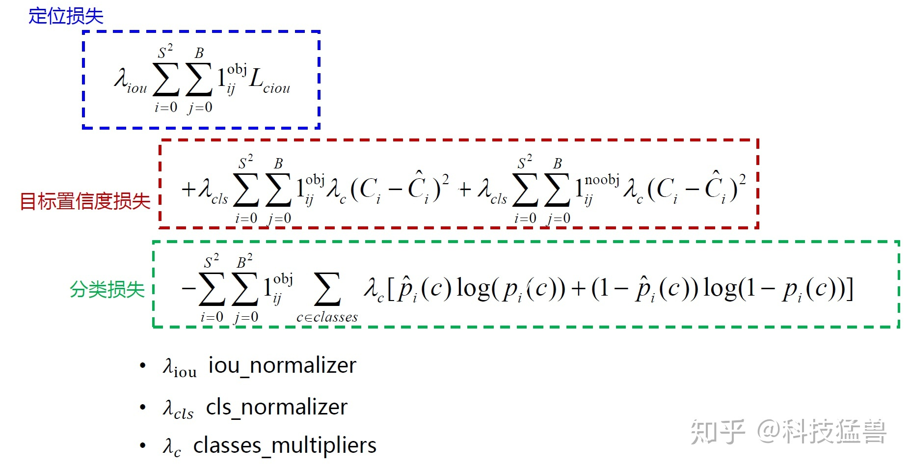

## CIOU损失

CIoU就是在DIoU的基础上增加了检测框尺度的loss，增加了长和宽的loss，使得目标框回归更加稳定，不会像IoU和GIoU一样出现训练过程中发散等问题。

$$
L_{DIoU}=1-IoU+\frac{\rho ^{2} (b,b^{gt} )}{c^{2}} +\alpha \nu
$$

其中$\nu =\frac{4}{\pi ^2} (arctan\frac{w^{gt}}{h^{gt}} -arctan\frac{w}{h})^2$，$\alpha =\frac{\nu }{(1-IoU)+\nu}$

考虑长宽比因素，引入$\alpha \nu$；其中$\alpha$可以当做权重参数。

存在的问题：

+ 如果预测框和真实框的长宽比是相同的，那么长宽比的惩罚项恒为0，不合理。
+ 观察CIoU中w，h相对于$\nu$的梯度，发现这两个梯度是一对相反数，也就是说，w和h不能同时增大或减小，不合理。

> 损失函数必须考虑的三个几何要素：重叠面积、中心点距离、长宽比

## NMS

### DIOU-NMS

之前的IOU-NMS根据IoU决定是否删除一个框，在YOLOv4中改用DIOU-NMS。

$$
s_{i}=\left\{\begin{array}{l}s_{i}, I o U-\mathcal{R}_{D I o U}\left(\mathcal{M}, B_{i}\right)<\varepsilon \\0, I o U-\mathcal{R}_{D I o U}\left(\mathcal{M}, B_{i}\right) \geq \varepsilon\end{array}\right.
$$

其中$\mathcal{R}_{DIoU}= \frac{\rho ^2(b,b^{gt})}{c^2} $，M表示高置信度候选框，$B_i$就是遍历各个框跟置信度高的重合情况。

不仅考虑了IoU的值，还考虑了两个Box中心点之间的距离。

### SOFT-NMS

不满足要求的降低分数而不是直接剔除。

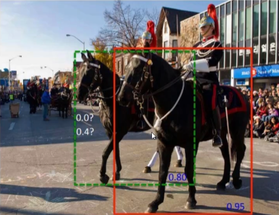

使得召回率提高。

## Bag of specials(BOS)

+ 增加稍许推断代价，但可以提高模型精度的方法。
+ 网络细节部分加入很多改进，引入各种能让特征提取更好的方法
+ 注意力机制，网络细节设计，特征金字塔等

## SPPNet(Spatial Pyramid Pooling)

### SPPNet中的SPP

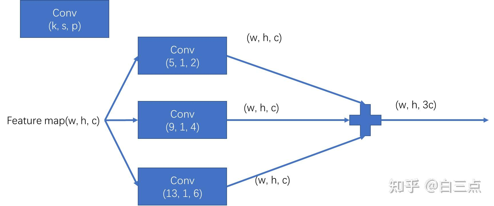

作用：增大感受野；使得网络可以接收任意大小的输入，更方面多尺度训练。

通过最大池化满足最终输入特征一致。

### YOLO中的SPP


输入的Feature map经过三次卷积操作像素并没有发生改变。

> 在YOLO中作用更多的是实现局部特征和全局特征的featherMap级别的融合。

## CSPNet(Cross Stage Partial Network)

在YOLOv4中用的是CSPReaNe(X)t.

按照特征图的channel维度拆分成两部分，一部分正常走网络，另一部分直接concat到这个block的输出。

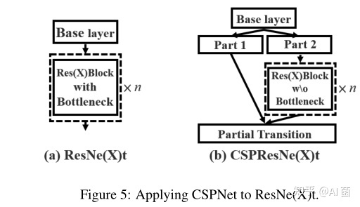

## SAM

### CBAM

Convolutional Block Attention Module (CBAM) 表示卷积模块的注意力机制模块，是一种结合了空间（spatial）和通道（channel）的注意力机制模块。相比于senet只关注通道（channel）的注意力机制可以取得更好的效果。

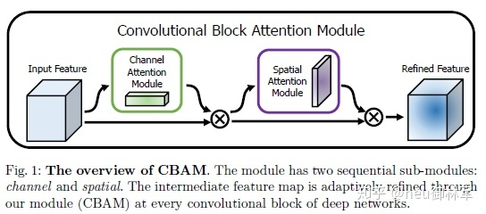

上图是添加CBAM后的整体结构。

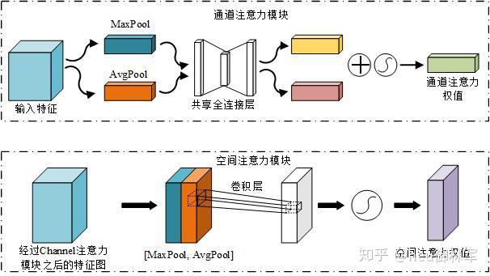

### SAM

YOLOv4只采用了其中的SAM，并进行了精简。去掉原SAM中的最大、平均池化，提高了训练速度。

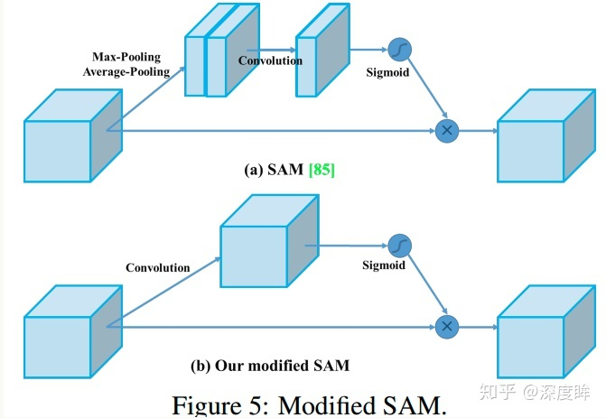

## PAN(Path Aggregation Network)

引入了自底向上的路径，使得底部信息更容易传递到顶部，并且是以一个捷径的方式实现。

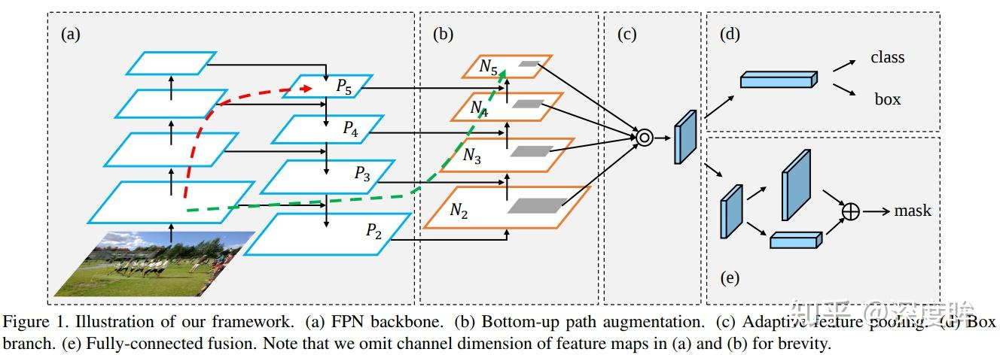

### concat操作

YOLOv4的PAN用的并不是加法(add)，而是拼接(concat)。

add用于特征信息的叠加，通道数不变，对于单张图片分类是有好处的，比如一张13×13的小图有眼睛的特征，26×26的特征图有脸的特征，通过add操作，能够更好地说明是人脸。add是基于对应通道的特征图语义信息相似，从而对应的特征图可以共享一个卷积核。

但在目标检测和语义分割网络中，一张图绝大多数情况是有多个目标的，对此进行分类，直接语义叠加显然不合适。（比如见小特征图猫的眼睛和大特征图狗的尾巴进行叠加，反而不利于分类）。因为这个时候不能认为对应通道的特征图语义类似，不能共享卷积核。

因此，用concat操作去增加特征图的数量（基于通道数增加）。

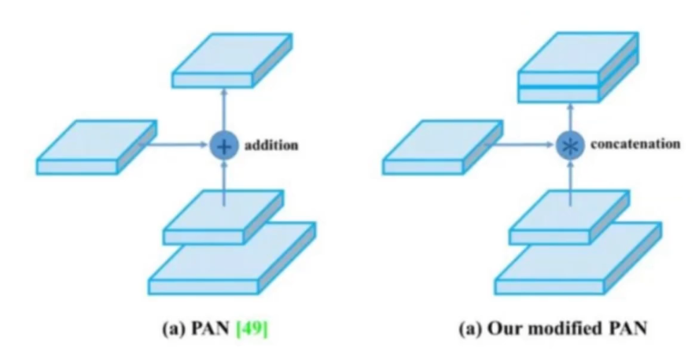

## Mish激活函数

改进Relu有点绝对的缺点，Mish更符合实际，效果会提升一点。但从公式中也可以看到计算量确实增加了。

$$
f(x)=x\cdot tanh(ln(1+e^{x} ))
$$

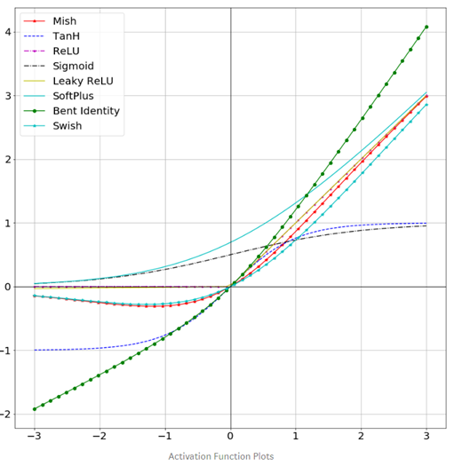

## Eliminate grid sensitivity

坐标回归预测值都在0-1之间，那么如果在grid边界怎么表示？

原始的边界框回归sigmoid中t需要很大的数值才可以达到边界（只有在t趋向无穷时才会为0，而当两个边界框完全重合时，就很难取到0）。因此进行边界框回归改进，添加系数，$b_x$，$b_y$进行改进如下：

$$
b_x=(σ(t_x)*scale_{xy}-(scale_{xy}-1)/2)+C_x
$$

$$
b_y=(σ(t_x)*scale_{xy}-(scale_{xy}-1)/2)+C_y
$$

通常情况下$scale_{xy}$取为2，使得b的取值范围扩大为-0.5到1.5之间，可以让$σ(t_x)$更容易的取到0或1，同时增加更多的可能性。


# YOLO v5

yolov5s.yaml

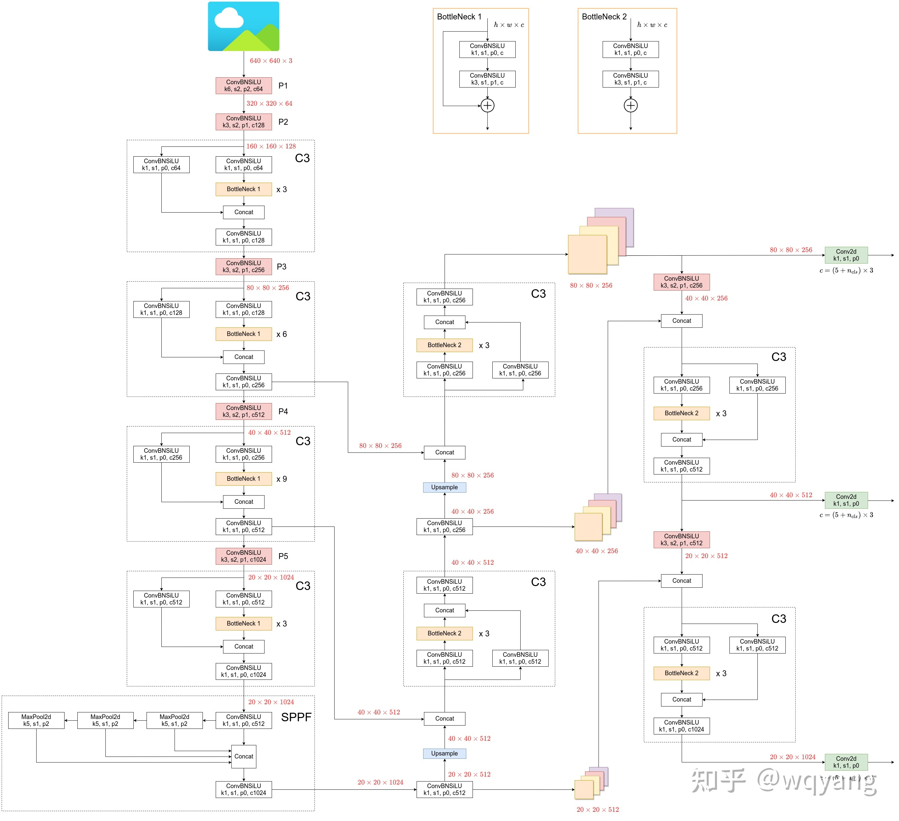

YOLOv5结构主要由输入端(Input)、主干网络(Backbone)、颈部网络(Neck)和预测输出端(Prediction)构成

> + 输入端：主要包括Mosaic 数据增强、自适应锚框计算和自适应图片缩放。
> + 主干网络：包括Focus 输入切分处理、CBL 模块处理、CSP3 结构和空间金字塔池化(spatial pyramid pooling，SPP)
> + Neck：沿用了 YOLOv4 的路径聚合网络，一种从底至上的路径增强，其包含可通过**管道聚合**的信息组件，将 Backbone 所提取的不同阶段特征进行上采样和池化，使用低层和顶层的横向连接，缩短信息传播路径，运用增强路径的手段使不同层级的特征信息得到丰富。
> + 预测输出端：默认采用GIOU_Loss 作为损失函数且分别有 3 种不同尺度的输出，对应大、中、小 3 种不同的目标预测。

## Focus模块

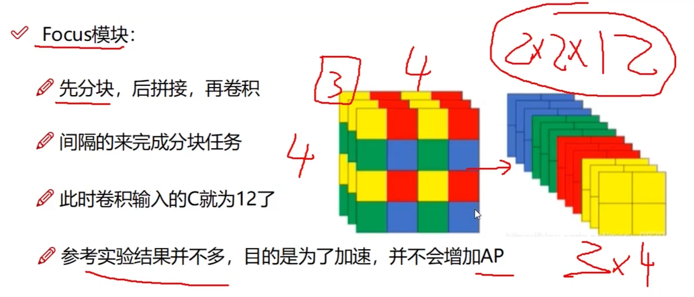

## BottleneckCSP

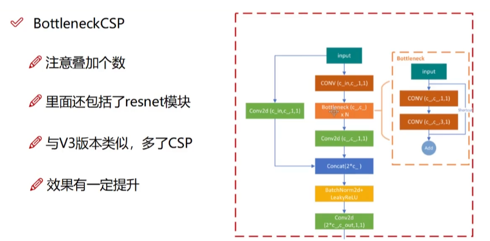

## SPPF

通过不同的kernel_size生成不同的特征图，通过控制padding值使得生成的特征图大小一致，从而顺利完成拼接操作。

# YOLO v1 — v5比较总结

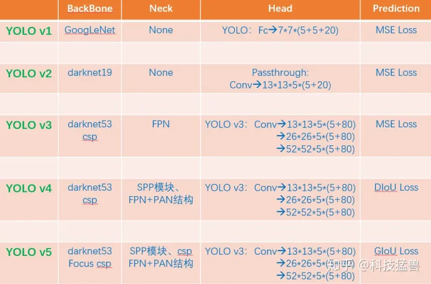

# YOLO v7

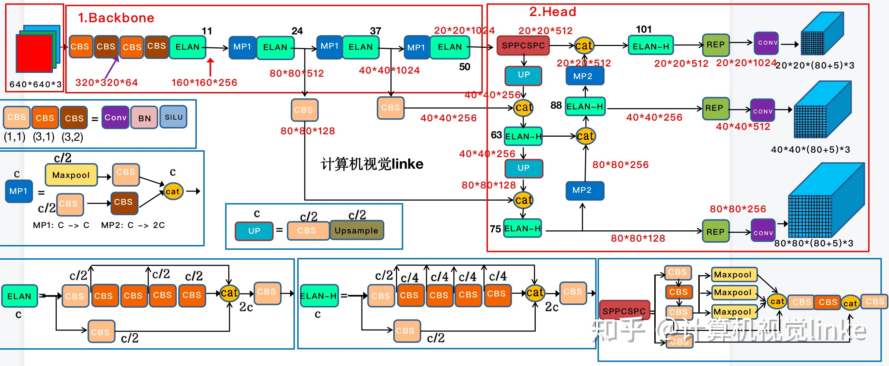

v7经典版本，非大版本（带辅助头）


## 模型重参化

### BN+conv

训练完后在推理阶段将多个模块合并为一个模块，合并测试网络中的BN和conv，用一个卷积代替原来的卷积+BN。

1. 卷积核BN合并
2. 全部卷积为3×3的卷积
3. 多个卷积核再合并

BN公式拆解：

$$
\hat{x_i}=\gamma \frac{x_i-\mu }{\sqrt{\sigma ^2+\epsilon } }  +\beta \hat{x_i}=\frac{\gamma x_i }{\sqrt{\sigma ^2+\epsilon } }+\beta -\frac{\gamma  \mu }{\sqrt{\sigma ^2+\epsilon } }
$$

网络中矩阵形式如下：

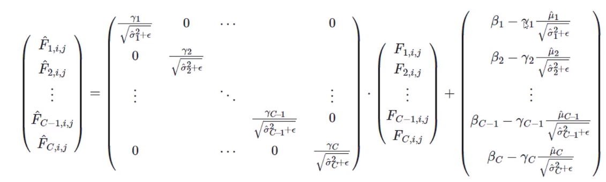

由公式我们发现，特征图F经过归一化后的结果相当于一个1×1×C的卷积$\hat{F} _{i,j} =W_{BN}\cdot F_{i,j}  +b_{BN}$($F_{i,j}$为之前卷积后的特征图)。因此，将BN与conv结合后的公式如下：

$$
\hat{f} _{i,j} =W_{BN}\cdot (W_{conv}\cdot f_{i,j}+b_{conv})+b_{BN}
=W_{BN}\cdot W_{conv}\cdot f_{i,j}+W_{BN}\cdot b_{conv}+b_{BN}
=W\cdot f_{i,j} +b
$$

因此就可以在推理阶段用一个卷积代替原来的卷积+BN，达到了加速的效果。

模型改变示意图如下：


针对卷积核1×1和3×3的合并方法，下文指出

### 卷积核1×1变换为3×3

原因：英伟达对3×3的优化更好，可以与3×3的卷积核合并在一起。

方法：计算方式不变，对卷积核进行padding，相应的对原始输入进行padding，这样就可以用1×1代替3×3。

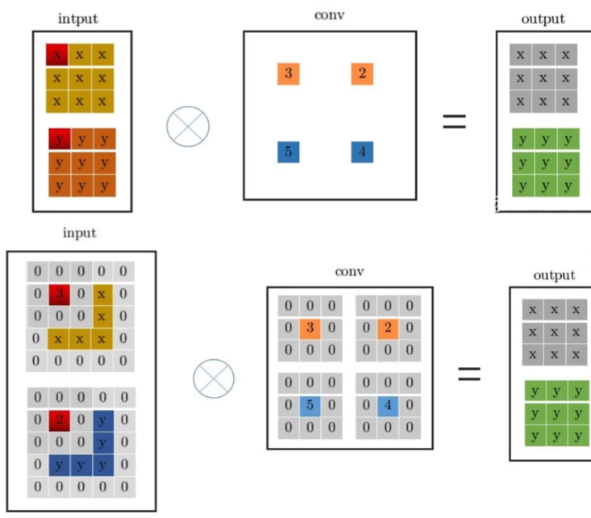

## 正样本分配策略

正样本：GT的中心点落在哪个点附近，其对应的anchor就可能成为正样本。

真实框的中心点往上下左右进行偏移（如0.5个单位），使得更多（三个）的anchor成为正样本，使得正样本匹配机会更多，能够提升recall。

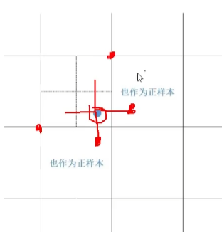

### 如何成为正样本

正样本筛选方案：

1. anchor选择：Autoanchor策略，获得数据集最佳匹配的9个anchor（可选）；
2. 初筛：根据GT框与anchor的宽高比，过滤掉不合适的anchor（0.25<ground truth与anchor的长宽比例<4）；
3. 正样本选择：选择GT框的中心网格以及最邻近的2个邻域网格作为正样本筛选区域（辅助头则选择周围4个邻域网格）；
4. IOU：计算GT框与正样本IOU并从大到小排序，选取前10个值进行求和，并取整作为当前GT框的K值；
5. 损失计算：根据损失函数计算每个GT框和候选anchor的损失，保留损失最小的前K个（下文视频讲解示例中根据的是IOU）；
6. NMS：去掉同一个anchor被分配到多个GT框的情况。

示例如下文：

### IOU损失计算

例如输入的GT为3个，候选框13个，则可以得到表示IOU的[3，13]矩阵，如下图：

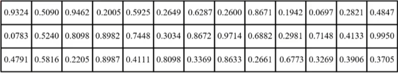

接下来看TOPK，选择策略是超过十个就TOP10，要是不够K就更小，得到IOU如下结果：

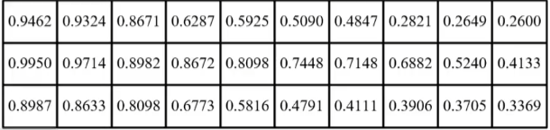

对每一个GT对应的候选框（图中每一行）进行求和并向下取证得到sum，每一行的前sum个对应的就是每一个GT最终选择的候选框。

注意：若存在一个候选框对应多个GT，则选择其中损失最小的那一个。举例如下：

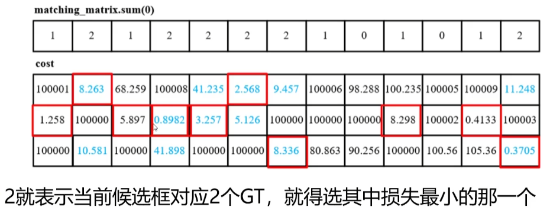

## 预测框

v3、v4预测的结果：

$$
\begin{array}{c}b_{x}=\sigma\left(t_{x}\right)+c_{x} \\b_{y}=\sigma\left(t_{y}\right)+c_{y} \\b_{w}=p_{w}e^{t_w} \\b_{h}=p_{h}e^{t_h}\end{array}
$$

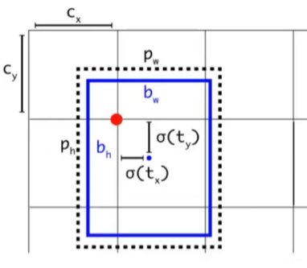

v5、v7预测的结果：

$$
\begin{array}{c}
b_{x}=2 \sigma\left(t_{x}\right)-0.5+c_{x} \\
b_{y}=2 \sigma\left(t_{y}\right)-0.5+c_{y} \\
b_{w}=p_{w}\left(2 \sigma\left(t_{w}\right)\right)^{2} \\
b_{h}=p_{h}\left(2 \sigma\left(t_{h}\right)\right)^{2}
\end{array}
$$

其中，$b_x$，$b_y$中的2和0.5两个参数的添加使得b的取值范围扩大为-0.5到1.5之间（因为在正样本分配策略中对GT的中心点进行了0.5个单位），同时增加更多的可能性；$b_w$，$b_h$中的2和2限制了ground truth与anchor的长宽比例在[0，4]（正样本分配策略中初筛已经对长宽比例做了4的限制，因此这里不会超过4）。

### 预测值采用sigmoid的原因

v3不使用，容易导致梯度爆炸。v5、v7平方后取值为0-4。倍率不能差异太多，一般为0.25-4。

 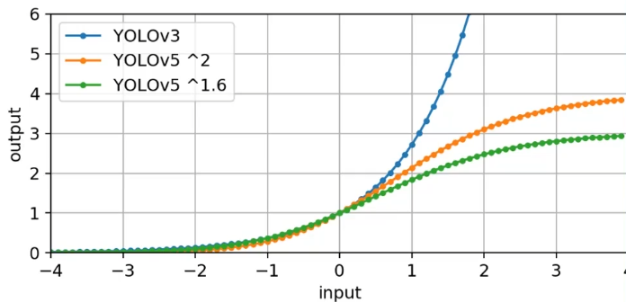

## AUX辅助输出

YOLOv7中，将head部分的浅层特征提取出来作为Aux head（辅助头），深层特征也就是网络的最终输出作为Lead head（引导头），如下图b所示。

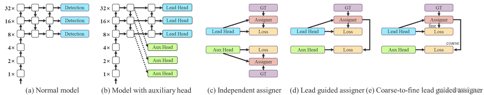

在计算损失时：

+ 图c的策略：lead head和aux head分别、单独计算损失，最终相加。
+ 图d的策略：lead head单独计算损失，aux head**将lead head匹配得到的正样本作为**自己的**正样本**，并计算损失，最终相加（**占比不同**）。
+ 图e的策略：lead head单独计算损失，aux head将lead head匹配得到的正样本（这里是**粗匹配**，也就是**选择GT框中心点所在网格的上下左右4个邻域网络作为正样本筛选区域**）作为自己的正样本，并计算损失，最终相加（占比不同）。

# YOLO v8

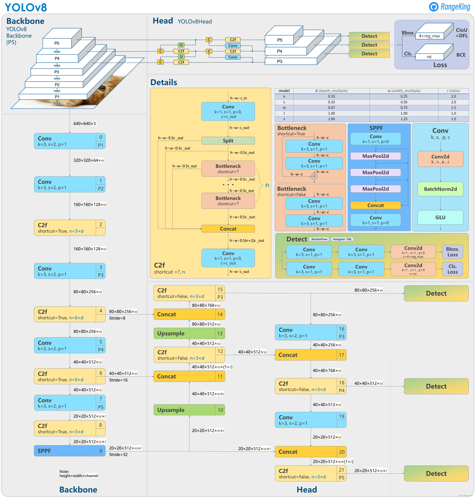

YOLOv8核心特性和改动：

* 提供了一个全新的SOTA模型，包括P5 640和P6 1280 分辨率的目标检测网络和基于YOLACT的示例分割模型。与v5一样提供基于缩放系数的N/S/M/L/X尺度不同大小的模型，满足不同场景的需求
* Backbone：骨干网络和Neck网络参考了v7 ELAN 设计的思想，C3换成了梯度流更丰富的C2f结构，并对不同尺度模型调整了不同的通道数。
  > 属于对模型结构精心微调，不再一套参数应用所有模型，大幅提升模型性能。但C2f模块中存在的Split等操作对特定硬件部署没有之前友好。
  >
* Head：较v5有两大改进，换成了目前主流的解耦头结构（Decoupled-Head），将分类和检测头分离；Anchor-Based换成了Anchor-Free。
* Loss：抛弃了以往的IOU匹配或者单边比例的分配方式，使用

## 损失函数

# 注意力机制

## CoordAtt

通道注意力（如SE）对于提升模型性能有显著效果，但通常会忽略位置信息，而位置信息对于生成空间选择性attention maps是非常重要的。

Coordinate Attention 将位置信息嵌入到通道注意力中，是一种新颖的移动网络注意力机制。与通过2维全局池化将特征张量转换为单个特征向量的通道注意力不同，coordinate注意力将通道注意力分解为两个1维特征编码过程，分别沿2个空间方向聚合特征。这样，可以沿一个空间方向捕获远程依赖关系，同时可以沿另一空间方向保留精确的位置信息。
