# 训练集、验证集、测试集

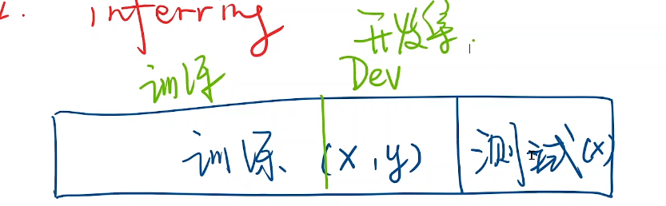

# MSE


# Visdom

训练数据**实时**可视化工具，三维图等

# np.meshgrid()

画三维图

# 非凸函数

画一条线所有函数值都在曲线（或曲面）的上方或下方

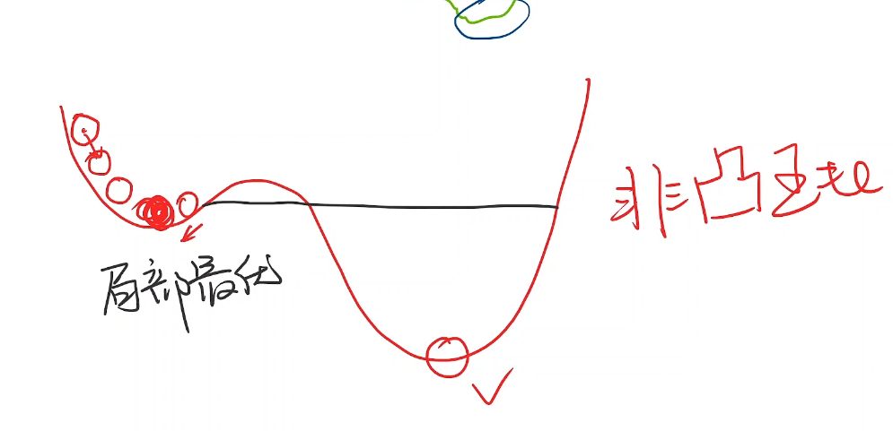

# 梯度下降

## 鞍点

梯度为0（多元为0向量）的点

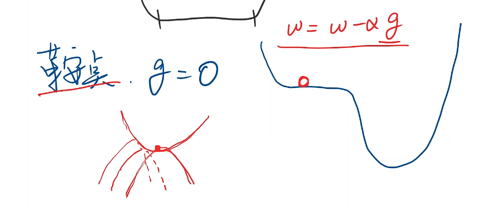

## zip()

拼装作用

```
x_data = [1.0,2.0,3.0]
y_data = [2.0,4.0,6.0]
w= 1.0
def forward(x) :
    return X *w
def cost (xs, ys) :  
    cost = 0
    for x, y in zip(xs, ys):   # 拼装x_data和y_data
       y_pred = forward(x)cost += (y_pred - y) ** 2
    return cost / len(xs)
```

## 指数加权均值

减少锯齿，对cost做平滑处理

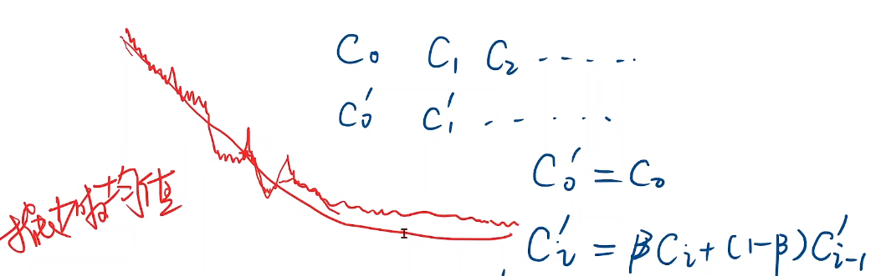

## 随机梯度下降

通过随机梯度下降，可能会跨越鞍点。

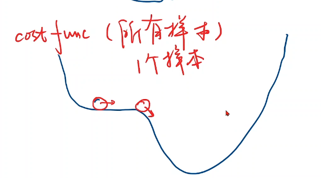

操作：拿其中一个loss（而非总体cost）做梯度下降处理。（Update weight by every grad of sample of train set.）

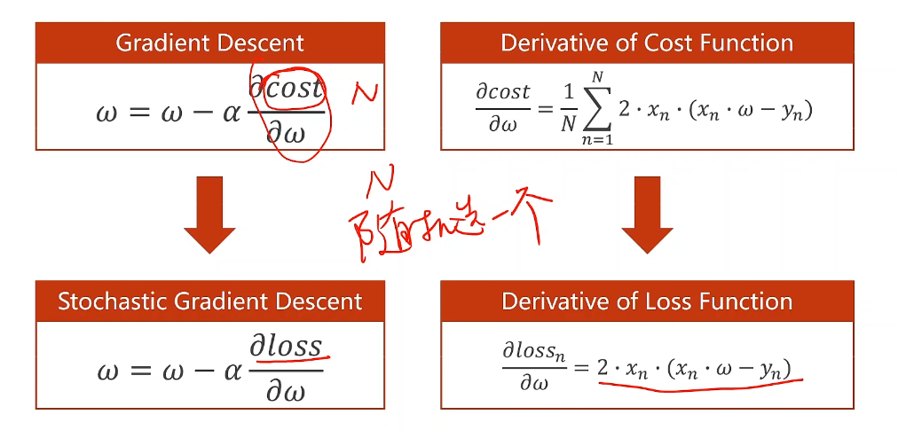

代码修改如下：

```
x_data = [1.0,2.0,3.0]
y_data = [2.0,4.0,6.0]
w=1.0
def forward(x) :
    return x * w
def loss (x, y) :
    y_pred = forward(x)
    return(y_pred - y)**2
def gradient(x, y) :
    return 2 * x* (x * w-y)


for epoch in range(100) :
    for x, y in zip(x_data, y_data) :
        grad = gradient(x, y)		# 计算每一个样本的损失，进行梯度下降
        w = w- 0.01 * grad
        print("\tgrad:",x,y,grad)
        l = loss(x, y)

    print("progress:",epoch,"w=",w,"loss",l)

print("Predict (before training)",4, forward(4))
```

注意：梯度下降在计算函数值时可以并行计算，随机梯度下降不能并行计算，因为上一个样本梯度更新完后才能进行下一个样本的函数值计算。

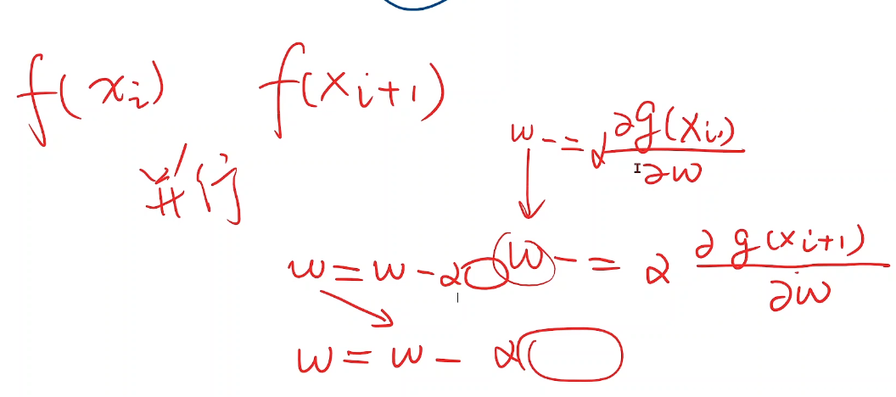

## Batch

又叫Mini-Batch（专业叫法），batch原指整个样本数据集，现在默认认为是分组后的一组样本。

batch是对所有样本cost进行梯度下降和针对单个样本loss逐一逐步梯度下降（即随机梯度下降）的**折中方法**，将几个样本分组，每次用一组的样本去求相应的梯度，然后进行随机梯度下降，这样组内每个样本的函数值就可以并行计算。

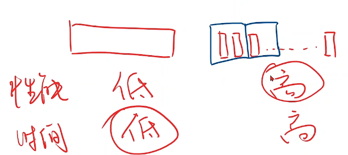

# 反向传播

## 参数量

如下图w，第一层隐层：6×1为输出向量，5×1为输入向量，故而权重矩阵为6×5，共30个权重。

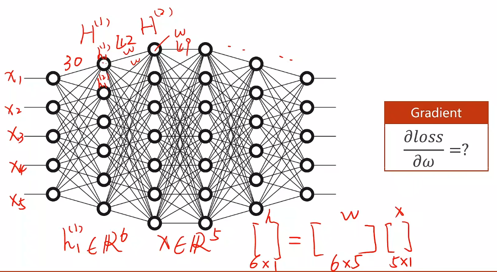

## 计算图

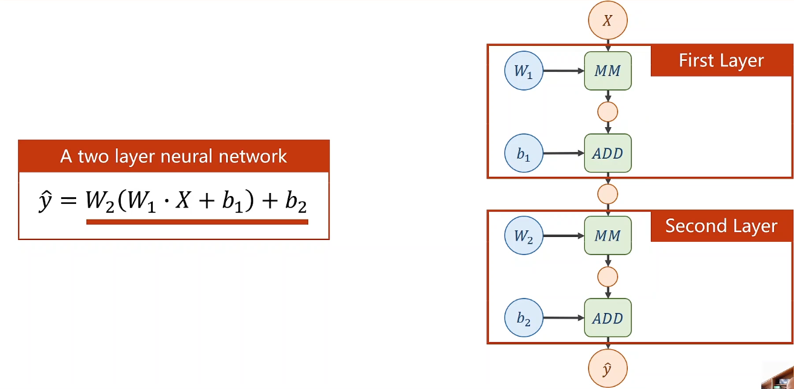

> 可以化简为如下线性变换，使得层数多与层数少没区别

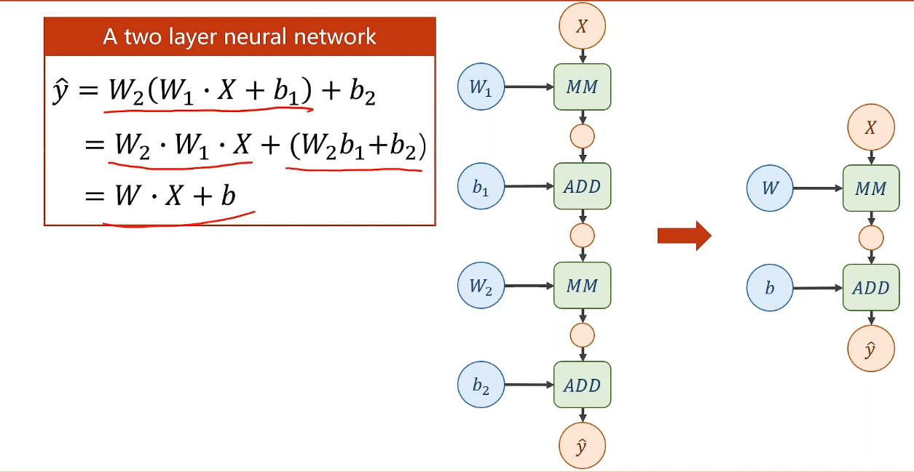

> 因此对每一层加一个非线性函数（激活函数），如下图：

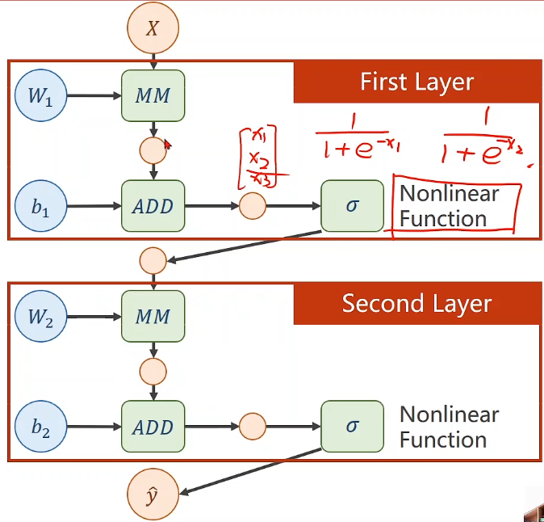

> 反向传播例题：

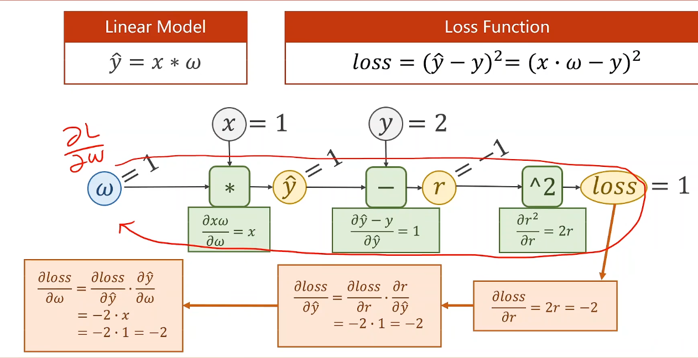

带偏置量b

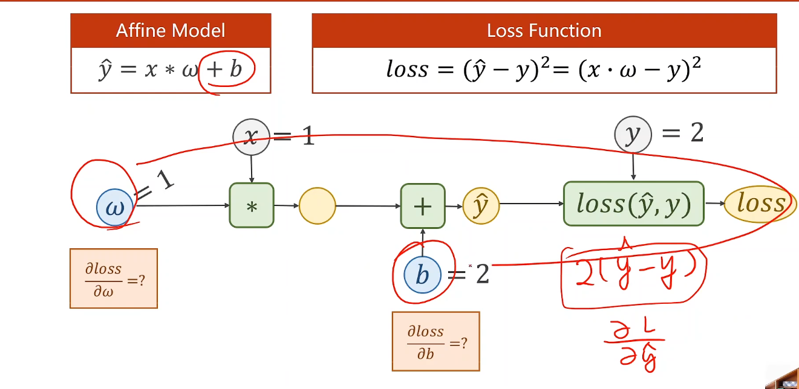

## Tensor in PyTorch

> w：

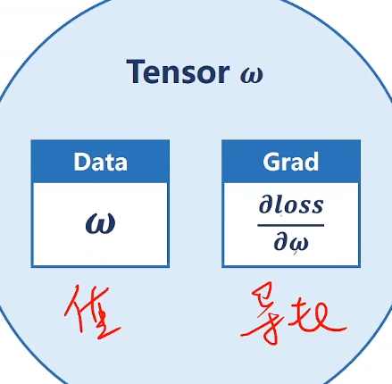

grad也是一个tensor

## 反向传播代码实现

由代码构建计算图

```
import torch

x_data = [1.0, 2.0, 3.0]
y_data = [2.0, 4.0, 6.0]
w = torch.Tensor([1.0])		# [1.0]表示w中有一个值
w.requires_grad_(True)		# True表示需要计算梯度


def forward(x):
    return x * w		# x不一定是tensor，这里自动转换为tensor


def loss(x, y):
    y_pred = forward(x)
    return (y_pred - y) ** 2


for epoch in range(100):
    for x, y in zip(x_data, y_data):
        l = loss(x, y)		# 前馈，只需要计算loss，形成计算图
        l.backward()		# 反馈，在计算图中自动计算梯度，存到w中，然后该计算图释放
        print('\tgrad:', x, y, w.grad.item())		# item()：变为Python中的标量
        w.data = w.data - 0.01 * w.grad.data		# .data：取到张量的data，做纯数值计算。否则会进行张量操作，会导致继续构建计算图
        w.grad.data.zero_()	# 将张量grad中的梯度清零
    print("progress:", epoch, l.item())
print("predict(after training)", 4, forward(4).item())


```

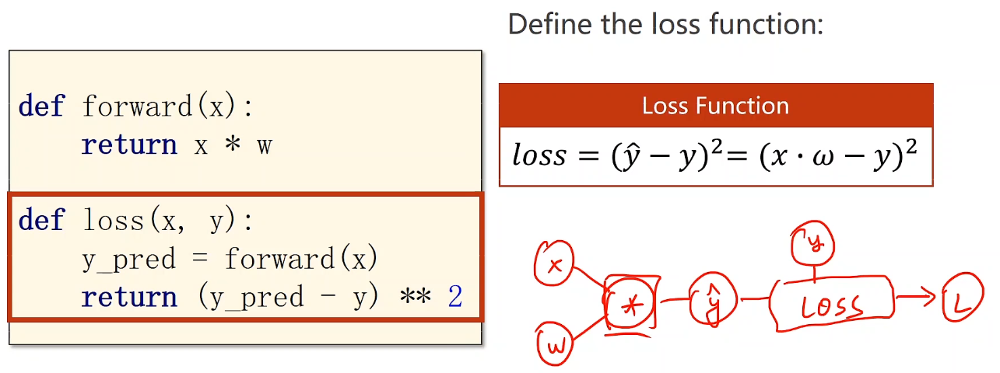

# 实现线性回归

单列tensor创建

```
import torch

my_tensor = torch.Tensor([[1.0], [2.0], [3.0]])
print(my_tensor)

输出如下：
tensor([[1.],
        [2.],
        [3.]])

```

多列tensor创建

```
import torch

my_tensor = torch.Tensor([[1.0, 2.0], [3.0, 4.0], [5.0, 6.0]])
print(my_tensor)

输入如下：
tensor([[1., 2.],
        [3., 4.],
        [5., 6.]])
```

## 线性回归代码实现

```
import torch

x_data = torch.Tensor([[1.0], [2.0], [3.0]])
y_data = torch.Tensor([[2.0], [4.0], [6.0]])


class LinearModel(torch.nn.Module):
    def __init__(self):
        super(LinearModel, self).__init__()
        self.linear = torch.nn.Linear(1, 1)

    def forward(self, x):
        y_pred = self.linear(x)
        return y_pred


model = LinearModel()

criterion = torch.nn.MSELoss(size_average=False)
optimizer = torch.optim.SGD(model.parameters(), lr=0.01)

for epoch in range(1000):
    y_pred = model(x_data)
    loss = criterion(y_pred, y_data)
    print(epoch, loss)      # 自动调用loss中的__str__(),不会生成计算图

    optimizer.zero_grad()       # 梯度归零
    loss.backward()             # 反向传播
    optimizer.step()            # 参数更新


# Output weight and bias
print('w =', model.linear.weight.item())
print('b =', model.linear.bias.item())

# Test Model
x_test = torch.Tensor([[4.0]])
y_test = model(x_test)
print('y pred =', y_test.data)
```

## torch.nn.Linear()

会构建计算图

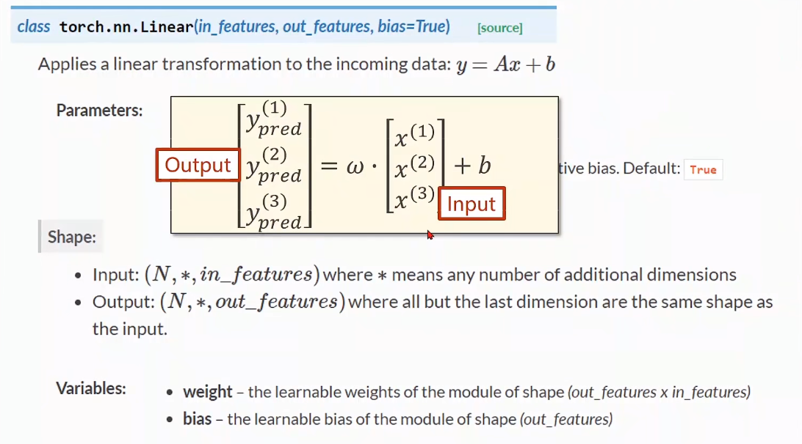

## 可调用对象

`y_pred = self.linear(x)`在对象后边加括号，因为这是一个可调用的对象

在对象中定义__call__这个函数可以使对象可调用

而pytorch的module的__call__中便调用forward()。

```
class Foobar:
    def __init_(self):
        pass

    def __call__(self，*args，**kwargs):	# __call__示例
        forward( self,)
```

```
def func(*args, **kwargs):	# *args, **kwargs用法
    print(args, kwargs)

func(1,2,3,4,x=1,y=2,z=3)

输出为：
(1, 2, 3, 4) {'x': 1, 'y': 2, 'z': 3}
```

## torch.nn.MSELoss()

size_average设置是否取均值，会构建计算图

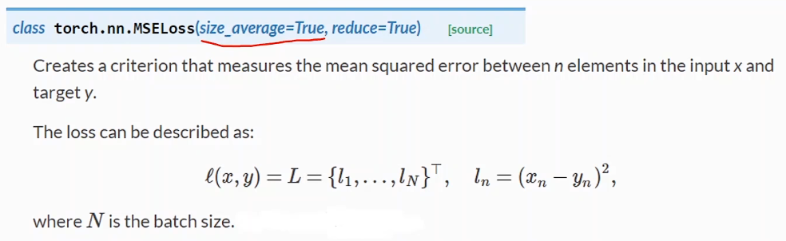

## torch.optim.SGD()

优化器SGD，优化器不会构建计算图。pytorch还可以对模型不同部分使用不同的学习率。


```
optimizer = torch.optim.SGD(model.parameters(), lr=0.01)
```

### model.parameters()

model构成如下：

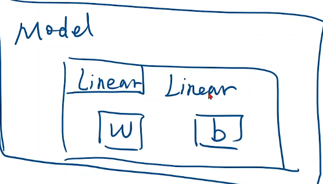

取得linear中的权重时 `model.parameters()`会调用`linear.parameters()`

# 逻辑斯蒂回归

## torchvision中带的数据集

### MNIST Dataset

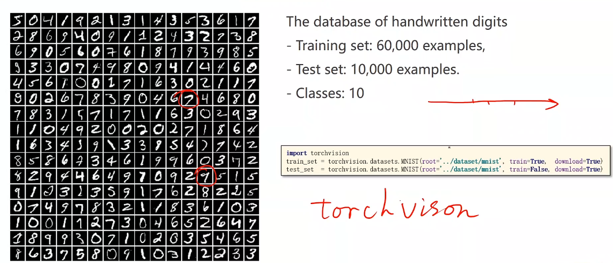

### CIFAR Dataset

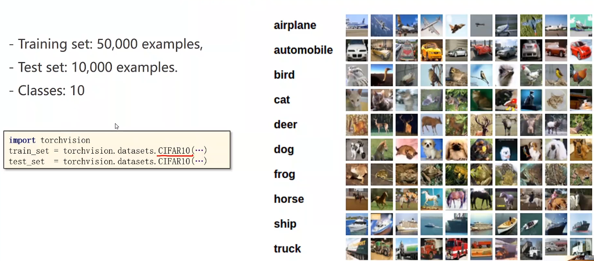
