# 轻量化

轻量化神经网络常用于移动端 、终端边缘计算，主流方法如下：

+ 压缩已经训练好的模型：知识蒸馏、权值量化、剪枝（权重剪枝、通道剪枝）、注意力迁移。
+ 直接训练轻量化网络：squeezeNet、MobileNet(v1、v2、v3\)、Mnasnet、shuffleNet(v1、v2)、Xception、EfficientNet、EfficientDet。
+ 加速卷积运算：im2col+GEMM、Winograd、低秩分解。
+ 硬件部署：TensorRT、Jetson、Tensorflow-slim、Tensorflow-lite、Openvino、FPGA、集成电路。

## 知识蒸馏

> 知识蒸馏使用一种教师-学术（Teacher-Student）训练结构，先训练一个性能较好的教师模型（大模型），然后使用大模型的输出作为软标签，用数据的真实标签作为硬标签，两者联合起来去训练学生模型（小模型）。通过该方法能把模型压缩到一个非常小的规模，最终以轻微的性能损失为代价将复杂教师模型的知识迁移到简单的学生模型中。在蒸馏的过程中， **小模型学习到了大模型的泛化能力，保留了接近于大模型的性能** 。

### 核心思想

知识蒸馏（Knowledge Distillation，KD）最早针对的是分类问题，分类问题最后经过softmax层输出概率。因此一种简单高效的迁移泛化能力的方法就是：“软标签”，使得学生模型相比教师模型可以使用更少的数据和更大的学习率（意味着收敛很快，多出来的训练时间可以忽略）。

> 软标签是指输入数据通过教师模型所得到的softmax层的输出，与硬标签（Ground Truth）相比，有着更高的熵，更小的梯度变化。

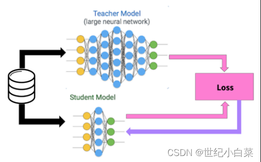

### 知识蒸馏有效的原因

softmax层输出的软标签可以保留负标签带有的大量信息（比如某些负标签对应的概率远远大于其他负标签）。而传统的训练过程hard target 中，所有负标签都被统一对待（即负标签之间不区分差异）。因此，KD的训练方式使得每个样本跟学生模型（Net-S）带来的信息量大于传统的训练方式。

> **硬标签（**hard targets**）**：输入数据所对应的label 例：[0,0,1,0]
>
> **软标签（**soft targets**）**：输入数据通过大模型所得到的softmax层的输出 例：[0.01,0.02,0.98,0.17]
>
> 以上例子可以看出soft target 有着更高的熵，更小的梯度变化，**因此student相比teacher可以使用更少的数据和更大的学习率** （意味着收敛很快，这部分多出来的训练时间不是问题）

### 蒸馏的过程

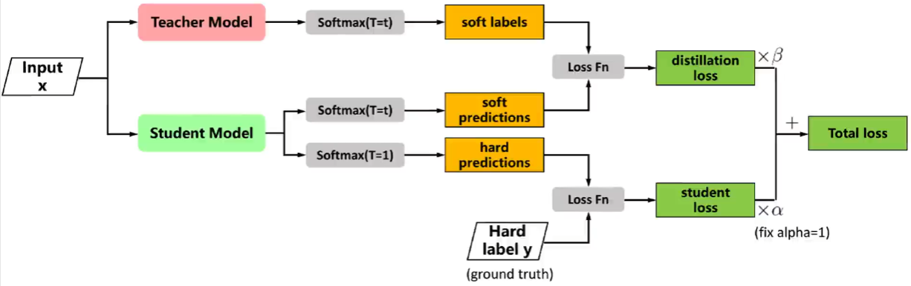

1. 训练大模型（教师模型）：hard target 。正常的label训练大模型。
2. 计算“软目标”：利用训练好的大模型计算“软目标”。大模型“软化后”再经过softmax得到的softmax。
3. 训练小模型，在小模型的基础上再加一个额外的软目标的损失函数，通过参数调节两个损失函数的必中，蒸馏损失函数如下图：

   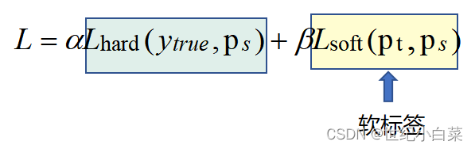

### 蒸馏温度

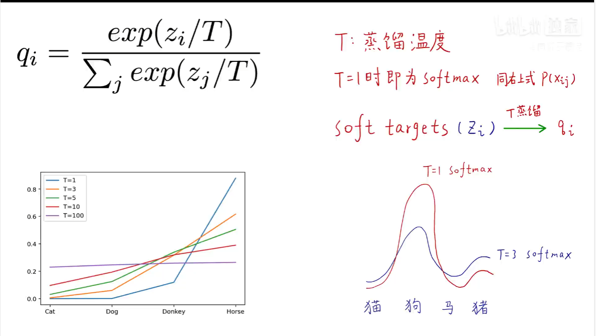

### 应用场景

+ 模型压缩
+ 优化训练，防止过拟合（潜在的正则化）
+ 无限大、无监督数据集的数据挖掘
+ 少样本、零样本学习

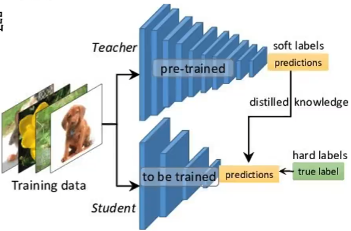

### 背后的机理

教师网络引导学生网络收敛到

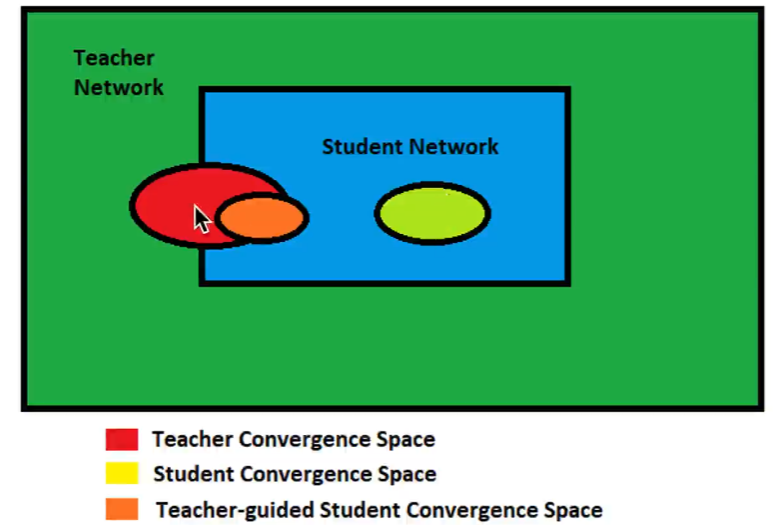

### 发展趋势

1. 教学相长。
2. 多个助教、多个老师、多个同学。
3. 知识的表示（中间层）、数据集蒸馏、对比学习。
4. 多模态、知识图谱、预训练大模型的知识蒸馏。

自蒸馏、离线蒸馏、在线蒸馏：

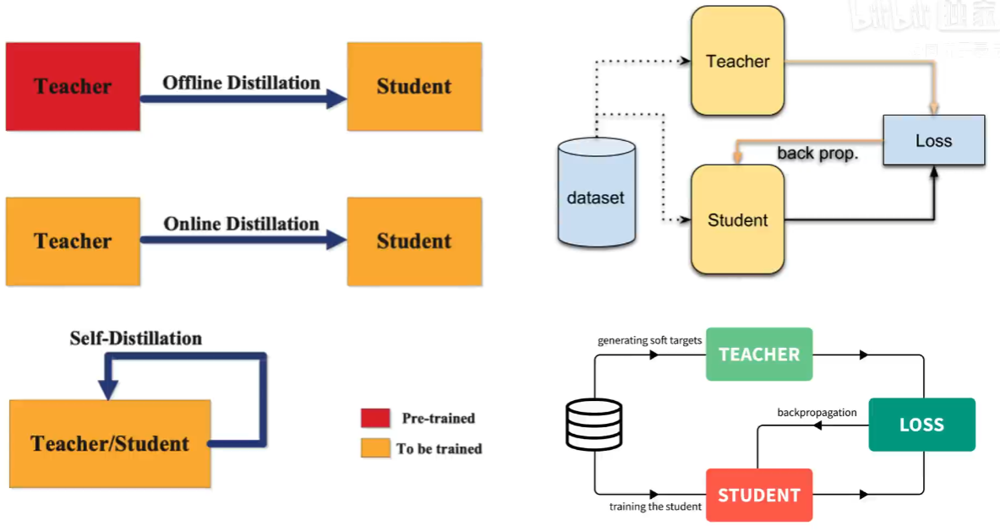

### 知识蒸馏代码库

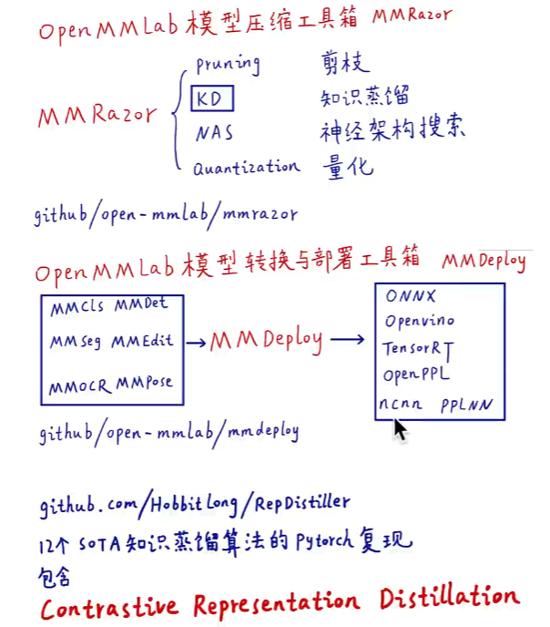

openMMlab为同济子豪兄团队自创

# IOU系列

> 边界框回归的三大几何要素：重叠面积、中心点距离、长宽比

## IOU

IoU是一种测量在特定数据集中检测相应物体准确度的一个标准。只要是在输出中得出一个预测范围(bounding boxes)的任务都可以用IoU来进行测量。

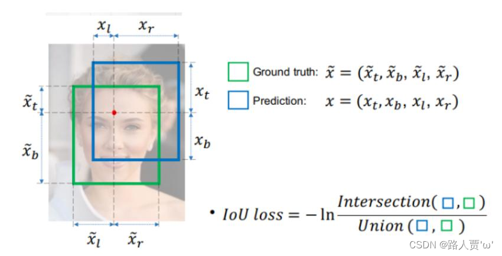

$$
IoU=\frac{\left | A\bigcap B \right | }{\left | A\bigcup  B \right | }
$$

$$
L_{IoU}=1-ln(IoU)
$$

IoU取值[0,1]。

存在的问题：

+ 如果两个框没有相交，IoU=0，不能反映两者的距离大小（重合度）。同时IoU=0无法进行梯度计算，没有梯度回传，无法进行学习训练。如下图a。
+ 相同的IOU却反映不出实际情况到底怎么样，不能判断哪种预测框更准确。如下图b、c：

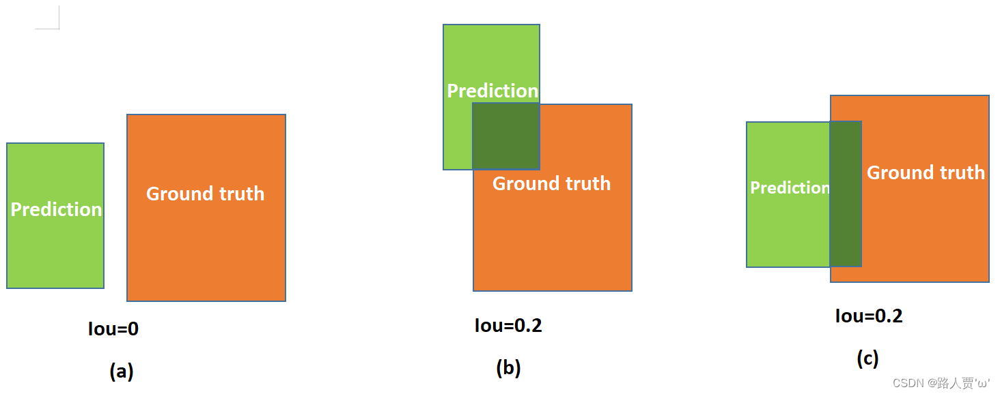

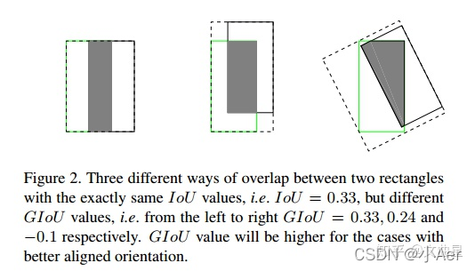

## GIOU

引入了最小封闭形状C（C可以把A，B包含在内）。

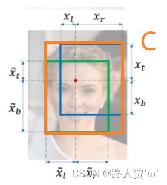

$$
GIoU=IoU-\frac{\left | C-B\bigcup B^{gt} \right |}{\left | C \right | }
$$

GIoU有对称区间，取值范围[-1,1]。在两者重合的时候取最大值1，在两者无交集且无限远的时候取最小值-1，因此GIoU是一个非常好的距离度量指标。

$$
L_{GIoU}=1-IoU+\frac{\left | C-B\bigcup B^{gt} \right |}{\left | C \right | }
$$

存在的问题：

+ 对每个预测框与真实框均要去计算最小外接矩形，计算及收敛速度受到限制。
+ 在两个预测框完全重叠或者两框处在同一水平或垂直方向的情况下，不能反映出实际情况，这时就退化为了IoU。

如下图所示，GIOU一样，但是实际第三种框会好一些。

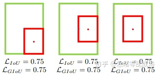

由于GIOU严重依赖IOU，因此在两个垂直方向上，误差很大，很难收敛。两框在相同距离的情况下，水平或垂直方向时，此部分面积最小，对loss的贡献也就越小，导致在垂直或水平方向上回归效果较差，并且以下的三种情况损失相同，GIOU也无法区分。


## DIOU

DIoU也是增加了C检测框，将真实框和预测框都包含了进来，但是DIoU计算的不是框之间的交并，而是计算的每个检测框之间的欧氏距离。

${\rho ^{2} (b,b^{gt} )}$计算预测框与真实框的中心点欧氏距离d的平方。

${c}$是能覆盖预测框与真实框的最小BOX的对角线长度

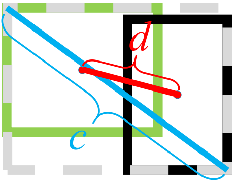

$$
DIoU=IoU-\frac{\rho ^{2} (b,b^{gt} )}{c^{2}}
$$

DIoU的惩罚项是基于中心点的距离和对角线距离的比值，避免了像GIOU在两框距离较远时，产生较大的外包框，Loss值较大难以优化。所以DIOU Loss收敛速度会更快。此外，即使在一个框包含另一个框的情况下，c值不变，但d值也可以进行有效度量。

存在的问题：考虑了重叠面积和中心点距离，当目标框包裹预测框的时候，直接度量2个框的距离，因此DIoU收敛的更快，但并没有考虑到长宽比。

直接优化距离，速度更快。

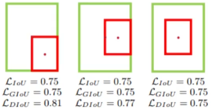

## CIOU

CIoU就是在DIoU的基础上增加了检测框尺度的loss，增加了长和宽的loss，使得目标框回归更加稳定，不会像IoU和GIoU一样出现训练过程中发散等问题。

$$
L_{DIoU}=1-IoU+\frac{\rho ^{2} (b,b^{gt} )}{c^{2}} +\alpha \nu
$$

其中$\nu =\frac{4}{\pi ^2} (arctan\frac{w^{gt}}{h^{gt}} -arctan\frac{w}{h})^2$，$\alpha =\frac{\nu }{(1-IoU)+\nu}$

考虑长宽比因素，引入$\alpha \nu$；其中$\alpha$可以当做权重参数，不参与梯度计算。

存在的问题：

$\nu$关于边长w和h的梯度为：

$$
\begin{array}{l}
\frac{\partial v}{\partial w}=\frac{8}{\pi^{2}}\left(\arctan \frac{w^{g t}}{h^{g t}}-\arctan \frac{w}{h}\right) \times \frac{h}{w^{2}+h^{2}} \\
\frac{\partial v}{\partial h}=-\frac{8}{\pi^{2}}\left(\arctan \frac{w^{g t}}{h^{g t}}-\arctan \frac{w}{h}\right) \times \frac{w}{w^{2}+h^{2}}
\end{array}
$$

+ 根据$\nu$的定义，如果预测框和真实框的长宽比是相同的，即：$\left\{\left(w=k w^{g t}, h=k h^{g t}\right) \mid k \in \mathbb{R}^{+}\right\}$，那么长宽比的惩罚项恒为0，不合理。
+ 观察CIoU中$\nu$相对于w，h的梯度，我们可以推出：$\frac{\partial v}{\partial w}=-\frac{h}{w} \frac{\partial v}{\partial h}$，表明w和h的梯度值$\frac{\partial v}{\partial w} $和$\frac{\partial v}{\partial h}$是具有相反符号的。这个相反符号表现为在w和h在其中一个值增大时，另外一个值必须减小，也就是说，w和h不能同增同减，不合理。

## EIOU

GIOU、CIOU、EIOU对比图如下。对于GIOU的回归中，出现了两个预测框完全重叠的情况，但显然不是我们想要的结果。对于CIOU的回归中，可以看到，一开始anchor是一个锚框，它的宽和高均大于待检测物体，而在优化过程中，尽管预测框的长度在减小，但它仍然会放大预测框的宽。


EIoU是在CIoU的惩罚项基础上将预测框和真实框的纵横比的影响因子拆开，分别计算预测框和真实框的长和宽，来解决CIoU存在的问题。

EIoU包括三个部分：iou损失、距离损失、高宽损失（重叠面积、中心点距离、高宽比）。高宽损失直接最小化了预测目标边界框和真实框的高度和宽度的差异，使其有更快的收敛速度和更好的定位结果。

$$
L_{EIoU}=1-IoU+\frac{\rho ^{2} (b,b^{gt} )}{c^{2}} +\frac{\rho ^{2} (w,w^{gt} )}{C_w^{2}} +\frac{\rho ^{2} (h,h^{gt} )}{C_h^{2}}
$$

其中，$C_w$和$C_h$是预测边界框与真实边界框的最小外接矩形的宽和高，$\rho(w,w^{gt} )$表示两框宽之差，$\rho(h,h^{gt} )$表示两框高之差。

pytorch代码实现如下：

```
def bbox_iou(box1, box2, x1y1x2y2=True, GIoU=False, DIoU=False, CIoU=False,  EIoU=False, eps=1e-7):
    # Returns the IoU of box1 to box2. box1 is 4, box2 is nx4
    box2 = box2.T
 
    # Get the coordinates of bounding boxes
    if x1y1x2y2:  # x1, y1, x2, y2 = box1
        b1_x1, b1_y1, b1_x2, b1_y2 = box1[0], box1[1], box1[2], box1[3]
        b2_x1, b2_y1, b2_x2, b2_y2 = box2[0], box2[1], box2[2], box2[3]
    else:  # transform from xywh to xyxy
        b1_x1, b1_x2 = box1[0] - box1[2] / 2, box1[0] + box1[2] / 2
        b1_y1, b1_y2 = box1[1] - box1[3] / 2, box1[1] + box1[3] / 2
        b2_x1, b2_x2 = box2[0] - box2[2] / 2, box2[0] + box2[2] / 2
        b2_y1, b2_y2 = box2[1] - box2[3] / 2, box2[1] + box2[3] / 2
 
    # Intersection area
    inter = (torch.min(b1_x2, b2_x2) - torch.max(b1_x1, b2_x1)).clamp(0) * \
            (torch.min(b1_y2, b2_y2) - torch.max(b1_y1, b2_y1)).clamp(0)
 
    # Union Area
    w1, h1 = b1_x2 - b1_x1, b1_y2 - b1_y1 + eps
    w2, h2 = b2_x2 - b2_x1, b2_y2 - b2_y1 + eps
    union = w1 * h1 + w2 * h2 - inter + eps
 
    iou = inter / union
    if GIoU or DIoU or CIoU or EIoU:
        cw = torch.max(b1_x2, b2_x2) - torch.min(b1_x1, b2_x1)  # convex (smallest enclosing box) width
        ch = torch.max(b1_y2, b2_y2) - torch.min(b1_y1, b2_y1)  # convex height
        if CIoU or DIoU or EIoU:  # Distance or Complete IoU https://arxiv.org/abs/1911.08287v1
            c2 = cw ** 2 + ch ** 2 + eps  # convex diagonal squared
            rho2 = ((b2_x1 + b2_x2 - b1_x1 - b1_x2) ** 2 +
                    (b2_y1 + b2_y2 - b1_y1 - b1_y2) ** 2) / 4  # center distance squared
            if DIoU:
                return iou - rho2 / c2  # DIoU
            elif CIoU:  # https://github.com/Zzh-tju/DIoU-SSD-pytorch/blob/master/utils/box/box_utils.py#L47
                v = (4 / math.pi ** 2) * torch.pow(torch.atan(w2 / h2) - torch.atan(w1 / h1), 2)
                with torch.no_grad():
                    alpha = v / (v - iou + (1 + eps))
                return iou - (rho2 / c2 + v * alpha)  # CIoU
            elif EIoU:
                rho_w2 = ((b2_x2 - b2_x1) - (b1_x2 - b1_x1)) ** 2
                rho_h2 = ((b2_y2 - b2_y1) - (b1_y2 - b1_y1)) ** 2
                cw2 = cw ** 2 + eps
                ch2 = ch ** 2 + eps
                return iou - (rho2 / c2 + rho_w2 / cw2 + rho_h2 / ch2)
        else:  # GIoU https://arxiv.org/pdf/1902.09630.pdf
            c_area = cw * ch + eps  # convex area
            return iou - (c_area - union) / c_area  # GIoU
    else:
        return iou  # IoU
```

## α-IOU

α-IoU 简单说就是对IoU loss家族做了幂次运算。

将IOU Loss推广到一个新的Power IoU系列，其具有一个Power IoU项和一个附加的Power正则项，具有单个Power参数α，称这种新的损失系列为α-IoU Loss。

通过调节α，使检测器在实现不同水平的bbox回归精度方面具有更大的灵活性。并且α-IoU对小数据集和噪声的鲁棒性更强。通过实验发现，在大多数情况下，取α=3的效果更好。

$$
\begin{aligned}
\mathcal{L}_{\mathrm{IoU}}=1-I o U & \Longrightarrow \mathcal{L}_{\alpha-\mathrm{IoU}}=1-I o U^{\alpha}, \\
\mathcal{L}_{\mathrm{GIoU}}=1-I o U+\frac{\left|C \backslash\left(B \cup B^{g t}\right)\right|}{|C|} & \Longrightarrow \mathcal{L}_{\alpha-\mathrm{GIoU}}=1-I o U^{\alpha}+\left(\frac{\left|C \backslash\left(B \cup B^{g t}\right)\right|}{|C|}\right)^{\alpha}, \\
\mathcal{L}_{\mathrm{DIoU}}=1-I o U+\frac{\rho^{2}\left(\boldsymbol{b}, \boldsymbol{b}^{g t}\right)}{c^{2}} & \Longrightarrow \mathcal{L}_{\alpha-\mathrm{DIoU}}=1-I o U^{\alpha}+\frac{\rho^{2 \alpha}\left(\boldsymbol{b}, \boldsymbol{b}^{g t}\right)}{c^{2 \alpha}}, \\
\mathcal{L}_{\mathrm{CIoU}}=1-I o U+\frac{\rho^{2}\left(\boldsymbol{b}, \boldsymbol{b}^{g t}\right)}{c^{2}}+\beta v & \Longrightarrow \mathcal{L}_{\alpha-\mathrm{CloU}}=1-I o U^{\alpha}+\frac{\rho^{2 \alpha}\left(\boldsymbol{b}, \boldsymbol{b}^{g t}\right)}{c^{2 \alpha}}+(\beta v)^{\alpha},
\end{aligned}
$$

## SIOU

### Angle cost(角度损失)

描述了中心点（如下图）连接与x-y轴之间的最小角度，当中心点在x轴或y轴上对齐时，$\wedge$=0。当中心点连接到x轴的45度时，$\wedge$=1。这一惩罚项可以引导预测框回归到与真值框同一水平线或者垂直线上。

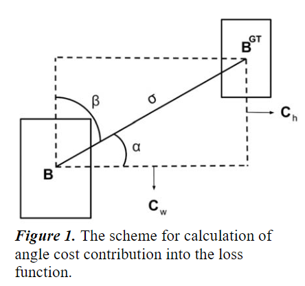

损失公式如下：

$$
\wedge =1-2*\sin ^2(\arcsin (x)-\frac{\pi }{4} )
$$

> 该公式由两部分组成，$1-2*\sin ^2(y)$等价于$cos(2y)$，主要角度损失转换成数值损失值，只有在x=0时损失值最大，取1；在$y=-\frac{\pi }{4}$和$y=\frac{\pi }{4}$时损失值最小，取0。第二部分$\arcsin (x)-\frac{\pi }{4}$，其中$arcsin(x)$也就是上图中的α，减去$\frac{\pi }{4}$是希望预测框朝着角度较小的一边移动，因为$\beta=\frac{\pi }{2}- \alpha $，α和β分别减去$\frac{\pi }{4}$后为：$\alpha -\frac{\pi }{4}$，$\beta-\frac{\pi }{4}=\frac{\pi }{2}- \alpha- \frac{\pi }{4}= \frac{\pi }{4}- \alpha$，可以看到两者互为相反数，经过cos函数计算后的值是一样的。具体为：当α大于$\frac{\pi }{4}$时，只有α不断增大，损失值$\wedge$才会不断减小，预测框会朝着垂直线回归；当α小于于$\frac{\pi }{4}$时，只有α不断减小，损失值$\wedge$才会不断减小，预测框会朝着水平线回归。

### Distance cost(距离损失)

描述了中心点之间的距离，其惩罚代价与角度代价呈负相关。

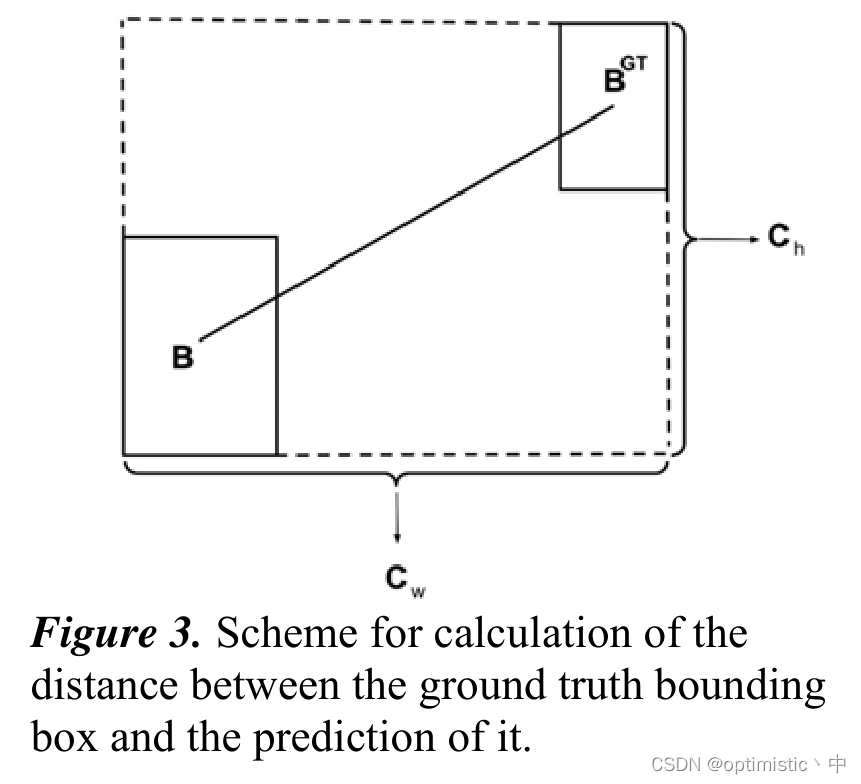

$$
\begin{array}{c}
\Delta=\sum_{t=x, y}\left(1-e^{-\gamma \rho_t}\right), \\
\\
\rho_x=\left(\frac{b_{c_x}^{g t}-b_{c_x}}{c_w}\right)^2, \rho_y=\left(\frac{b_{c y}^{g t}-b_{c_y}}{c_h}\right)^2, \gamma=2-\Lambda
\end{array}
$$

$\rho_x$、$\rho_y$算的是两中心点之间的距离。对于$\gamma$的计算方式，首先角度损失$\Lambda$的取值范围是[0,1]，这里$\gamma=2-\Lambda$是防止$\gamma$为0时，使$p_t$失效，其次是角度损失$\Lambda$越小，$p_t$对于损失$\Delta$的影响就越大。

### Shape cost（形状损失）

作者考虑两框之间的长宽比，通过计算两框之间宽的差与最大宽的比值（长同理）来定义的，大体思路和CIOU相似，只不过CIOU可以考虑的是两框整体形状的收敛，而SIOU是以长、宽两个边收敛来达到整体形状收敛的效果。

$$
\Omega=\sum_{t=w, h}\left(1-e^{-\omega_t}\right)^\theta
\\
\omega_w=\frac{\left|w-w^{g t}\right|}{\max \left(w, w^{g t}\right)}, \omega_h=\frac{\left|h-h^{g t}\right|}{\max \left(h, h^{g t}\right)}
$$

SIOU总损失公式如下：

$$
L_{SIOU}=1-IoU+\frac{\Delta+ \Omega }{2}
$$

存在的问题：

+ 模型评估结果不一定具有可重复性：SIOU采用了多个不同的IOU阈值，这意味着对于同一组测试数据，在不同的IOU阈值下，同一个模型的评估结果可能会有所不同。这回给评估和比较带来困难。
+ 阈值选择问题：SIOU需要指定多个IOU阈值，而这些阈值的选择通常需要根据具体的数据集和任务进行调整。
+ 可解释性问题：SIOU计算过程较为复杂，需要对多个IOU阈值进行计算并进行加权平均，这可能会使得结果难以解释，给结果的可信度带来一定影响。

## WIOU

### Wise-IoU v1

由于训练数据中难以避免地包含低质量示例，这导致了诸如距离、纵横比之类的几何度量都会加剧对低质量示例的惩罚，从而使模型的泛化性能下降。

而好的损失函数应该在锚框与目标框较好地重合时削弱几何度量的惩罚，不过多地干预训练，这将使模型具有更好的泛化能力。

因此，WIOU根据距离度量构建了距离注意力，得到了具有两层注意力机制的WIOU v1：

$$
\begin{matrix}L_{WIoU-v1}=R_{WIoU}L_{IoU}\\R_{WIoU}=\exp \left(\frac{\left(x-x_{g t}\right)^{2}+\left(y-y_{g t}\right)^{2}}{\left(W_{g}^{2}+H_{\mathrm{g}}^{2}\right)^{*}}\right)，\left\{\begin{array}{c}L_{I o U}=1-I o U=1-\frac{W_{i} H_{i}}{S_{u}} \\S_{u}=w h+w_{g t} h_{g t}-W_{i} H_{i}\end{array}\right.\end{matrix}
$$

其中$R_{WIoU} \in [1,e)$，这将显著放大普通质量锚框的$L_{IoU}$。$L_{IoU} \in [0,1]$，这将显著降低高质量锚框的$R_{WIoU}$，并在锚框与目标框重合较好的情况下显著降低其对中心点距离的关注。

为了防止$R_{WIoU}$产生阻碍收敛的梯度，将$W_g、H_g$从计算图中分离（上标*表示此操作）。因为它能有效地消除阻碍收敛的因素，所以没有引入新的度量指标，如纵横比。

### Wise-IoU v2

Focal Loss 设计了一种针对交叉熵的单调聚焦机制，有效降低了简单示例对损失值的贡献。这使得模型能够聚焦于困难示例，获得分类性能的提升。类似地，我们构造了单调聚焦系数$\mathcal{L}_{I o U}^{\gamma*}$：

$$
\mathcal{L}_{WIoUv2} =\mathcal{L}_{I o U}^{\gamma*} \mathcal{L}_{WIoUv1},\gamma >0
$$

在模型训练过程中，梯度增益$\mathcal{L}_{I o U}^{\gamma*}$随着$\mathcal{L}_{IoU}$的减小而减小，导致训练后期收敛速度较慢。因此，引入 $\mathcal{L}_{IoU}$的均值作为归一化因子：

$$
\mathcal{L}_{W I o U v 2}=\left(\frac{\mathcal{L}_{I o U}^*}{\overline{\mathcal{L}_{I o U}}}\right)^\gamma \mathcal{L}_{W I o U v 1}
$$

其中的$\overline{\mathcal{L}_{I o U}}$是动量为m的滑动平均值，动态更新归一化因子使梯度增益$r= \left(\frac{\mathcal{L}_{I o U}^*}{\overline{\mathcal{L}_{I o U}}}\right)^\gamma$整体保持在较高的水平，解决了训练后期收敛速度慢的问题。

### Wise-IoU v3

定义离群度以描述锚框的质量，其定义为：

$$
\beta = \frac{\mathcal{L}_{I o U}^*}{\overline{\mathcal{L}_{I o U}}} \in [0,\infty]
$$

Wise-IoU v3 定义为：

$$
L_{WIoUv3}=rR_{WIoU}L_{IoU}\\

r=\frac{\beta }{\delta \alpha ^{\beta-\delta}}
$$

离群度$\beta$小意味着锚框质量高，我们为其分配一个小的增益，以便使边界框回归聚焦到普通质量的锚框上。对离群度较大的锚框分配较小的梯度增益，将有效防止低质量示例产生较大的有害梯度。$\alpha$和$\delta$表示超参数，通过网格搜索法计算调整取得，不同取值的实验结果如下图。

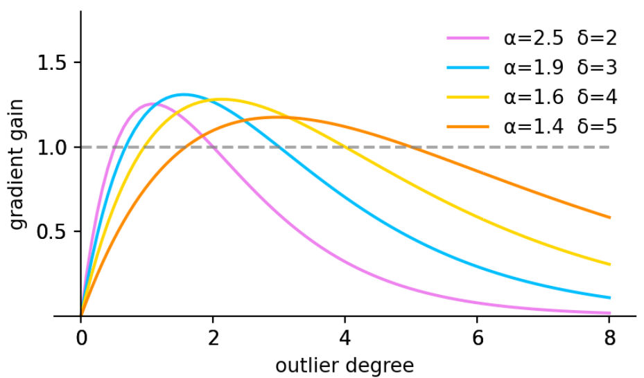

其中，当β=δ时，r=1。如上图，当锚框的离群程度满足β=C（C为定值）时，锚框将获得最高的梯度增益。

由于$\overline{\mathcal{L}_{I o U}}$是动态的，锚框的质量划分标准也是动态的，这使得WIOUv3在每一时刻都能做出最符合当前情况的梯度增益分配策略。

为防止低质量锚框在训练初期落后，设$\overline{{L_{IoU}}}$的初值为1，从而使$L_{IoU}$为1的锚框具有最大的梯度增益，为了在训练的早期阶段保持这样的策略我们引入小的动量m。之后每轮的训练都动态调整 $\overline{{L_{IoU}}}$的值，调整策略为：

$$
\begin{cases}\overline{L_{IoU}} =(1-m)\overline{L_{IoU}}+m\overline{L_{IoU}^*} \\m=1-\sqrt[tn]{0.05} \end{cases}
$$

式中：m为小动量，目的是延迟$\overline{L_{IoU}}$接近真实值$\overline{L_{IoU-real}}$的时间，从而防止低质量的锚框在训练初期被落下。n为数据批个数（n=总数据量/batchsize），t为训练时模型检测精度提升速度显著放缓的轮次(如下图示意)。这样定义的动量m可以在训练了t轮后，使得$\overline{L_{IoU}}$ ≈ $\overline{L_{IoU-real}}$。

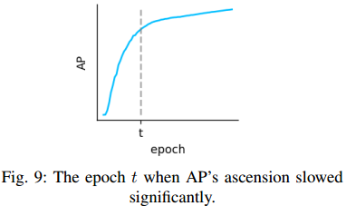

在训练的中后期，WIoU v3 将小梯度增益分配给低质量的锚框以减少有害梯度。同时 WIoU v3 会聚焦于普通质量的锚框，提高模型的定位性能。

## 总结

* IOU Loss：主要考虑检测框和目标框重叠面积。
* GIOU Loss：在IOU的基础上，解决边界框不相交时loss等于0的问题。
* DIOU Loss：在IOU和GIOU的基础上，考虑边界框中心点距离的信息。
* CIOU Loss：在DIOU的基础上，考虑边界框宽高比的尺度信息。
* EIOU Loss：在CIOU的基础上，解决了纵横比的模糊定义，并添加Focal Loss解决BBox回归中的样本不平衡问题。
* αIOU Loss：通过调节α，使探测器更灵活地实现不同水平的bbox回归精度。
* SIOU Loss：在EIOU的基础上，加入了类别信息的权重因子，以提高检测模型的分类准确率。
* WIOU Loss：解决质量较好和质量较差的样本间的BBR平衡问题。

# NMS系列

## NMS

NMS即(non maximum suppression)即非极大值抑制，顾名思义就是抑制不是极大值的元素。

以目标检测为例，目标检测推理过程中会产生很多检测框，其中有一些检测框都是检测同一个目标，但最终每个目标只需要一个检测框。NMS的作用便在于此：选出最合适的那个检测框。

在做NMS之前首先根据设定的分类置信度阈值进行pre的过滤（通常是0.1）。假定过滤之后得到6个预测框，再根据分类器类别分类概率做排序，从小到大分别属于马的概率分别为：A<B<C<D<E<F，运算流程如下：

1. 从最大概率矩形框F开始，分别判断A、B、C、D、E与F的重叠度IOU是否大于某个设定的阈值（普遍设置为0.5，目标检测中常设置为0.7，仅供参考），如果大于阈值，将其看作是与F预测框预测的同一个物体，抑制掉；反之，则将其看做是待回归的其他物体。
2. 假设B、D与F的重叠度超过阈值，那么扔掉B、D，即对超过阈值的框进行抑制，抑制的做法是将检测框的得分设置为0，并标记第一个矩形框F是我们保留下来的（B、F、D四个预测框回归的是同一个物体，对于同一个物体，选择出score最大的预测框F）。
3. 从剩下的矩形框A、C、E中，选择概率最大的E，然后判断A、C与E的重叠度IOU，重叠度大于一定的阈值，那么就扔掉；并标记E是我们保留下来的第二个矩形框(保留理由同上)。
4. 重复这个过程，找到所有被保留下来的矩形框。

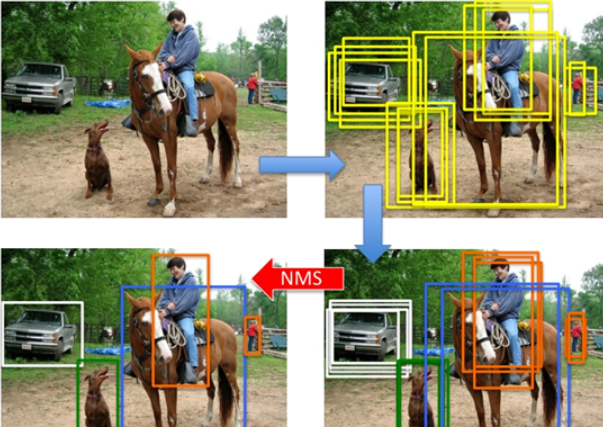

针对多分类NMS问题，只需要对每个类别内部做NMS即可。

缺点：

+ 需要手动设置阈值，阈值的设置会直接影响重叠目标的检测，太小框容易被抑制，造成误检；太大抑制效果不明显，达不到理想情况。
+ 低于阈值的直接设置score为0，做法太hard、粗暴。
+ 只通过IOU来评估，IOU的做法对目标框尺度和距离的影响不同

改进思路：

+ 通过自适应的方法在目标稀疏时使用小阈值，在目标稠密时使用大阈值，比如Adaptive NMS。
+ 将低于阈值的直接置为0的做法太粗暴，可以依据IOU大小进行惩罚衰减，使其更加soft。例如：Soft NMS、Softer NMS。
+ 将目标尺度、距离引进IOU的考虑中，如DIoU等。

## Soft NMS


引入惩罚衰减

### 线性抑制

$$
s_i=\left\{\begin{array}{ll}
s_i & , \operatorname{IoU}\left(M, b_i\right)<N_t \\
s_i\left(1-\operatorname{IoU}\left(M, b_i\right)\right) & , \operatorname{IoU}\left(M, b_i\right) \geq N_t
\end{array}\right.
$$

这种方式在略低于阈值和略高于阈值的部分，经过惩罚衰减函数后，很容易导致得分排序的顺序打乱。

### 高斯抑制

合理的惩罚函数应该是具有高iou的有高的惩罚，低iou的有低的惩罚，它们中间应该是逐渐过渡的。高斯惩罚函数如下：

$$
s_i=s_ie^{\frac{-IoU(M,b_i)^2}{\sigma } }
$$

式中：$\sigma$表示超参数，值为0.5(仅供参考)。

## Softer NMS

使用VGG-16 faster R-CNN测试了MS-COCO数据集中的图片，论文中贴了两张检测失败的代表图片，如下图，

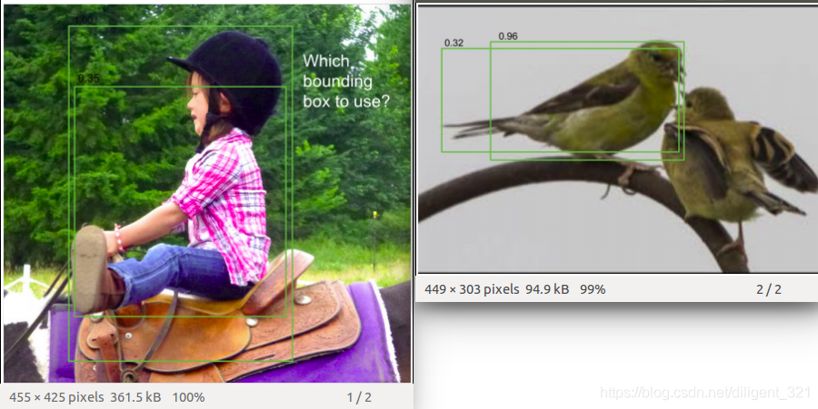

左图存在的问题：检测出来的2个proposals，沿着y坐标轴方向的定位均不准确。结论：检测算法预测出来的proposals的坐标不一定准确

右图存在的问题：检测出来的2个proposals，右边的框分类score较高，但是却沿着x坐标轴方向的定位不准确。结论：分类score高不一定定位score高，也即classification confidence和 localization confidence不具有一致性。

# YOLO训练结果分析

目标检测性能指标如下：

| 检测精度                       | 检测速度                           |
| ------------------------------ | ---------------------------------- |
| Precision，Recall，F1 score    | 前传耗时                           |
| IoU（Intersection over Union） | 每秒帧数 FPS（Frames Per Sencond） |
| P-R curve                      | 浮点运算量（FLOPS）                |
| AP、mAP                        |                                    |

+ 前传耗时(ms)：从输入一张图像到输出最终结果所消耗的时间，包括前处理耗时（如图像归一化）、网络前传耗时、后处理耗时（如非极大值抑制）。
+ 每秒帧数FPS(Frames Per Second)：每秒钟能处理的图像数量。
+ 浮点运算量(FLOPS)：处理一张图像所需要的浮点运算数量，跟具体软硬件没有关系，可以公平地比较不同算法之间的检测速度。

## confusion_matrix

混淆矩阵是对分类问题预测结果的总结。使用计数值汇总正确和不正确预测的数量，并按每个类进行细分，显示了分类模型进行预测时会对哪一部分产生混淆。通过这个矩阵可以方便地看出模型是否将两个不同的类混淆了，把一个类认成了另一个。

混淆矩阵不仅可以让我们直观的了解分类模型所犯的错误，更重要的是可以了解哪些错误类型正在发生，正是这种对结果的分解克服了仅使用分类准确率带来的局限性（从总体到细分）。

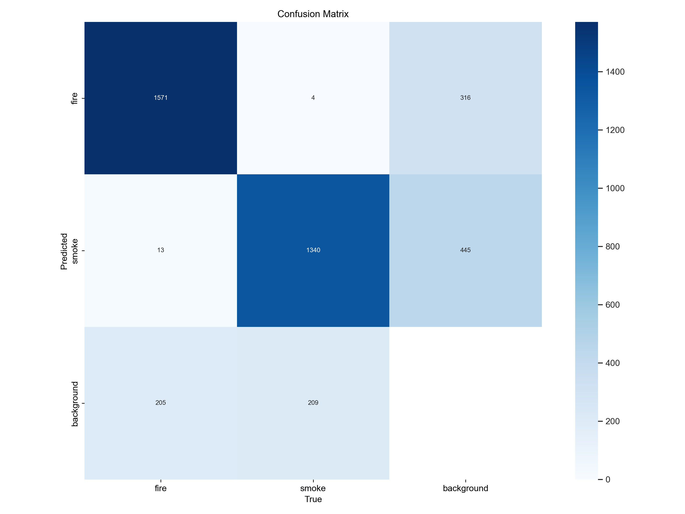

上图中行是预测类别（y轴），列是真实类别（x轴）

* TP（True Positive）: 将正类预测为正类数 即正确预测，真实为0，预测也为0。
* FN （False Negative）：将正类预测为负类 即错误预测，真实为0，预测为1。
* FP（False Positive）：将负类预测为正类数 即错误预测， 真实为1，预测为0。
* TN （True Negative）：将负类预测为负类数，即正确预测，真实为1，预测也为1。

精确率Precision=TP/(TP+FP)，在预测是Positive所有结果中，预测正确的比重。

召回率recall=TP/(TP+FN)，在真实值为Positive的所有结果中，预测正确的比重。

混淆矩阵归一化后的结果为：

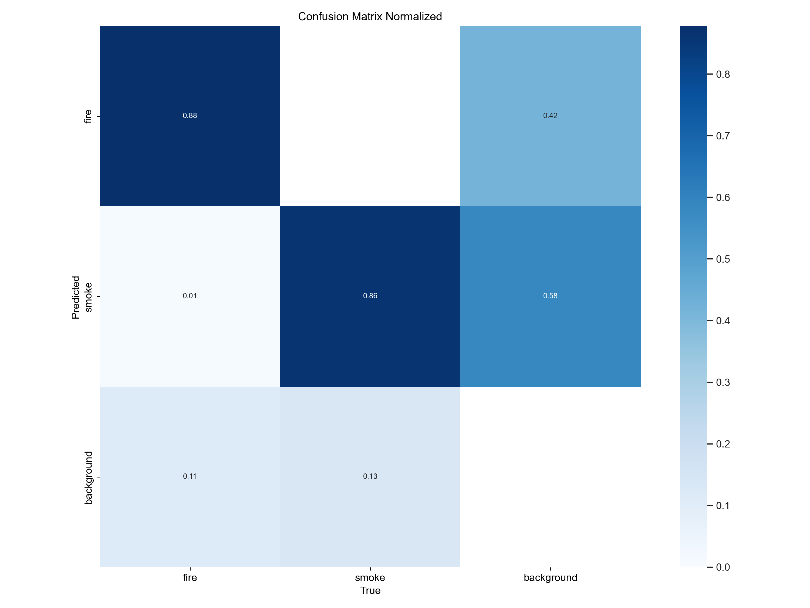

## F1_curve

F1曲线，被定义为查准率（精确率）和召回率的调和平均数，最大为1，其中1是最好，0是最差。

一些多分类问题的竞赛，常常将F1-score作为最终测评的方法。

一般来说，置信度阈值（该样本被判定为某一类的概率阈值）较低的时候，很多置信度低的样本被认为是真，召回率高，精确度低；置信度阈值较高的时候，置信度高的样本才能被认为是真，类别预测越准确，即精准率较大（只有confidence很大，才被判断是某一类别），所以前后两头的F1分数比较少。

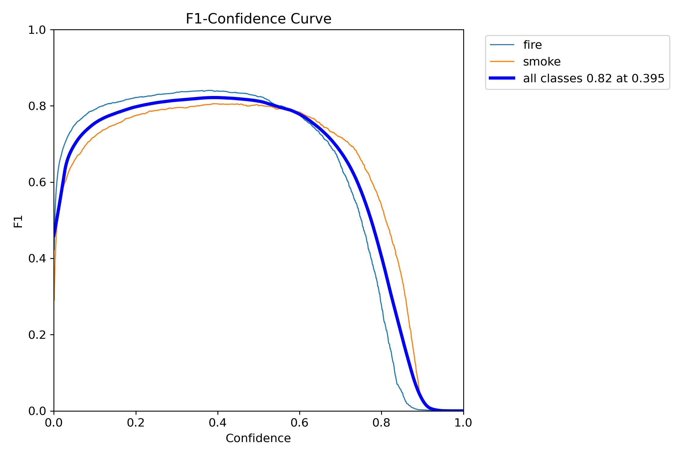

$$
\begin{aligned}F_1 & = 2\cdot \frac{precision \cdot recall}{precision+recall} \\F_1 & = 2TP/(2TP+FN+FP)\end{aligned}
$$

这是在150epoch得到的F1_curve，说明在置信度0.4-0.6区间内得到比较好的F1分数

## args

训练时的超参数

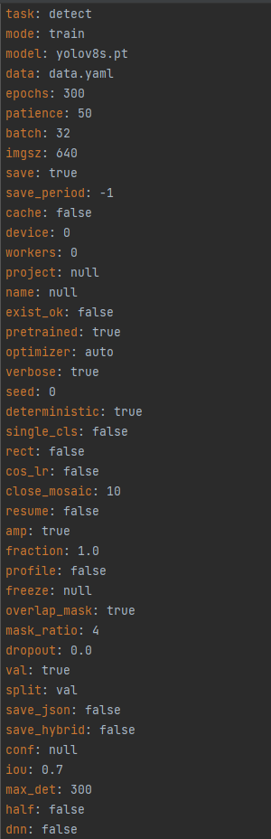

## P_curve(单一类准确率)

准确率precision和置信度confidence的关系图，即置信度阈值—准确率曲线图。具体为：当判定概率超过置信度阈值时，各个类别识别的准确率。

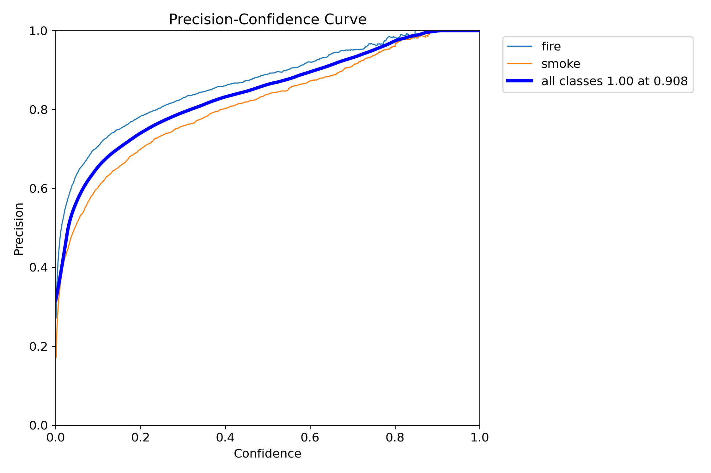

当置信度越大时，类别检测的越准确。即只有confidence很大，才被判断是某一类别，这样一来会使FP减少，precision增加。这样也可能会漏掉一些置信度较低的真实样本。

## R_curve(单一类召回率)

召回率recall和置信度confidence之间的关系，即置信度阈值—召回率曲线图。recall表示的是正样本有多少被找出来了（召回了多少）。

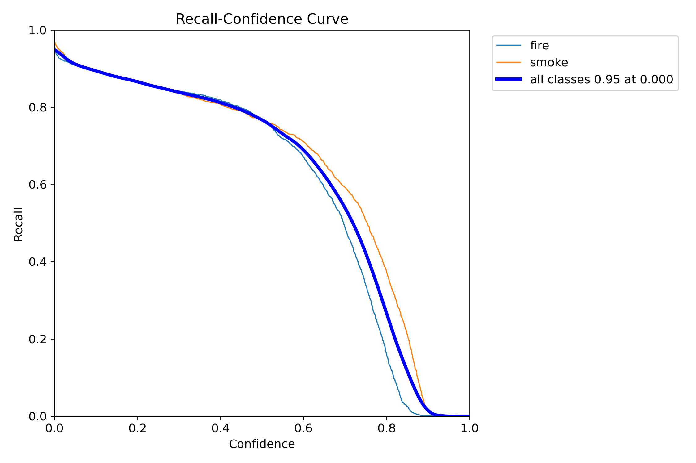

当置信度越小的时候，类别检测的越全面（不容易被漏掉，但容易误判）。

## PR_curve（精确率和召回率关系）

PR曲线体现精确率和召回率的关系。可以看到，精度越高，召回率越低。

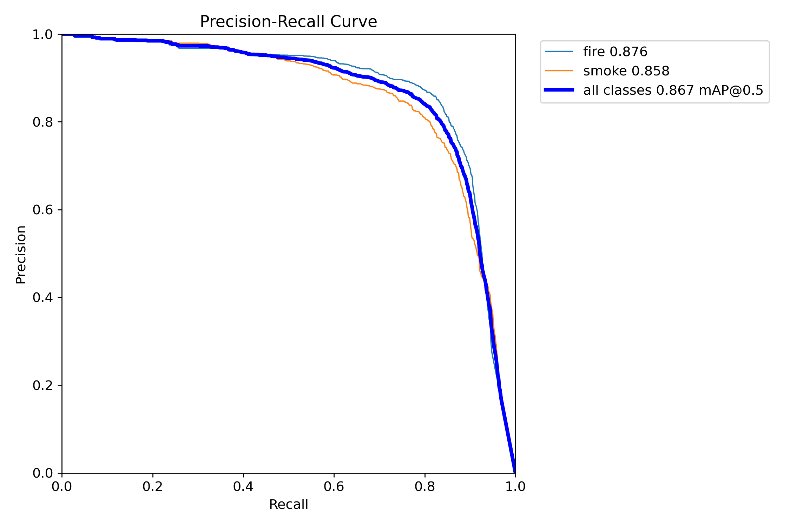

PR曲线下围成的面积即为AP，所有类别AP平均值即mAP(Mean Average Precision，均值平均精度)。

我们希望的是：在准确率很高的前提下，尽可能的检测到全部的类别。因此我们希望PR曲线更接近（1,1），即希望曲线的面积mAP尽可能接近1。

**根据PR曲线图判断学习器性能：**

+ 如果PR图中的一个曲线A完全包住另一个学习器的曲线B，则可断言A的性能优于B。
+ 当A和B发生交叉时，可以根据曲线下方的面积大小来进行比较。
+ 一般训练结果主要观察精度和召回率波动情况（波动不是很大则训练效果较好）。

> Precision和Recall往往是一对矛盾的性能度量指标，即一个的值越高另一个就越低；
>
> 提高Precision<==>提高二分类预测正例门槛<==>使得二分类预测的正例尽可能是真实正例；
>
> 提高Recall<==>降低二分类器预测正例门槛<==>使得二分类器尽可能将真实的正例挑选出来。

## results

loss functions（损失函数）是用来衡量模型预测值和真实值不一样的程度，极大程度上决定了模型的性能。

+ 定位损失box_loss：预测框与真实框之间的误差，越小定位得越准。
+ 置信度损失obj_loss：计算网络的置信度，越小判定为目标的能力越准。
+ 分类损失cls_loss：计算锚框与对应的标定分类是否正确，越小分类越准。


mAP是用Precision和Recall作为两轴作图后围成的面积，m表示平均，@后面的数字表示判定iou为正负样本的阈值。

mAP@0.5：表示阈值大于0.5的平均mAP。

mAP@0.5-0.95表示在不同iou阈值（从0.5到0.95，步长0.05，即：0.5、0.55、0.6、... 、0.95）上的平均mAP

一般训练结果主要观察精度和召回率波动情况（波动不是很大则训练效果较好），然后观察mAP@0.5和mAP@0.5:0.95评价训练结果。

## val_batch0_labels 和 val_batch0_pred

val_batchx_labels：验证集第1轮的实际标签

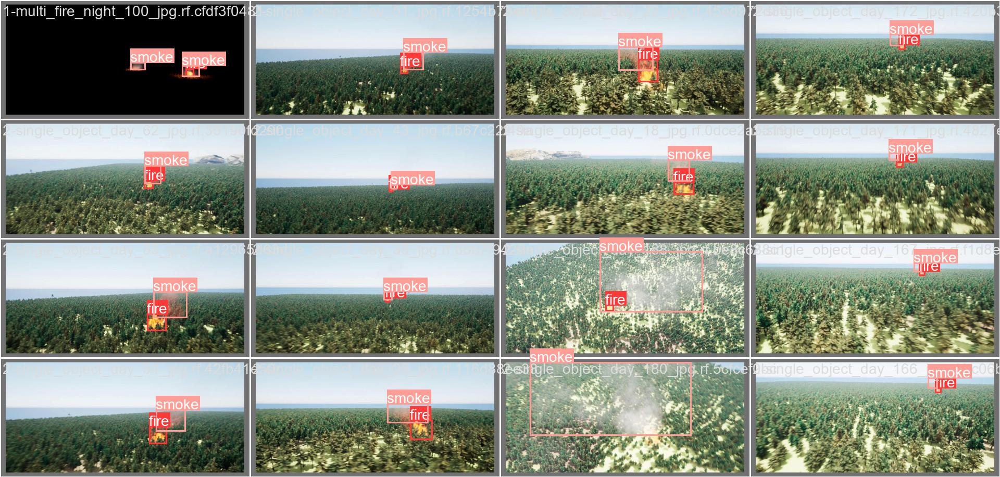

val_batchx_pred：验证集第1轮的预测标签

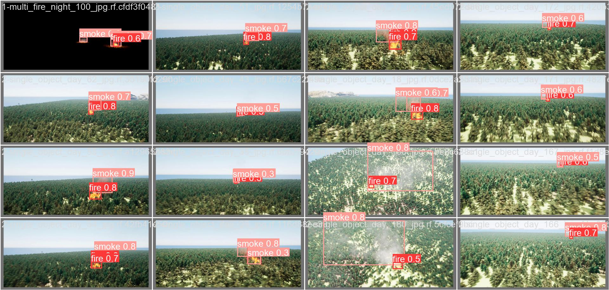

## labels(标签)

| 第一个图是训练集的数据量，每个类别有多少个 | 第二个图是框的尺寸和数量                 |
| ------------------------------------------ | ---------------------------------------- |
| 第三个图是中心点相对于整幅图的位置         | 第四个图是图中目标相对于整幅图的高宽比例 |

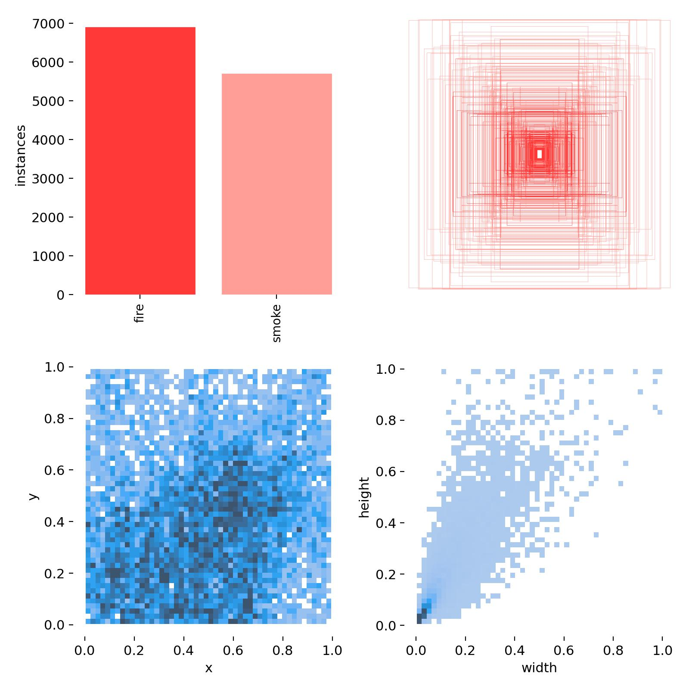

## labels_correlogram

体现标签中心点横纵坐标以及框的高宽间的关系。


每一行的最后一幅图分别代表的是x，y，宽和高的分布情况。

其他的图即是寻找这四个变量间的关系。

# 正负样本问题

## 什么是正负样本？

+ 对于YOLO系列的结构，正负样本就是feature map 上的每一个grid cell（或者说对应的eanchor）。
+ 对于RCNN系列的结构
+ 对于DETR系列

检测问题通常涉及3种不同性质的样本：

+ 正样本（positive），其存在的意义是让模型具备判断前景的能力，不仅要让模型知道图像上这个位置存在前景目标，还要把具体的位置用bbox框出来。所以一旦判定某个grid cell 或者proposal是正样本，就需要对其负责cls+bbox的训练。
+ 忽略样本（ignore），ignore最大的作用就是可以处理模棱两可的样本，以及影响模型训练的样本。因此对于ignore，对其不负责任何训练，或者对其负责bbox的训练，但是不负责cls的训练。
+ 负样本（negative），其是让模型具备区分背景的能力，不让模型产生背景的误检，所以对于negative只负责cls的训练，不负责bbox的训练。

> ignore的例子：
>
> 1. 对于遮挡达到80%以上的vehicle或者模糊的vehicle，如果当正样本训练的话，loss收敛不了，那么就可以把这些原本是正样本的纳入ignore中，不参与训练。如果确实不想把遮挡80%以上的vehicle召回出来，那么归入负样本。
> 2. 卡车上运载着的多层passenger car，不想把这种passenger car 召回，那么可以把这些原本是负样本的纳入ignore，因为这些负样本显然和正常的passenger car的正样本特征存在一定矛盾。
> 3. 像bus这种，由于车身镜像的作用，把旁边的vehicle照进来

# 损失函数

## Cross Entropy Loss Function（交叉熵损失函数）

举例：

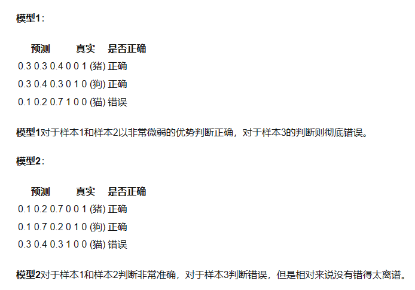

（1）二分类

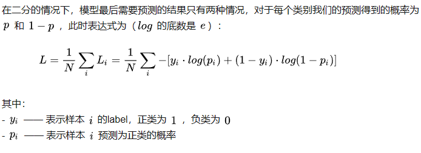

（2）多分类

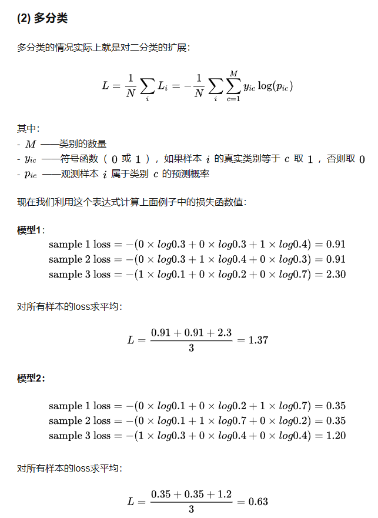

# Transformer

## Transformer概览

1. 相比RNN网络结构，transformer的最大优点是可以进行并行计算。整体模型架构如下图所示：

   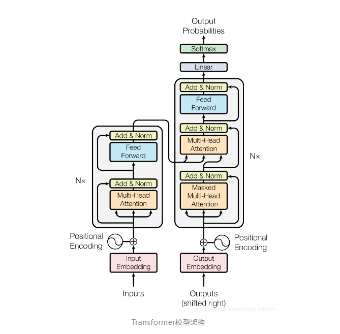
2. 如果将Transformer视为一个黑盒，在机器翻译中的处理流程如下图：

   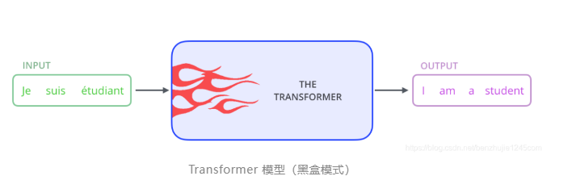
3. Encoder-Decoder。中间部分可以分为**编码组件和解码组件**，如下图：

   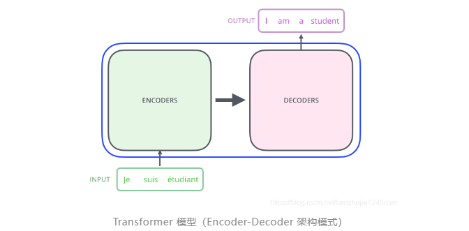

   其中，论文作者分别用了6层编码器和6层解码器，如下图：

   

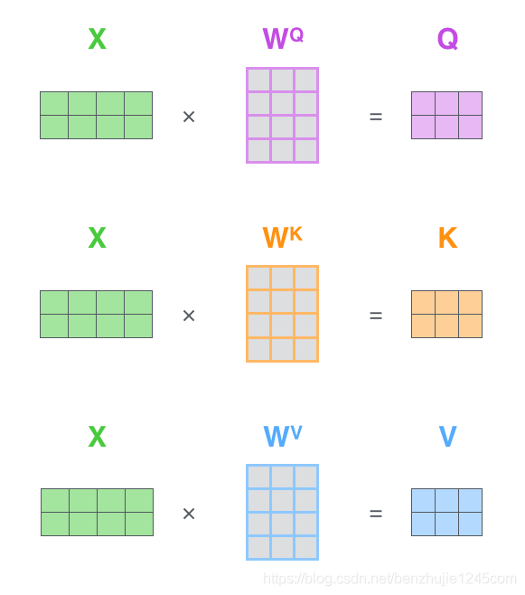

> 如何进行点乘？
>
> 只有Q与K之间的运算是点乘

## Multi-head Attention（多头注意力机制）

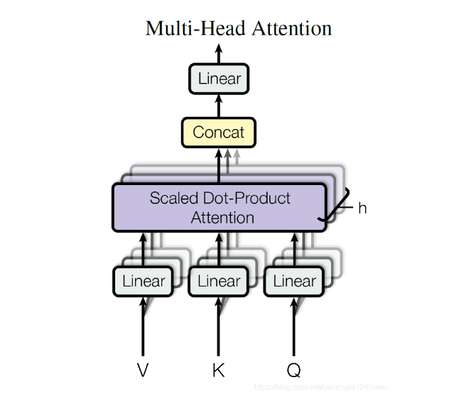

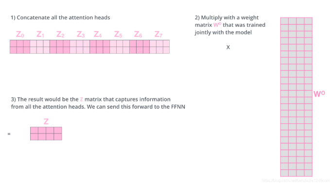

## 位置编码

表示序列中词顺序的方法

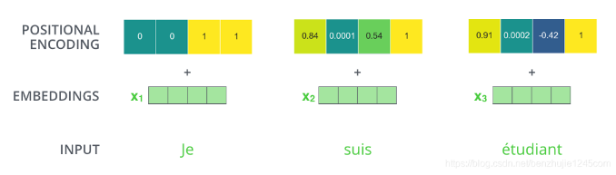

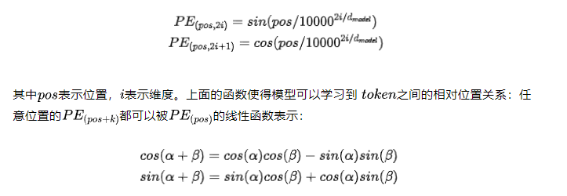

在下图中，我们将这些值进行可视化。每一行对应一个向量的位置编码。所以第一行对应于输入序列中第一个词的位置编码。每一行包含 64 个值，每个值的范围在 -1 和 1 之间。

* `Transformer`论文中，`sine>` 函数和 `cosine` 函数产生的值交织在一起；

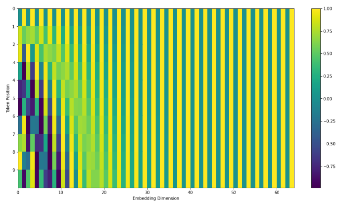

* 而官方提供的代码中，左半部分的值全是由 `sine` 函数产生的，右半部分的值全是由 `cosine` 函数产生的，然后将它们拼接起来。


生成位置编码的方法不唯一。以上这种方法的优点是：可以扩展到未知的序列长度。例如，当我们训练后的模型被要求翻译一个句子，而这个句子的长度大于训练集中所有句子的长度。

## 解码器Decoder

最后一个编码器的输出是一组注意力向量Key和Value。这些向量将在每个解码器的Encoder-Decoder Attention层被使用，这有助于解码器把注意力集中在输入序列的合适位置。

解码阶段的每个时间步都输出一个元素。重复这个过程，知道输出一个结束符，表示transformer 解码器完成其输出。

每一步的输出都会在下一个时间步输入到下面的第一个解码器

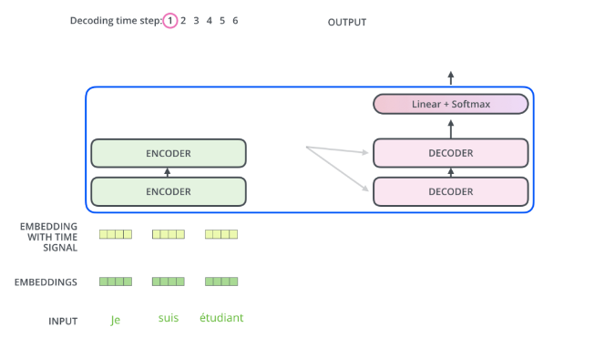

## 掩码Mask

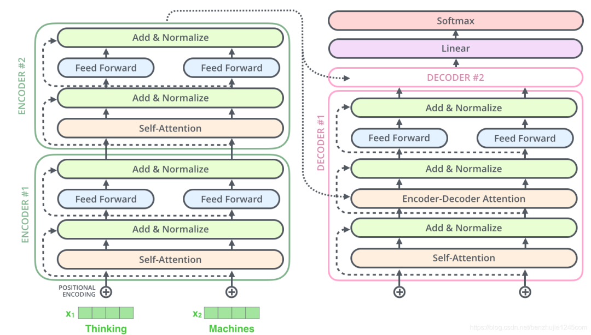

Mask表示掩码，它对某些值进行掩盖，使其在参数更新时不产生效果。Transformer模型涉及两种mask：

+ Padding Mask 在所有的scaled dot-product attention 里面都需要用到。
+ Sequence Mask 只有在解码器Decoder 的Self-Attention 里面用到。

### Padding Mask

每个批次对输入序列的长度是不一样的，因此需要利用Padding Mask对输入序列进行对齐。

具体来说：在较短的额序列后面填充0，在较长的序列，则是进行截断，把多余的直接舍弃。这些填充的位置其实是没意义的，这使得Attention机制不把注意力放在这些位置上。

实现的具体做法：把相应位置加上一个非常大的负数（负无穷），这样，经过softmax后，这些位置的概率接近0。

### Sequence Mask

Sequence Mask是为了使得Decoder不能看见未来的信息。对于一个序列，在t时刻，解码器应该只能依赖于t时刻之前的输出，而不能依赖t之后的输出。因此需要把t之后的信息隐藏起来。

具体做法：产生一个上三角矩阵，上三角值全为0。将这个矩阵作用在每个序列上，就可以达到目的。

> 上三角矩阵是如何实现Mask的？具体步骤？

总结：对于Decoder的Self-Attention里面使用到的scaled dot-product attention，同时需要Padding Mask和Sequence Mask，具体实现就是两个相加。其他情况只用padding Mask。

## 最后的线性层和Softmax层

解码器栈的输出是一个float向量，其通过线性层和Softmax层转换为一个词。

1. 线性层：线性层是一个简单的全连接神经网络，其将解码器栈的输出向量映射到一个更长的向量，这个向量被称为logits向量。
2. softmax层：假设模型模型的输出词汇表有10000个英文单词，则logits向量有10000个数字，每个数表示一个单词的分数。Softmax层把logitsf中的每个分数转换为概率，最后选择最高概率的单词，作为这个时间步的输出。

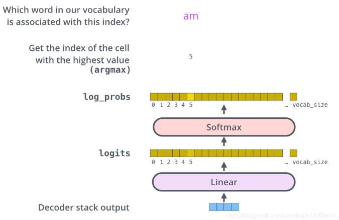

编码组件和解码组件中的嵌入层，以及最后的线性层共享权重矩阵。在嵌入层中，会将这个共享权重矩阵乘以$\sqrt{d_{model}}$

> 词嵌入如何操作？

Transformer中的正则化操作：

+ Droupout。对编码器和解码器的每个子层的输出使用Dropout操作，在进行残差连接和层归一化之前。词嵌入向量和位置编码向量执行相加操作后也执行Droupout操作。论文提供的参数$P_{drop}=1$。
+ Label Smoothing（标签平滑）。论文中提供的参数$\epsilon _{ls}=0.1$。

> 词嵌入向量和位置编码向量执行相加操作是在哪？

# ---------最初学习内容----------

# 图像处理流程

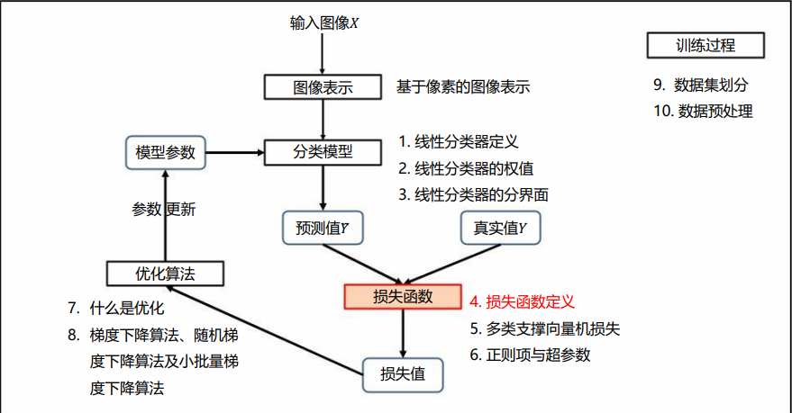

# 基本知识

## 过拟合

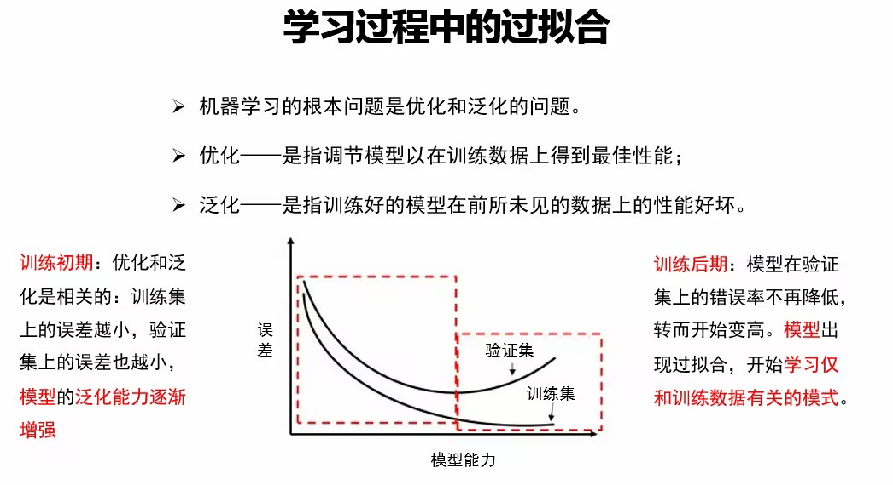

## 线性分类器的决策边界


## 损失函数

损失函数是一个函数，用于度量给定分类器的预测值与真实值的不一致程度，其输出通常是一个非负实值。

其输出的非负实值可以作为反馈信号来对分类器参数进行调整，以降低当前示例对应的损失值，提升分类器的分类效果。

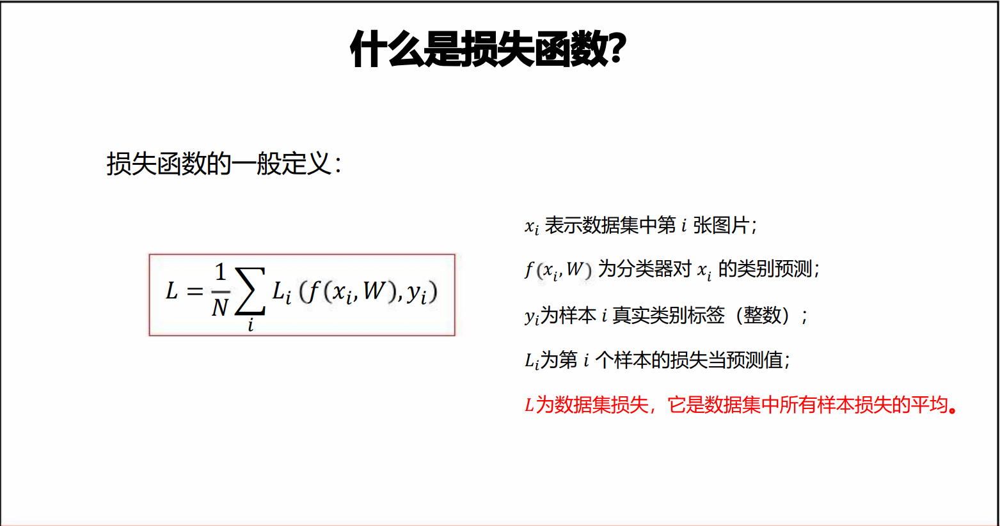

## 多类支撑向量机损失

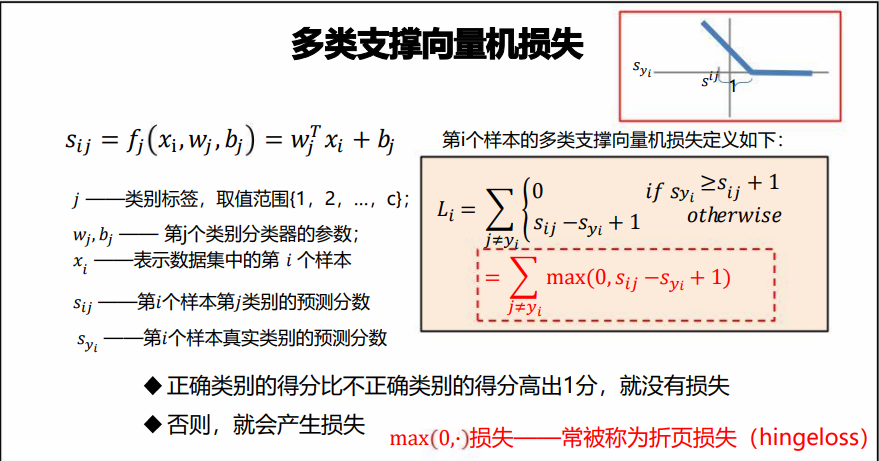

## 正则项损失

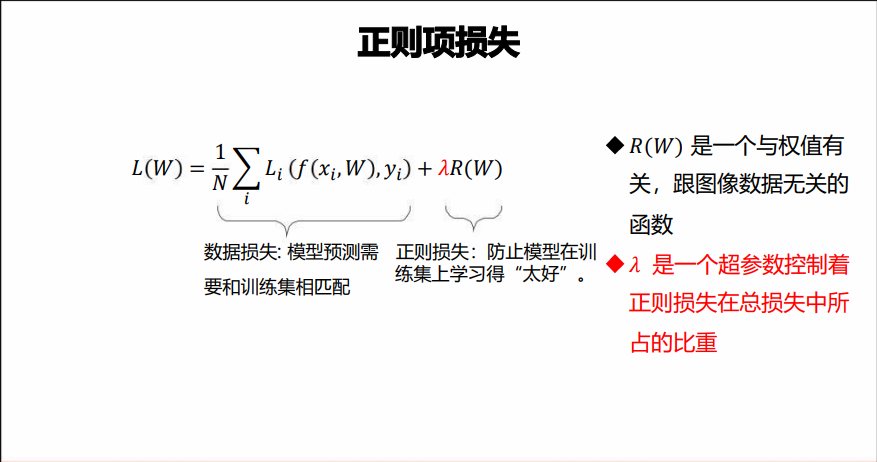

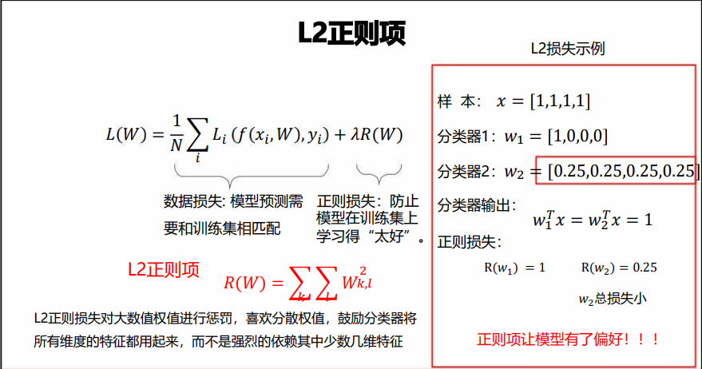

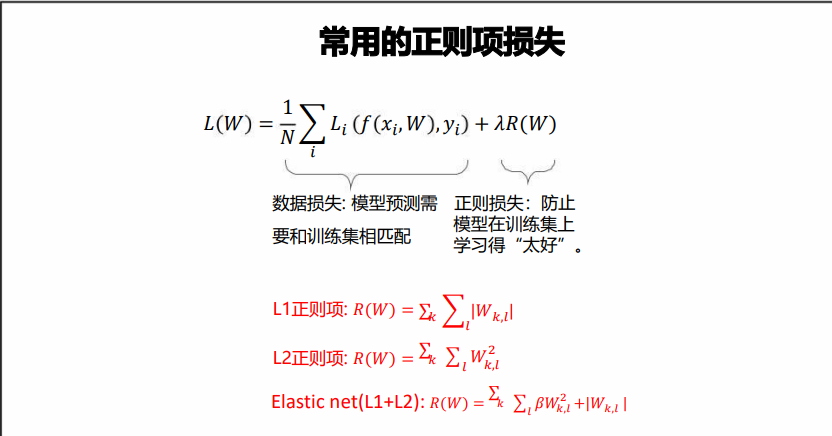

## 超参数

在开始学习过程之前设置值的参数，而不是学习得到。

超参数一般都会对模型性能有着重要的影响。

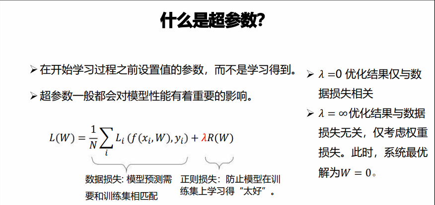

## 激活函数

在机器学习领域，单个神经元中的非线性变换通常被称为激活函数，常见的激活函数是：sgn、tanh、sigmoid、ReLU函数。

# Sigmoid

Sigmoid 函数是一条 s 形曲线，如下图中的绿线所示。该图还显示了粉红色的导数图形：

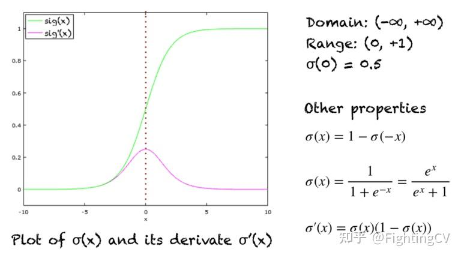

## zero-shot

Zero-shot定义：学习一个新类的的视觉分类器，这个新类没有提供任何的图像数据，仅仅给出了这个类的word embedding。

关键： **如何关联视觉特征和语义特征（视觉特征一般用预训练好的CNN提取特征，不再进行fine-tine，因此zero-shot考察的问题是如何建立语义和视觉特征的关系）** 。(1) 怎样把未知类和已知类相联系 （2）怎样在未知类别上获得最佳的判别性能。

## sparsity

PCA：传统机器学习降维算法，先降维再学习。

最新常用的算法：先升维，再学习。

## Softmax函数

Softmax从字面上来说，可以分成soft和max两个部分。max故名思议就是最大值的意思。Softmax的核心在于soft，而soft有软的含义，与之相对的是hard硬。很多场景中需要我们找出数组所有元素中值最大的元素，实质上都是求的hardmax。hardmax最大的特点就是只选出其中一个最大的值，即非黑即白。但是往往在实际中这种方式是不合情理的，比如对于文本分类来说，一篇文章或多或少包含着各种主题信息，我们更期望得到文章对于每个可能的文本类别的概率值（置信度），可以简单理解成属于对应类别的可信度。所以此时用到了soft的概念。

**Softmax的含义就在于不再唯一的确定某一个最大值，而是为每个输出分类的结果都赋予一个概率值，表示属于每个类别的可能性。**下面给出Softmax函数的定义（以第i个节点输出为例）：

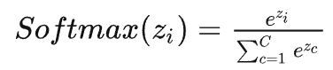

其中 z~i~ 为第i个节点的输出值，C为输出节点的个数，即分类的类别个数。通过Softmax函数就可以将多分类的输出值转换为范围在[0, 1]和为1的概率分布。

### 引入指数形式优点

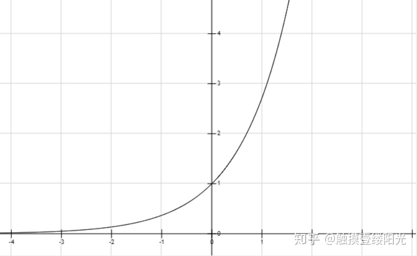

指数函数曲线呈现递增趋势，最重要的是斜率逐渐增大，也就是说在x轴上一个很小的变化，可以导致y轴上很大的变化。这种函数曲线能够将输出的数值拉开距离。

在深度学习中通常使用反向传播求解梯度进而使用梯度下降进行参数更新的过程，而指数函数在求导的时候比较方便。比如 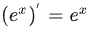。

这里需要注意一下，当使用Softmax函数作为输出节点的激活函数的时候，一般使用交叉熵作为损失函数。由于Softmax函数的数值计算过程中，很容易因为输出节点的输出值比较大而发生数值溢出的现象，在计算交叉熵的时候也可能会出现数值溢出的问题。

### 引入指数形式缺点

指数函数的曲线斜率逐渐增大虽然能够将输出值拉开距离，但是也带来了缺点，当 z~i~ 值非常大的话，计算得到的数值也会变的非常大，数值可能会溢出。

### Softmax的损失函数

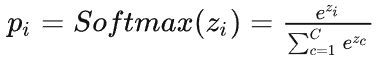，其中i表示输出节点的编号。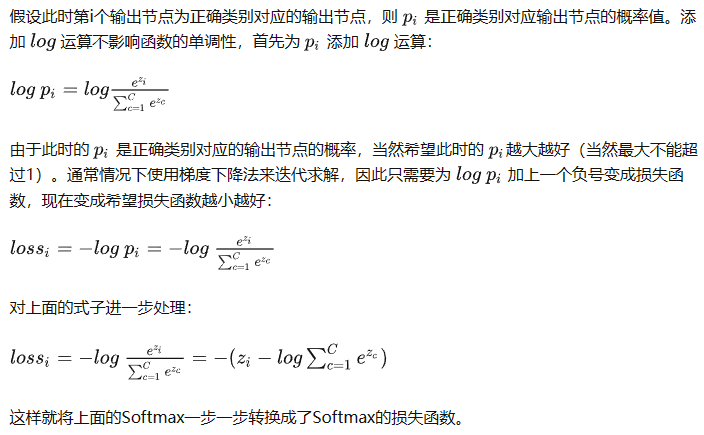

但是通常我们说起交叉熵往往是下面的式子：

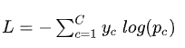

那上面这种形式的损失函数和上面通过Softmax函数一步一步转换推导成的损失函数有什么区别呢？

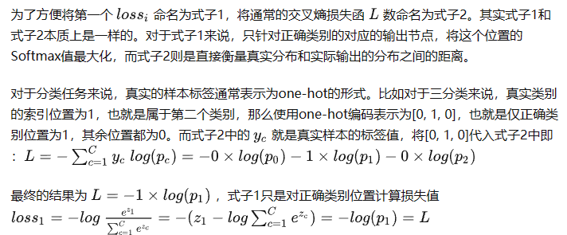

## 什么是交叉熵？

**交叉熵主要是用来判定实际的输出与期望的输出的接**近程度。用它来衡量网络的输出与标签的差异，利用这种差异经过反向传播去更新网络参数。

### 信息量

**信息量：**它是用来衡量一个事件的不确定性的；一个事件发生的概率越大，不确定性越小，则它所携带的信息量就越小。

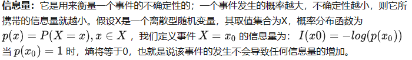

### 熵

**熵：** 它是用来衡量一个系统的混乱程度的，代表一个系统中信息量的总和；信息量总和越大，表明这个系统不确定性就越大。

    举个例子：假如小明和小王去打靶，那么打靶结果其实是一个0-1分布，X的取值有{0：打中，1：打不中}。在打靶之前我们知道小明和小王打中的先验概率为10%，99.9%。根据上面的信息量的介绍，我们可以分别得到小明和小王打靶打中的信息量。但是如果我们想进一步度量小明打靶结果的不确定度，这就需要用到熵的概念了。那么如何度量呢，那就要采用**期望**了。我们对所有可能事件所带来的信息量求期望，其结果就能衡量小明打靶的不确定度：

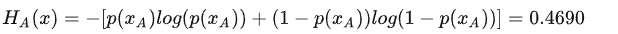

与之对应的，小王的熵（打靶的不确定度）为：

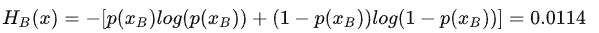

    虽然小明打靶结果的不确定度较低，毕竟十次有9次都脱靶；但是小王打靶结果的不确定度更低，1000次射击只有1次脱靶，结果相当的确定。

### 交叉熵

**交叉熵：** 它主要刻画的是实际输出（概率）与期望输出（概率）的距离，也就是交叉熵的值越小，两个概率分布就越接近。

假设概率分布p为期望输出，概率分布q为实际输出， 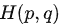为交叉熵，则

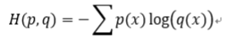

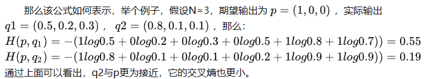

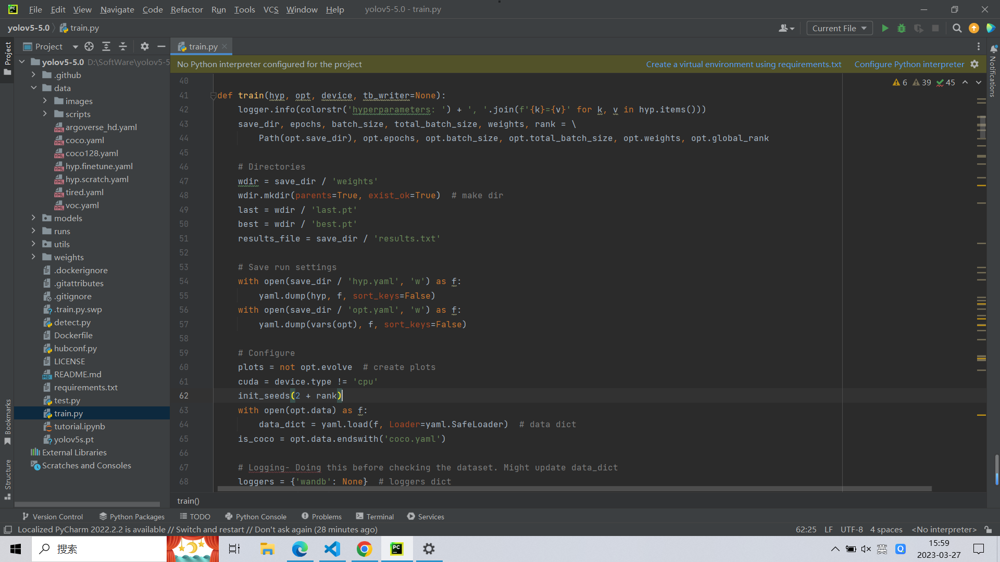

## Adam

Adam为梯度下降算法。

### 带动量的梯度下降算法：

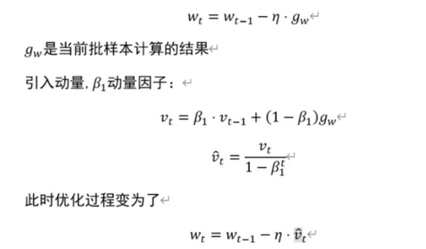

### 均方根传递：

学习率自适应改变。其中m~t~ 为梯度大小随时间的积累量。（下边只存在β1，β2写错了）

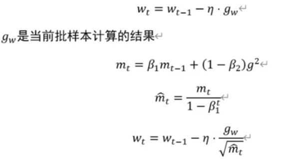

### Adam(自适应矩估计)

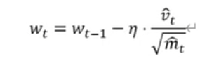

## 评价指标

### 错误率与精度（整体考量结果）

如何评估一个模型的好坏，一个自然而然的想法就是：模型给出的预测值与真实值进行对比（以分类任务为例）。

* 错误率：分类错误的样本数占样本总数的比例（由测试集给出）。
* 精度：分类正确样本数占样本总数的比例（由测试集给出）。

错误率 = 1 - 精度

### 查全率与查准率（局部考量结果）

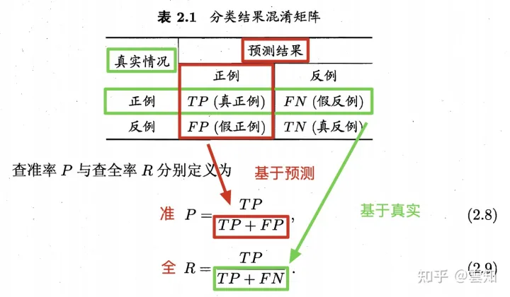

从上图可以知道：

* 查准率：是基于「预测数据」，考察「真正例」的占比。
* 查全率（召回率）：是基于「真实数据」，考察「真正例」的占比。

例子1：如：在病情诊断时，我们希望查准率越高越好，减少病情误判。这样就需要约束条件比较严苛，落在约束条件下的样本数量较小，查全率自然就小了。

例子2：如：在逃犯搜捕过程中，我们希望不放过一个漏网之鱼，所以就希望查全率越高越好。这样就需要约束条件比较宽松，落在约束条件下的样本数量较大，查准率自然就小了。

### F1指数

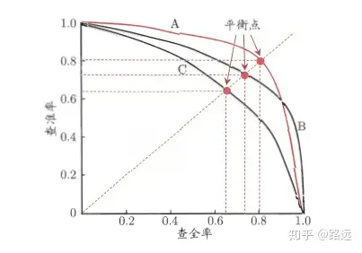

如果想要找到二者之间的一个平衡点，我们就需要一个新的指标： F1分数。F1分数同时考虑了查准率和查全率，让二者同时达到最高，取一个平衡。

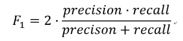

更一般的，我们定义Fβ分数为：

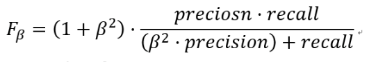

除了F1分数之外，F0.5分数和F2分数，在统计学中也得到了大量应用，其中，F2分数中，召回率的权重高于精确率，而F0.5分数中，精确率的权重高于召回率。

# 神经网络

神经网络的训练主要分为两个部分：

1. 前向传播生成基于当前试验参数的预测值
2. 根据LOSS反向传播，计算梯度并更新模型参数

为了理解神经网络中的这两个主要步骤，请看下面的数学推导实例。在这个例子中，我们随机定义了一个全连接神经网络，且网络中包含两层Hidden Layer。


举例运算为：

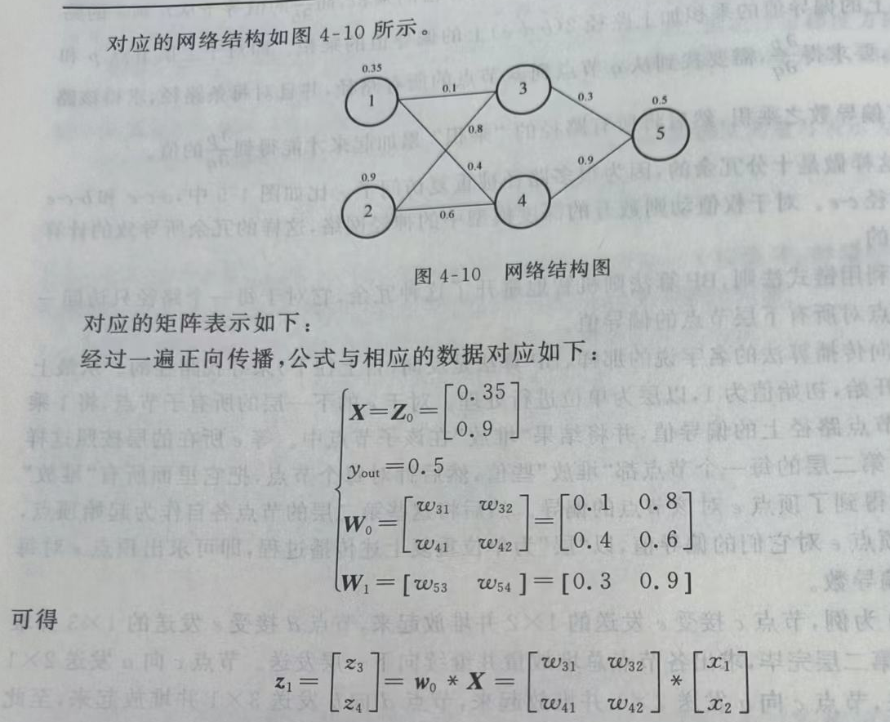

## 神经网络的前项传播

前向传播的主要目的在于基于将输入X通过各种层的计算（weights和Bias等）得出最终的预测结果，并计算Loss。对于Fig1 中的神经网络，如果想要生成最终的预测结果Y_hat。总共分为以下几个步骤：

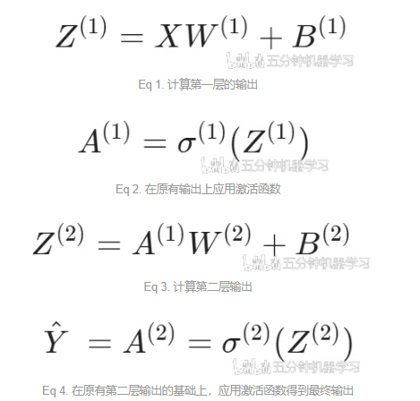

假定这个神经网络是用于RegressionTask， 那么SSE Loss为：

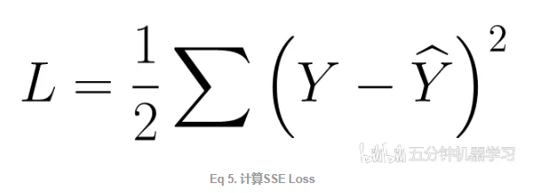

如果是一个Classification Task，那么Cross-entropy Loss 为（其中C表示数据集中类别的数量）:

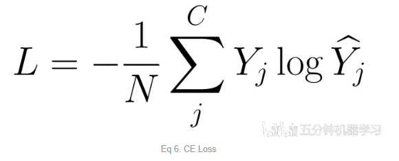

## 神经网络的反向传播

   反向传播算法（Back Propagation）用来求解多层复合函数的所有变量的偏导数的利器。

    当我们有了基于当前模型参数的前向传播的结果，我们需要利用LOSS和Y_hat进行反向传播，来更新模型内部的参数使LOSS更低。通常来说，为了更新参数，我们需要用到Gradient Descent这个方法，计算Loss和待更新参数之间的偏导数。比如如果你要更新W2，你需要计算dL/dW2。但是问题在于，在神经网络中，前项的参数往往和你的LOSS不能直接关联，也就是你不能直接计算他们的偏导数。比如你不能直接找到dL/dW1这个项。为此，我们需要利用反向传播，通过中间项找到他们之间的关系。

    我们以dL/dW2这项为例。要找到这组关联偏导数，我们需要从Eq6 入手。在这个公式中，Y表示Ground Truth，Y_hat表示为模型的输出。而为了找到L和W2之间的关系，可以看到Y是个无关项，我们需要从Y_hat 入手。

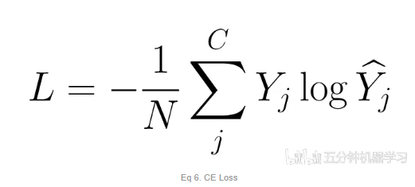

而为了找到Y_hat 和W2之间的关系，我们来到Eq4。在这个公式中，delta表示激活函数，是一个固定的计算逻辑，并不和W2相关，所以他是无关项。而Z2的结果将受到W2的影响，所以这里面我们关注Z2

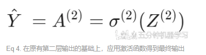

现在，我们通过Y_hat作为中间相，找到了L和Z2的关系。我们继续这个流程，来到Eq3。

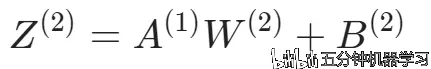

可以看到在这个公式中Z2和W2是直接相关的。所以到此我们已经找到了L和W2的关系，他表示为：

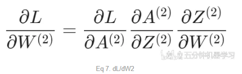

对于Eq6这个公式，我们为了找到L和W2的关系，引入了两个中间项Y_hat (也就是A2）和Z2。然后分别通过中间项之间的关联及Z2和W2之间的关联，表示了最终的偏导数。在这个公式中,dL/dA2表示为Loss的偏导数。以Cross-Entropy Loss 为例，这一项的结果为：

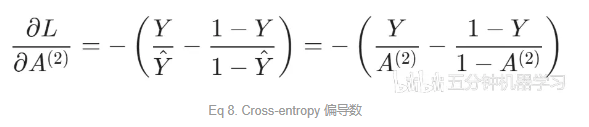

而dA2/dZ2这一项，表示的位Activation的偏导数。常见的Activation有很多，比如Sigmoid，Tanh,和ReLU。 对于Sigmoid函数，其偏导表示为：

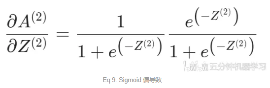

最后一项dZ2/dW2，回顾Eq3,这两项直接相关，也就是说：

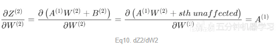

到此，我们已经完成了对于Eq7中每一项的计算，求得了W2的导数。最后我们立刻用梯度下降的方法，更新W2的参数值：

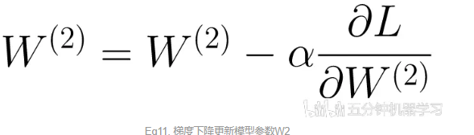

同样的你也可以利用上面的逻辑更新其他参数比如W1：

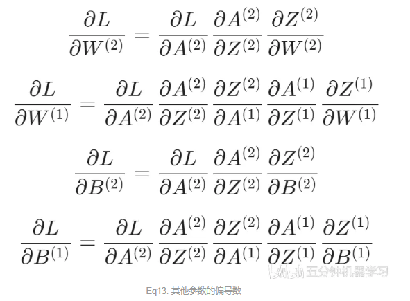

当你有了这些偏导数之后，就可以利用Eq11中的公式去更新所有的参数了。

## 循环神经网

[【循环神经网络】5分钟搞懂RNN，3D动画深入浅出_哔哩哔哩_bilibili](https://www.bilibili.com/video/BV1z5411f7Bm/?spm_id_from=333.337.search-card.all.click&vd_source=587f5843c9f7c7e32ebfbaf45850aeaf)

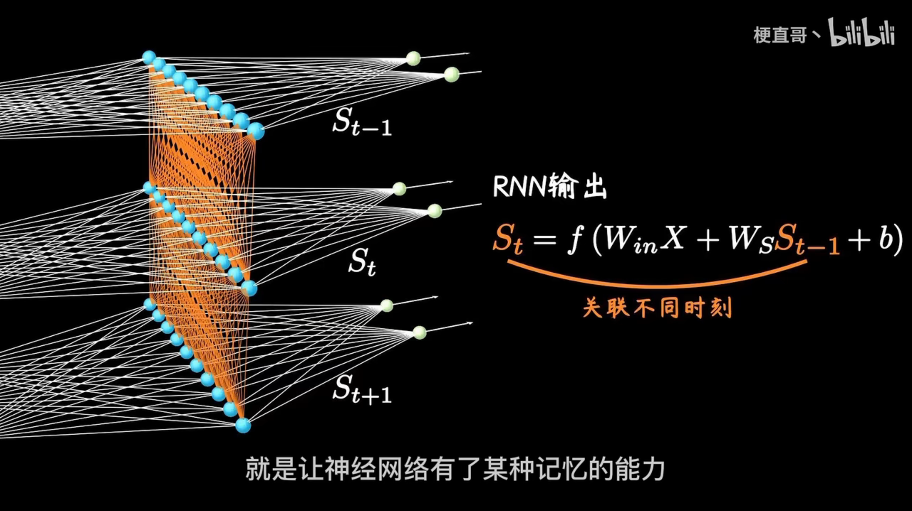

# 卷积神经网络

## 卷积核（kernel）和过滤器（filter）的区别

常规卷积操作如下图所示

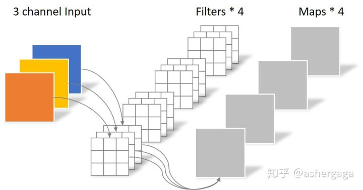

较为直观地一种理解方法为：

* 卷积核就是由长和宽来指定的，是一个二维的概念。
* 而过滤器是由长、宽和深度指定的，是一个三维的概念。
* 过滤器可以看做是卷积核的集合。
* 过滤器比卷积核高一个维度——深度。

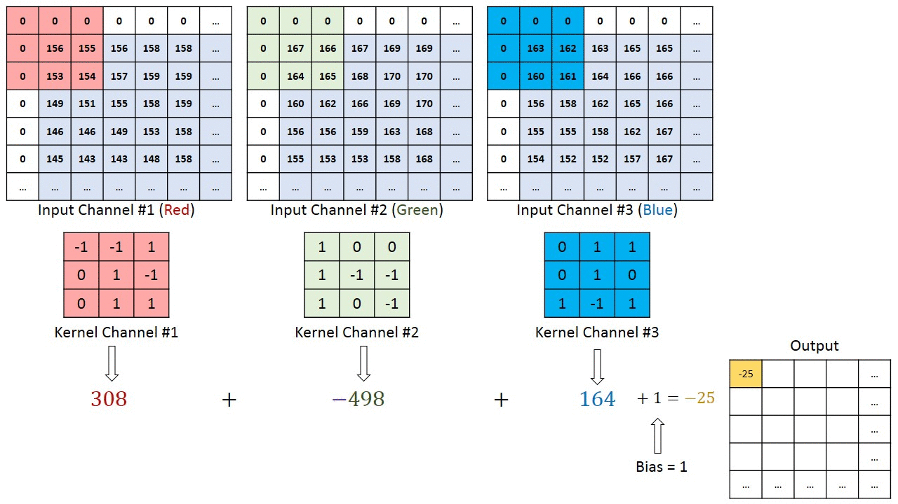

图1是对一个3通道的图片做卷积操作，卷积核的大小为 3 × 3，卷积核的数目为3，此时过滤器指的就是这三个卷积核的集合，维度是 3 × 3 × 3，前面的 3 × 3 指的是卷积核的高度（H）和宽度（W），后面的那个 3 指的是卷积核的数目。

上面的操作是对三个通道分别做卷积操作，然后将卷积的结果相加，最后输出一个特征图。

即： **一个过滤器就对应一个特征图**。

注意这个数字对应关系，如果换成卷积核还能否成立？

一般情况下，过滤器的概念应当应用在多通道的情况下，因为在多通道情况下，我们没办法说一个卷积操作就能够产生一个特征图，于是有了过滤器这个概念，便于描述这种情况。（这个是我的猜测，哈哈哈哈）

再来看一个单通道的例子：

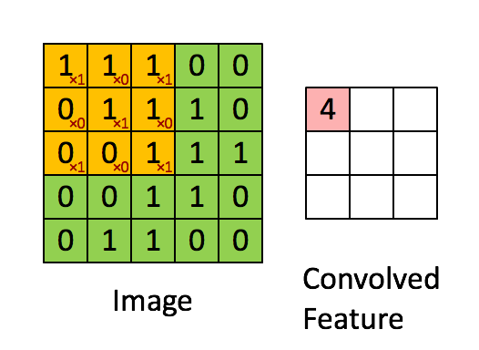

图2就是对一个单通道的图片做卷积操作，卷积核的大小是 3 × 3 ，卷积核的数目为1，最终得到1个特征图。

在单通道情况下，其实过滤器和卷积核可以看做一个东西，即 filter=kernel 。

如果要得到多个特征图其实只需要多加几个卷积核即可。

这时候，一个卷积核就对应一个特征图。

## 通道

核心观点：

1. 对于最初输入图片样本的通道数 in_channels 取决于图片的类型，如果是彩色的，即RGB类型，这时候通道数固定为3，如果是灰色的，通道数为1。
2. 卷积完成之后，输出的通道数 out_channels 取决于过滤器的数量。从这个方向理解，这里的 out_channels 设置的就是过滤器的数目。
3. 对于第二层或者更多层的卷积，此时的 in_channels 就是上一层的 out_channels ，out_channels 还是取决于过滤器数目。

在第2条用的是过滤器，而不是卷积核，跟原作者观点有些不同，因为在这里用过滤器描述可能更合适。

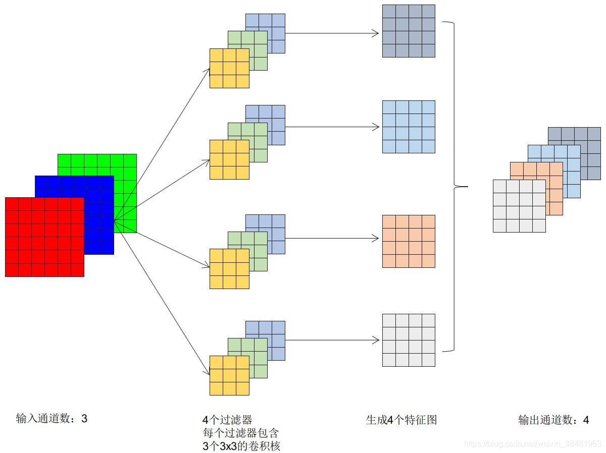

这里输入通道数是3，每个通道都需要跟一个卷积核做卷积运算，然后将结果相加得到一个特征图的输出，这里有4个过滤器，因此得到4个特征图的输出，输出通道数为4。

单个特征图的计算可看下图：


再来看一下单通道的例子：

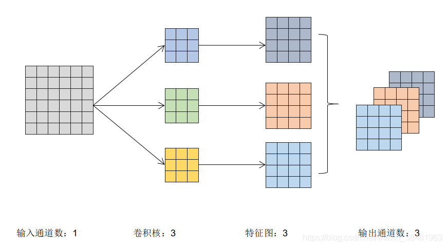

输入是灰色图片，输入通道数是1，卷积核有3个，做三次卷积操作，生成3个特征图，输出通道数为3。

**最初的通道数是3，但是有的神经网络通道数目多达100多个，怎么理解呢？**

可以类比RGB通道，对于多通道我们可以看做是颜色表示的更抽象版本，每一个通道都表示图像某一方面的信息。

## 卷积层

### 尺寸的计算


原理：

* 输入矩阵格式：四个维度，依次为：样本数、图像高度、图像宽度、图像通道数
* 输出矩阵格式：与输出矩阵的维度顺序和含义相同，但是后三个维度（图像高度、图像宽度、图像通道数）的尺寸发生变化。
* 权重矩阵（卷积核）格式：同样是四个维度，但维度的含义与上面两者都不同，为：卷积核高度、卷积核宽度、输入通道数、输出通道数（卷积核个数）

输入矩阵、权重矩阵、输出矩阵这三者之间的相互决定关系：

* **卷积核的输入通道数（in depth）由输入矩阵的通道数所决定。（红色标注）**
* **输出矩阵的通道数（out depth）由卷积核的输出通道数所决定。（绿色标注）**
* 输出矩阵的高度和宽度（height, width）这两个维度的尺寸由输入矩阵、卷积核、扫描方式所共同决定。计算公式如下。（蓝色标注）W=（W1-F+2P）/S+1，（W1为输入图像尺寸，F为卷积核尺寸，S为步长），详细公式为：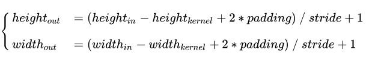

### 卷积层参数计算

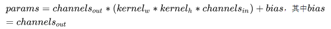

### 卷积层连接数量计算

### 卷积层计算量

#### 普通卷积层的计算量

进行一次卷积操作的计算量，应该如何计算呢？

**卷积层计算量 = 卷积矩阵操作 + 融合操作 + 偏置项操作**

**注意：其中矩阵操作包括：先乘法，再加法**

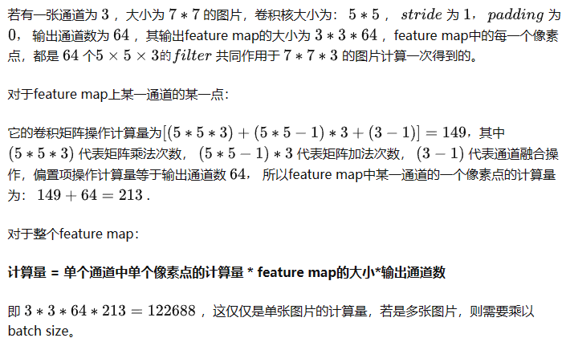

（2）全连接层的计算量

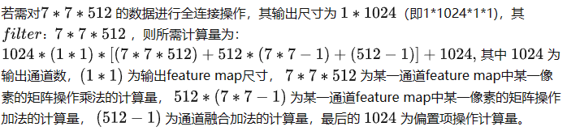

## 池化层

池化（pooling） 的本质，其实就是采样。Pooling 对于输入的 Feature Map，选择某种方式对其进行降维压缩，以加快运算速度。此外，**池化层没有参数**。

### 最大池化

用一个 2×2 的filter，步长为2进行‘扫描’，选择最大值输出到下一层，这叫做 Max Pooling。max pooling常用的 s=2 ，f=2 的效果：特征图高度、宽度减半，通道数不变。(s为步长，f为卷积核尺寸)

### 平均池化

用一个 2×2 的filter，步长为2进行‘扫描’，计算平均值输出到下一层，这叫做 Mean Pooling。

### 作用

1. 保留主要特征的同时减少参数和计算量，防止过拟合。
2. invariance(不变性)，这种不变性包括translation(平移)，rotation(旋转)，scale(尺度)。

Pooling 层说到底还是一个特征选择，信息过滤的过程。也就是说我们损失了一部分信息，这是一个和计算性能的一个妥协。现在有些网络都开始少用或者不用pooling层了。

## 全连接层

### view()方法

**其实就是把原先tensor中的数据进行排列，排成一行，然后根据所给的view()中的参数从一行中按顺序选择组成最终的tensor** 。

view(h,w)，h代表行（想要变为几行），w代表的是列（想要变为几列）//这里所说并不严谨，只是为了更好理解。

| view()的参数 | 作用                                                       |
| ------------ | ---------------------------------------------------------- |
| h            | 取值代表行数，当不知道要变为几行，但知道要变为几列时可取-1 |
| w            | 取值代表列数，当不知道要变为几列，但知道要变为几行时可取-1 |

注意：元素个数要能整除行和列。

## 损失函数和优化

### 损失函数

每一个样本的预测值与真实值的差称为损失。

损失函数是一个用来计算损失的函数。它是一个非负实值函数,通常使用L(Y, f(x))来表示。

损失函数类型：

1. 分类任务损失：0-1 loss、熵与交叉熵loss、softmax loss及其变种、KL散度、Hinge loss、Exponential loss、Logistic loss、Focal Loss
2. 回归任务损失：L1 loss、L2 loss、perceptual loss、生成对抗网络损失、GAN的基本损失、-log D trick、Wasserstein GAN、LS-GAN、Loss-sensitive-GAN

#### Cross Entropy Loss (CE)：

y的取值为1和-1，p为模型预测出的值，y为真实标签，y=1代表正样本

$$
p_t=\left\{\begin{matrix}-log(p) &if\:y=1  & \\-log(1-p)  &otherwise\end{matrix}\right.
$$

举例说明：

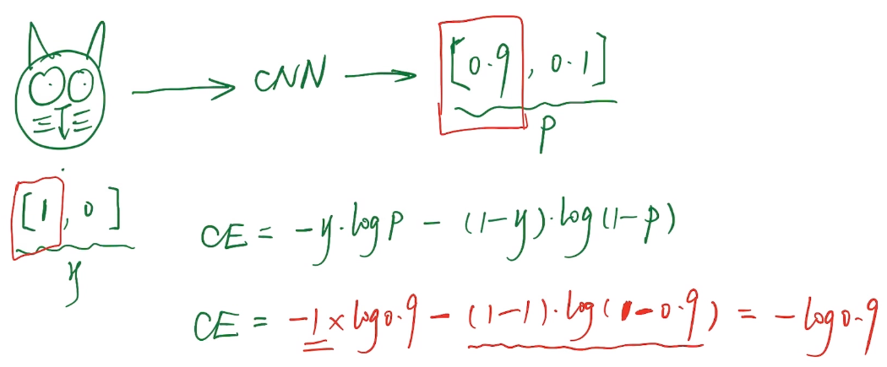

为方便简洁的表达，定义关于P的函数：

$$
p_t=\left\{\begin{matrix}p &if\:y=1  & \\1-p  &otherwise\end{matrix}\right.
$$

因此CE的形式为：

$$
CE(p,y)=CE(p_t)=-log(p_t)
$$

注意公式中log函数为ln函数

#### Balanced Cross Entropy（BCE）

> 正负样本不均衡是指在一张图像中能够匹配到目标的候选框（正样本）个数一般只有十几个或几十个，而没有匹配到的候选框（负样本）则有10000~100000个。这么多的负样本不仅对训练网络起不到什么作用，反而会淹没掉少量但有助于训练的样本。

为解决单阶段目标检测**正负样本不均衡问题**，引入一个权重因子α∈[0,1]，当为正样本（y=1）时，权重因子为α，当为负样本时，权重因子为1-α。公式形式如下：

$$
CE(p_t)=-α_tlog(p_t)
$$

出现频率较高的label，α调低；出现频率较低的label，α调高

为什么二阶段目标检测不用解决？

> 因为在二阶段中分了两步，第一步时同样也会生成许多的负样本以及很少的负样本，但到第二步时，它会在第一步的基础上选取特定数量的正负样本去检测，因此正负样本并不会特别不平衡

#### Focal Loss（FC）

虽然BCE解决了正负样本不平衡问题，但并没有区分简单还是难区分样本。当易区分负样本超级多时，整个训练过程将会围绕着易区分负样本进行，进而淹没正样本，造成大损失。因此Focal Loss是为了进一步**解决one-stage目标检测**中**难样本问题** 。除此之外还有其他处理方法，比如：hard negative mining（难例挖掘），其并不会使用所有的负样本去训练网络，而是去选择损失比较大的来训练。

**什么是难区分样本？**

> 如下图，“难”现在预测出是对应真实标签的概率非常低

Focal Loss是一个动态缩放的交叉熵损失，通过一个动态缩放因子$(1-p_t)^γ$，γ∈[0,5]，动态降低训练过程中易区分样本的权重，从而将重心快速聚焦在那些**难区分的样本**（有可能是正样本，也有可能是负样本，但都是对训练网络有帮助的样本）。

$$
FL(p_t)=-α_t(1-p_t)^γlog(p_t)
$$

解释如下：$(1-p_t)^γ$可以**减低易分样本的损失贡献** ，从而**相对增加难分样本的损失比**，通过 相对放大难样本对损失的贡献，相对降低简单样本的贡献。（相对指的是难易样本之间的相对）

例题举例：

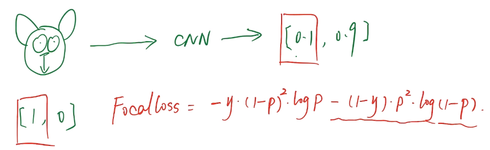

对于γ的不同取值，得到的loss效果如图：

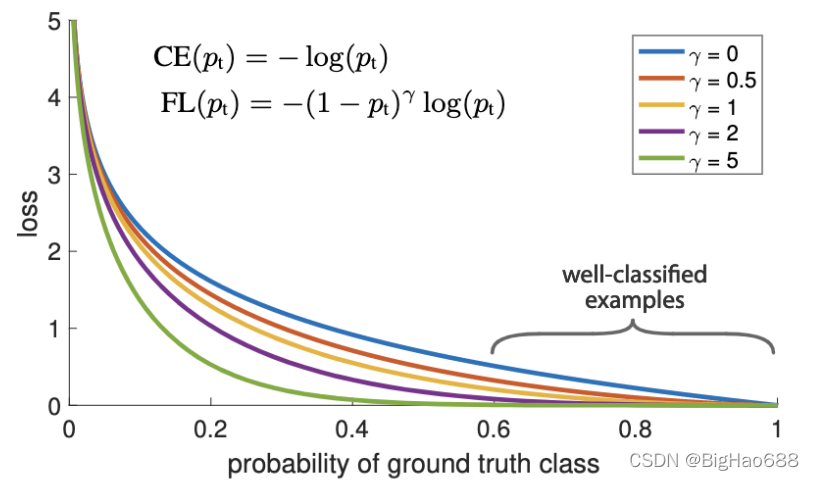

右侧是简单样本（易区分样本），左侧是难区分样本，通过调大γ，使得难区分样本的损失相对易区分样本的损失增大。（相对值增大，其实绝对值两者都减小了）

Focal Loss总结：

> 1. $(1-p_t)^γ$用来减低易区分样本的损失贡献。
> 2. $α_t$用于调节正负样本损失之间的比例。
> 3. γ 和 αt **都有相应的取值范围**，他们的取值相互间也是有影响的，在实际使用过程中应组合使用。

### 交叉熵损失

#### ？？CrosssEntropyLoss()方法

### 随机梯度下降

#### ？？SGD()方法

## 轻量级网络

如：Mobilenet 和 Squeezenet等，主要关注的是一个间接量——以 FLOPS 为衡量的网络复杂度，即轻量级网络模型的快慢可通过浮点运算量来描述。

注意：在小型计算机的设备中，设备运行速度不仅要考虑浮点计算量本(Memory access cost)和平台特征(Platformcharacteristics)。

## 深度可分离卷积（Depthwise Separable Convolution）

逐通道卷积（Depthwise Convolution）

一个卷积核负责一个通道，一个通道只被一个卷积核卷积

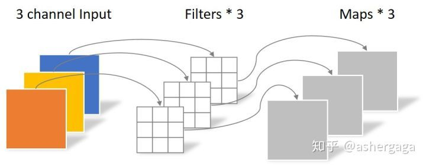

逐通道卷积没有有效的利用不同通道在相同空间位置上的feature信息。因此需要Pointwise Convolution来将这些Feature map进行组合生成新的Feature map。

逐点卷积（Pointwise Convolution）

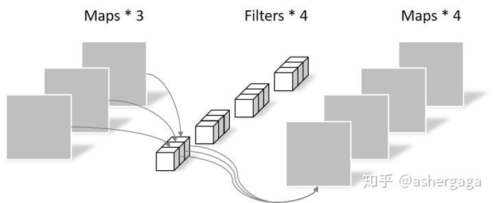

## 空洞卷积

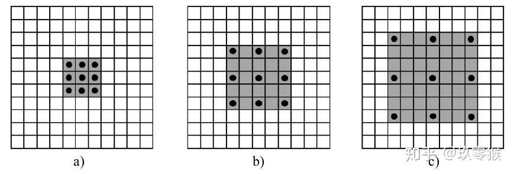

* a是普通的卷积过程(dilation rate = 1),卷积后的感受野为3
* b是dilation rate = 2的空洞卷积,卷积后的感受野为5
* c是dilation rate = 3的空洞卷积,卷积后的感受野为8

优点：

* **扩大感受野** ：在deep net中为了增加感受野且降低计算量，总要进行降采样(pooling或s2/conv)，这样虽然可以增加感受野，但空间分辨率降低了。为了能不丢失分辨率，且仍然扩大感受野，可以使用空洞卷积。这在检测，分割任务中十分有用。一方面感受野大了可以检测分割大目标，另一方面分辨率高了可以精确定位目标。
* **捕获多尺度上下文信息：** 空洞卷积有一个参数可以设置dilation rate，具体含义就是在卷积核中填充dilation rate-1个0，因此，当设置不同dilation rate时，感受野就会不一样，也即获取了多尺度信息。***多尺度信息在视觉任务中相当重要啊。***

缺点：

+ 空洞卷积可以任意扩大感受野，且不需要引入额外参数，但如果把分辨率增加了，算法整体计算量肯定会增加。
+ 在实际中不好优化，速度会大大折扣

# 注意力机制

### 为什么需要注意力机制

计算机视觉（computer vision）中的注意力机制（attention）的基本思想就是想让系统学会注意力——能够忽略无关信息而关注重点信息。

该文分为： 硬注意力、软注意力、此外，还有高斯注意力、空间变换

就注意力的**可微性来分**：

1.Hard-attention。强注意力是一个不可微的注意力 ， 训练过程往往是通过增强学习(reinforcement learning)来完成的 。

2.Soft-attention

# 图神经网络

图神经网络（Graph Neural Networks , GNN），常用于处理非结构化数据，在网络数据分析、推荐系统、物理建模、自然语言处理和图上的组合优化表现出色

语音、图像、文本都是很简单的序列或者网格数据，是很结构化的数据，深度学习很善于处理该种类型的数据（如下图）

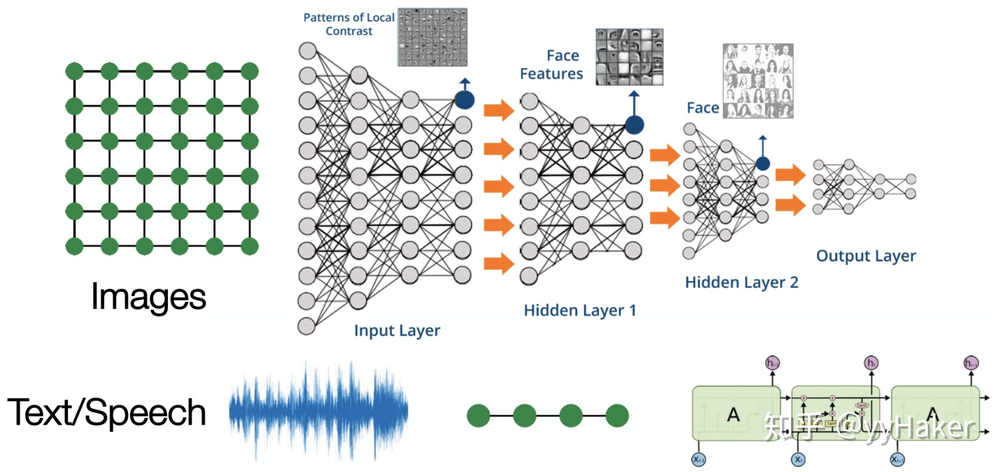

然而现实很多事物都是非结构化的，例如社交网络、知识谱、复杂的文件系统等（如下图）

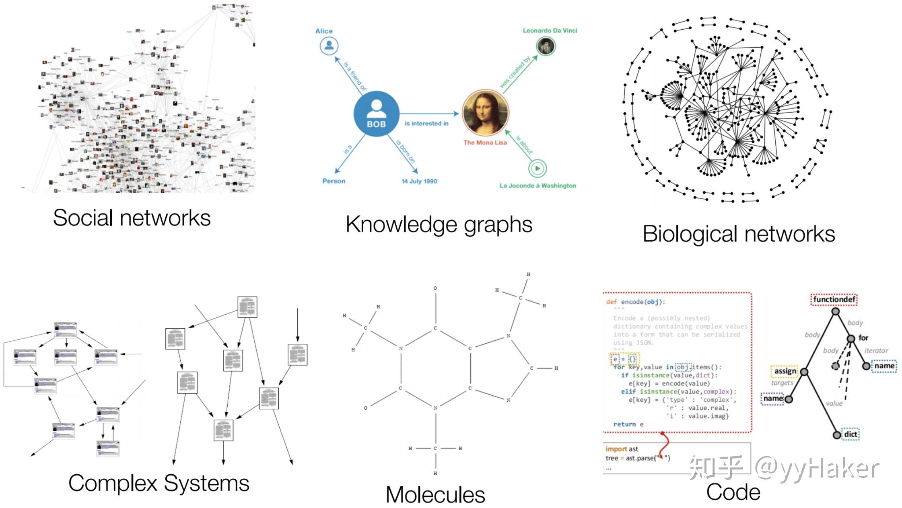

## 处理非结构化数据的难点

1. 图的大小是任意的，图的拓扑结构复杂，没有像图像一样的空间局部性
2. 图没有固定的结点顺序，或者说没有一个参考结点
3. 图经常是动态图，而且包含多模态的特征

相较于神经网络最基本的网络结构全连接层（MLP），特征矩阵乘以权重矩阵，图神经网络多了一个邻接矩阵。计算形式为三个矩阵相乘再加上一个非线性变换。

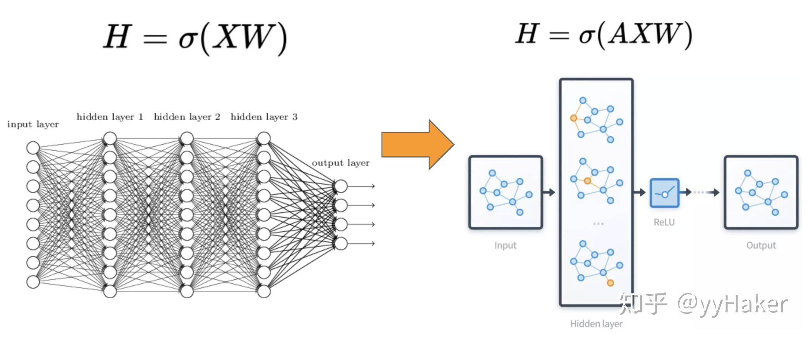

比较常见的图神经网络应用模式如下图（简单直观的感受与理解，其背后的原理逻辑比较复杂），输入是一个图，经过多层图卷积等各种操作以及激活函数，最终得到各个节点的表示，以便于进行节点分类、链接预测、图与子图的生成等等任务

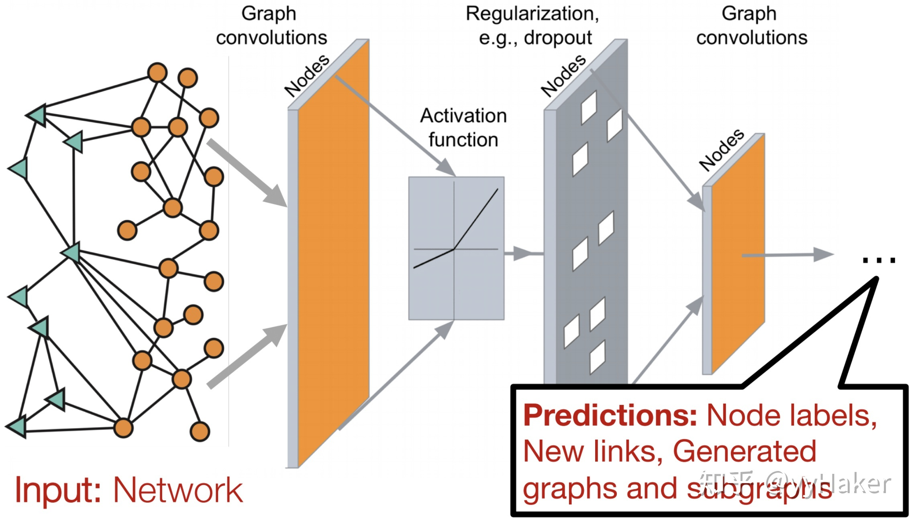
