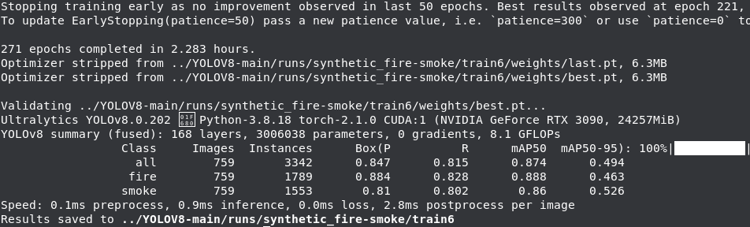
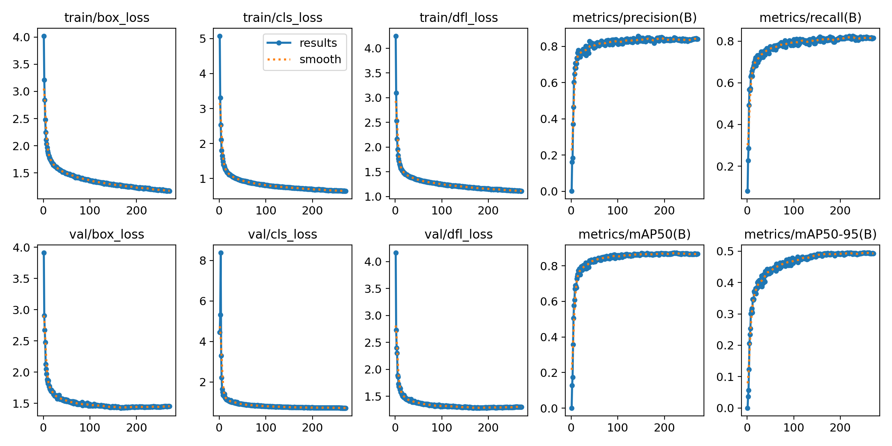
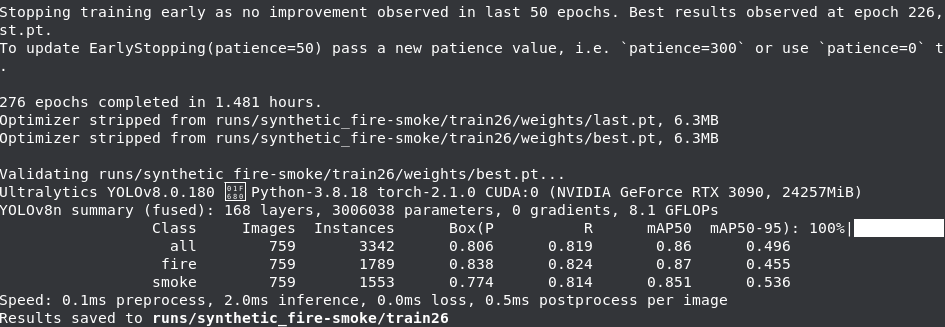
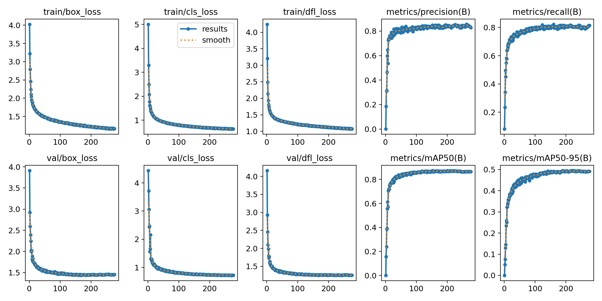
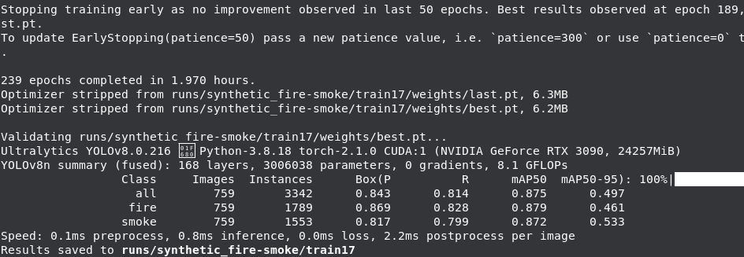

# 注意事项：

train：指的是ultralytics-main(old)

代码包2指的是ultralytics-main

代码包3指的是ultralytics-main（3）

# v5s训练myfiredataset数据集

## yolov5

### v5s baseline

exp40

### 加注意力机制

#### s+CoordAtt

map50提升0.8%（exp41）

200轮后过拟合

### 改IOU

#### EIoU

map50提升0.2%（exp48）

#### WIoU

map50提升0.4%（exp51）

200轮后过拟合

### 改Head

#### GFPN替换Head

map50提升0.5%（exp54）

200轮后过拟合

### 改残差

#### C2f

map50提升0.3%（exp55）

收敛正常

# RTDETR

## synthetic fire-smoke.v17i数据集

### rtdetr-l

#### 无预训练权重baseline

20231219

结果保存文件：exp

map50：0.88。

### rtdetr-r18

#### 无预训练权重baseline

20231220

结果保存文件：exp2

map50：0.878。

### rtdetr-r34

#### 无预训练权重baseline

20231220

结果保存文件：exp3

map50：0.879。

# YOLOv8n

## synthetic fire-smoke.v17i数据集

### baseline

#### 有预训练baseline

##### 实验一

20230925

结果保存文件：train9

map50：0.86，相较于无预训练降低了0.6%

无法收敛

##### 实验二

结果保存文件：(魔)train4（训练日期：20231223）

yolov8n，CIOU，batch=32，GPU1

map50：0.864，最好结果在91轮。

#### 无预训练baseline

##### 实验一

网络模型图：

20230925

结果保存文件：train8

map50：0.866，相较于有预训练提升了0.6%。

收敛

##### 实验二（需要录入默认超参(魔)train8）

结果保存文件：(魔)train6（训练日期：20231223）

yolov8n，CIOU，batch=32，GPU1。

map50：0.874，最好结果在221轮。

##### 实验三（需要默认超参实验五）

结果保存文件：train26（训练日期：20231223）

yolov8n，CIOU，batch=32，GPU0

map50：0.86，最好结果在226轮。

##### 实验四（需要默认超参代码包2train18）

结果保存文件：代码包2train17（训练日期：20231223）

yolov8n，CIOU，batch=32，GPU1

map50：875，最好结果在189轮。

##### 实验五

结果保存文件：train27（训练日期：20231223）

yolov8n，CIOU，batch=32，GPU0，默认超参

map50：，最好结果在轮。

v8图

### 注意力

#### +GAM_Attention

##### 第一次实验

结果保存文件：train10（日期：20230925）

200轮

map50：0.868，相较于有训练baseline提升0.8%，相较于无训练baseline提升0.2%。

##### 第二次实验

结果保存文件：train11（日期：20230925）

300轮

map50：0.868，与第一次实验总map50相同，fire的map50有0.5%提升，smoke的map50有0.3%下降，相较于有训练baseline提升0.8%，相较于无训练baseline提升0.2%。

#### +CoordAtt

##### 实验一

结果保存文件：(魔)train3（训练日期：20231223）

CoordAtt，CIOU，batch=32，GPU1

map50：0.87，最好结果在225轮。

### small object

结果保存文件：train12（日期：20230925）

300轮

map50：0.877，相较于有训练baseline提升1.7%，相较于无训练baseline提升1.1%。

#### small object + augment

结果保存文件：train22（日期：20231020）

300轮，221轮终止

map50：0.874，相较于单独small object 降低 0.3%。

#### small object + GAM_Attention

结果保存文件：train13（日期：20230925）

300轮

map50：0.872，相较于有训练baseline提升1.2%，相较于无训练baseline提升0.6%，相较于单独的small object 降低0.5%。因而small object网络与GAM结合有负面影响。

#### small object + WIoU

结果保存文件：train14（日期：20230926）

300轮，187轮终止

map50：0.876，相较于有训练baseline提升1.6%，相较于无训练baseline提升1.0%，相较于单独的small object 降低0.1%。因而small object网络与GAM结合有负面影响。

#### small object + Inner CIOU

##### 实验一

结果保存文件：代码包2train13（训练日期：20231207）

ratio=1.1，tal中为CIOU，180轮终止。

map50：0.884，相较于无训练baseline提高1.8%。

##### 实验二

结果保存文件：代码包3train6（训练日期：20231208）

ratio=0.95，tal中为CIOU，241轮终止。

map50：0.881。

#### +CA+Inner CIOU+small object

##### 实验一

结果保存文件：(魔)train（训练日期：20231223）

self_small_Object_CoordAtt，CIOU，ratio=1.1，batch=32，GPU1

map50：0.875，最好结果在226轮。

##### 实验二

结果保存文件：(魔)train2（训练日期：20231223）

self_small_Object_CoordAtt，CIOU，ratio=0.95，batch=32，GPU1

map50：0.876，最好结果在142轮。

##### 实验三

结果保存文件：(魔)train5（训练日期：20231223）

self_small_Object_CoordAtt，CIOU，ratio=0.9，batch=32，GPU1

map50：0.877，最好结果在166轮。

##### 实验三

结果保存文件：(魔)train7（训练日期：20231223）

self_small_Object_CoordAtt，CIOU，ratio=0.85，batch=32，GPU0

map50：0.872，最好结果在252轮。

### IOU

#### WIoU

结果保存文件：train15（日期：20230926）

300轮，tal中为CIOU（不能同时在loss和tal两个地方同时用WIOU）

map50：0.87，相较于有训练baseline提升1.0%，相较于无训练baseline提升0.4%。

#### EIOU

##### 第一次实验

结果保存文件：train16（日期：20230927）

300轮，tal中为CIOU

map50：0.866，相较于有训练baseline提升0.6%，相较于无训练baseline无提升。

##### 第二次实验

结果保存文件：train19（日期：20231002）

300轮，tal中为EIOU

map50：0.863，实验无意义。

#### SIOU

##### 第一次实验

结果保存文件：train18（日期：20230928）

300轮 ，tal中为CIOU

map50：0.864，相较于第一次实验fire的map提升1.3%，smoke降低1.4%。

##### 第二次实验

结果保存文件：train17（日期：20230928）

300轮 ，tal中也为SIOU

map50：0.865，相较于有训练baseline提升0.5%，相较于无训练baseline降低0.1%。

#### GIOU

|            |   GIOU   | InnerGIOU(1.15) | InnerGIOU(1.1) | InnerGIOU(1.2) | InnerGIOU(1.25) |
| :--------: | :------: | :-------------: | :------------: | :------------: | :-------------: |
|   map50   |  0.872  |      0.871      |     0.868     |      0.87      |      0.866      |
|    tal    |   CIOU   |      GIOU      |      CIOU      |      CIOU      |      CIOU      |
| epoch(50p) |   244   |       246       |      257      |      231      |       230       |
|    save    | train21 |  代码包2train  | 代码包2train3 | 代码包2train4 |  代码包2train5  |
|    date    | 20231003 |    20231124    |    20231125    |    20231126    |    20231126    |

结果保存文件：train21（日期：20231003）

244轮 ，tal中为CIOU

map50：0.872，相较于有训练baseline提升1.2%，相较于无训练baseline提高0.6%。

#### Inner GIOU

##### 实验一

结果保存文件：代码包2train（训练日期：20231124）

ratio=1.15，tal中为GIOU，246轮终止

map50：0.871，相较于无训练baseline提高0.5%。

##### 实验二

结果保存文件：代码包2train2（训练日期：20231125）

ratio=1.15，tal中为CIOU，214轮终止

map50：0.871，相较于无训练baseline提高0.5%。

##### 实验三

结果保存文件：代码包2train3（训练日期：20231125）

ratio=1.1，tal中为CIOU，257轮终止

map50：0.868，相较于无训练baseline提高0.2%。

##### 实验四

结果保存文件：代码包2train4（训练日期：20231126）

ratio=1.2，tal中为CIOU，231轮终止

map50：0.87，相较于无训练baseline提高0.4%。

##### 实验五

结果保存文件：代码包2train5（训练日期：20231126）

ratio=1.25，tal中为CIOU，230轮终止

map50：0.866，相较于无训练baseline无提高。

略

#### DIOU

|            |   DIOU   | InnerDIOU(1.15) | InnerDIOU(1.2) | InnerDIOU(1.25) | InnerDIOU(1.1) | InnerDIOU(1.05) |
| :--------: | :------: | :-------------: | :------------: | :-------------: | -------------- | --------------- |
|   map50   |  0.869  |      0.871      |     0.866     |      0.868      | 0.872          | 0.868           |
|    tal    |   DIOU   |      DIOU      |      DIOU      |      DIOU      | DIOU           | DIOU            |
| epoch(50p) |   207   |       230       |      277      |       235       | 286            | 250             |
|    save    | train20 |  代码包2train6  | 代码包2train9 |  代码包2train7  | 代码包2train10 | 代码包2train8   |
|    date    | 20231003 |    20231127    |    20231127    |    20231127    | 20231127       | 20231127        |

结果保存文件：train20（日期：20231003）

207轮 ，tal中为CIOU

map50：0.869，相较于有训练baseline提升0.9%，相较于无训练baseline提高0.3%。

#### Inner DIOU

##### 实验一

结果保存文件：代码包2train6（训练日期：20231127）

ratio=1.15，tal中为DIOU，230轮终止

map50：0.871，相较于无训练baseline提高0.5%。

略

##### 实验二

略

##### 实验三

结果保存文件：代码包2train7（训练日期：20231127）

ratio=1.25，tal中为DIOU，235轮终止。

map50：0.868，相较于无训练baseline提高0.2%。

略

##### 实验四

结果保存文件：代码包2train10（训练日期：20231127）

ratio=1.1，tal中为DIOU，286轮终止

map50：0.872，相较于无训练baseline提高0.6%。

略

##### 实验五

结果保存文件：代码包2train8（训练日期：20231127）

ratio=1.05，tal中为DIOU，250轮终止。

map50：0.868，相较于无训练baseline提高0.2%。

略

#### Inner CIOU

|            |  CIOU  | InnerCIOU(1.15) | InnerCIOU(1.2) | InnerCIOU(1.25) | InnerCIOU(1.1) | InnerCIOU(1.05) | InnerCIOU(0.9) | InnerCIOU(0.8) | InnerCIOU(0.95) |
| :--------: | :----: | :-------------: | :------------: | :-------------: | -------------- | --------------- | -------------- | -------------- | --------------- |
|   map50   | 0.866 |      0.874      |     0.872     |      0.87      | 0.874          | 0.871           | 0.872          | 0.867          | 0.875           |
|    tal    |  CIOU  |      CIOU      |      CIOU      |      CIOU      | CIOU           | CIOU            | CIOU           | CIOU           | CIOU            |
| epoch(50p) |  缺失  |       275       |      181      |       181       | 254            | 181             | 239            | 241            | 237             |
|    save    | train8 |  代码包3train2  | 代码包3train3 | 代码包2train14 | 代码包2train12 | 代码包3train4   | 代码包3train6  | 代码包2train15 | 代码包3train5   |
|    date    |  基线  |    20231206    |    20231207    |    20231208    | 20231207       | 20231207        | 20231208       | 20231208       | 20231208        |

##### 实验一

结果保存文件：代码包2train11（训练日期：20231206）

ratio=1.15，tal中为CIOU，275轮终止。

map50：0.874，相较于无训练baseline提高0.8%。

代码包3train2(最好)

代码包2train11（一般情况）

##### 实验二

结果保存文件：代码包3train3（训练日期：20231207）

ratio=1.2，tal中为，181轮终止。

map50：0.872，相较于无训练baseline提高0.6%。

##### 实验三

结果保存文件：代码包2train12（训练日期：20231207）

ratio=1.1，tal中为CIOU，轮终止。

map50：，相较于无训练baseline提高%。

##### 实验四

结果保存文件：代码包3train4（训练日期：20231207）

ratio=1.1

##### 实验五

结果保存文件：代码包2train14（训练日期：20231208）

ratio=1.25

##### 实验六

结果保存文件：代码包3train5（训练日期：20231208）

ratio=0.9

##### 实验七

结果保存文件：代码包2train15（训练日期：20231208）

ratio=0.8

##### 实验八

结果保存文件：代码包3train5（训练日期：20231208）

ratio=0.95

### RTDETR

#### +Head

结果保存文件：exp（训练日期：20231220）

yolov8-detr-p2

map50：0.872

#### +Head+小目标检测层

##### 实验一

结果保存文件：exp2（训练日期：20231220）

yolov8-detr-p2

map50：0.874，50轮早停

##### 实验二

结果保存文件：exp3（训练日期：20231221）

yolov8-detr-p2-self

map50：0.883，最好结果在258轮。

#### +Head+小目标检测层+Inner

|            |  CIOU  | InnerCIOU(0.8) | InnerCIOU(0.9) | InnerCIOU(0.95) | InnerCIOU(1.1) | InnerCIOU(1.2) | InnerCIOU(1.4) | InnerCIOU(1.5) | InnerCIOU(0.95) |
| :---------: | :----: | :------------: | :------------: | :-------------: | :------------: | -------------- | -------------- | -------------- | --------------- |
|    map50    | 0.866 |                |     0.874     |      0.872      |     0.877     | 0.876          | 0.883          | 0.881          |                 |
|     tal     |  CIOU  |      CIOU      |      CIOU      |      CIOU      |      CIOU      | CIOU           | CIOU           | CIOU           | CIOU            |
| epoch(best) |  缺失  |                |      311      |       191       |      215      | 222            | 238            | 311            |                 |
|    batch    |        |                |       32       |       32       |       32       | 32             | 16             | 32             |                 |
|    save    | train8 |                |   代码包2exp   |      exp4      |      exp5      | exp6           | 代码包2exp2    | exp7           |                 |
|    date    |  基线  |                |    20231222    |    20231221    |    20231221    | 20231222       | 20231223       | 20231222       |                 |

##### 实验一

##### 实验一

结果保存文件：exp4（训练日期：20231221）

yolov8-detr-p2-self，CIOU，ratio=0.95

map50：0.872，最好结果在191轮。

##### 实验二

结果保存文件：exp5（训练日期：20231221）

yolov8-detr-p2-self，CIOU，ratio=1.1

map50：0.877，最好结果在215轮。

##### 实验三

结果保存文件：exp6（训练日期：20231222）

yolov8-detr-p2-self，CIOU，ratio=1.2

map50：0.876，最好结果在222轮。

##### 实验四

结果保存文件：exp7（训练日期：20231222）

yolov8-detr-p2-self，CIOU，ratio=1.5

map50：0.881，最好结果在311轮。

##### 实验五

结果保存文件：代码包2exp（训练日期：20231222）

yolov8-detr-p2-self，CIOU，ratio=0.9

map50：0.874，最好结果在311轮。

##### 实验六

结果保存文件：exp8（训练日期：20231223）

yolov8-detr-p2-self，CIOU，ratio=1.4，batch=8，GPU1

map50：0.879，最好结果在235轮。

##### 实验七

结果保存文件：代码包2exp2（训练日期：20231223）

yolov8-detr-p2-self，CIOU，ratio=1.4，batch=16，GPU0

map50：0.883，最好结果在238轮。

##### 实验八

结果保存文件：代码包2exp3（训练日期：20231223）

yolov8-detr-p2-self，CIOU，ratio=1.5，batch=16，GPU0

map50：0.881，最好结果在264轮。

### ~~BiFPN~~

~~结果保存文件：train21（日期：20231020）~~

~~300轮 ，228轮终止（早停：50轮）~~

~~map50：0.862，比baseline效果变差。~~

## 211104_didim.v1-none数据集

结果保存文件：代码包2train（训练日期：20231209）

map50：0.754（0.758）。收敛太慢，382轮才收敛。

## Fire And Smoke.v1-training-fire-and-smoke数据集

baseline

烟是0，火是1

## my_fire+synthetic数据集

### 无预训练baseline

结果保存文件：mAnds（日期：20231010）

300轮，204轮终止

map50：0.864

## my_fire数据集

### 无预训练baseline

结果保存文件：my_fire（日期：20231010）

300轮，274轮终止

map50：0.891

### small object

#### small object + Inner CIOU

##### 实验一

结果保存文件：代码包2train（训练日期：20231208）

ratio=0.95，tal中为CIOU，351轮终止。

map50：0.895

## self_real_forest_detection数据集

## Smoke_Dataset_2数据集

### baseline

##### 实验一

结果保存文件：代码包3train（训练日期：20231209）

199轮终止。

map50：0.61

## fire_and_smoke.v3i数据集

雪地无人机森林火灾检测

### 无预训练baseline

99%，无可改进空间，跟别的数据集结合效果也严重受到影响，建议直接放弃该数据集。

# YOLOv8s

## synthetic fire-smoke.v17i数据集

### 无预训练baseline

结果保存文件：train

map50：0.867

无法收敛

### 有预训练baseline

20230924

结果保存文件：train4

map50：0.862

无法收敛

### 8s(Augment)

20230924

结果保存文件：train5

map50：0.855，相较baseline降低0.7%

无法收敛

### GAM（无效试验）

20230924

结果保存文件：train6

map50：0.862

与有预训练的v8s结果一模一样，但第一遍模型输出打印时确实加了GAM层，有可能是yolov8s.pt加载后覆盖了修改后的模型。此次试验初步判定为无效试验。

### +GAM_Attention

结果保存文件：train1

map50：0.87，相较baseline提高0.3%

可以收敛

### +GAM（第二次试验）

20230924

结果保存文件：train7

map50：0.868

### small object

结果保存文件：train2

map50：0.875，相较baseline提高0.8%

改进后网络模型图：

### small object + GAM_Attention

结果保存文件：train3

map50：0.88，相较baseline提高1.3%

# YOLOv5s

## synthetic fire-smoke.v17i数据集

### baseline

结果保存文件：train（20231023）

map50：0.873

过拟合

### lr0=0.1

结果保存文件：train1（20231023）

map50：0.885

### SimAM

结果保存文件：train1（20231023）

map50：0.883

比baseline降低0.2%。

