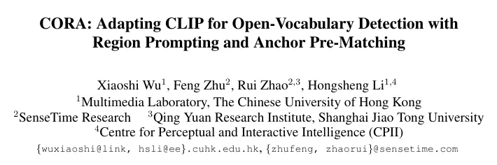
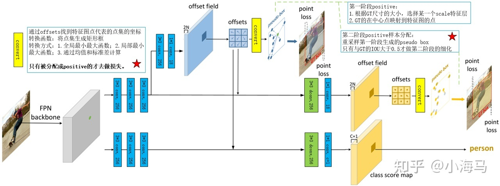
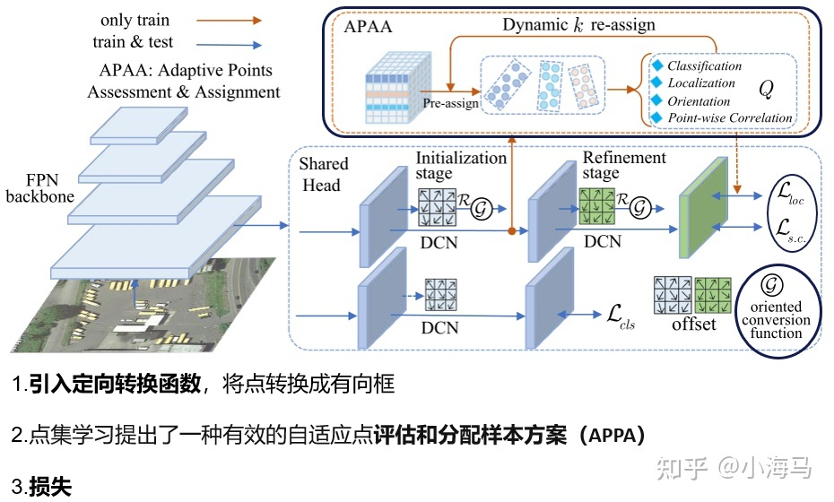
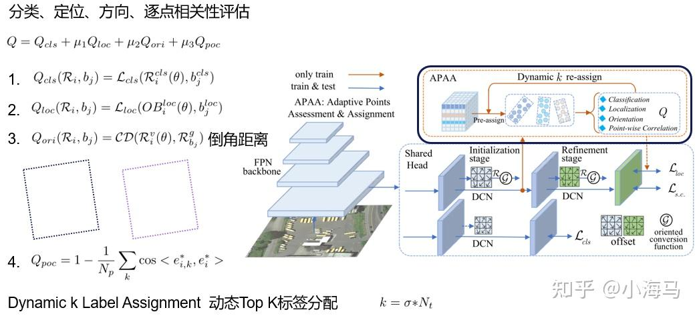

# 图像分割

## 一、▌CrOC: Cross-View Online Clustering for Dense Visual Representation Learning

论文作者：Thomas Stegmüller,Tim
Lebailly,Behzad Bozorgtabar,Tinne Tuytelaars,Jean-Philippe Thiran

论文链接：[http://arxiv.org/abs/2303.13245v1](https://link.zhihu.com/?target=http%3A//arxiv.org/abs/2303.13245v1)

项目链接： [https://github.com/stegmuel/CrOC](https://link.zhihu.com/?target=https%3A//github.com/stegmuel/CrOC)

1）方向：计算机视觉

2）应用：图像分割、视频目标分割

3）背景：在没有标签的情况下学习密集的视觉表示是一项艰巨的任务，特别是从以场景为中心的数据中学习。本文提出了一种跨视图一致性目标和在线聚类机制（CrOC）来发现和分割视图的语义，以解决这个具有挑战性的问题。

4）方法：CrOC方法通过在线聚类机制和跨视图一致性目标来发现和分割视图的语义。该聚类算法同时操作两个视图的特征，从而优雅地绕过了两个视图中都没有表示的内容和从一个裁剪到另一个裁剪的目标的模糊匹配问题。

5）结果：CrOC方法在各种数据集上展示了线性和无监督分割转移任务的出色性能，以及视频目标分割的类似结果。作者公开了代码和预训练模型，可在[https://github.com/stegmuel/CrOC](https://link.zhihu.com/?target=https%3A//github.com/stegmuel/CrOC)上获得。

## 二、▌Orthogonal Annotation BenefitsBarely-supervised Medical Image Segmentation

论文作者：Heng Cai,Shumeng Li,Lei Qi,Qian
Yu,Yinghuan Shi,Yang Gao

论文链接：[http://arxiv.org/abs/2303.13090v1](https://link.zhihu.com/?target=http%3A//arxiv.org/abs/2303.13090v1)

1）方向：3D半监督医学图像分割

2）应用：医学图像分割

3）背景：与2D图像相比，3D医学图像涉及来自不同方向（横向、矢状和冠状平面）的信息，因此可以自然地提供互补的视图。这些互补的视图和相邻3D切片之间的内在相似性启发了作者开发一种新的标注方式及其相应的半监督模型，以实现有效的分割。

4）方法：首先，作者提出了正交标注，只标记标记体积中的两个正交切片，从而显著减轻了标注的负担。然后，作者进行配准以获得稀疏标记体积的初始伪标签。随后，通过引入未标记的体积，作者提出了一种名为Dense-Sparse Co-training（DeSCO）的双网络范式，该范式在早期阶段利用密集的伪标签，在后期阶段利用稀疏标签，并同时强制两个网络的输出一致。

5）结果：在三个基准数据集上的实验结果验证了作者在性能和注释效率方面的有效性。例如，在KiTS19数据集上，仅使用10个标记的切片，作者的方法达到了86.93％的Dice系数。

# 目标检测

## 一、▌Box-Level Active Detectio

论文作者：Mengyao Lyu,Jundong Zhou,Hui Chen,Yijie Huang,Dongdong Yu,Yaqian Li,Yandong Guo,Yuchen Guo,Liuyu Xiang,Guiguang Ding

论文链接：[http://arxiv.org/abs/2303.13089v1](https://link.zhihu.com/?target=http%3A//arxiv.org/abs/2303.13089v1)

项目链接： [https://github.com/lyumengyao/blad](https://link.zhihu.com/?target=https%3A//github.com/lyumengyao/blad)

1）方向：计算机视觉

2）应用：目标检测

3）背景：目前广泛使用的主动学习检测基准评估方法是图像级别评估，这在人力工作量估计上是不现实的，并且偏向于拥挤的图像。此外，现有的方法仍然执行图像级别标注，但是同一图像中的所有目标都被平等评分会浪费预算和产生冗余标签。

4）方法：提出了一个基于框级别的主动检测框架，每个周期控制基于框的预算，优先考虑信息量大的目标，并避免冗余标注，以进行公平比较和高效应用。在提出的框级别设置下，设计了一种新的流程，即互补伪主动策略（ComPAS）。它以互补的方式利用人类标注和模型智能：输入端委员会仅查询信息量大的对象的标签；同时，模型识别出学习良好的目标，并用伪标签进行补偿。

5）结果：ComPAS在统一的代码库中在4个设置下始终优于10个竞争对手。仅在有标注数据的情况下，它就可以通过监督学习实现VOC0712的100％监督性能，仅需19％的框标注。在COCO数据集上，它比第二好的方法提高了高达4.3％的mAP。ComPAS还支持使用未标记的池进行训练，在这种情况下，它可以在减少85％标签的情况下超过90％的COCO监督性能。源代码公开在[https://github.com/lyumengyao/blad](https://link.zhihu.com/?target=https%3A//github.com/lyumengyao/blad)。

## 二、▌CORA: Adapting CLIP for Open-Vocabulary Detection with Region Prompting and Anchor Pre-Matching

论文作者：Xiaoshi Wu,Feng Zhu,Rui Zhao,Hongsheng Li

论文链接：http://arxiv.org/abs/2303.13076v1

1）方向：计算机视觉

2）应用：Open-vocabulary detection (OVD) 目标检测

3）背景：OVD是一种目标检测任务，旨在检测超出检测器训练基础类别的新类别的对象。最近的OVD方法依赖于大规模的视觉语言预训练模型，例如CLIP，用于识别新对象。

4）方法：为了克服将这些模型纳入检测器训练时遇到的两个核心障碍，作者提出了CORA，一种DETR风格的框架，通过区域提示和锚点预匹配来适应CLIP进行开放词汇检测。区域提示通过提示基于CLIP的区域分类器的区域特征来减轻整体到区域分布差异。锚点预匹配通过一种类别感知的匹配机制来帮助学习可推广的对象定位。

5）结果：作者在COCO OVD基准测试中评估了CORA，其中在新类别上实现了41.7 AP50，即使不使用额外的训练数据也比以前的SOTA高出2.4 AP50。当有额外的训练数据时，作者在基于真实标注的基础类别标注和由CORA计算的额外伪边界框标签上训练了CORA+。CORA+在COCO OVD基准测试中实现了43.1 AP50，在LVIS OVD基准测试中实现了28.1 box APr。

## 三、**▌MV-JAR: Masked Voxel Jigsaw and Reconstruction for LiDAR-Based Self-Supervised Pre-Training**

论文作者：Runsen Xu,Tai Wang,Wenwei Zhang,Runjian Chen,Jinkun Cao,Jiangmiao Pang,Dahua Lin

论文链接：[http://arxiv.org/abs/2303.13510v1](https://link.zhihu.com/?target=http%3A//arxiv.org/abs/2303.13510v1)

项目链接： [https://github.com/SmartBot-PJLab/MV-JAR](https://link.zhihu.com/?target=https%3A//github.com/SmartBot-PJLab/MV-JAR)

1）方向：LiDAR-based self-supervised pre-training

2）应用：3D object detection

3）背景：本文介绍了一种基于LiDAR的自监督预训练方法Masked Voxel Jigsaw and Reconstruction (MV-JAR)，并在Waymo数据集上设计了一个数据高效的3D目标检测基准。作者受到下游3D目标检测中场景-体素-点层次结构的启发，设计了掩蔽和重建策略，考虑了场景中的体素分布和体素内局部点分布。作者采用了反向最远体素采样策略来解决LiDAR点的不均匀分布，并提出了MV-JAR方法，结合了两种技术来建模上述分布，从而实现了更优越的性能。

4）方法：本文提出了一种基于LiDAR的自监督预训练方法Masked Voxel Jigsaw and Reconstruction (MV-JAR)，并在Waymo数据集上设计了一个数据高效的3D目标检测基准。MV-JAR方法结合了掩蔽和重建策略，考虑了场景中的体素分布和体素内局部点分布，采用了反向最远体素采样策略来解决LiDAR点的不均匀分布。作者提出了一种新的基准，对场景序列进行采样，以确保模型收敛并提供更准确的预训练方法评估。

5）结果：实验结果表明，MV-JAR方法在Waymo基准和KITTI数据集上均能显著提高3D检测性能，实现了高达6.3%的mAPH增长。作者提供了代码和基准，可在[https://github.com/SmartBot-PJLab/MV-JAR](https://link.zhihu.com/?target=https%3A//github.com/SmartBot-PJLab/MV-JAR)上获取。此外，作者还发现了以往数据高效实验的局限性，并提出了一种新的基准，以确保模型收敛并提供更准确的预训练方法评估。

## 四、▌MV-JAR: Masked Voxel Jigsaw and Reconstruction for LiDAR-Based Self-Supervised Pre-Training

论文作者：Runsen Xu,Tai Wang,Wenwei Zhang,Runjian Chen,Jinkun Cao,Jiangmiao Pang,Dahua Lin

论文链接：[http://**arxiv.org/abs/2303.1351**0v1](https://link.zhihu.com/?target=http%3A//arxiv.org/abs/2303.13510v1)

项目链接： [https://**github.com/SmartBot-PJL**ab/MV-JAR](https://link.zhihu.com/?target=https%3A//github.com/SmartBot-PJLab/MV-JAR)

1）方向：LiDAR-based self-supervised pre-training

2）应用：3D object detection

3）背景：本文介绍了一种基于LiDAR的自监督预训练方法Masked Voxel Jigsaw and Reconstruction (MV-JAR)，并在Waymo数据集上设计了一个数据高效的3D目标检测基准。作者受到下游3D目标检测中场景-体素-点层次结构的启发，设计了掩蔽和重建策略，考虑了场景中的体素分布和体素内局部点分布。作者采用了反向最远体素采样策略来解决LiDAR点的不均匀分布，并提出了MV-JAR方法，结合了两种技术来建模上述分布，从而实现了更优越的性能。

4）方法：本文提出了一种基于LiDAR的自监督预训练方法Masked Voxel Jigsaw and Reconstruction (MV-JAR)，并在Waymo数据集上设计了一个数据高效的3D目标检测基准。MV-JAR方法结合了掩蔽和重建策略，考虑了场景中的体素分布和体素内局部点分布，采用了反向最远体素采样策略来解决LiDAR点的不均匀分布。作者提出了一种新的基准，对场景序列进行采样，以确保模型收敛并提供更准确的预训练方法评估。

5）结果：实验结果表明，MV-JAR方法在Waymo基准和KITTI数据集上均能显著提高3D检测性能，实现了高达6.3%的mAPH增长。作者提供了代码和基准，可在[https://**github.com/SmartBot-PJL**ab/MV-JAR](https://link.zhihu.com/?target=https%3A//github.com/SmartBot-PJLab/MV-JAR)上获取。此外，作者还发现了以往数据高效实验的局限性，并提出了一种新的基准，以确保模型收敛并提供更准确的预训练方法评估。

## 五、▌Dense Distinct Query for End-to-End Object Detection

论文作者：Shilong Zhang,Wang xinjiang,Jiaqi Wang,Jiangmiao Pang,Chengqi Lyu,Wenwei Zhang,Ping Luo,Kai Chen

论文链接：[http://arxiv.org/abs/2303.12776v1](https://link.zhihu.com/?target=http%3A//arxiv.org/abs/2303.12776v1)

项目链接： [https://github.com/jshilong/DDQ](https://link.zhihu.com/?target=https%3A//github.com/jshilong/DDQ)

1）方向：计算机视觉

2）应用：目标检测

3）背景：在目标检测中，一对一的标签分配成功地消除了后处理中的非极大值抑制（NMS），使管道端到端。然而，它触发了一个新的困境，因为广泛使用的稀疏查询不能保证高召回率，而密集查询不可避免地带来更多相似的查询并遇到优化困难。

4）方法：本文提出了一种新的查询方法，称为Dense Distinct Queries（DDQ）。具体来说，首先像传统检测器一样放置密集查询，然后选择不同的查询进行一对一的分配。DDQ融合了传统方法和最近的端到端检测器的优点，并显着提高了各种检测器的性能，包括FCN，R-CNN和DETRs。

5）结果：DDQ方法融合了传统方法和最近的端到端检测器的优点，并显着提高了各种检测器的性能，包括FCN，R-CNN和DETRs。DDQ-DETR在使用ResNet-50骨干网络的情况下，在12个时期内在MS-COCO数据集上实现了52.1 AP，优于同一设置中的所有现有检测器。DDQ在拥挤场景中也具有端到端检测器的好处，并在CrowdHuman上实现了93.8 AP。DDQ方法可以启发研究人员考虑传统方法和端到端检测器之间的互补性。源代码可以在\url{[https://github.com/jshilong/DDQ](https://link.zhihu.com/?target=https%3A//github.com/jshilong/DDQ)}找到。

# 遥感图像目标检测研究综述_CSDN_113之落

## 遥感图像特殊性

+ 尺度多样性：航空遥感图像可从几百米到近万米的高度进行拍摄，且地面目标即使是**同类目标也大小不一**，如港口的轮船大的有300多米，小的却只有数十米。

* 视角特殊性：航空遥感图像的视角基本都是**高空俯视**，但常规数据集大部分还是地面水平视角，所以**同一目标的模式是不同**的，在常规数据集上训练的很好的检测器，使用在航空遥感图像上可能效果很差。
* 小目标问题：航空遥感图像的目标很多都是**小目标**（**几十个甚至几个像素**），这就导致**目标信息量不大**，基于CNN的目标检测方法在常规目标检测数据集上一骑绝尘，但*对于小目标检测而言，CNN的Pooling层会让信息量进一步减少，一个2424的目标经过4层pooling后只有约1个像素，使得维度过低难以区分*。
* 多方向问题：航空遥感图像采用俯视拍摄，**目标的方向都是不确定**的（而常规数据集上往往有一定的确定性，如行人、车辆基本都是立着的），目标检测器需要对方向具有鲁棒性。
* 背景复杂度高：航空遥感图像视野比较大（通常有数平方公里的覆盖范围），视野中可能包含**各种各样的背景**，会对目标检测产生较强的干扰。

## 目标检测研究综述

### 介绍

* General Object Detection：探索在统一的框架下检测不同类型物体的方法，以模拟人类的视觉和认知。
* Detection Applications：特定应用场景下的检测，如行人检测、人脸检测、文本检测。

### 传统目标检测

早期的目标检测算法大多是基于手工特征构建的。由于当时缺乏有效的图像表示，人们别无选择，只能设计复杂的特征表示，以及各种加速技术来用尽有限的计算资源。

1. Viola Jones Detectors
   18年前，P.Viola和M.Jones在没有任何约束条件(如肤色分割)的情况下首次实现了人脸的实时检测。在700MHz Pentium III CPU上，在同等检测精度下，检测器的速度是其他算法的数十倍甚至数百倍。这种检测算法，后来被称为“维奥拉-琼斯”(VJ)检测器”。VJ检测器采用最直接的检测方法。即：**滑动窗口**：查看图像中所有可能的位置和比例，看看是否有窗口包含人脸。VJ检测器结合了 “ 积分图像 ”、“ 特征选择 ” 和 “ 检测级联 ” 三种重要技术，大大提高了检测速度。
2. HOG Detector
   方向梯度直方图(HOG)**特征描述符**最初是由N.Dalal和B.Triggs在2005年提出的。HOG可以被认为是***对当时的尺度不变特征变换***（scale-invariant feature transform）和***形状上下文***（shape contexts）的***重要改进***。为了平衡特征不变性 ( 包括平移、尺度、光照等 ) 和非线性 ( 区分不同对象类别 )，将HOG描述符设计为***在密集的均匀间隔单元网格上计算***，并**使用*重叠局部对比度归一化*** ( 在“块”上 ) 来提高精度。虽然HOG可以用来检测各种对象类，但它的主要动机是***行人检测问题***。若要检测不同大小的对象，则HOG检测器在保持检测窗口大小不变的情况下，多次对输入图像进行重新标度。多年来，HOG检测器一直是许多目标检测器和各种计算机视觉应用的重要基础。
3. Deformable Part-based Model (DPM)
   DPM作为voco -07、-08、-09检测挑战的优胜者，是***传统目标检测方法的巅峰***。DPM最初是由P.Felzenszwalb提出的，于2008年作为HOG检测器的扩展，之后R.Girshick进行了各种改进。DPM***遵循“分而治之”的检测思想***，训练可以简单地看作是学习一种正确的分解对象的方法，推理可以看作是对不同对象部件的检测的集合。一个典型的DPM检测器由一个***根过滤器***（root-filter）和一些***零件滤波器***（part-filters）组成。该方法不需要手动指定零件滤波器的配置 ( 如尺寸和位置 )，而是在DPM中开发了一种***弱监督学习***方法，所有零件滤波器的配置都可以作为潜在变量自动学习。R.Girshick将这个过程进一步表述为一个多实例学习的特殊案例，“硬负挖掘”、“边界框回归”、“上下文启动”等重要技术也被用于提高检测精度。为了加快检测速度，R.Girshick开发了一种技术，将检测模型 “ 编译 ” 成一个更快的模型，实现了级联结构，在不牺牲任何精度的情况下实现了超过10倍的加速度。

### 基于深度学习的目标检测

目标检测算法主要分为三个步骤：图像特征提取、候选区域生成与候选区域分类

# 论文阅读：Oriented RepPoints for Aerial Object Detection

DOI：10.48550/arXiv.2105.11111，2022/3/24

Author：[Wentong Li](https://arxiv.org/search/cs?searchtype=author&query=Li%2C+W), [Yijie Chen](https://arxiv.org/search/cs?searchtype=author&query=Chen%2C+Y), [Kaixuan Hu](https://arxiv.org/search/cs?searchtype=author&query=Hu%2C+K), [Jianke Zhu](https://arxiv.org/search/cs?searchtype=author&query=Zhu%2C+J)

Subject：Computer Vision and Pattern Recognition (cs.CV)

## 摘要

空中目标通常是非轴对准的，具有杂乱的环境。本文提出了：

* 自适应点学习方法，该方法利用自适应点表示，能够捕捉任意方向实例的几何信息。
* 提出三种定向转换函数，以便于分类和定位。
* 自适应点学习质量评估和样本分配方案，用于在训练过程中选择具有代表性的点样本，能够从相邻物体或背景噪声中捕获非轴对齐特征。
* 在自适应学习中，引入空间约束来惩罚离群点

## 介绍

航空目标定位特点：任意方向，目标密集

