# 基础知识

## 小目标的定义

### 基于相对尺度定义

从目标与图像的相对比例进行判断，如：

+ 指定类别的所有目标边界框的面积与图像面积之比的中位数在0.08%~0.58%之间；
+ 在640×480大小的图像中，16×16至42×42大小的目标为小目标；
+ 目标边界框的宽高与图像的宽高比例小于阈值，常用的阈值为0.1；目标边界框面积与图像面积的比值开方小于阈值，常用的阈值为0.03；
+ 根据目标实际覆盖像素与图像总像素之间比例来进行判断。

缺点：难以评估模型对不同尺度目标的效果，容易受到预处理和模型的影响。

### 基于绝对尺度

这是比较通用的定义。在COCO数据中，小目标定义为小于32×32的目标。因为大多数模型会对图像进行5次下采样，2^5就为32，所以大多数模型的输入尺寸需要为32的正整数倍。

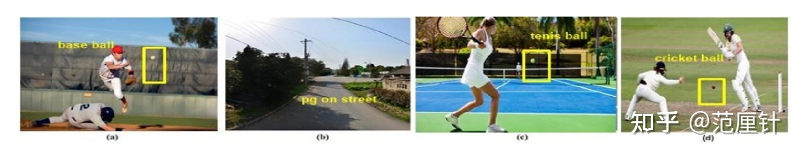

在实际使用中，一般是依据COCO的标准把大小**不大于32x32**或者**占原始图片比例不足0.01**的目标物体定义为一个小目标物体。

## 小目标检测存在的问题

1. **可用特征少**。尺度小、分辨率低导致小目标的可用特征很少；并且容易受到环境的干扰，增加检测难度；而在后续的卷积过程中容易消失
2. **定位精度要求高**。同样是偏移十个像素，对小目标的误差是远远大于大尺度、中大尺度目标的；在训练时对小目标进行匹配的anchor框数量会远低于大尺度和中尺度目标，在IOU匹配过程中，如果定位稍微不准，就会被认为是小目标的负样本。
3. **图像中小目标占比小**。每张图片中大多数的目标都比较大；此外在对小目标标注过程中，容易出现人为疏忽导致的遗漏；由于数量不多，导致小目标对于误差是十分敏感的。
4. **样本不均衡**。大多数基于anchor的目标检测算法在训练时，通过固定的阈值判断锚框属于正还是负样本，这个固定的阈值不一定适用于不同尺度的目标。当人为设置的anchor与小目标的gt框差异较大时，大多数anchor框就会被视为负样本，使得小目标正样本远远小于大尺度、中尺度的正样本，最终导致模型偏向于大、中尺度，而忽略小目标。
5. **小目标聚集**。小目标更容易发生聚集现象，当小目标聚集时，通过多次下采样后，临近的区域在特征图上就会变成一个点，导致很模型无法识别；此外，邻近的小目标还可能会被nms后处理过滤掉，导致漏检；如果邻近区域的小目标之间边界框距离过近，会导致边界框很难回归。
6. **外部干扰**。除分辨率低、尺度小之外，可能会融入了其他光照、噪声、遮挡的因素，导致它们的特征质量差，模型在学习上变得困难。

## 解决方法（tricks）

物体的特征对于分类和定位尤其重要，小目标容易受到外部干扰，最终会严重阻碍后续检测。因此方法有：

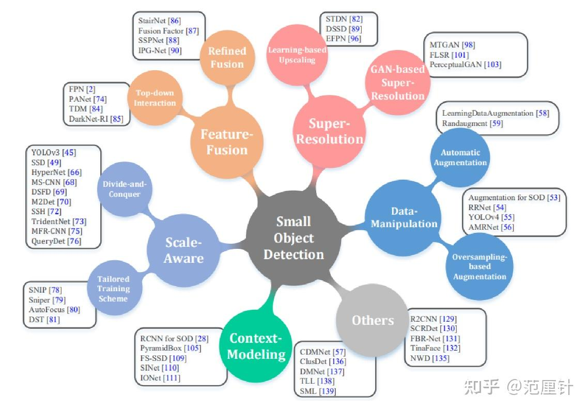

### 提高图像分辨率

非常小的物体它的边界框可能只包含几个像素，因此提高图像分辨率可以增加小目标的特征丰富度，达到立竿见影的效果。

### 提高模型的输入大小

有了更高分辨率的图像后，就可以增大网络的输入大小，当然这也会导致模型的推理速度变慢。

### 平铺图像

介于正常图像中小目标的个数占比较少，样本占比相对较低的问题，可以通过平铺图像在原本图像中增加小目标的个数，提高小目标的样本数，使得网络在训练时能够学习到更多小样本目标的特征。

### 预设anchor框

像yolov5自动学习anchor框，针对这些小目标，生成更符合当前任务的anchor框。

### 修改Anchor框尺寸

通过修改anchor的尺寸来生成更加拟合小目标的anchor。最简单的方式是根据自己的小目标数据集生成合适的anchor尺寸。

生成anchor的算法会现在主干网络的所有输出特征图上生成不同尺寸的anchor，然后根据anchor预测其中是否含有目标物以及真实物体和anchor框的偏移

### 修改Anchor数量

针对数据集中物体的大小变化范围较大的情况，不仅可以通过调节anchor的尺寸提高所有物体的分类和定位精确度，还可以适当增加anchor的个数，使得其实现多尺度匹配。

### 图像分块

与医学图像处理想法相似，可以在预处理时对图像进行分块，从而有效地放大小目标，但是这也要求了模型要适应小分辨率的输入。这种做法也可以提高单个块推理的速度。而其缺点是因为要推理多个块，单张图像分块后FPS会降低；此外在推理时也要对图像进行分块操作。

### 数据增强

利用数据增强从原生的数据集基础上生成新的图像，如：随机裁剪、随机旋转和mosaic。这对于小目标来说**特别有用**，一定程度上也可以防止模型在训练集上过拟合。

### 重新定义类别

过滤无关类别、合理划分类别是提高数据集质量的重要技术。如果一个类和另一个类明显重叠，那么就可以考虑删掉这个类，这样不管是在训练阶段还是推理阶段，都可以减少一个类别的开支。

### 结合其他信息

对于视频中的小目标检测，可以结合上下文如环境信息或者其易检测物体之间的关系辅助小目标检测，本质上是解决小目标自身可用特征少的问题。或者可以结合上下帧的信息进行预测。

### 其他

* Focal loss，是模型更关注困难、不平衡的样本；
* 引入FPN、使用GAN生成更大分辨率的目标

## 遥感、航空目标检测存在的问题

针对在航空图像中目标以任意方向显示、呈密集排列，在基于anchor的两阶段检测器通常在正负anchor框之间遭受严重的不平衡问题。针对这一科学问题，可以将基于水平关键点的对象检测器扩展到定向对象检测任务，具体为：先检测目标的中心关键点，然后根据该中心关键点去回归框边界感知向量（BBAVectors）以捕获定向的边界框。

针对各种比例和任意角度，在航空图像中需要很多的预定义anchor，十分耗时。针对这一问题，可以使用单阶段anchor-free的方法，逐像素预测方式检测定向目标，通过预测目标的轴线来检测任意定向的目标，该轴线是连接目标头部和尾部的线并且垂直于目标的宽度。

针对目标分布密集、角度任意、小目标特征少的难点，在遥感图像检测领域会出现小目标漏检的现象。针对这一科学问题，可以综合以下三个方式去解决：1.引入频率域通道注意力，通过更多的频率分量来充分利用特征信息；2.修改网络输入尺寸为大尺寸（如：1024*1024）来提高对小目标检测的性能；3.引入圆形平滑标签计算角度损失，以分类的形式解决角度的回归问题。

针对非轴对准、复杂的环境，？？？？

遥感图像中，杂乱分布的目标会因目标时而密集时而稀疏的分布导致难以提取特征信息，小目标多次下采样后会出现特征消失，遥感图像目标检测会因此出现分布密集和分布稀疏的小目标漏检的现象，因此如何精确检测遥感图像中的密集和稀疏分布的小目标是一个科学问题。针对这一问题，可以综合以下两种方式解决：

引入并针对性的改进特征金字塔网络（FPN）结构，使得网络结构对小目标更加敏感，提高网络的多尺度特征提取能力。同时使用图像拼接的手段，如mosaic的拼接方式，混合多张具有不同语义信息的图片，增强模型的鲁棒性，极大程度上改善小目标分布不均匀的情况，并且由于拼接的随机性，随着训练时间的加长，改善效果会越明显。

选取合适的提取featuremap的网络结构（Backbone + Neck）,使得模型满足单个图像中检测多个不同尺度多个对象的能力，既保证了丰富的浅层位置信息同时保证深层的语义信息。

采用多尺度特征融合结构（SPP、PANet），扩大感受野、加强网络的特征提取能力。将语义分割融入目标检测中、使用空洞卷积以增大感受野、通道注意力机制弱化背景信息，最终减少背景中的大量噪声，

1.引入频率域通道注意力，通过更多的频率分量来充分利用特征信息；2.修改网络输入尺寸为大尺寸来提高对小目标检测的性能。

数据规模小，考虑数据增强

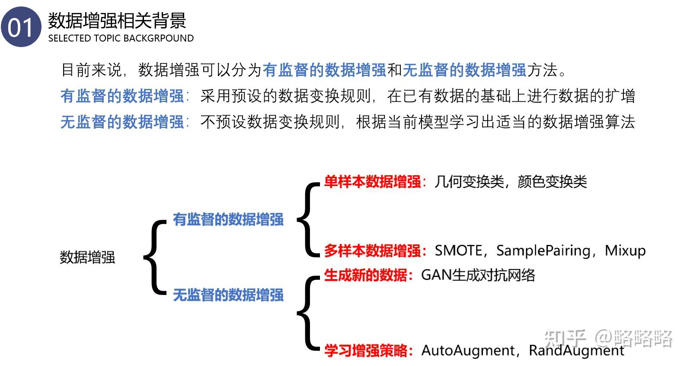

# 高质量论文

## Instance Segmentation under Occlusions via Location-aware Copy-Paste Data Augmentation

基于竞赛介绍 MMSport 2023全球分割竞赛冠军方案

日期：2023年10月27日

代码：**https://github.com/nguyendinhson-kaist/MMSports23-Seg-AutoID**

### 导读

本文的背景是ACM MMSports 2023 DeepSportRadar 竞赛，该比赛中公开了一个开源数据集，专注于在篮球场景中对人体进行分割，并引入了一种专门用于遮挡场景的评估指标。该数据集规模较小，其中要分割的对象具有高度可变的特性，因此需要用强大的数据增强技术和合适的深度学习框架。

本文工作：

+ 首次提出了一种新的数据增强技术，能够生成更广泛分布的训练样本；
+ 采用新的深度学习架构——混合任务级联（Hybrid Task Cascade, HTC）框架，并使用 CBNetV2 作为骨干网络和MaskIoU头来提高分割性能；
+ 采用随机权重平均（Stochastic Weight Averaging, SWA）的训练策略来提升模型的泛化能力。

最终，在竞赛数据集上实现了显著的遮挡分数（OM）为0.533，占据了排行榜第一。

**实例分割背景：**

示例分割常用在自动驾驶、医学图像分析和体育分析等领域。示例分割一开始使用的是Mask R-CNN，后面从ViT出来后衍生出MaskFormer 为代表的系列模型，其可以通过注意力机制从图像中获得丰富且有意义的特征表示。

示例分割面临的两个主要挑战：

+ 识别由于因素（如姿势或角度）改变而导致的物体形状变化（变形）；
+ 识别部分或完全隐藏在其他物体后面的物体（遮挡）。

这不仅在实例分割中存在，还在相关领域如目标检测和图像分类中出现。此外，传统的COCO度量指标依赖于IoU（交并比）值，用于比较模型预测与真实值在目标检测和分割任务中的一致性。然而，这些度量标准可能不足以满足遮挡场景下模型性能的评估需求。

为了应对这一问题，ACM MMSports 2023竞赛引入了一种新颖的专门用于遮挡场景的评估指标，称为遮挡度量（OM）。OM指标主要关注由于遮挡而部分可见的示例，由GT标注验证。OM指标强调重新连接遮挡像素。该指标通过两个组成部分的乘积来计算，即遮挡实例召回（OIR），用于测量视觉上分割的实例的召回率；断开像素召回（DPR），用于评估与这些分割实例的主要结构分离的像素的召回率。

### 正文

#### 数据增强策略

在本研究中，除了传统的几何和光度变换（如平移、旋转或颜色扰动）之外，还引入了一种专门的复制粘贴数据增强技术，示意图如下。

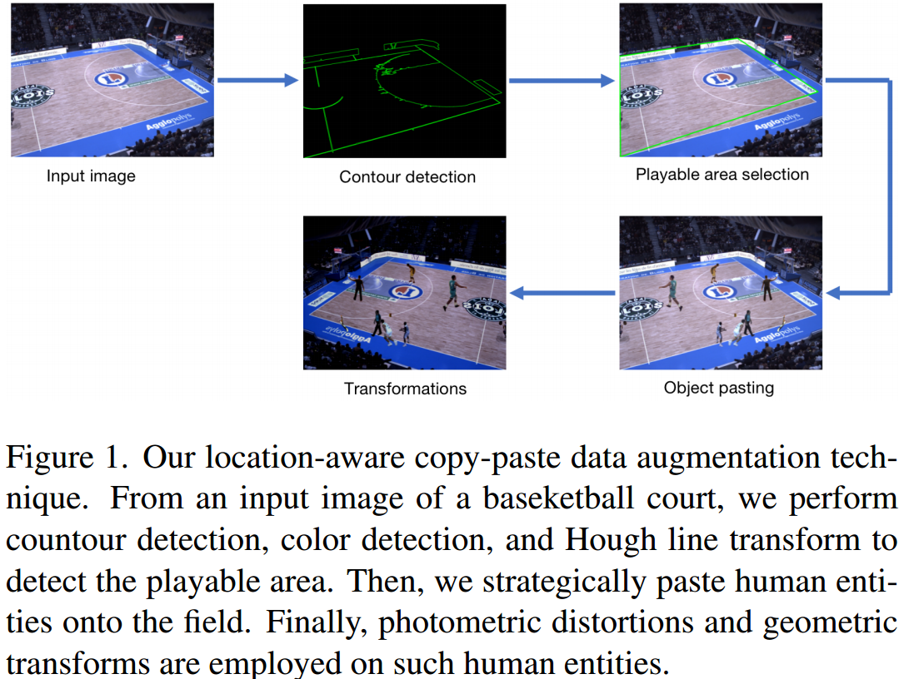

在这里，作者将数据集中的真实实例（人体对象或篮球球员）称为“entities”（实体），为了准确地定位和粘贴这些实体在球场上，作者构建了一个自定义的篮球场检测器。这个检测器利用传统的计算机视觉技术，如轮廓检测、颜色检测和霍夫线变换，准确绘制出篮球场的边界。然后，将实体随机黏贴到检测到检测到的可播放区域内的坐标上。如果篮球场检测器出现故障或无法准确识别边界，将使用以下默认坐标粘贴实体：

+ 对于拍摄篮球场左侧的图像，$0 \le x_{min} \le w-\frac{w}{5}  $；
+ 对于拍摄篮球场右侧的图像，$\frac {w}{5} \le x_{min} \le w$。

其中，w和h分别表示输入图像的宽度和高度，$(x_{min},y_{min})$表示要粘贴的实体的坐标。

在这种新颖的复制黏贴方法中，作者使用训练样本的GT分割掩码从中提取实体。每个训练图像有80%的概率在篮球场区域内粘贴附加实体。粘贴的实体数量是随机的，但在实践中受到最多40名球员的限制。

在复制粘贴后，作者还应用了一个遮挡模块。即一旦粘贴了一个实体，这个模块将有70%的概率在初始实体的左上象限上叠加另一个实体，从而模拟出在训练集中观察到的显示遮挡情景。这种方法有助于训练模型更好地处理遮挡情况。

#### 模型设计

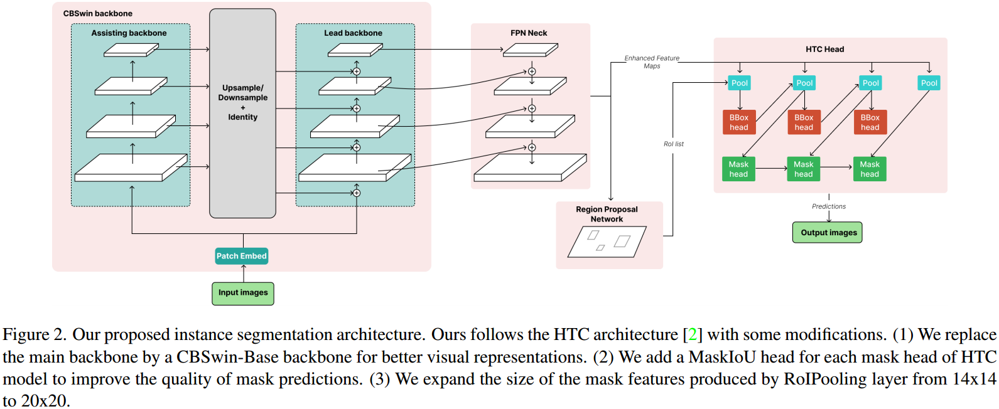

作者选择混合任务级联（Hybrid Task Cascade，HTC）作为他们的主要模型架构。与传统的使用ResNet骨干网络不同，本文使用CBSwin-Base骨干网络，并结合一个名为CB-FPN的特征金字塔网络。这个选择充分权衡了模型大小和可用训练资源。这意味着本文使用了更轻量级的骨干网络，以便在有限的训练资源下提高模型性能。

此外，还采用了MaskIoU头部来帮助模型学习生成高质量的分割掩码，与传统的方法不同，传统方法通常将置信度分数与分类头部共享。在遮挡场景的情况下，分割掩码的质量至关重要，因此他们选择增强分割掩码预测。为实现这一目标，本文将ROIPoolIng层提取的掩码特征大小从14×14扩展到20×20。这个修改不仅提高了掩码质量，还帮助模型在严重遮挡的情况下重建物体的细节。

#### 训练策略

本文从零开始（即没有预训练权重）训练和评估他们的模型。在训练之前，需要准备被复制粘贴的算法粘贴的对象。因此，作者从训练数据中提取了所有人体实例以及它们相应的掩码注释和剪裁后的图像，然后保存在本地。

在数据增强过程中，复制粘贴算法会随机选择候选对象并为每个对象定义粘贴区域。完成复制粘贴后，它们继续进行其他基本转换的预处理，包括随机调整大小、光度扭曲和几何变换。增强后的图像会进一步被剪裁和填充到固定尺寸，然后输入到模型中进行训练。

为调整模型的超参数，本文将324个训练图像分为两组：260个用于训练，64个用于验证，最终确定最佳的超参数集。为了提高模型的泛化能力，本文还采用了随机权重平均（Stochastic Weight Averaging，SWA）的训练策略。具体来说，在主要的训练过程之后，继续训练模型12个额外的时期，并为每个时期保存一个检查点。在SWA训练之后，他们对保存的12个检查带你进行平均以获取最终的权重，然后提交这个模型。

### 实验

#### 训练细节

+ 使用MMDetection工具箱进行模型训练，有助于快速开发过程。
+ 所有实验均在两块NVIDIA A100-SXM4 GPU 上进行，每块GPU配备了40GB的内存。
+ 复制粘贴数据增强之后，图像会被随机调整到以下尺寸之一：(3680, 3080), (3200, 2400), (2680, 2080), (2000, 1400), (1920, 1440), (1800, 1200), (1600, 1024), (1333, 800), (1624, 1234), (2336, 1752), (2456, 2054)。
+ 随后，训练数据会随机应用一系列光度扭曲、几何变换和剪裁操作。
+ 最后，所有图像都会被一致地调整大小和填充到标准分辨率1760×1280。

整个训练过程中，作者使用Adam优化器，带有分离的权重衰减（AdamW）。学习力设置为1e-4，权重衰减配置为2e-2，以防止过拟合。当模型开始收敛时，使用SWA训练策略来对模型进行额外的12个时期的微调。在整个SWA训练过程中，优化器仍然是AdamW，具有固定的学习率1e-4。

在训练过程中，本文调整了掩码头部的损失权重，将其从1.0提高到2.0。这个修改旨在强调模型学习过程中准确掩码生成的重要性。

#### 效果

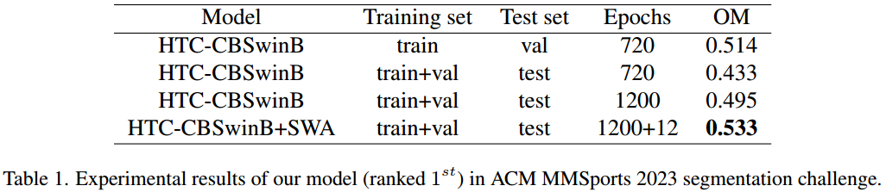

根据以上的训练策略，作者的CBSwin-Base + HTC模型在经过720个时期的训练后，获得0.514的OM（遮挡）分数（见上表）。基于这些结果，并保持相同的配置，对更多样本（即训练集+验证集）进行模型训练。在测试集上的初始尝试中，获得了0.433的OM分数。意识到可以进行更长时间的训练之后，作者决定从上次实验的点回复训练。经过从720个时期延长到1200个时期的训练，作者获得了0.495的OM分数。比之前尝试的提高了0.062分的显著改进。

最终他们利用SWA训练策略获得了0.533的最终OM分数，从而在MMSports 2023挑战中获得了最高分。

### 总结

为解决分割任务中的遮挡问题，作者利用了性能优异的HTC架构，搭载特征提取能力较强的CBSwin-Base骨干网络，并引入了一种新颖的位置感知复制粘贴数据增强技术，可以随意应用于数据稀缺的分割应用。实验结果表明，本文方法在不需要额外数据或预训练的情况下，在测试集上实现了最先进的结果（以0.533的OM得分排名第一）。这突出了所提方法在处理遮挡场景下的显著性能提升，以及在有限的数据条件下实现出色的效果。

## Towards Large-Scale Small Object Detection:Survey and Benchmarks

面向大规模场景的小目标检测：综述和 benchmark

DOI：10.48550/arXiv.2207.14096，2022/07/28

SCI一区

Author：Gong Cheng, Xiang Yuan, Xiwen Yao, Kebing Yan, Qinghua Zeng, Xingxing Xie, and Junwei Han, Fellow, IEEE

Subject：Computer Vision and Pattern Recognition (cs.CV)

### 论文背景

小目标视觉特征较差、噪声较多

小尺寸目标检测的大规模基准测试数据集仍然不够全面

#### 构建数据集

构建了两个大规模小目标检测数据集（SODA），SODA-D和SODA-A，分别关注驾驶场景和空中场景。

* SODA-D包括24704张高质量交通图像和9个类别的277596个实例。
* SODA-A收集了2510张高分辨率航空图像，并在9个类中注释了800203个实例。SODA数据集是目前为止最大规模的小目标检测数据集，数据集和代码将会在：[https://**shaunyuan22.github.io/S**ODA/](https://link.zhihu.com/?target=https%3A//shaunyuan22.github.io/SODA/)上公布

### 应用背景

小目标检测在监控、无人机场景分析、行人检测、自主驾驶交通标志检测等各种场景中具有重要的理论和现实意义。

目前，在通用目标检测方面有实质性进展，但小目标检测的研究进展相对缓慢，即使是在SOTA网络，在检测小目标和正常尺寸目标方面也存在显著差异。

以DyHead为例，DyHead在COCO数据集上小目标的平均精度（map）度量仅为28.3%，显著落后于中大型目标（分别为50.3%和57.5%）。本文认为性能下降有两个原因：

1. 从小目标的有限和扭曲信息中学习适当表征存在固有的困难
2. 缺乏用于小目标检测的大规模数据集

### 主要贡献

发布了两个用于小目标检测的大规模基准，其中第一个专用于驾驶场景，另一个专用于空中场景。

### 小目标检测基础回顾

#### 问题定义

术语“微小”和“小”通常由面积阈值或长度阈值定义，以COCO为例，面积小于等于1024像素的对象属于小目标，考虑到目前为止没有关于小对象的统一和明确的定义，除非另有规定，在本论文中遵循原始文件中关于这些微小术语的表达。

#### 主要挑战

* **目标信息丢失**
  特征提取器通常利用**子采样**操作来过滤噪声，并**降低特征图的空间分辨率**，从而不可避免地丢失目标信息。考虑到**最终特征仍然保留了足够的信息**，这种信息丢失在一定程度上几乎不会影响大中型对象的性能。然而这对小目标来说是致命的，因为检测头很难在高度结构化的表示上给出准确预测，在这种表示中，小物体的微弱信号几乎被消除。
* **噪声特征表示**
  判别特征对于分类和定位任务都至关重要，小物体通常分辨率低，外观质量差，因此很难从其扭曲的结构中进行区分学习。同时，小对象的区域特征容易受到背景和其他情况的污染，从而进一步将噪声引入学习表示。综上所述，小目标的特征表示容易受到噪声的影响，阻碍后续检测。
* **边界框扰动的低容忍度**
  定位作为检测的主要任务之一，在大多数检测范式中被表述为回归问题，其中定位分支被设计为输出边界框偏移，通常采用联合交集（IoU）度量来评估精度。然而，**定位小对象比定位大对象更困难**。如下图所示，与中大型对象（56.6%和71.8%）相比，小对象预测框的微小偏差（沿对角线方向的6个像素）导致IoU显著下降（从100%降至32.5%）。同时，更大的差异（例如，12像素）进一步加剧了这种情况，对于小对象，IoU下降到可怜的8.7%。也就是说，与较大的对象相比，小对象对box扰动的容忍度较低，从而加剧了回归分支的学习。

  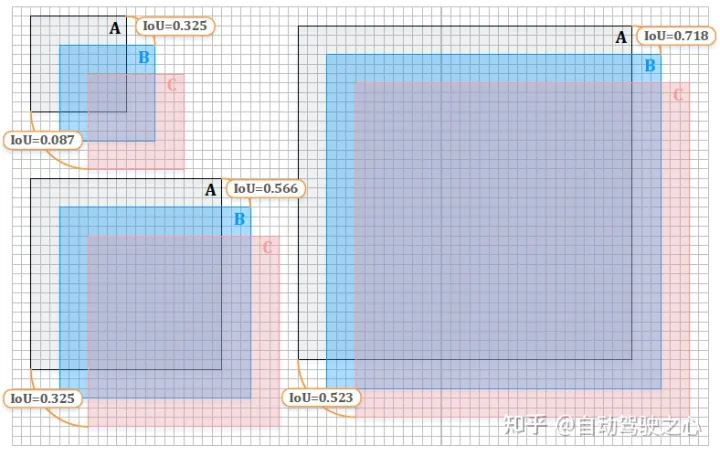

#### 小目标检测范式和方法

##### 数据增强方式

1. 基于重/过采样的方法
2. 自动增强方案

##### 尺度感知方法

1. 分而治之的多尺度检测
2. 自适应定制的训练方案

##### 特征融合方式

1. 自上而下的信息交互
2. 精细特征融合

##### 超分辨率方法

1. 基于学习的尺度扩充
2. 基于GAN的超分辨率框架

##### 上下文建模方法

人类可以有效地利用环境和物体之间的关系或物体之间的相互关系来促进物体和场景的识别。这种捕捉语义或空间关联的先验知识称为上下文，它将证据或线索传递到目标区域之外。上下文信息不仅在人类的视觉系统中至关重要，在场景理解任务中也至关重要。

##### **其它方法**

1. Attention-based methods
2. Localization-driven optimization
3. Density analysis guided detection


### 小目标检测数据集

前并没有大规模的小目标检测基线数据集，现开源的主要包括：COCO、WiderFace、TinyPerson、TT100K、DOTA，各个数据集的图像规模和实例规模如下图所示：

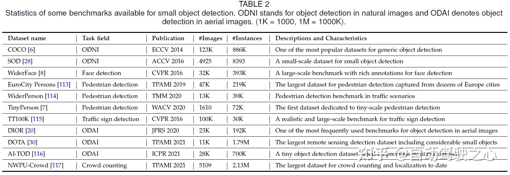

### BENCHMARKS

论文在自动驾驶和遥感图像上展开处理

#### SODA-D数据集

主要来自MVD、自采集和互联网。

* MVD：是一个用于街道场景语义理解的大规模数据集，其中25000张高质量图像是从道路上采集的景观、公路、农村和越野场景。MVD具有高质量和高分辨率特性，可以获得具有清晰视觉结构的有价值实例
* 自采集：使用车载摄像机和手机收集中国几个城市的典型驾驶场景的图像，包括北京、深圳、上海、青岛、广州等。此外，还通过在图像搜索引擎（谷歌、必应、百度等）上搜索关键字来抓取图像。最后获得了30126张交通场景的原始图像。

SODA-D优点：丰富性高、分辨率高、忽略非忽略标记

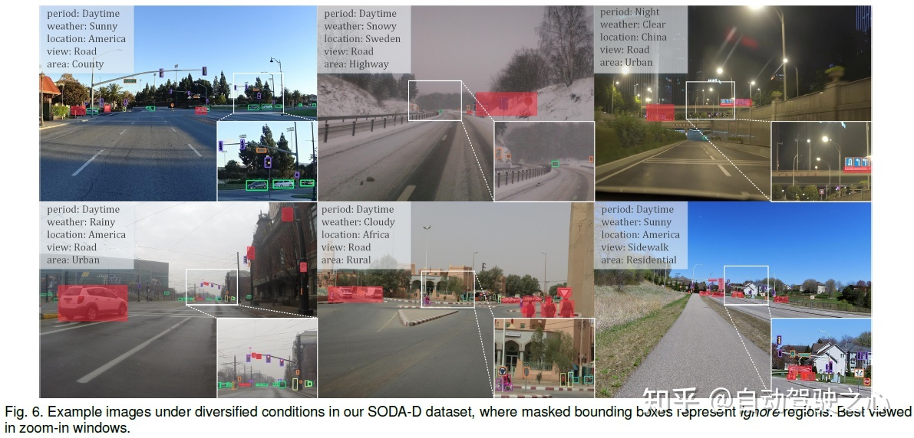

#### SODA-A数据集

Google Earth2被用于为SODA-A收集图像，从专家建议的全球数百个城市中提取了2976张图像。

SODA-A中的图像具有相对较高的分辨率，其中大多数图像的分辨率大于4700×2700，能够获得更精细的细节和足够的上下文，这对小对象检测具有重要意义。

优点：密度变化大、各种方向、地点丰富！


#### 对比

SODA-D数据集和SODA-A数据集对比如下图：

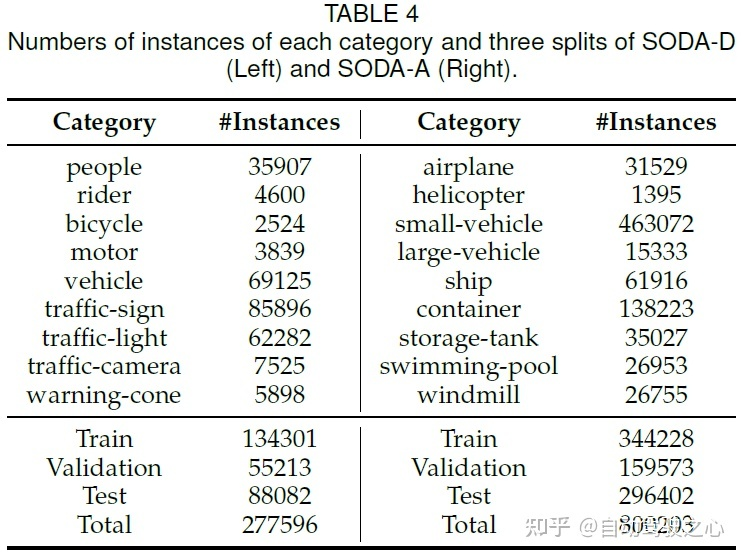

可视化如下图：

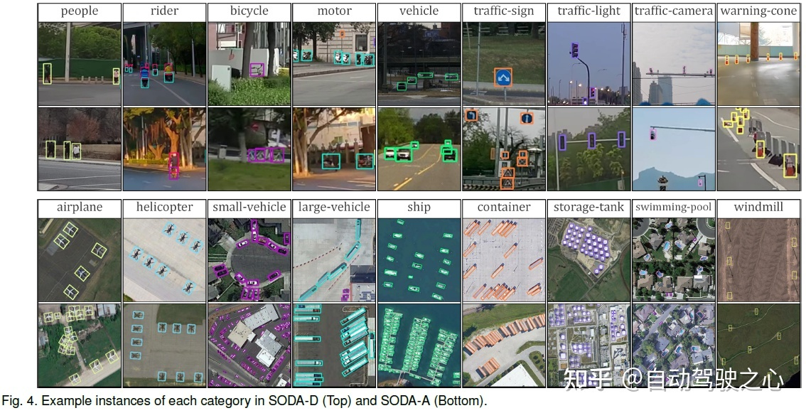

分别与其它数据的数量、类别对比：

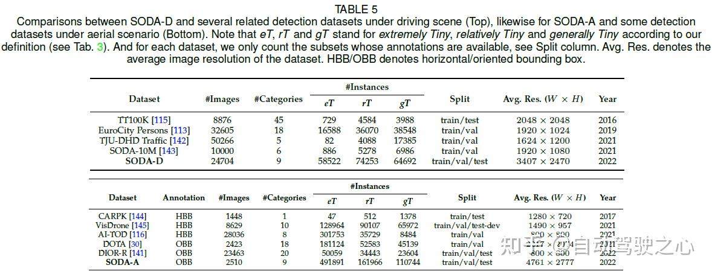

### 实验

将几种常见的方法在SODA数据集上进行了实验对比

#### SODA-A自动驾驶场景

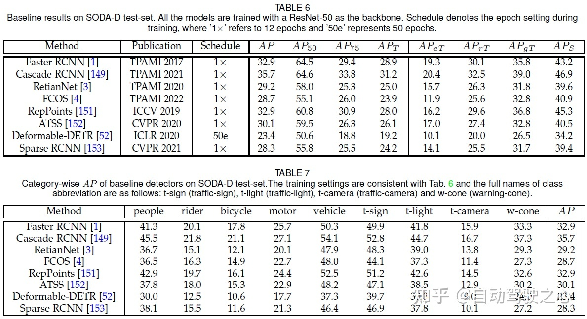

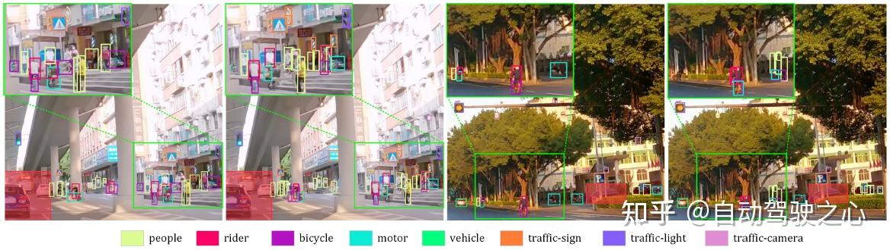

#### SODA-D遥感场景

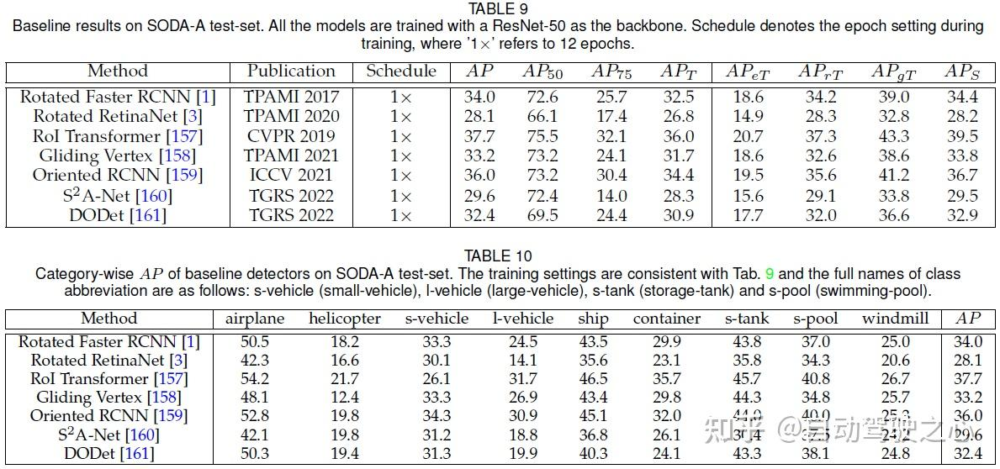

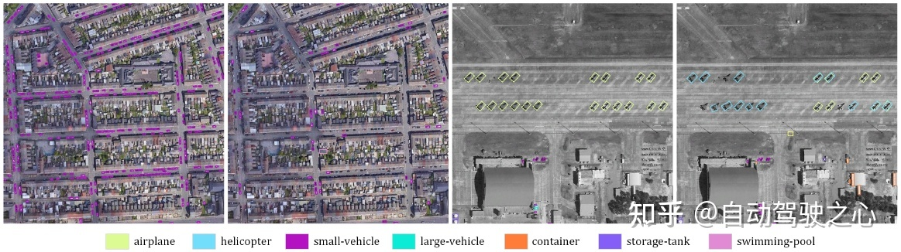

### 总结

注释良好的数据集可以作为各种小目标检测方法提供基准测试的平台。

潜在解决方案和未来发展方向：

* 较深的主干网络可能不利于提取小对象的高质量特征表示，设计一个有效的backbone具有强大的特征提取能力，同时避免高计算成本和信息丢失，这一点至关重要。
* FPN是小目标检测中不可或缺的一部分。当前的特征金字塔架构对于小目标检测来说并不理想，因为其顶层是冗余的且未使用启发式金字塔级分配策略
* 在低层特征图上进行检测会带来沉重的计算负担，因此，对小目标检测任务量身定制的高效分层特征架构的需求很高。

## Generalized Intersection over Union: A Metric and A Loss for Bounding Box Regression

CVPR2019

### 摘要

1. 提出GIOU，作为比较任意两个形状的新度量。
2. 提出GIOU作为两个轴线对齐的矩形或generally n-orthotopes的损失的解决方法。、
3. 将GIOU用在Faster R-CNN、Mask R-CNN 和YOLOv3中，有着显著的提升。

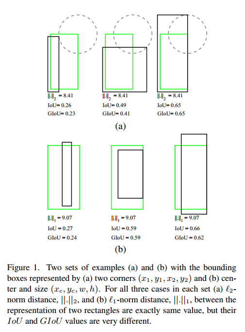

> L1、L2、$smoothL1$在计算bbox loss时，都是独立求出4个点的loss，然后相加。

论文前半段概要中一直在强调轴线对齐的矩形的相似度计算，以及是否可以被用于损失计算：轴线对齐的矩形，指的就是目标检测常规情况下目标框预测框（即非其他形状，非旋转情况）。

### Generalized Intersection over Union

IOU具有对称性、非负性、同一性、三角不等性，此外还具有尺度不变性（IOU反应的是两个检测框交集和并集的比例，和检测框大小无关）

> 四种性质是什么意思？

对于任意的两个凸形，找到一个能够包围这两个凸形的最小包围框，这个包围框也可以是这种类型的凸形（如两个椭圆的最小包围框）。然后用以下方法计算GIOU。

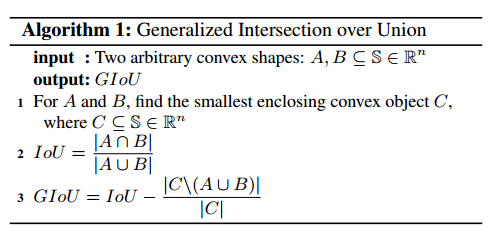

GIOU作为新的指标具有以下属性：

1. GIOU也具有度量的所有属性：对称性、非负性、同一性、三角不等性。
2. 尺度不变性。
3. GIOU始终是IOU的下限，即：对于所有的$\forall A,B\subseteq \mathbb{S}, GIoU(A, B) ≤ IoU(A, B)$，当A和B有更强的相似性和接近性时，两者更接近。即：$\lim_{A \to B} GIoU(A, B) =IoU(A, B)$。
4. GIOU的取值是一个对称的范围，即：$\forall A,B\subseteq \mathbb{S}, -1 \le GIoU(A, B) \le 1$。当两个框完全重叠时，GIOU=IOU=1。当$\lim_{\frac{\left | A \cup B \right | }{\left |C \right |}  \to 0} GIOU(A,B)=-1$。

我们可以轻易地推导出GIOU的解析解，并将其应用为度量和损失。

### GIoU as Loss for Bounding Box Regression

然而计算两个任意形状之间的交叉点和最小封闭区间还有困难。对于轴线对齐的矩形，解决方法是：分别比较每个顶点的坐标实现。算法如下图：

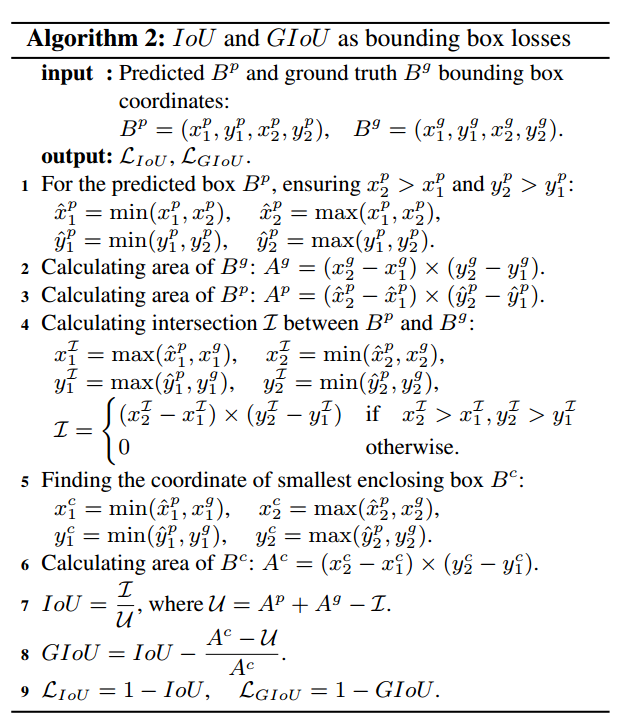

min、max和分段线性函数（Relu）在反向传播中可以正常使用，因此IOU和GIOU可以作为优化目标检测神经网络的损失。在这种情况下，我们可以直接将度量作为损失进行优化，这是最好的优化选择。

GIOU和IOU有很强的相关性，尤其是在高IOU的情况下。从两个2D矩形的参数中获取超过1万个随机样本，其中GIOU和IOU的关系如下：

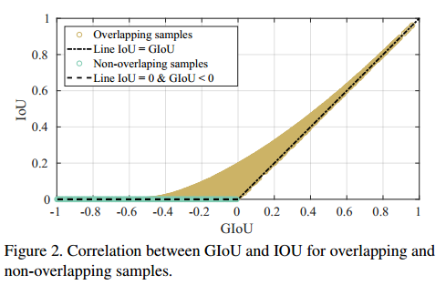

从中可以观察到，在低重叠的情况下（如：IoU≤0.2且GIoU≤0.2），与IOU相比，GIOU有机会发生更大的变化。因此，与IOU相比，GIOU可能在任何可能的状态下具有更陡峭的梯度。

> 如何看出梯度更陡峭？

**损失稳定性证明**

1. 通过简单的数学推导，IOU和GIOU损失都是有界的。
2. 当IOU=0，即预测框与真实框不重叠时，$\mathfrak{L} _{GIoU}=1+\frac{A^c- \mathcal{U} }{A^c} =2-\frac{\mathcal{U}}{A^c}$，此时最小化损失就是最大化$\frac{\mathcal{U}}{A^c}$。进一步的就是最小化最小包围框C的面积、最大化真实框与预测框并集面积。最终会使得预测框移动到与真实框相交。

### 实验

使用的数据集：PASCAL VOC 2007、MS COCO

#### YOLOv3实验

原始损失用的是L2范式

在PASCAL VOC 2007上的实验：

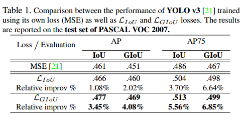

在MS COCO上实验，88%的验证集用于训练，12%的验证集用于生成对比结果。

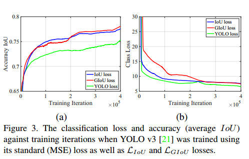

在定位精准度方面，GIOU有着明显的提高。然而，通过对当前正则化参数的朴素调整、在分类损失方面，GIOU与基线相比并没有太大提高。这主要是因为基于AP的性能度量受小分类误差的影响很大，这个问题可以通过寻找更好的正则化参数来进一步改善结果。

#### Faster R-CNN and Mask R-CNN实验

原始损失用的是L1范式。

在最后的边界框细化阶段用IOU损失和GIOU损失替换了L1范式。与YOLO v3实验类似，我们进行了最小的努力来针对其他损失正则化新的回归损失。对于所有实验，我们简单地将LIOU和LGIOU损失乘以10倍。

> 为什么是边界框细化阶段，其他时候不替换么？针对其他损失正则化新的回归损失？

在PASCAL VOC 2007上的实验。（该数据集没有可用的实例掩码批注，因此不在Mask R-CNN）

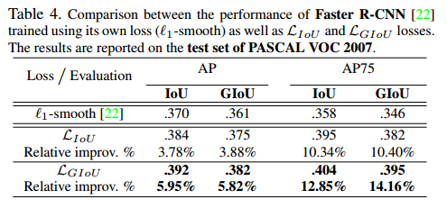

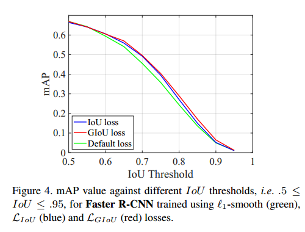

Faster R-CNN在MS COCO上实验：


其中表6是将最佳模型上传到COCO服务器，在MS COCO2018挑战赛上的结果。

Mask R-CNN在MS COCO上实验：

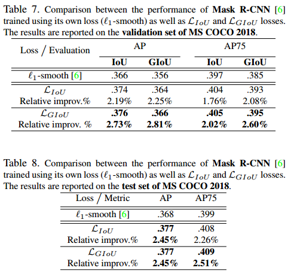

其中表8是将最佳模型上传到COCO服务器，在MS COCO2018挑战赛上的结果。

这两个在COCO上的实验和之前的实验结果对比，可以发现，在Faster R-CNN、Mask R-CNN上的提升不如YOLOv3上的显著。这可能是由以下两个原因造成的：

1. 在Faster R-CNN、Mask R-CNN上的预选锚框比在YOLOv3中的更多、更密集，这就导致了GIOU具有相对优势的情况减少（比如：不重叠的边界框）。
2. 在VOC上的实验对边界框正则化参数进行了简单的调整，导致在MS COCO数据集上产生了次优的结果。

以上几个实验可视化如下：

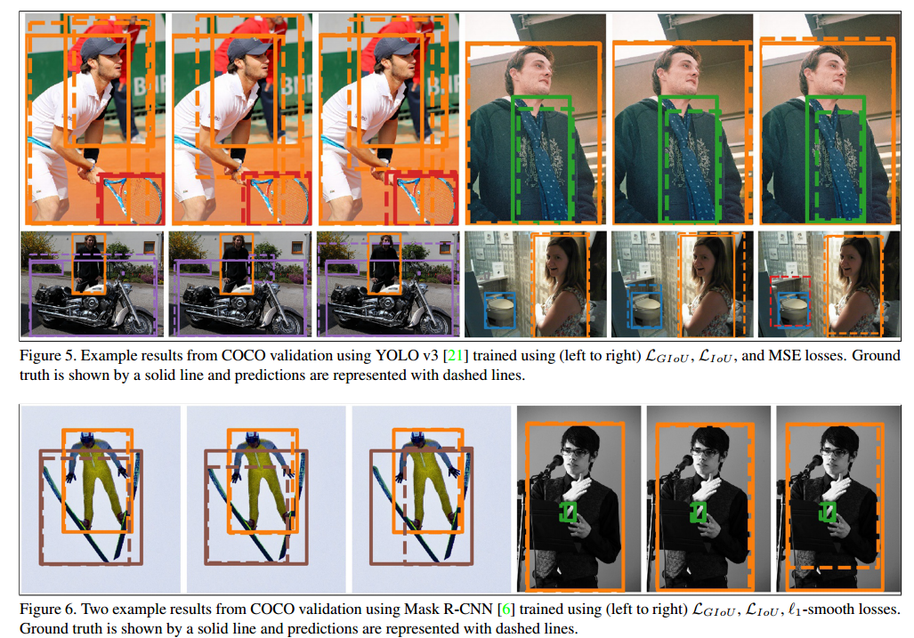

### 总结

本文提出了一个新的IOU作为度量，称其为GIOU，将其用于比较任意两个形状。GIOU有着IOU的所有优点，还解决了IOU的缺点。

本文还对两个轴对齐矩形之间的GIOU计算进行解析。本文证明了可以计算GIOU作为距离的倒数，并可以将其用作边界框回归损失。本文使用最常用的性能指标和本文新提出的准确性指标（基于GIOU的平均精度），在不同数据集上测试，证明了GIOU的优越性。

由于度量的最佳损失是度量本身，因此GIOU可以用到所有需要2D边界框回归的边界框优化损失中去。

在未来，我们计划研究在两个旋转矩形长方体的情况下推导GIOU解析解的可行性。在这方面的扩展以及将其作为损失，对于提高3D目标检测的性能有很大的潜力。

> 可以计算GIOU作为距离的倒数,，什么意思? 度量的最佳损失是度量本身，什么意思？

## Distance-IoU Loss: Faster and Better Learning for Bounding Box Regression

2019年11月

AAAI 2020

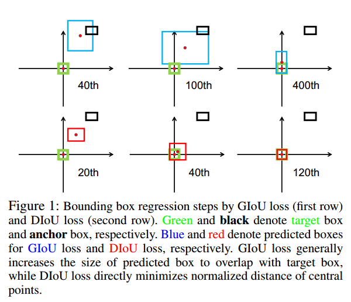


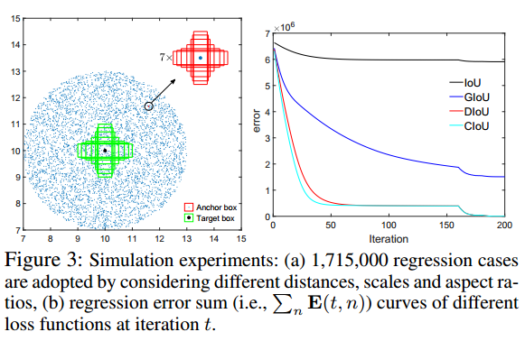

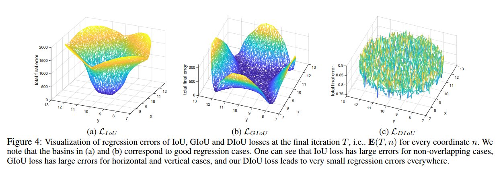

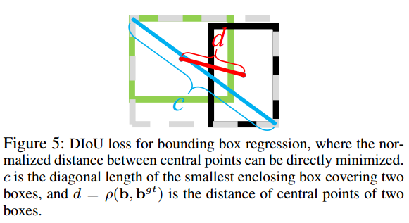

> 问题：如何理解在不重叠的情况下，对重叠面积因子给予较高的优先级？

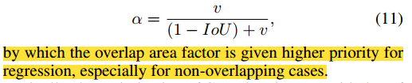

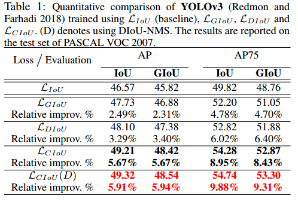

> AP下边的IoU和GIoU是什么？
>
> 计算map时判断预测框预测是否正确时使用的计算方法，如@0.5表示：当预测框与真实框的GIOU大于0.5，认为预测正确，然后再去计算map。

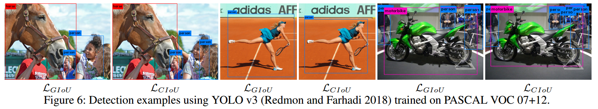

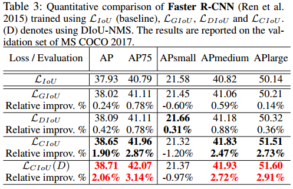

CIOU在小目标检测效果变差的原因：the consistency of aspect ratio may not contribute to the regression accuracy for small objects. for small objects, the central point distance is more important than aspect ratio for regression, and the aspect ratio may weaken the effect of normalized distance between the two boxes.

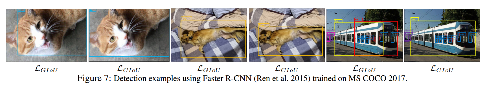

## Focal Loss for Dense Object Detection

EI检索

2017年何恺明团队

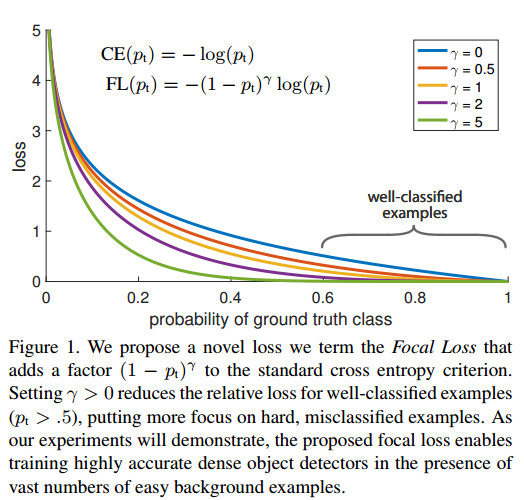

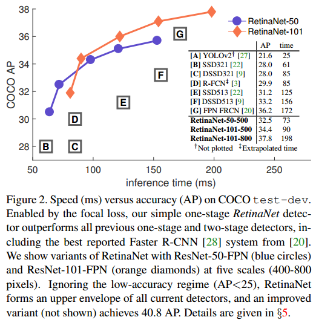

hard examples：examples with large errors

easy examples： inliers

错误分类且p很小，举例如下：

| 预测        | 真实       | 是否正确 |
| ----------- | ---------- | -------- |
| 0.1 0.2 0.7 | 0 0 1 (猪) | 正确     |
| 0.1 0.7 0.2 | 0 1 0 (狗) | 正确     |
| 0.1 0.4 0.3 | 1 0 0 (猫) | 错误     |

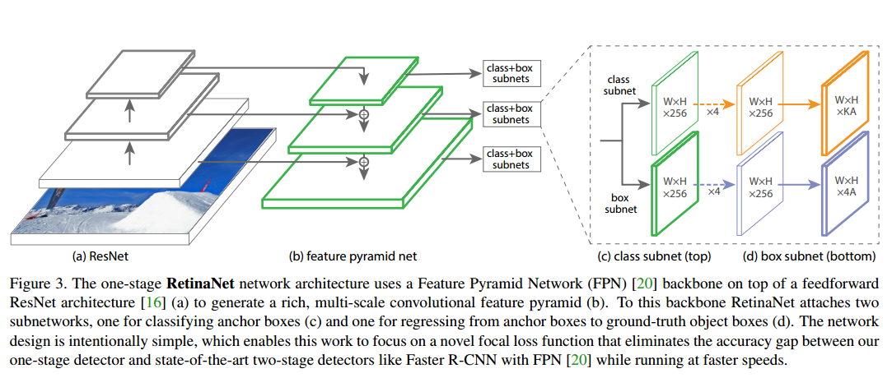

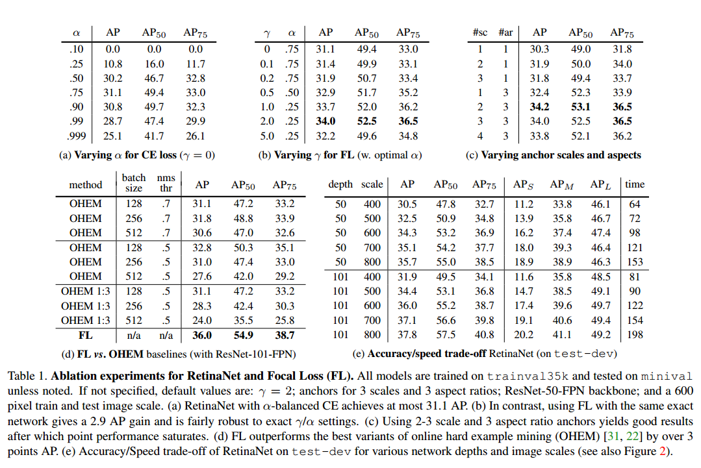

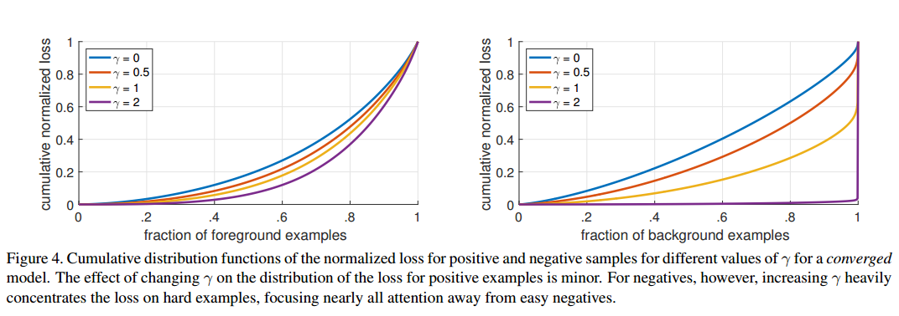

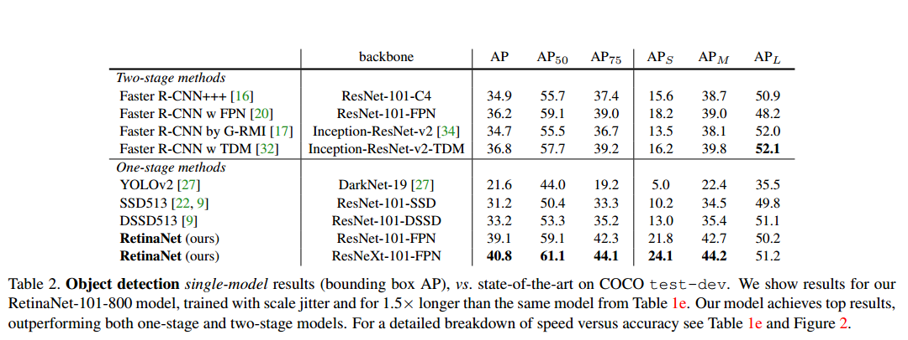

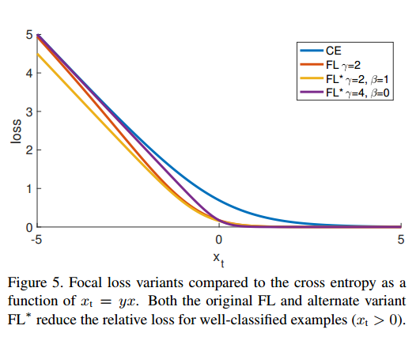

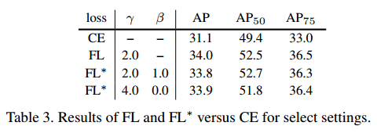

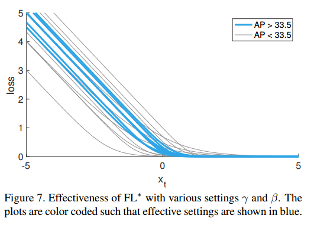

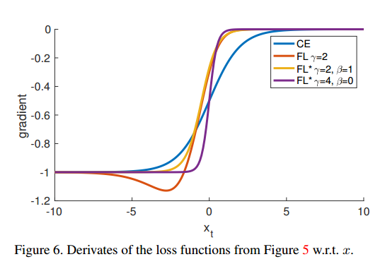

## Focal and Efficient IOU Loss for Accurate Bounding Box Regression

CVPR2020

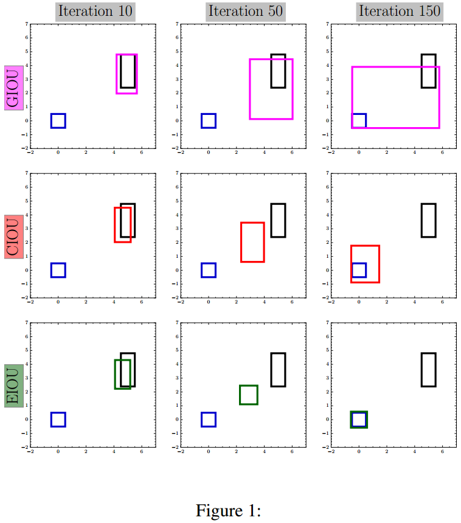

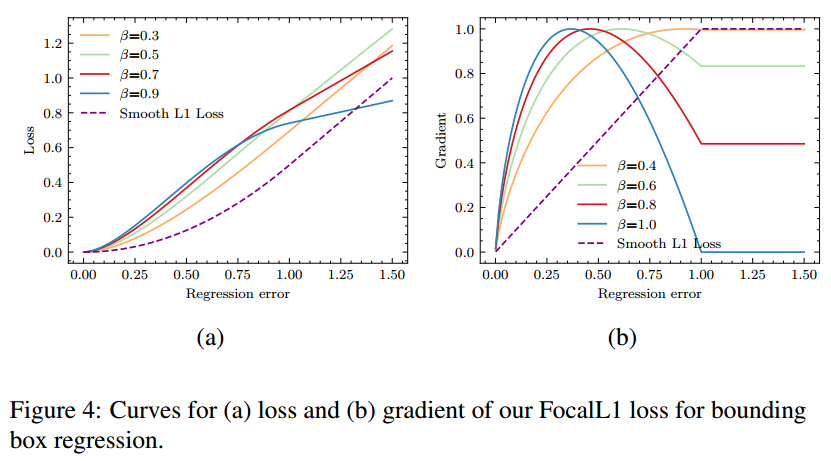

$$
L_{f}(x)=\left\{\begin{array}{ll}-\frac{\alpha x^{2}(2 \ln (\beta x)-1)}{4}, & 0<x \leq 1 ; 1 / e \leq \beta \leq 1, \\-\alpha \ln (\beta) x+C, & x>1 ; 1 / e \leq \beta \leq 1\end{array}\right.
$$

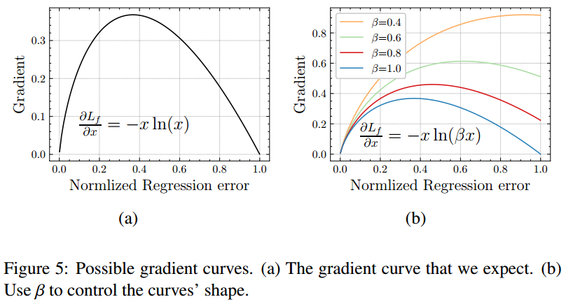

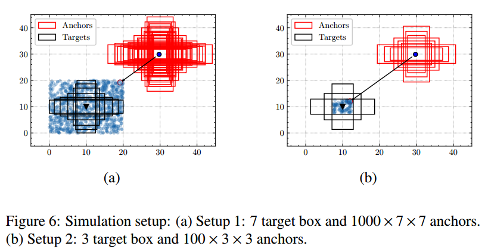

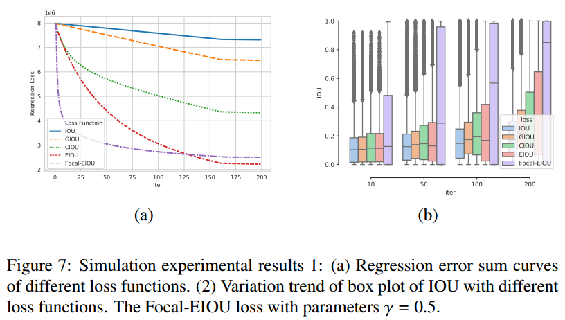


EEM是什么？论文中多次提出

Effective Example Mining，

图9中weight是什么？也多次提出

## Inner-IoU: More Effective Intersection over Union Loss with Auxiliary Bounding Box

### 简介

传统边界框损失函数可以通过向IoU损失函数添加新的几何约束来加速收敛和改进检测性能，但它们没有考虑IoU损失本身的合理性，这决定了检测结果的质量。为了弥补这一不足，作者提出Inner-IoU损失，通过使用辅助边界框来加速回归，而无需添加任何新的损失项。

主要贡献：

+ 作者分析了边界框回归的过程和模式，并根据边界框回归问题的固有特性，提出在模型训练过程中使用较小的辅助边界框计算损失，从而对高IoU样本的回归产生正向效果，而对低IoU样本产生相反效果。
+ 提出了Inner-IoU损失，通过引入比例因子来生成不同尺度的辅助边界框以计算损失。将其应用于现有的IoU可以实现更快和更有效的回归结果。
+ 经过一系列仿真和比较试验，结果表明，该IoU在检测性能和泛化方面优于现有方法，对不同像素大小的数据集，实现了SOTA。

### 正文

#### 边界框回归模式分析


## Revisiting Proposal-based Object Detection


# 基于卷积神经网络的林火烟雾检测

Doi:10.14067/j.cnki.1673-923x.2023.07.002

Author：略

Subject：中南林业科技大学学报

## 摘要

以高时间分辨率国产静止气象卫星 FY-4A 数据为基础，采用卷积神经网络 AlexNet、MobileNet、ResNet 及 Inception-ResNet（IRNet）结构对数据集进行实验分析，采用准确率、精确率、召回率和 Kappa 系数评价模型的总体效果。

利用高时效性 FY-4A 静止气象卫星遥感数据，采用 IRNet 模型进行林火烟雾检测的总体效果最好，能有效地减少卫星监测时的林火漏判和迟判现象，提高对森林火灾的早期监测预警能力。

# 火焰烟雾检测

## 改进 YOLOv5s 的地下车库火焰烟雾检测方法

北大核心

Doi：10.3778/j.issn.1002-8331.2307-0003

### 摘要

现存问题：小目标烟火检测困难、检测精度低、只检测火焰或只检测烟雾、目前算法研究只针对火焰检测而不考虑具体应用背景

所做相关工作：整合火焰烟雾公开数据集以及网络和实地拍摄收集到的地下车库火灾视频图片建立的自制数据集。

创新点：

* 提高检测性能：在yolov5s模型的C3模块中引入了PSA(pyramid squeeze attention)注意力机制，使用ECA(efficient channel attention module)注意力提取模块替换原始注意力提取模块。
* 加强小目标检测能力：RepGFPN(re-parameterized generalized- feature pyramid network)替换掉PANet(path aggregation network)，使得模型充分利用低级空间信息中的小目标特征信息。
* 加强特征融合提取能力：引入新的Fusion模块；引入ELAN(efficient layer aggregation networks)和Rep(re-parameterized)思想重构主干网络中的模块。
* 提高中等质量样本的竞争力、模型泛化能力、检测精度：引入WIoU
* 解决火焰烟雾发生重叠导致漏检：将NMS(nonmaximum suppression)修改为Soft NMS。

### 正文

#### 数据集

在已有公开火灾数据集如 BoWFire Dataset、FIRE-SMOKE-DATASET 的基础上，加入了从网络和实地采集的地下车库火灾图片和视频，两者整合成为检测模型实验使用的数据集。

> 数据集预处理方法：计算图像的直方图值并比较，如果两张图片直方图值一样，则说明图像重复，删除其中的一张。

#### PSA-ECA注意力机制

注意力机制的原理是在增强有用的特征信息的同时，抑制无用的特征信息，从而使模型自适应的关注上下文中的重要区域。

+ SE(squeeze-and-excitation)，优点：可以利用相当低的成本显著提高性能。缺点：忽略了空间信息的重要性，而空间信息对于对象检测任务性能的提升有着重要的作用。
+ BAM（bottlenet attention module）和 CBAM （convolutionalblock attention module）：有效结合空间注意力和通道注意力来丰富注意力图，提高模型性能。但存在两个问题：一个是如何有效地捕获和利用不同尺度特征图的空间信息用以丰富特征空间。另一个是通道或空间注意力只能有效地捕获本地信息，但无法建立长距离通道依赖性。
+ PSA（pyramid squeeze attention）：可以充分提取多尺度空间信息和通道注意力向量中跨维度的重要特征，解决以上两个问题。


步骤1：SPC


通过SPC 可以获得更丰富的输入张量位置信息，同时可以在多尺度上并行对其处理。

其中使用多尺度卷积核来生成不同的空间分辨率和深度，通过压缩输入张量的通道维数可有效提取每个通道特征图上的不同尺度的空间信息。

$$
k_i=2×(i+1)+1\\
G_i=2^{(k_i-1)/2}\\
$$

式中：第i个卷积核大小$k_i$，第i个组大小$G_i$，i=0,1,...,S-1。多尺度特征图$F_i$由下式表示：

$$
F_i=Conv(k_i×k_i,G_i)(X)\\
$$

式中：X为多尺度分组卷积前的特征图。之后将多尺度特征图$F_i$在通道维度上连接特征得到整个多尺度预处理特征图F，其公式如下：

$$
F=Cat([F_0,F_1,...,F_{s-1}])
$$

> 其中每一组中卷积核大小不同，输出的特征图大小不同，其通过修改padding实现大小统一，代码示例如下：
>
> ```
> def __init__(self, inplans, planes, conv_kernels=[3, 5, 7, 9], stride=1, conv_groups=[1, 4, 8, 16]):
>         super(PSAModule, self).__init__()
>         self.conv_1 = conv(inplans, planes//4, kernel_size=conv_kernels[0], padding=conv_kernels[0]//2,
>                             stride=stride, groups=conv_groups[0])
>         self.conv_2 = conv(inplans, planes//4, kernel_size=conv_kernels[1], padding=conv_kernels[1]//2,
>                             stride=stride, groups=conv_groups[1])
>         self.conv_3 = conv(inplans, planes//4, kernel_size=conv_kernels[2], padding=conv_kernels[2]//2,
>                             stride=stride, groups=conv_groups[2])
>         self.conv_4 = conv(inplans, planes//4, kernel_size=conv_kernels[3], padding=conv_kernels[3]//2,
>                             stride=stride, groups=conv_groups[3])
>         self.se = SEWeightModule(planes // 4)
>         self.split_channel = planes // 4
>         self.softmax = nn.Softmax(dim=1)
> ```

步骤2：SE（原PSA中的一部分，本文中对其做了替换）

经过SPC模块之后，为了获得不同尺度注意力权重向量，采用SE权重提取模块提取输出的多尺度特征图中的注意力权重，公式表示为：

$$
Z_i=SEWeight(F_i),i=0,1...S-1
$$

之后将得到的注意力权重拼接并做Softmax处理，实现局部与整体通道注意力间的交互。权重拼接与Softmax处理公式如下：

$$
Z=Z_0\oplus Z_1\oplus ... \oplus Z_{S-1}
$$

$$
att_i=Softmax(Z_i)=\frac{exp(Z_i)}{\sum_{i=0}^{S-1}exp(Z_i) }
$$

其中$\oplus$是concat操作，$Z_i$是$F_i$Z是多尺度注意力权重向量，$att_i$是校准后的权重值。

最后将得到的校准后的多尺度注意力权重值拼接并与之前SPC模块输出的多尺度特征图F逐通道相乘，公式如下：

$$
att=att_0\oplus att_1\oplus ... \oplus att_{S-1}\\
Y_i=F_i\odot att_i,i=1,2,...S-1\\
Out=Cat([Y_0,Y_1,...,Y_{S-1}])
$$

式中：att表示注意力交互后的多尺度通道权重，$\odot$表示逐通道相乘，$Y_i$表示具有获得的多尺度通道关注权重的特征图，Out表示最终具有获得的多尺度通道关注权重的全部特征图。

步骤3：PSA-ECA注意力模块（ECA替换SE）


ECA模块提出者已经证明SE注意力模块中的降维操作会对通道注意力的预测产生负面影响，同时获取所有通道的依赖关系是低效不必要的。因此用ECA替换SE。


首先使用全局平均池化GAP(global average pooling)操作对比其进行空间特征压缩，得到1×1×$C'$的特征图。全局平均池化操作公式如下：

$$
GAP=\frac{1}{H×W}\sum_{j=1}^{H}\sum_{k=1}^{W}F_{i,C'}(j,k)
$$

接着对压缩后的特征图采用1D卷积。其不仅可以使每个通道与相邻层的通道进行信息交互，共享权重，而且还不会像SE权重提取模块中的MLP模块（FC->ReLU->FC->Sigmoid）一样进行降维操作。同时采用1D卷积还减少了参数计算量。

通过1D卷积后，再通过Sigmoid激励函数对其进行处理，得到通道注意力权重向量$Z_i$。公式如下：

$$
Z_i=ECAWeight(F_i),i=0,1...S-1
$$

> 1D卷积指的是在一条线上做卷积，卷积核可以不为1维（在这里使用的卷积核为3）

总结：

+ PSA-ECA模块可以将多尺度空间信息和跨通道注意力集成到每个特征组的块中，在本地和全局通道注意力之间获得更好的信息交互。
+ 本文SPC模块中的S值为4，ECAWeight 模块 1D 卷积核大小设为3，PSA-ECA 模块加在 backbone 中的最后一个 C3 中。修改后的PSAC3模块如下图：

  

#### Neck改进

> PANet在FPN(feature pyramid network)上添加了另一条自上而下的路径用于增强网络的表征能力。FPN已被证明能有效融合多尺度特征，提高网络检测性能。

现存问题：原始YOLOv5s网络中小目标检测困难的原因在于小目标样本的尺寸较小，YOLOv5s的下采样倍数太大，较深的特征图很难学习到小目标的特征信息，这就导致了高级语义信息中包含较少的小目标特征信息，而低级空间信息中的小目标特征信息利用不充分。

因此，为了更加充分的交换利用高级语义信息和低级空间信息，借鉴引入RepGFPN对Neck网络部分的改进，改进后的Neck结构如下图：


改进后的YOLOv5s的Neck结构将相邻的多尺度特征图进行上下采样并拼接，之后通过Fusion模块对拼接后的特征图进行特征融合。

原始YOLOv5s模型中的Fusion使用的是C3模块进行融合，为了进一步增强融合效果，提高网络精度，通过借鉴ELAN和Rep思想，对C3模块进行改进。改进后的Fusion模块结构如下图：


相较于C3模块中的ResX模块和由两个CBS结构串联组成的FC模块，使用本文提出的FC模块可以在**不增加检测速度**的同时利用**多分支训练结构**的优点**增强特征提取融合能力**，进一步提高模型对地下车库烟火的检测精度。

> 为什么Fusion的FC中使用RepConvN+CBS结构而不使用RepConv+CBS结构?
>
> 两者检测精度相近，检测速度相同，而前者去除了恒等映射，模型训练时的层数会有所下降，因此选用前者。

改进后的Neck结构可以细化**融合高层次语义信息和低层次空间特征信息**，**加强对低层次空间特征信息的利用**，**增强特征之间的交互**，有效提高检测网络对地下车库中的小目标火焰和烟雾的检测精度。

#### 卷积模块改进

采用RepConv结构，即在训练时为多分支结构，由一个3×3 卷积、一个 1×1 卷积和一个恒等映射组成，在推理时进行恒等变形，如下图：


引入RepConvN 结构，其是在 RepConv结构的基础上去掉分支中的恒等映射，即Train中最右边的BN这条线。

以上两种结构既可以使得训练效果比采用单一模式训练的效果更好，同时还可以保证推理时的速度不会下降。

本文相关工作：

+ 将YOLOv5s骨干网络中的3×3卷积块替换为RepConvN结构。
+ 将YOLOv5s骨干网络中的C3模块引入Rep和ELAN的思想，改进为RepC3模块，如下图

  

改进后的主干网络在不降低推理速度的前提下，有效增强了特征提取能力，使模型可以更好的提取输入特征图中的火焰和烟雾的特征信息。

#### 改进后的整体网络结构图


#### 损失函数改进

yolov5损失函数主要由三部分组成：边界框损失、定位损失以及置信度损失。但在Zhang等人的研究中，提出了CIoU中长宽比的加入不太合理，回归样本中回归质量太好或太坏都对回归损失有害的观点。

针对以上两个问题，研究者们设计了Focal EIoU。而在WIoU中，同样解决了以上两个问题，同时还解决了Focal EIoU v1中的非单调静态聚集机制的潜力没有被充分利用的问题。

WIoU共有三个版本，其中WIoU v3实验效果最好。其损失函数公式如下：

$$
L_{WIoU-v3}=rR_{WIoU}L_{IoU}
$$

式中：$R_{WIoU} \in \left [ 1,e \right )  $，作用是放大普通质量锚框的$L_{IoU}$。$L_{IoU} \in \left [ 0,1 \right ]$，作用是降低高质量锚框的$R_{WIoU}$并在锚框与目标框重合较好的情况下降低其对中心点距离的关系。r 表示非单调动态聚焦系数，其目的是为了在训练中降低易区分样本对损失值的贡献，从而使模型聚焦于难区分样本，同时动态给予边界框递增梯度增益，在训练后期减少低质量锚框产生的有害梯度，多聚焦于普通质量的锚框，提高模型定位性能。

$L_{IoU}$被定义为：

$$
\left\{\begin{array}{c}L_{I o U}=1-I o U=1-\frac{W_{i} H_{i}}{S_{u}} \\S_{u}=w h+w_{g t} h_{g t}-W_{i} H_{i}\end{array}\right.
$$

式中：$W_i$，$H_i$表示秒矿与预测矿之间重叠区域宽高。$S_u$表示预测框和真实框并集的面积。w，h表示预测框宽高，$w_{gt}$，$h_{gt}$表示真实框宽高。

$R_{WIoU}$被定义为：

$$
R_{WIoU}=\exp \left(\frac{\left(x-x_{g t}\right)^{2}+\left(y-y_{g t}\right)^{2}}{\left(W_{g}^{2}+H_{\mathrm{g}}^{2}\right)^{*}}\right)
$$

式中：x，y表示预测框中心坐标。$x_{gt}$，$y_{gt}$表示真实框中心坐标。，$W_g$，$H_g$表示同时包含预测框和真实框的最小外围框宽高。上标 * 表示从计算图中分离，即不需要计算其梯度，目的是为了消除阻碍收敛的因素。

r 被定义为：

$$
r=\frac{\beta }{\delta \alpha ^{\beta-\delta}}
$$

式中：$\beta \in \left [ 0, +\infty \right)$，表示锚框质量，值越小意味着锚框质量越高，我们为其分配一个小的增益，以便使边界框回归聚焦到普通质量的锚框上。对离群度较大的锚框分配较小的梯度增益，将有效防止低质量示例产生较大的有害梯度。$\alpha$$和\delta$表示超参数，通过网格搜索法计算调整取得。$\beta$可由公式表示：

$$
\beta=\frac{L_{IoU}^{*}}{\overline{{L_{IoU}}}}
$$

式中：$L_{IoU}^{*}$表示将$L_{IoU}$从计算图中分离。$\overline{{L_{IoU}}}$是动态滑动平均值，目的是动态化锚框质量划分标准，使得损失函数在每时每刻都能做到符合当前情况的梯度增益分配策略。

为防止低质量锚框在训练初期落后，设$\overline{{L_{IoU}}}$的初值为1，从而使$L_{IoU}$为1时具有最大的梯度增益。之后每轮训练都动态调整 $\overline{{L_{IoU}}}$的值，调整策略为：

$$
\begin{cases}\overline{L_{IoU}} =(1-m)\overline{L_{IoU}}+m\overline{L_{IoU}^*} \\m=1-\sqrt[tn]{0.05} \end{cases}
$$

式中：m为小动量，目的是延迟$\overline{L_{IoU}}$接近真实值$\overline{L_{IoU-real}}$的时间，从而防止低质量的锚框在训练初期被落下。n为数据批个数（n=总数据量/batchsize），t为训练时模型检测精度提升速度显著放缓的轮次。这样定义的动量m可以在训练了t轮后，使得$\overline{L_{IoU}}$ ≈ $\overline{L_{IoU-real}}$。

WIoU v3取消了CIoU中不合理的长宽比，同时降低高质量锚框的竞争力，并掩盖低质量样本的影响，增强模型的泛化能力，提高模型整体性能。

#### NMS改进

yolov5s后处理阶段中使用的NMS通过计算出有着最大置信度值的预测框与其他预测框间的IOU值并将其与阈值进行对比，对高出阈值的候选框置信度直接设置为0。

而当地下车库火灾发生时，火焰和火焰、烟雾和烟雾在视频图像上往往会重叠在一起，此时如果使用yolov5s原始的NMS去处理预选框，极有可能会产生漏检的情况，对火灾的补救显然是不利的。

因此选择对原始NMS进行升级，采用Soft NMS对其进行升级替换，当预测框间的IOU值超过阈值后，Soft NMS不会直接将其置信度设为0，而是将其进行罚项衰减。其中包含两种惩罚方式，

第一种线性抑制如下：

$$
s_i=\left\{\begin{array}{ll}
s_i & , \operatorname{IoU}\left(M, b_i\right)<N_t \\
s_i\left(1-\operatorname{IoU}\left(M, b_i\right)\right) & , \operatorname{IoU}\left(M, b_i\right) \geq N_t
\end{array}\right.
$$

式中：M表示全部待处理框中具有最大置信度的预测框。$b_i$表示该类中除M外置信度由大到小排第i名的待处理框。$s_i$表示第i名待处理框的置信度。$N_i$表示设定的阈值。$IoU(M, b_i)$表示M与$b_i$的交并比。

采用该离散的惩罚函数会出现施加惩罚后检测排序列表的突然变化。合理的惩罚函数是连续的，并且根据重叠的面积从小到大逐渐增大惩罚。故而提出了第二种采用高斯惩罚函数的惩罚方式，其函数如下：

$$
s_i=s_ie^{\frac{-IoU(M,b_i)^2}{\sigma } }
$$

c

本文使用的Soft NMS是具有高斯惩罚函数的Soft NMS，具体流程为：

1. 记录全部待处理框中拥有最大置信度M的预测框；
2. 对每个与其相交的预测框的置信度施加衰减；
3. 将衰减后的值与阈值相比，将置信度高于阈值的预测框保留，低于阈值的预测框剔除；
4. 剩下的预测框重复该流程，直到没有待处理框置信度值高于阈值，输出全部记录的预测框作为最终检测结果。

采用Soft NMS替换原始NMS，在一定程度上可以减少重叠火焰烟雾的漏检，提高模型检测精度。

### 实验

数据集按照 8：1：1 的比例划分。划分后训练集中图片数量为 4496张，验证集和测试集中图片数量为 562张。

在训练时对训练数据集使用 Mosaic 数据增强，丰富数据集，增加小目标数量。

#### 对比实验

本文提出的PSA-ECA与其他注意力模块进行对比：


本文提出的fusion模块应用在neck结构上与其他模块进行对比：


改进后的网络与原来YOLOv5s网络对比：


因数据集中大部分待检测对象为小目标对象，故而可以认为改进模型对小目标检测精度有所提升。

除此之外，由于两种网络都使用了早停机制，训练模型在固定 epoch 数量内没有提升就停止训练，在相同训练环境下，越早结束训练就说明模型训练效率越高，收敛速度越快。改进后的网络更早停止训练，说明改进后的模型学习速度更高，训练效率更好，收敛速度更快。

#### 消融实验


改进 1 在原始 YOLOv5s 网络上加入了 PSA-ECA 注意力机制，使模型在充分提取图像中火焰烟雾的多尺度空间信息和通道注意力向量中跨维度的重要特征时，略微减少模型参数量。

改进 2 在改进 1 的基础上借鉴 RepGFPN 结构对模型的 Neck 部分进行改进，使模型更加充分细化融合利用高层次语义
信息和低层次空间特征信息用以增强特征交互，加强了小目标检测能力。

改进 3 在改进 2 的基础上在主干网络中引入了 RepConvN+RepC3 结构，在训练时采用多分支结构，在验证和实际测试时转为单分支结构，既使得训练效果更好，又使得验证测试时检测时间不会增加。

改进 4 在改进3 的基础上引入了新的边界框损失函数 WIoU，解决了CIoU 中长宽比参与计算不合理的问题，同时因为降低
高低质量锚框的影响，增强了模型的泛化能力。

改进 5 在改进 4 的基础上根据现实当中地下车库的火焰烟雾位置情况，引入了 Soft NMS，通过改进目标框重叠时的惩罚机制，增强网络模型对于同类重叠时的后处理准确度。

#### 多模型对比实验


虽然改进后的 YOLOv5s 模型相比于上述四种 YOLO模型在检测速度方面有所不足，但仍可满足对于地下车库视频火焰烟雾检测的实时性要求。

综上所述，检测精度高的模型其模型大小较大且检测速度较慢，而检测速度快的模型其检测精度相比之下会低一些，同
时部分模型的模型大小还大于改进模型。

### 总结

针对传统地下车库火灾检测方式中人工检测不及时，无法给出火灾详细信息，同时现有火灾检测算法存在对地下车库火焰烟雾漏检、误检的情况。

本文提出了一种基于改进 YOLOv5s 模型的地下车库火焰烟雾检测方法，该方法在原始 YOLOv5s 模型的基础上，首先在主干网络中的最后一个 C3 模块中加入了注意力机制。其次参考 RepGFPN 改进了 Neck 部分的特征融合结构。接着引入 Rep 和 ELAN 思想对主干网络卷积模块进行改进替换。然后引入了新的边界框损失函数WIoU。最后使用 Soft NMS 对模型后处理阶段进行改进优化。

在未来工作中，考虑把火灾视频图像检测数据与传统的传感器数据进行数据融合，进一步提高其对于现实生活中地下车库火灾事件的判断准确度。

## 重参数化 YOLOv5s的森林火灾检测算法

北大核心  （2023年5月17日）

作者：杨武

Doi：10.3778/j.issn.1002-8331.2307-0003

### 摘要

现存问题：边缘智能检测设备算力和内存较低，限制了检测模型的推理和部署。

创新点：

+ 轻量化：提出一种改进的重参数化YOLOv5s，结合重参数化、通道重排、深度可分离卷积等轻量化思想分别设计新的骨干和颈部网络，增强特征提取能力，提高检测精度，使参数量和推理权重较大幅度减少。
+ 提出特征增强模块：为避免颈部网络的信息丢失，根据空洞卷积提出特征增强模块，增强多尺度特征融合能力。
+ 注意力机制：加入轻量化的CA注意力机制，更准确定位目标。
+ 制作新的森林火灾数据集：当前公开的火焰烟雾数据集存在针对性不强，制作新数据集，同时利用结构相似性算法剔除相似度过高的图片。

实验结果：改进后的重参数化 YOLOv5s 以原网络约 76%的参数量提高了 4.0%的精确度，同时推理权重下降至 10.5M，更适合于设备性能差、容量小的边缘设备，提高了森林火灾巡检的效率。

### 正文

#### 数据集

**数据集的收集**：现有的大多数火焰烟雾数据集收集的场景与野外环境差异很大，还没有只包含森林火灾的数据集。因此，从 github、aistudio 以及互联网收集了由无人机、高山防火监控等设备拍摄的全球真实森林火灾图片。

**数据集的处理**：针对逐帧截取的、相似度极高的图片，使用结构相似度度量算法（Structural Similarity，SSIM）筛选相似度过高的图片。最终得到一个0到1之间的值，越大则表示相似度越高，算法如下。式中N表示图片像素点总数，$x_i$表示图像像素值，$C_1,C_2,C_3$为常数。


若两张图片SSIM 相似度值大于 0.85，则只保留其中一张。

为充分模拟野外监测场景，增强模型泛化能力，加入约 10%的负样本，向数据集加入了 300张不包含森林火灾的图片，其中包括易于和火焰混淆的秋季叠翠流金的森林、落日夕阳、银寒月光、深山村落等等图片。如下：


最终得到3466 张不重复的图片构成的森林火灾数据集，LabelImg 对图片重新进行矩形框标注并分为烟雾（smoke）和火焰（fire）。

#### 前言：重参数化

RepVGG（Re-param VGG）中的结构重参数化技术：


通俗的讲为：3×3Conv与BN的融合，以及1×1与3×3融合


DBB (Diverse Branch Block，多样性分支模块)模块重参数化：与RepVGG的不同点在于多了不同尺寸卷积核在垂直方向的融合，即垂直方向Conv_1×1和Conv_3×3的融合。其中平均池化AVG可等价于每个值为$\frac{1}{3\times 3}$的Conv_3×3。


将 Conv_1×1 记为F1 ，Conv3_3 记为F2，则对于两个连续卷积，输入I有：


由于卷积之间没有激活函数，则对于$F_1×F_2$可以等价于 $F_2×F_1^T$，并以此合并为一个卷积。

#### Backbone改进

借鉴重参数化思想。

##### RepConv_3×3

将训练阶段中步长为 2 的下采样 Conv_3×3 重参数化，替换成 RepConv_3×3。


##### RSBlock

RSBlock替换C3，重复迭代适当的数量构建新的特征提取网络。设计**带残差边**结构的RepConv_1×1和带残差边结构的ResDBB，如下图：

                     

结合以上内容，再根据 ShuffleNet引入通道分离（Channel Split）和通道重排（Channel Shuffle）操作，提出一种在backbone中可重复迭代的轻量化高效特征提取块 RSBlock（Re-param Shuffle Block），如下图：


其中channel split将输入的特征图按通道分为两组，其中一组做恒等映射，另外一组经过两个具有相同输入输出通道数的卷积块，这样的好处是**只有一半的特征进行密集卷积操作，极大的减少了计算量和内存使用**。之后将两组通道进行融合，使得输出的通道数不变，提高特征的重复利用，最后进行channel shuffle操作，对融合后的特征图在通道上进行**规则打乱**，提高两组通道的信息交流。

#### Neck改进

深度可分离卷积（Depthwise Separable Convolution，简称 DSC），由一个逐通道卷积（Depthwise Convolution）和一个逐点卷积（Pointwise Convolution）组成，如下图：


> 逐通道卷积：即分组数为输入通道数的组卷积，在普通卷积中一个卷积核跟所有通道进行卷积计算，而在逐通道卷积中，一个卷积核只负责一个通道，之后将所有卷积核的输出再进行拼接得到它的最终输出。
>
> 逐点卷积：即分组数为1，卷积核大小为1的普通卷积。在DSC中负责改变输出通道的数量和对逐通道卷积输出的特征图进行通道上的融合。

**YOLOv5s的Neck结构仅仅使用两个conv1×1来保证通道持续减半（Neck结构的前两个CBS），导致特征图丢失了大量语义信息。**

> 多尺度空洞卷积通过不同扩张因子（dilation）的卷积联合提取特征在语义分割领域取得了较大的成功。

##### FEM

将空洞卷积和深度可分离卷积结合起来设计特征增强模块FEM（Feature Enhancement Module），如下图。FEM结构使**用了一个标准卷积和三个不同扩张率的逐通道卷积提取不同尺度的特征**，之后在通道上进行堆叠，最后使用一个标准卷积达到不同特征尺度的融合。使用 FEM 替换原 Neck 中最初的两个CBS


用FEM替换原Neck中最初的两个CBS。

##### RDSC

+ 将逐通道卷积替换为分组数为输入通道数的ResDBB
+ 逐点卷积替换为RepConv_1×1
+ 为缓解分组卷积组与组之间缺乏信息交流，在逐点卷积的后面引入通道重排（Channel Shuffle）操作。
+ 同时在非线性激活函数方面选择对硬件更为友好的 H-Swish（Hard Swish）


RDSC（Re-param Depthwise Separable Convolution）替换Neck 结构的 Conv_3×3

##### RSDWBlock

RSDWBlock（Re-param Shuffle Depthwise Block）结构替换 Neck 中的 C3 结构


+ 考虑到 Neck 结构主要功能是特征融合，因此相对于Backbone 中 的 RSBlock，在左侧分支增加一个RepConv_1×1。
+ 右侧分支中，DW_ResDBB是分组数等于输入通道数的ResDBB
+ 在最后增加一个RepConv_1×1，作用是调整输出的通道数，使之满足下一层网络输入要求

#### Coordinate Attention 注意力机制

**问题**：以往的注意力机制SENet(Squeeze-and-Excitation Networks)、CBAM(Convolutional Block Attention Module)对每个通道使用全局平均池化，该操作虽然能提取每个通道的全局信息，但是丢失了目标非常重要的位置信息。

**解决方法**：Coordinate Attention（简称 CA）为解决信息丢失问题，分别对水平方向、垂直方向进行全局平均池化，在两个方向上同时关注感兴趣的地方，准确地定位出目标对象的位置，其结构如下图：


具体的，使用（H，1）和（1，W）的池化核沿着水平坐标和垂直坐标方向对每个通道进行编码，则高度为h的第c个通道：


同理宽度为w的第c个通道：


以此得到两个不同方向的特征图，然后进行concat生成如下图所示的特征图


再用1×1卷积核进行降维到C/r。

split操作：沿着空间维度，进行split操作，然后用1×1卷积核进行升维到C。

#### 改进后的整体网络架构图


### 实验

> Mosaic 数据增强虽然会极大丰富训练样本数量，增强模型泛化能力，但是其拼接操作会使小目标变得更小，导致模型泛化能力衰退，因此以一定的概率进行 Mosaic 数据增强既可以丰富样本，又不至于丢失小目标的检测能力。


改进3中权重大小减少，但推理时间有少量增加，基本恢复到原始网络，分析原因是由于FEM 特征融合模块增加了网络复杂度，同时**深度可分离卷积对于内存访问量较高**，频繁的内存访问影响了检测效率，但是基本保持了原 YOLOv5s 推理速度快的优点。

推理权重的减少对于边缘设备的部署更加友好。


### 结论

森林火灾检测环境复杂，**对象尺度变化大**，复杂环境下火焰烟雾目标容易发生漏检，下一步工作是针对多尺度复杂环境中的火焰烟雾进行视频多帧分析检测。

## 改进YOLOv5s的小目标烟雾火焰检测算法

北大核心（2022年8月23日）

作者：王一旭

Doi：10.3778/j.issn.1002-8331.2207-0087

### 摘要

存在问题：复杂环境中烟雾火焰检测精度低、小目标检测困难。

本文所做工作：

+ 基于公开数据集自建了9981张不相似的烟雾火焰图像数据集，解决现有数据集的限制，挺好模型的训练效率和泛化能力；
+ 添加3-D注意力机制SimAM，增加算法的特征提取能力，并且不增加额外的参数
+ Neck结构中将三尺度检测改为四尺度检测，提高小目标检测能力
+ 添加BiFPN结构（加权双向特征金字塔网络结构），对特征融合进行修改
+ 通过遗传算法优化网络中的部分超参数

实验结果：比原始YOLOv5s算法平均检测精度提高了7.2%，同时对小目标检测精度更高，误检漏检等情况减少。

### 正文

#### 数据集

制作了一个多场景的复杂烟雾与火焰数据集，数据来源于多个公共火灾数据集，Bilkent 大学火焰视频库VisiFire、BoWFire Dataset、FD-Dataset，搜索引擎搜索和网络火焰烟雾视频截取。

为减少重复数据的出现，对数据集中的图片进行结构相似性（structural similarity，SSIM）计算：


其中 C1 、C2 为常数，避免分母为 0的情况，常取 0.01和0.03，μ 表示图的平均亮度


其中，N 为图像的像素点总数，xi 标识每个图像的像素值。 σ 表示图的对比度


可得到一个 SSIM index，值在0 到 1 之间，越大表明两张图片越相似，在数据集中，对SSIM index 大于 0.85 的两张图片定义为相似，只保存其中一张。

#### SimAM注意力机制

SimAM注意力模块不同于现有1-D通道注意力和2-D空域注意力，无需额外参数去推导3-D注意力权值，简单且高效，只需一个Energy函数来计算注意力权重。示意图如下：


计算过程如式：


其中输出结果为增强后的特征，X 为输入的特征，⊙为点积运算，并且通过 sigmoid函数限制 E 中可能出现的过大值，E 为每个通道上的能量函数，计算过程如式


其中 t 为输入的特征的值，t ∈ X ，λ 为常数 1E−4，μ 和σ2 分别表示 X 中每个通道上的均值与方差，计算过程为式


其中 M = H × W ，表示每个通道上的值的数量。通过计算可获得每个点的权重，以此来改善网络的识别效果，同时也不会为网络增加额外的参数。在多次实验后，SimAM层加在backone中的最后一层中效果最好。

#### 四尺度检测


在CSP1_1部分增加一个特征图输出，接入Neck部分作为$P_2$输出，输出大小为160×160，每格特征图对应原始输入图中4×4的感受野，可以更好检测小目标，同时也在特征融合中为其它层提供信息。但$P_2$的部分仅经过四倍下采样，干扰信息较多，需要对Neck进一步改进。


改进方案1：为借鉴BiFPN的结构，

+ 在$P_3$层增加一个上采样节点，然后与$P_2$层融合。
+ $P_3、P_4$层增加到输出节点的通路。

改进后的结构只增加了些许复杂度，但每个特征图能融合更多的信息，能提高检测精度

#### 带权特征融合

在改进后的Neck结构中，用快速归一化融合（fast normalized fusion）计算不同输入特征图的权重，计算公式如下，

$$
O=\sum_{i} \frac{\omega_{i}}{\varepsilon+\sum_{j} \omega_{j}} I_{i}
$$

其中，I 为输入值，O 为输出值，通过计算可以使所有的权重值在0和1之间。

以$P_3$融合过程为例，计算过程如下。


式中 Conv代表卷积操作，Resize为上采样或下采样，各参数和计算流程如下图所示，


改进后的Neck输出的每个特征图包含更多信息，且加强了对小目标的检测能力。

#### 改进后的整体网络架构图


#### 遗传算法进化超参数

最优的超参数能最大化地发挥网络的性能，从而提高模型的检测能力。论文中遗传算法流程图如下，


论文中的流程可能存在问题，以下是网络中公认的遗传算法流程图，真实性更高。


将 YOLOv5s原有的超参数设定为初始值，在改进后的 YOLOv5s 网络上进行进化，并设定选择算子的选择范围为5，交叉算子为 80%的随机交叉，变异算子的概率为 0.01，进化的轮次为300次，最终结果如表1所示，


### 实验

#### 实验准备工作

实验环境硬件配置：CPU为AMD R7 5800H，GPU为NVIDIA RTX 3070 Laptop，操作系统为Windows10，编译环境为Python3.8+Pytorch1.10.1+CUDA11.3。

+ K-means 算法对初始锚框进行聚类，结果为[18，28，43，37，52，110]，[90，66，96，144，157，117]，[270，150，192，237，346，221]，[305，350，532，253，548，352]。
+ 训练时对数据集使用在线增强，在每个epoch 中对数据进行色调、饱和度、亮度的变换，以一定的概率进行平移、缩放操作，并加上 Mosaic 数据增强，使得每个 epoch学习的数据都有一定变化。
+ 对数据集进行相关性分析。
+ 所有数据经过三次试验后统计取平均值。
+ AP的 IoU检测阈值为 0.5，即评价指标为AP@0.5与mAP@0.5。当置信度阈值设定为 0.5 时，各项指
  标综合最高，如下图所示。


#### 数据集有效性分析

在 3 个数据集上分别进行训练，并选用1张不在数据集中的现实图片进行对比，结果如下图，


VisiFire数据集中仅包含火焰标注，无法检测到烟雾类别，同时因数据量过少，训练的模型泛化性不是很好。

Kaggle上火焰烟雾体量最大的数据集fire smoke dataset数据集训练的模型中虽然能检测到火焰烟雾图像，但置信度不高，同时也没有将烟雾完全检测到。

自建数据集所训练模型的检测效果是最好的。

#### 注意力机制对比

将 3 种注意力机制分别加入到YOLOv5s中，实验结果如下


#### 损失值对比

改进后的 YOLOv5s设定batchsize 为 16，输入为 640×640，部分超参数采用遗传算法优化后的值，设置早停（100epoch），越早停止的训练说明模型训练的效率更高，学习速度更快。

模型训练的训练损失和验证损失的对比，如下图


如图可知，改进后的网络中，box_loss、obj_loss、cls_loss在训练集与验证集中都比 YOLOv5s网络更小，未出现严重过拟合现象，且训练花费时间更短，学习速率更高。改进后的网络比原网络收敛更快，在训练时更有效率。

#### mAP@0.5对比


改进后的网络比原 YOLOv5s的精度指标更高，在火焰和烟雾检测中更有优势。因为数据集中大部分数据为小目标数据，当精度提升后，可以认定为对小目标检测效果提升。

#### 与主流的轻量级网络对比

在与改进后网络使用的训练集上训练，之后在同一测试集对比，为保证每个网络发挥最佳性能，对每个网络设置合适的输入大小。


改进后的YOLOv5s的精度远高于其他网络，参数量和权重大小也仍然满足轻量级网络的要求。

此外，网络结构的改变，提高了少量的参数量和权重大小，但并未明显影响检测速度，仍可满足实时性的要求。

#### 消融实验


### 总结

本文针对火灾检测中对烟雾误检，对小目标火焰漏检的情况，提出基于YOLOv5s改进的小目标火焰烟雾检测算法。

+ 为增加模型的鲁棒性和泛化能力，基于公开数据及制作了一个数量充足，内容复杂的烟雾火焰自检数据集；
+ 在主干网络中增加3-D注意力机制SimAM；
+ 在Neck部分增加一个检测尺度；
+ 在Neck部分使用带权特征融合；
+ 用遗传算法在自建数据集上优化网络超参数。

实验表明，改进后的网络相较于原始YOLOv5s，在没有过多增加参数与权重大小的情况下，对火焰烟雾的检测精度提高，提升了小目标的检测精度，能满足实时性的需要。

在后续中，可对结构进一步调整，扩充学习的数据集，以达到更好的检测效果。

## 基于改进 YOLOv7的火焰烟雾检测算法

北大核心（2022年7月15日）

期刊：国外电子测量技术

作者：谢康康

Doi：10.19652/j.cnki.femt.2304868

### 摘要

现存问题：火焰烟雾检测精度差、误报率高、检测速度慢等问题。

本文工作：

+ 数据集建立：包括 BilkentUniversity公开的数据集和部分自建数据集，共计9621张图片。并对数据集采用Mosaic数据增强；
+ GhostNetV2：修改backbone部分，引入GhostNetV2，在降低参数量的同时，增加模型检测准确性；
+ VoV-GSCSP：在Neck部分引入Slim范式，使用一次性聚合方法设计跨级部分网络VoV-GSCSP模块，降低计算量和网络结构复杂性，并保持精度；
+ 解耦头：引入解耦头，增加模型收敛速度，进一步提高网络模型准确性。

实验结果：参数量降低了约3.4 MB,mAP@0.5提高了2.4%,并且检测速度也得到提升。

### 引言

#### 结构重参数化

RepConv在 VGG取得优异性能，但是直接用在DensNet和ResNet和其他结构时，精度就会显著降低。RepConv是
在卷积层中结合了3×3卷积、1×1卷积和Identity连接。

Wang等[13]发现 RepConv 中的 identity 连接破坏了ResNet的残差和DensNet的级联，为不同的特征图提供了更多的梯度多样性。因此,Wang等[13]使用重参数化卷积代替残差或级联的卷积层，但又去掉 Identity 连接。PlainNet和 ResNet的规划重参数卷积如下图：


#### 标签分配策略

YOLOv7的标签分配策略采用了YOLOv5的跨网络搜索和YOLOx的SimOTA标签匹配策略。

YOLOv5的跨网络搜索：用gt落在cell加上最近两个cell中的9个anchor都与gt进行长宽比匹配，保证了更多的anchor匹配到gt，增加了正样本的数量。

YOLOx的SimOTA标签分配策略：

1. 对gt boxs 位置范围内的所有anchor point 进行框选；
2. 在gt boxs位置范围内设定一个5×5大小的box，称之为fixed center area；
3. 被gt box 与fixed center area 框选出来的anchor point就是预筛选的目标。（下方黄色部分）

   

#### ELAN高效网络架构

ELAN通过控制最短和最长的梯度路径，使网络能够学习到更多的特征，并且具有更强的鲁棒性。ELAN结构如下图：


上方是1×1的卷积分支，做通道数变化。下方的分支是一条1×1的卷积做通道数变化，再经过四个3×3的卷积做特征提取，最后把4个特征叠加在一起得到最后的特征提取结果。

YOLOv7网络结构如下图：


### 正文

#### GhostNetV2 模块

##### GhostNet简介：

GhostNet，一种轻量级卷积神经网络，设计初衷是使用更少的参数生成更多的特征图。Ghost模块将输出的通道分为两个部分：

1. 常规卷积，唯一不同是会控制输出特征图的数量，避免计算量过大。

   $$
   Y'=X*F_{1×1}
   $$

   式中，*代表卷积操作；$F_{1×1}$是point-wish卷积；$Y' \in \mathbb{R}^{H \times W \times C'_{out}}$是部分输出特征。
2. 廉价操作：目的是得到另外一些的特征图，不再使用常规的卷积操作，而是使用线性变换来生成，最后将两个部分的输出结果进行concat得到最终的输出。

   $$
   Y=Concat([Y',Y*F_{dp}])
   $$

   式中：$F_{dp}$是depth-wise卷积；$Y \in \mathbb{R}^{H \times W \times C_{out}}$是最终输出特征。

##### 解耦全连接（DFC）注意力机制简介

一个预期的注意力机制应该具备：

+ 长距离（具有捕捉长程空间信息的能力，以增强其表征能力）；
+ 高效率部署（注意力模块应该高效，避免拉低整体模型的推理速度）；
+ 简单（为了保证注意力模块在不同任务上的通用性，其设计应该简单）。

由于原始的Self-attention计算复杂度与图片的分辨率呈二次方的关系，不能满足高效率部署。

Tang等提出的DFC注意力机制采用更简单，更容易实现的具有固定权重的全连接层（FC）生成具有全局感受野的注意力图。一种FC层实现注意力图的方式是：

$$
a_{h w}=\sum_{h^{\prime},w^{\prime}} F_{hw, h^{\prime}, w^{\prime}} \odot z_{h^{\prime},w^{\prime}}
$$

式中：$\odot$代表element-wise乘法；F是可学习权重。$A=\left \{  a_{11},a_{12},...,a_{hw} \right \} $是得到的特征图。

上式中通过计算每个位置注意力输出$a_{h w}$的过程中，融合所有的位置信息，将所有的token与可学习权重结合在一起捕捉全局信息。其相较于Self-attention要简单的多，但其计算复杂度仍与分辨率成二次方的关系。

DFC注意力机制将上式分解成两个FC层，分别沿水平和垂直方向聚集特征。其可以表述为：

$$
\begin{array}{l}
a_{h w}^{\prime}=\sum_{h^{\prime}=1}^{H} F_{h^{\prime}, h, w}^{H} \odot z_{h^{\prime}, w}, \quad h=1,2, \cdots, W \\
a_{h w}=\sum_{h^{\prime}=1}^{W} F_{w^{\prime}, h, w^{\prime}}^{W} \odot a_{h w}^{\prime}, \quad h=1,2, \cdots, W
\end{array}
$$

式中：$F^H$和$F^W$是权重，输入是原始特征Z，分别捕获沿两个方向的特征相关性。

##### Ghost模块中引入DFC

GhostNetV2即在GhostNet中引入DFC注意力机制。用来捕捉长距离空间位置的依赖关系。将输入的特征X送到两个分支中，一个是Ghost分支，得到输出特征Y，一个是DFC分支，得到输出注意力矩阵A，使用1×1的卷积将输入特征X转化成DFC的输入Z。最终输出是将两个分支的结果进行点乘。

$$
O=Sigmoid(A) \odot V(X)
$$

式中：Sigmoid(. )是将注意力矩阵的输出结果标准化到(0,1)。

GhostNetV2 bottleneck的示意图如下图所示：


GhostNetV2是将第一个Ghost module 直接与DFC Attention相乘，得到的模型性能更高。经过多次试验，将GhostNetV2模块加在backbone中，替换第1个和最后一个ELAN模块，效果最好。

#### Slim范式（Neck结构改进）

## 基于 YOLOv5s 的轻量化森林火灾检测算法研究

DOI：10.11996/JG.j.2095-302X.2023010026

Author：皮骏

Subject：图学学报

### 摘要

创新点：

> 1. 将YOLOv5s骨干网络替换为轻量化网络shufflenetv2，并以通道重组的思想，使得骨干网络对图片信息的提取效率变快，在保证精度的同时保证速度。
> 2. 在Backbone与Neck的连接处加入为轻量化网络设计的CA位置注意力模块，使得图片不同的位置信息聚合到通道中，使被检对象关注度得以提高。
> 3. 在预测部分使用CIOU损失函数，能够更好的优化矩形框的长宽比和加快模型收敛。

部署在嵌入式系统Jetson Xavier NX 上，与对比实验方法相比，模型大小最多减少了98%。

### 改进轻量化YOLO网络

通道改组(Channel shuffle)的基本思想：

> 先将不同维度的特征矩阵进行融合，然后将每一组所提取的特征划分为若干份，再将对应位置的特征重新分配至同一组，并通过通道改组后的特征矩阵进行组卷积(Group convolution)，以融合不同组的通道信息，再继续进行下一步的卷积。

## 基于YOLOv5的火焰烟雾检测

DOI：10.19678/j.issn.1000-3428.0064509

Author：宋华伟

发表时间：2022.8.22

Subject：计算机工程

### 摘要

+ Neck：替换为双向交叉尺度融合模块，使深层网络可以直接提取浅层特征，增强信息流并提升网络特征融合能力。
+ head：引入能够协调注意力(Coordinate Attention，CA)的推理层，在不增加太多计算量的情况下，加强检测头对网络信息的提取和定位能力。

采用HSV色域增强、随机旋转、Mosic等多种数据增强技术扩充数据集；使用K-means获取先验锚框。

实验结果：与YOLOv5s相比，改进算法的平均精度提升了3.2%，检测速度达到243帧/s，保持了轻量化的优势，且在遮挡、夜晚、小目标等复杂场景下均具有较好的火焰烟雾检测效果。

### 正文

#### 双向交叉尺度融合

双向交叉尺度融合在PANet的基础上对同一尺度的节点进行融合，分别为：在通道维度上连接16倍下采样的骨干网络特征图$ \boldsymbol{I}=\mathbb{R}^{C \times H \times W}$（C、H、W分别为张量的通道数、高、宽）、颈部上采样特征图$\boldsymbol{J}=\mathbb{R}^{(C / 2) \times H \times W}$和颈部下采样特征图$\boldsymbol{K}=\mathbb{R}^{(C / 2) \times H \times W}$，三组特征图concat后共同构成特征图$\boldsymbol{M}=\mathbb{R}^{(2 \times C) \times H \times W}$


双向交叉尺度融合在PANet的基础上实现横向的特征融合，使网络在不增加计算量的同时增强信息流，提升网络的特征融合能力，减少漏报误报。

#### 引入协调注意力的推理层

通过多头注意力机制建立不同图像区域之间的推理信息，往往会带来较大的运算量，因此本文采用了具有长程依赖关系的轻量化协调注意力作为推理层。


### 实验

#### 实验数据集

摄像头、网站 Kaggle 和网站 MIVIA 以及网络爬虫获取数据集。

经过处理后得到Q-Fire数据集，共3427张图片，1321张图片只有火焰，1227张图片只有烟雾，1003张图片既包含火焰又包含烟雾，加入35张负样本的背景图片（没有火焰和烟雾）。共3032个标记为fire的真实框和3998个标记为 smoke 的真实框。

火焰与烟雾在颜色、形状、质地、密度方面各有不同，包括城市、道路、室内、室外、白天、夜晚等多种场景

，摄像头视角中包含较多小目标。按照 8∶1∶1划分数据集

#### 实验环境

初始学习率为0.01，最终学习率为0.1，随机梯度下降的动量为0.937，优化器权重衰减为0.0005，3个轮次的warmup，共训练300轮次。

#### 结果分析

使用K-means聚类算法得到合适的锚框，P3 头部合适的锚框为［17，17］、［39，32］、［56，67］，P4 头部合适的锚框为［109，79］、［104，153］、［185，136］，P5 头部合适的锚框为［315，176］、［223，267］、［430，293］，单位均为像素。

数据增强方式：HSV 色域增强、随机旋转、随机缩放平移、左右翻转、Mosaic等

##### CA中的缩放系数实验

探究推理层不同缩放系数r对网络性能的影响，结果如下：


考虑到要及时准确地发现火灾，以便采取及时有效的应对措施，因此检测精度更为重要。选择缩放系数r=2，从而达到最优的性能。

##### 消融实验


##### 对比实验


结论：

针对本文构建的数据集，传统算法无法进行实时检测。无论是mAP或是检测速度，将VGG作为主干网络比ResNet作为主干网络在Faster R-CNN更有优势。

##### 可视化结果


本算法可以检测出被遮挡的烟雾，主要是因为提前学习了该场景，因此在实际部署应用中需要提前对摄像头所在场景进行学习。

本算法能检测到夜晚和小目标场景下形状奇特的火焰和较小的烟雾。在多目标场景下可以检测出所有目标。在落日和白云的干扰场景下也可以较好地实现目标检测。

### 总结

本文将双向交叉尺度融合模块应用于颈部，并结合引入协调注意力的推理层。使用k-means聚类算法得到数据集的先验锚框，利用多种数据增强方法提高样本多样性和加强模型鲁棒性。实验结果表明改进后的算法提升了火焰烟雾检测效果，具有较好的实时性。

后续将通过定位关键帧，研究视频序列中火焰烟雾以及类火焰烟雾（如落日，白云）的运动变化，通过加入动态特征进一步提升检测性能。

# 涨点

## Simple Copy-Paste is a Strong Data Augmentation Method for Instance Segmentation

CVPR2020

谷歌、UC伯克利与康奈尔大学的研究人员

数据增强方法

### 摘要

# 轻量化

## 知识蒸馏

### Distilling the Knowledge in a Neural Network

#### 蒸馏过程

1. 在T下，训练教师网络得到soft targets1
2. 在T下，训练学生网络得到soft targets2
3. 通过soft tatgets1和soft targets2得到distillation loss
4. 在T=1下，训练学生网络得到soft targets3
5. 通过soft tatgets3和correct label得到studentloss

#### distillation loss

输入:相同温度下，学生模型和教师模型的soft targets。

常用:KL散度。

作用: 让学生网络的类别输出预测分布尽可能拟合教师网络输出预测分布。

#### student loss

输入:T=1时，学生模型的soft targets和正确标签。

常用:交叉熵损失。

作用:减少教师网络中的错误信息被蒸留到学生网络中。


蒸馏过程用的是softmax


知识蒸馏中交叉熵梯度：


假设T趋于无穷大时，近似为：


假设对于不同的样本而言，logits的均值为0，或者说logits期望为0，则近似为：


由此可以看出，在以上两个假设情况下，知识蒸馏等价于均方误差$\frac{1}{2} \left ( z_{i}-v_{i}  \right ) ^2$。

#### 蒸馏过程举例


### Bridging Cross-task Protocol Inconsistency for Distillation in Dense Object Detection

* ICCV2023
* 机构：浙大、海康威视等
* 论文地址：https://arxiv.org/pdf/2308.14286.pdf
* 代码地址：https://github.com/TinyTigerPan/BCKD
* 关键词：目标检测、蒸馏学习

提出了一种跨任务协议一致的蒸馏方法，能够更好地保留和传递知识，提升学生模型的性能。

#### 总体结构图


#### 蒸馏学习现存问题

1. **不一致性问题**。当学生模型和教师模型使用softmax得到的分类结果一致时，蒸馏学习的loss值为0，而此时学生模型和教师模型使用sigmoid得到的分类结果可能有一定差异，如下图所示：
   
2. 需调整Head。目标检测中常用的定位蒸馏（Localization Distillation，LD）需要一个特殊的回归Head（本文作者称其为Discrete Position probability Prediction Head），这与常见的目标检测器的回归Head不一致，想要使用LD，需要额外调整网络结构。

#### 解决方法

本文提出了两种为密集物体检测中的**分类**和**定位**量身定制的蒸馏损失。

##### **Binary Classificaton Distillation Loss**

在分类任务的蒸馏学习中，常使用 softmax 得到分类 score。教师网络的分类 score：$\begin{aligned}\operatorname{Prot}_{\operatorname{Smax}}\left(l^{t}\right) & =\frac{e^{l^{t}}}{\sum_{i=1}^{K} e^{l_{i}^{t}}}\end{aligned}$，学生网络的分类socre：$\begin{aligned}\operatorname{Prot}_{\operatorname{Smax}}\left(l^{t}\right) & =\frac{e^{l^{t}}}{\sum_{i=1}^{K} e^{l_{i}^{t}}}\end{aligned}$。使用这两个score计算蒸馏损失函数，从而鼓励学生网络模仿教师网络，常使用 KL 损失函数作为**分类任务**的蒸馏损失函数，表示如下：

$$
\begin{array}{l}\mathcal{L}_{cls}^{kl}\left(x\right)= \mathcal{L}_{kl}\left(p^{s},p^{t}\right)\end{array}
$$

将以上蒸馏学习的思路用于目标检测的分类任务，使用softmax方法得到教师网络的分类得分为：$\begin{aligned}\operatorname{Prot}_{\operatorname{Smax}}\left(l^{t}\right) & =\frac{e^{l^{t}}}{\sum_{i=1}^{K} e^{l_{i}^{t}}}\end{aligned}$，使用sigmoid方法得到的教师网络的分类得分为：$\begin{aligned}\operatorname{Prot}_{\operatorname{Smax}}\left(l^{t}\right) & =\frac{1}{1+e^{-l^{t}}} \end{aligned}$。

假设学生网络分支最后一，卷积层的输出为：$\begin{aligned}l^{s}=l^{t}+n\end{aligned}$，其中n为常数，则：

$$
\begin{aligned}\operatorname{Prot}_{\operatorname{Smax}}\left(l^{s}\right) & =\frac{e^{l^{t}+n}}{\sum_{i=1}^{K} e^{l_{i}^{t}+n}}=\frac{e^{l^{t}} \cdot e^{n}}{\sum_{i=1}^{K}\left(e^{l_{i}^{t}} \cdot e^{n}\right)} \\& =\frac{e^{l^{t}}}{\sum_{i=1}^{K} e^{l_{i}^{t}}}=\operatorname{Prot}_{S \operatorname{Smax}}\left(l^{t}\right) .\end{aligned}
$$

此时学生和教师网络的损失值为0，但通过sigmoid计算的教师网络分类得分和学生网络分类得分是不同的，使用该方法进行蒸馏学习，学生网络并未完全继承教师网络强大的分类能力。

因此，作者提出在分类蒸馏学习中，将多分类问题分解为多个二分类问题，分别对教师模型和学生模型计算二分类得分：$\begin{aligned}p^{t^{'}}=Prot_{Sig}(l^{t})\end{aligned}$、$\begin{aligned}p^{s^{'}}=Prot_{Sig}(l^{s})\end{aligned}$，然后使用二分类交叉熵损失作为蒸馏损失函数，表示如下：

$$
\begin{array}{l}
\mathcal{L}_{B C E}\left(p_{i, j}^{s}{ }^{\prime}, p_{i, j}^{t}{ }^{\prime}\right)= \\
-\left(\left(1-p_{i, j}^{t}{ }^{\prime}\right) \cdot \log \left(1-p_{i, j}^{s}{ }^{\prime}\right)+p_{i, j}^{t}{ }^{\prime} \cdot \log \left(p_{i, j}^{s}{ }^{\prime}\right)\right), \\
\mathcal{L}_{c l s}^{d i s}(x)=\sum_{i=1}^{n} \sum_{j=1}^{K} \mathcal{L}_{B C E}\left(p_{i, j}^{s}{ }^{\prime}, p_{i, j}^{t}{ }^{\prime}{ }^{\prime}\right),
\end{array}
$$

上式中n表示样本数量，K表示类别数。

此外，作者还提出了一个加权策略，定义样本x的蒸馏损失权重$\omega$为：

$$
\omega = \left | p^{t^{'}}-p^{s^{'}} \right |
$$

上式中$\omega \in R^{n\times K}$，最终的分类分支蒸馏损失函数为：

$$
\begin{array}{l}\mathcal{L}_{c l s}^{d i s}(x)=\sum_{i=1}^{n} \sum_{j=1}^{K} \omega _{i,j}\cdot \mathcal{L}_{B C E}\left(p_{i, j}^{s}{ }^{\prime}, p_{i, j}^{t}{ }^{\prime}{ }\right)\end{array}
$$

##### **Iou-based Localization Distillation**

LD将bounding box转化为概率分布来解决定位蒸馏问题。。在LD中，离散位置概率预测头(Discrete PositionProbability Prediction Head)，如广义焦点损失头(Generalized Focal Loss Head)，对于精确预测每个样本的定位概率分布至关重要。但其过于复杂，特别是在推理方面，这钟类型的头部在当前的目标检测器中并不常见，因此对教师模型进行专门的改进。

为了解决这一问题，本文提出了一种创新的无结构定位蒸馏损失，该损失由密集物体检测器中广泛使用的IoU损失驱动，以取代现有的定位蒸馏损失。

具体来说，我们从教师模型和学生模型中获得定位图，对于给定的输入样本x，我们分别表示教师模型和学生模型在第i位的对应定位预测，分别为$o_{i}^{t}$和$o_{i}^{s}$。

然后利用锚点位置和定位预测得到x的边界框，其中$A_i$表示第i个锚点。教师模型和学生模型的边界框分别为：$b_{i}^{t}=\operatorname{Decoder}\left(A_{i}, o_{i}^{t}\right)$和$b_{i}^{s}=\operatorname{Decoder}\left(A_{i}, o_{i}^{s}\right)$。我们计算$b_{i}^{t}$和$b_{i}^{s}$之间的IoU记为$u_{i}^{\prime}$。再引入一种损失加权策略用于定位蒸馏。

$$
\mathcal{L}_{\text {loc }}^{\text {dis }}(x)=\sum_{i=1}^{n} \max \left(w_{., j}\right) \cdot\left(1-u_{i}^{\prime}\right)
$$

##### 联合损失公式

在这项工作中，我们引入了两种新的蒸馏损失，即二元分类蒸馏损失和基于iou的定位蒸馏损失，以提高分类和定位任务的性能。提出的分类蒸馏损失是专门为分类任务设计的，而IoU损失是为定位任务开发的。联合蒸馏损失公式如下:

$$
\mathcal{L}_{\text {total}}^{\text {dis }}(x) = \alpha _{1}\cdot \mathcal{L}_{\text {cls}}^{\text {dis }}(x)
+ \alpha _{2}\cdot \mathcal{L}_{\text {loc}}^{\text {dis }}(x)
$$

#### 实验

在MS COCO数据集上实验

用GFocal-Res18, GFocal-Res34, 和GFocal-Res50作为学生网络的backbone进行实验：


与feature-based 的蒸馏方法融合的实验结果：


与LD对比的消融实验：


不同超参设置的实验：


当α1 = 1.0， α2 = 4.0时，定量结果最好。

Self-KD。其他 logits-based 的蒸馏方法在自蒸馏学习时的性能对比，Sdet = Tdet下的实验结果


Error Analysis。Cls错误类型表示正确定位但错误分类的预测，Loc错误类型表示正确分类但错误定位的预测。


Binary Classification Distillation Loss有效降低了Cls误差，但对Loc误差没有贡献。IoU-based Localization蒸馏损失有效地降低了Loc误差，但对Cls误差没有贡献。

这些结果进一步证明了二元分类蒸馏损失和基于iou的定位蒸馏损失分别在提高分类和定位性能方面的有效性。

#### 总结

我们的研究揭示了跨任务协议不一致性是原始分类蒸馏在密集目标检测中效率低下的原因。为了解决这一问题，我们提出了一种新的二元蒸馏损失分类方法。此外，我们还设计了一个基于iou的定位蒸馏损失，以消除对特定结构的需求。实验结果证明了该方法的有效性，特别是在提高分类蒸馏性能方面。我们期望我们的工作将提供有价值的见解，并鼓励对基于logit的蒸馏方法的进一步研究。

## 结构重参数化 RepVGG：Making VGG-style ConvNets Great Again

论文：RepVGG：Making VGG-style ConvNets Great Again（CVPR 2021）

作者：丁霄汉

Doi：10.48550/arXiv.2101.03697

repVGG核心思想：通过结构重参数化思想，让训练网络的多路结构（多分支模型训练时的优势——性能高）转换为推理网络的单路结构（模型推理时的好处——速度快、省内存），结构中均为3×3的卷积核，同时计算库（如CuDNN、Intel MKL）和硬件针对3×3卷积有深度的优化，最终可以使网络有着高效的推理速率。

### 背景

为了获得高性能网络结构，有着以下可以显著增长网络性能的结构：

#### 多分支结构

第一次出现多分支结构应该是在Inception中，就获得了高性能的收益，加上不同分支应用不同卷积核，能获得不同感受野。

后续出现的ResNet，其残差结构也是多路结构。

**缺点**：

+ 多路结构需要保存中间结果，显存占用量会明显增高，只有到多路融合时，显存才会降低，如下图：

  
+ ShuffleNet论文中提到的网络高效推理法则：模型分支越少，速度越快。由此可知，多分支结构虽然会带来高性能收益，但显存占用明显增加，模型推理速度会一定程度降低，在工业场景不实用。

#### 性能优异组件

性能优异的网络组件如：深度可分离卷积、分组卷积等，都可以显著增加网络性能。

缺点：

+ 拿group conv举例，当group越多时，其MAC（内存访问成本）也会显著增大，最终导致模型变慢。
+ 深度可分离卷积虽然可以显著降低FLOPs，但是其MAC也会增加，最终导致模型速度变慢。

> FLOPs（Floating Point Operations），指浮点运算次数，可以理解为描述总计算量的单位，一般在计算FLOPs时将乘法和加法算为一次操作，但NVIDIA这样的硬件供应商在报告TFLOPS时通常将其计算为两次操作。
>
> TFLOPS（floating point operations per second），意指每秒浮点运算次数，理解为计算速度，衡量硬件性能的指标。
>
> MACs（Multiply ACcumulate operations）指**乘加累积操作次数**，有时也用MAdds （Multiply-Add operations）表示。MACs也可以为是描述总计算量的单位。一个MACs包含一个乘法操作与一个加法操作。

### 解决方案

目的：使网络具有高性能，又有高效推理速度

方案：repVGG给出的答案是结构重参数化思想，训练时尽量是用多分支结构提升网络性能，推理时采用结构重参数化思想，将其变为单路结构，最终使得显存占用少，推理速度快。

#### 选用VGG作为backbone的原因

+ 速度快：VGG几乎都是用3×3的卷积核堆叠而成，现在加速库（udNN、MKL）和相关硬件对3×3的卷积核有非常好的性能优化。在相同channels、input_size和batchsize条件下，不同卷积核的FLOPs和TFLOPS如下图。可以看出3×3卷积非常快，在GPU上，3×3卷积的计算密度(Theoretical FLOPs ÷ Time usage）可达1×1和5×5卷积的4倍。

  
+ 节省内存：VGG是一个直筒性单路结构，单路结构会占有更少的内存，因为其不需要保存中间结果。同时，因为并行度高，单路架构计算更快。同样的计算量，大而整的运算效率远超小而碎的运算。
+ 灵活性好：多分支结构会引入更多的网络结构约束，比如Resenet的残差结构要求输入和卷积出来的张量维度要一致（这样才能相加），这就导致网络不易延伸扩展，一定程度上限制了通道剪枝。因此，单路结构相对就比较友好，非常容易改变各层的宽度，剪枝后能够得到很好的加速比。
+ RepVGG主体部分只有一种算子：conv3×3+ReLU，这在设计专用芯片时，给定芯片尺寸或造价，我们就可以集成海量的**3x3卷积-ReLU计算单元**来达到很高的效率。同时单路架构省内存的特性也可以帮我们少做存储单元。

#### repVGG结构


在原始VGG基础上，引入残差分支和1×1卷积分支。为了后续重参数化成单路结构，调整分支放置的位置，不进行跨层连接，采用直接相连的方式。实验证明残差分支和1×1卷积分支均能增加网络性能，如下图所示：


#### 多路模型（train）转换为单路模型（test）


##### 卷积层和BN层合并

repVGG中大量运用conv+BN层，将层合并，能减少层数提升网络性能，下面推理时**conv带有bias**：

卷积公式为：$\operatorname{Conv}(x)=W(x)+b$

BN层公式为：$BN(x)=\gamma * \frac{(x-\text { mean })}{\sqrt{\text { var }}}+\beta$

将卷积层结果代入到BN公式中：$BN(\operatorname{Conv}(x))=\gamma * \frac{W(x)+b-\text { mean }}{\sqrt{\text { var }}}+\beta$

进行化简得：$BN(\operatorname{Conv}(x))=\frac{\gamma * W(x)}{\sqrt{v a r}}+\left(\frac{\gamma *(b-\text { mean})}{\sqrt{v a r}}+\beta\right)$

至此，可以将其看为卷积层，其中的权重包括了BN的参数，其中令：

$$
\begin{array}{c}
W_{\text {fused }}=\frac{\gamma * W}{\sqrt{\text {var}}} \\
B_{\text {fused }}=\frac{\gamma *(b-\text {mean})}{\sqrt{\text {var}}+\beta}
\end{array}
$$

最终的融合结果为：

$$
BN(\operatorname{Conv}(x))=W_{\text {fused }}(x)+B_{\text {fused }}
$$

相关融合代码如下：

```
def _fuse_bn_tensor(self, branch):
        if branch is None:
            return 0, 0
        if isinstance(branch, nn.Sequential):
            kernel = branch.conv.weight
            running_mean = branch.bn.running_mean
            running_var = branch.bn.running_var
            gamma = branch.bn.weight
            beta = branch.bn.bias
            eps = branch.bn.eps
        else:
            ...
        std = (running_var + eps).sqrt()
        t = (gamma / std).reshape(-1, 1, 1, 1)
        return kernel * t, beta - running_mean * gamma / std
```

现在一般带有BN的conv几乎已经不带bias了，已经将其与BN层中的β进行合并，带有BN层的conv+bn计算过程如下图所示：


##### conv_3×3和conv_1×1合并

假设输入的特征图尺寸为（1,2,3,3）,输出特征图尺寸与输入特征图尺寸相同，且stride=1，下图为conv_3×3的卷积过程：


首先特征图进行padding=kernel_size//2，然后从左上角开始（上图中红色位置）做卷积运算，最终得到output输出。

下图为conv_1×1的卷积过程：


观察conv_1x1和conv_3x3的卷积过程，可以发现他们都是从input中的红色起点位置开始，走过相同的路径，因此，只需要将conv_1x1卷积核padding成conv_3×3的形式，然后与conv_3×3相加，再与特征图做卷积（依据卷积的可加性原理）即可。其中conv_1x1卷积变形成如下形式：


##### identity 等效为特殊权重的卷积层

identity层就是输入直接等于输出，也即input中每个通道每个元素直接输出到output中对应的通道。

应该用一个什么样的卷积层等效这个操作？

卷积操作必须涉及要将每个通道加起来然后输出，但又要保证input中的每个通道每个元素等于output中对应的值，因此可以从PWconv想到，只要令当前通道的卷积核参数为1，其余的卷积核参数为0，就可以实现。由DWconv中可以想到，用conv_1x1卷积且卷积核权重为1，就能保证每次卷积不改变输入。

综上，identity可以等效为如下的conv_1×1的卷积形式：


转化为conv_3x3形式：


##### 结构重参数化

结构重参数化的最后一步如下图中的step2 -> step3，利用卷积可加性原理，将三个分支的卷积层和bias对应相加做成最终的conv_3x3形式。


> 这里既然可以把BN，identity，conv_1×1和conv_3x3都融合在一起，也可以把ReLU层进行融合，但是需要进行量化，conv输出tensor的值域直接使用relu输出的阈值（同时对应计算S和Z），就可以完成conv和relu合并。当然，无量化动作的优化是无法完成conv+relu的合并。这里的内容可以参考论文：**[Quantization and Training of Neural Networks for Efficient Integer-Arithmetic-Only Inference](https://link.zhihu.com/?target=https%3A//arxiv.org/abs/1712.05877)**

### 实验


性能指标包括：Top-1准确率、模型推理速度、模型参数量、FLOPS和Wino卷积的MUL个数

### 总结

repVGG将常规的工作思路：train model ->deploy model，转换为train model ->redefine model->deploy model，这与TensorRT在根据train model 构建高效率的inference engine思路一样，TensorRT对模型进行加速，也是在模型进行优化和等效变换，以下述模型为例：


可以看到上图中有很多零散的OP节点，OP越多，会导致网络推理越慢，主要是由于cudnn是一个动态库，对于每个OP，程序运行时都是需要在.so库（Win系统下是.dll）找到对应的实现，这就导致了推理变慢。


TensorRT的优化如上图，将CONV+BN+ReLU层进行合并（也称之为“垂直融合”）。至于为什么第一幅图中写的是bias而不是BN层，这是因为，带有BN的层的conv的实现。其bias和BN层的beta项进行合并了。


进一步合并优化处理，conv_1×1被合并成一个超级大的层。这里是水平融合机制，也即在同一个level层面上的相同操作进行融合。


最后，进一步取消没必要的层，比如concat操作。

## GhostNet: More Features from Cheap Operations

CVPR 2020

作者：韩凯、王云鹤(华为诺亚方舟实验室)

提出了一种新型的端侧神经网络架构GhostNet，该架构可以在同样的精度下，速度和计算量均少于SOTA算法。

其提出的全新Ghost模块，旨在通过廉价操作生成更多的特征图，具体为基于一组原始的特征图，经过一系列线性变换，以很小的代价，从卷积后的原始特征中发掘并生成所需信息的“幻影”特征图（Ghost feature maps）。该Ghost模块即插即用，通过堆叠Ghost模块得出Ghost bottleneck，进而搭建轻量级神经网络——GhostNet。

在ImageNet分类任务，GhostNet在相似计算量情况下 **Top-1正确率达75.7%** ，高于MobileNetV3的75.2%。

### 引言

神经网络在移动设备上的应用还亟待解决，主要原因是现有模型又大又慢。一些研究提出了模型的压缩方法，比如剪枝、量化、知识蒸馏等；还有一些则着重于高效的网络结构设计，比如MobileNet，ShuffleNet等。

在一个训练好的深度神经网络中，通常会包含丰富且冗余的特征图，当然，这也保证了对输入数据有全面的理解。如下图所示，在ResNet-50中，经过第一个残差块处理后的特征图，三种不同的颜色框代表三个相似的特征图对。观察可以发现，每对中的其中一个特征图可以通过廉价操作（用扳手表示）变换得到另一个特征图，因此可以认为其中一个特征图是另一个的“幻影”。介于以上发现，本文提出并非所有特征图都要用卷积操作得到，“幻影”特征图可以用更廉价的操作来生成。


在本文中，作者提出了一钟新颖的Ghost模块，可以使用更少的参数来生成更多的特征图。具体来说，将深度神经网络中的普通卷积分为两部分。第一部分涉及普通军妓，但是严格控制它们的总数。然后依据第一部分的固有特征图，使用一系列简单的线性运算生成更多特征图。

与普通卷积神经网络相比，在不改变输出特征图大小的情况下，该Ghost模块中所需的参数总数和计算复杂度均已降低。

基于Ghost模块，作者简历了一种有效的神经体系结构，即GhostNet。作者首先在基准神经体系结构中替换原始的卷积层，证明Ghost模块的有效性，然后再几个基准视觉数据集上验证Ghost的优越性。实验结果表明，所提出的Ghost模块能够在保持相似识别性能的同时降低通用卷积层的计算成本，并且GhostNet可以超越MobileNetV3等先进的高效深度模型，在移动设备上进行快速推断。

### 正文

#### Ghost模块

深度卷积神经网络通常引用由大量卷积组成的卷积神经网络，导致大量的计算成本。尽管最近的工作，如MobileNet和ShuffleNet引入深度卷积或混洗操作，以使用较小的卷积核（浮点运算）来构建有效的CNN，但是其余1×1卷积层仍将占用大量内存和FLOPs。

鉴于主流CNN计算出的中间特征图中存在大量的冗余，作者提出减少所需的资源（即用于生成它们的卷积核）。

给定输入数据$X \in \mathbb{R}^{c \times h \times w}$，用于生成n个特征图的任意卷积层的运算可表示为：

$$
Y=X*f+b,
$$

其中，$Y \in \mathbb{R}^{h' \times w' \times n}$是具有n个通道的输出特征图，$f \in \mathbb{R}^{c \times k \times k \times n}$是这一层中的卷积核。

在此卷积过程中，由于卷积核数量n和通道数c非常大（列如256或512），因此所需的FLOPs数量达$n \cdot h' \cdot w' \cdot c \cdot k \cdot k$之多。


因此，要优化的参数量（ f 和 b 中的参数）由输入和输出特征图的尺寸确定。由引言中介绍的，卷积层的输出特征图通常包含很多冗余，并且其中一些可能彼此相似。由此作者指出，没有必要使用大量的FLOP和参数来一一生成这些冗余的特征图，可以让输出的特征图是少数原始特征图通过一些廉价转换的“幻影”。这些原始特征图通常具有较小的大小，并由普通的卷积生成。具体为，m个原始特征图$Y' \in \mathbb{R}^{h' \times w' \times m}$是使用一次卷积生成的：

$$
Y'=X*f',
$$

其中，$f' \in \mathbb{R}^{c \times k \times k \times m}$是卷积核，$m \le n$，为简单起见，省略了偏差项。超参数（如卷积核大小、stride、padding）与普通卷积中的超参数相同，以保持输出特征图的大小保持一致。

为了进一步获得所需的n个特征图，作者提出对$Y'$中的每个原始特征应用一系列廉价的线性运算，以生成s个幻影特征图：

$$
y_{i j}=\Phi_{i, j}\left(y_{i}^{\prime}\right), \quad \forall i=1, \ldots, m, \quad j=1, \ldots, s,
$$

其中$y_{i}^{\prime}$是$Y'$中的第 i 个原始特征图，上述函数中的$\Phi_{i, j}$是第 j个线性运算，用于生成第 j 个幻影特征图$y_{i, j}$，也就是说，$y_{i}^{\prime}$可以具有一个或多个幻影特征图$\left \{y_{ij} \right \} _{j=1}^s$。最后的$\Phi_{i, s}$适用于保留原始特征图的恒等映射（前s-1个是生成的“幻影”），如上图所示。

通过使用廉价操作，我们可以获得n=m*s个特征图，$Y=[y_{11},y_{12}, ..., y_{ms}]$作为Ghost模块的输出数据。注意，线性计算$\Phi$在每个通道上运行，其计算量比普通卷积少得多。Ghost模块中可能有几种不同的线性运算，例如3×3 和 5×5 线性内核，将在实验部分进行分析。

**复杂度分析**

Ghost模块生成与普通卷积层相同数量的特征图，可以轻松地将Ghost模块替换卷积层，集成到现有设计好的神经网络结构中，以减少计算成本。

本文进一步分析使用Ghost模块带来的内存和计算量的收益。具体来说，Ghost模块具有一个恒等映射和$m \cdot (s-1)=\frac{n}{s} \cdot (s-1) $个线性运算，并且每个线性运算的平均内核大小为d×d。

> 理想情况下，$n \cdot (s-1)$个线性运算可以具有不同的形状（指的是d的大小）和参数（指的是内核的值），但是考虑到CPU或GPU的实用性，在线推理会受到阻碍。因此作者jainying在一个Ghost模块中采用相同大小的线性运算（例如全3×3或全5×5）以高效实现Ghost模块

使用Ghost模块与普通卷积的理论加速比为：

$$
\begin{aligned}
r_s & =\frac{n \cdot h^{\prime} \cdot w^{\prime} \cdot c \cdot k \cdot k}{\frac{n}{s} \cdot h^{\prime} \cdot w^{\prime} \cdot c \cdot k \cdot k+(s-1) \cdot \frac{n}{s} \cdot h^{\prime} \cdot w^{\prime} \cdot d \cdot d} \\
& =\frac{c \cdot k \cdot k}{\frac{1}{s} \cdot c \cdot k \cdot k+\frac{s-1}{s} \cdot d \cdot d} \approx \frac{s \cdot c}{s+c-1} \approx s .
\end{aligned}
$$

其中d×d的幅度与h×h相似，s≪c 。同样，参数压缩比可以计算为：

$$
\begin{aligned}
r_s & =\frac{n \cdot c \cdot k \cdot k}{\frac{n}{s} \cdot c \cdot k \cdot k+(s-1) \cdot \frac{n}{s}  \cdot d \cdot d} \\
& \approx \frac{s \cdot c}{s+c-1} \approx s .
\end{aligned}
$$

它大约等于加速比。

#### Ghost Bottleneck

利用Ghost构建Ghost bottleneck(G-bneck)，如下图：


Ghost bottleneck 主要由两个堆叠的Ghost模块组成，

第一个Ghost模块用作扩展层，增加了通道数。这里将输出通道数与输入通道数之比称为expansion ratio。

第二个Ghost模块减少通道数，以与shortcut路径匹配。

然后，使用shortcut连接这两个Ghost模块的输入和输出。

这里借鉴了MobileNetV2，第二个Ghost模块之后不是用ReLU，其它层在每层之后都应用了批量归一化（BN）和ReLU非线性激活。

对于stride=2的情况，shortcut路径由下采样层和stride=2的深度卷积（Deepwise Convolution）实现。

出于效率考虑，Ghost模块中的初始卷积是点卷积（Pointwise Convolution）。

#### GhostNet

作者遵循MobileNetV3的基本体系结构的优势，然后使用Ghost bottleneck 替换MobileNetV3中的bottleneck。网络结构如下表：


第一层是具有16个卷积核的标准卷积层，然后是一系列Ghost bottleneck，通道逐渐增加。每个阶段的最后一个Ghost bottleneck 是stride=2，其他所有Ghost bottleneck 都以stride=1进行应用。最后，利用全局平均池化和卷积层将特征图转换为1280维特征向量进行最终分类。其中，SE模块也用在了某些Ghost bottleneck 中的残留层。与MobileNetV3相比，用ReLU换掉了Hard-swish激活函数。

后续进一步的超参数调整或基于自动架构搜索的Ghost模块将进一步提高性能，这里也为其提供了一个基本的设计参考。

### 实验

#### Ghost模块消融实验

Ghost模块具有两个超参数，s用于生成m=n/s个内在内在特征图，d用于计算幻影特征图的线性运算d×d（即深度卷积核的大小）。

首先，作者固定s=2并在｛1，3，5，7｝范围中调整d，在CIFAR-10验证集上的结果如下表：


可以看出，当d=3的时候，Ghost模块的性能优于更小或更大的Ghost模块。这是因为大小为1×1的内核无法在特征图上引入空间信息，而较大的内核（例如d=5或d=7）会导致过拟合和更多运算。因此，在以下实验中作者采用d=3来提高有效性和效率。

在研究了内核大小的影响之后，作者固定d=3并在｛2，3，4，5｝的范围内调整超参数s。s与所得网络的计算成本直接相关，即较大的s导致较大的压缩率和加速比。在CIFAR-10验证集的实验结果如下：


当增加s时，FLOP显著减少，并且准确性逐渐减低。特别地，当s=2，也就是将VGG-16压缩2×时，Ghost模块的性能甚至比原始模型稍好，表明了Ghost模块的优越性。

作者将Ghost模块用在VGG-16和ResNet-56架构上，与几个代表性模型进行了比较，结果如下图。Ghost-VGG-16 (s=2 )以最高的性能（93.7%）胜过竞争对手，而FLOPs明显减少。对于已经比VGG-16小得多的ResNet-56，基于Ghost模块的模型可以将计算量降低一半时获得可比的精度，而其他具有相似或更大计算成本的最新模型所获得的准确性低于Ghost模型。


#### 特征图可视化

下边第一幅图展示了Ghost-VGG-16的第二层特征，左上方是图像的输入，左红色框中的特征图来自初始卷积，右绿色框中的特征图是经过廉价深度变换后的幻影特征图。可以看出，尽管生成的特征图来自原始特征图，但它们之间确实存在显著差异，这意味着生成的特征足够灵活，可以满足特定任务的需求。


#### ImageNet分类任务实验

为简单起见，作者在初始卷积中设置了内核大小k=1，在所有Ghost模块中设置了s=2和d=3。实验分为3个级别的计算复杂性，实验结果如下。可以看出，通常较大的FLOPs会在这些小型网络中带来更高的准确性，这表明了它们的有效性。而GhostNet在各种计算复杂度级别上始终优于其他竞争对手，主要是以为你GhostNet在利用计算机资源生成特征图方面效率更高。


#### 硬件推理速度

由于提出的GhostNet是为移动设备设计的，因此作者使用TFLite工具在基于ARM的收集华为P30Pro上进一步测量GhostNet和其他模型的实际推理速度。遵循MobileNet中的常用设置，使用Batch size为1的单线程模式。由下图可以看出，与具有相同延迟的MobileNetV3相比，GhostNet大约提高了0.5%的top-1的准确性，另一方面GhostNet需要更少的运行时间来达到相同的精度。例如，精度为75.0％的GhostNet仅具有40毫秒的延迟，而精度类似的MobileNetV3大约需要46毫秒来处理一张图像。

       

#### COCO目标检测数据集

在MS COCO数据集上进行目标检测试验。具有特征金字塔网络（FPN）的两阶段Faster R-CNN和单阶段的RetinaNet作为baseline，GhostNet用于骨干网络做特征提取器，试验结果如下图。其中FLOPs是使用 224×224 输入图像计算的。通过使用GhostNet显著降低了计算成本，并且GhostNet可以在单阶段的RetinaNet和两阶段的Faster R-CNN框架上达到和MobileNetV2和MobileNetV3类似的mAP。

### 总结

为了减少最新的深度神经网络的计算成本，本文提出了一种用于构建高效的神经网络结构的新型Ghost模块。Ghost模块将原始卷积层分为两部分，首先使用较少的卷积核来生成原始特征图，然后，进一步使用廉价变换操作以高效生产更多幻影特征图。在基准模型和数据集上进行的实验表明，该方法是一个即插即用的模块，能够将原始模型转换为更紧凑的模型，同时保持可比的性能。此外，在效率和准确性方面，使用提出的新模块构建的GhostNet均优于最新的轻量神经网络，如MobileNetV3。

## GhostNetV2: Enhance Cheap Operation with Long-Range Attention

IJCV 2022

北京华为诺亚方舟实验室

### Ghost 模块的局限性

Ghost模块可以大幅度地减少计算代价，但是其特征的表征能力也因为“卷积操作只能建模一个窗口内的局部信息”而被削弱了。在GhostNet中，一半特征的空间信息被廉价操作（3×3 Depth-wise Convolutiion）所捕获，其余的特征只是由1×1的Point-wise卷积得到的，与其他像素没有任何信息上的交流。捕捉空间信息的能力很弱，可能妨碍进一步提高。

### 重新思考 Attention 对模型架构的影响

# 图像增强

## 面向复杂背景图像生成的遮罩增强扩散模型Instance Segmentation under Occlusions via Location-aware Copy-Paste Data

Augmentation
