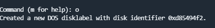
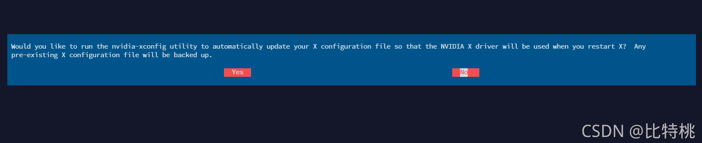
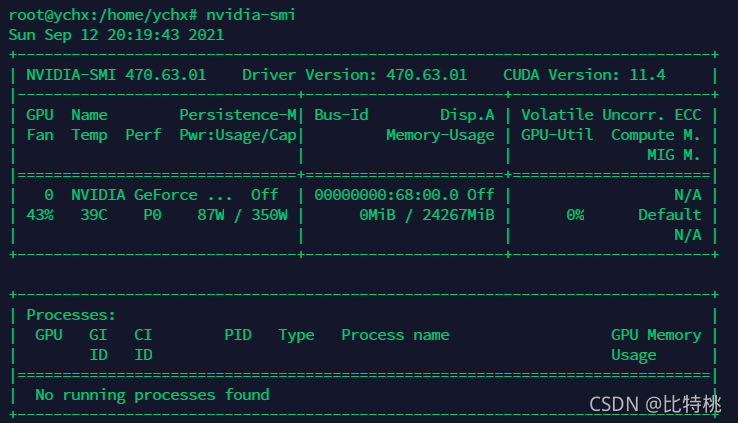
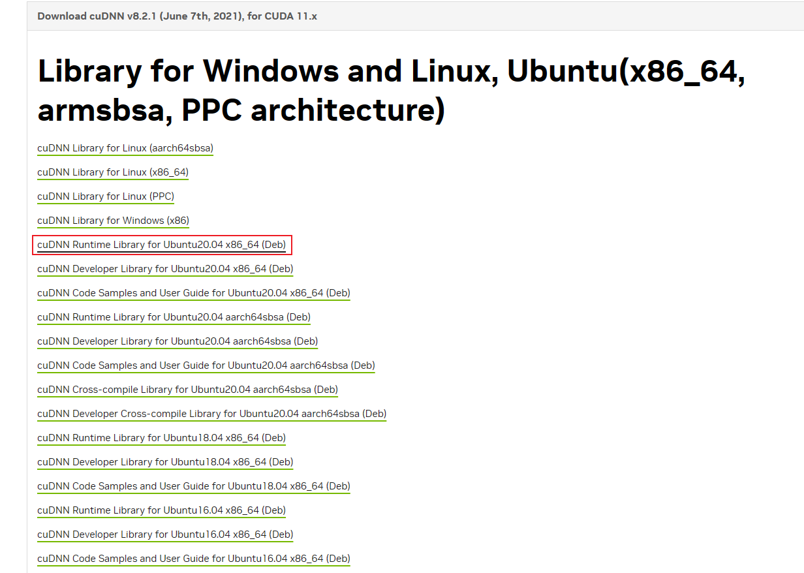
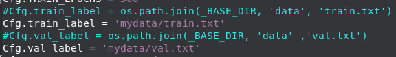
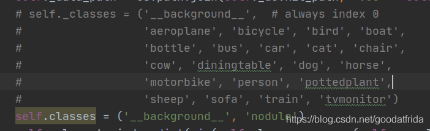
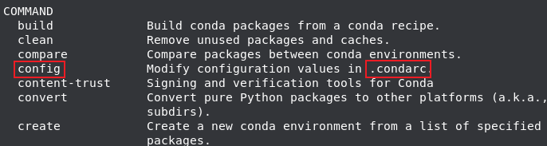
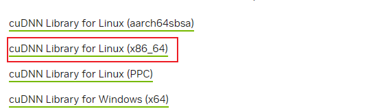

# tUbuntu20.04安装

## 报错合集

### 报错：ERROR：Unable to find the development tool `cc` in your path

先更新找到gcc，再下载

```
sudo apt-get update
sudo apt-get install gcc
```

### 报错：gpg: no valid OpenPGP data found.

```
wget https://download.docker.com/linux/ubuntu/gpg
sudo apt-key add gpg
```

### 报错：E: Unable to locate package libnvidia-container-dev E: Unable to locate package libnvidia-container-tools E: Unable to locate package nvidia-container-runtime

```
sudo apt update
```

### Failed to add partition 1 to system: Invalid argument

创建分区的时候 通过命令来新建一份空的分区表：o



Firefox乱码

```
# 1.安装wqy-zenhei字体
apt-get install ttf-wqy-zenhei
# 2.修改系统字体配置文件/etc/fonts/conf.d/49-sansserif.conf
vim /etc/fonts/conf.d/49-sansserif.conf
# 3.然后修改倒数第四行的字体为WenQuanYi Zen Hei，如下:

<?xml version="1.0"?>
<!DOCTYPE fontconfig SYSTEM "fonts.dtd">
<fontconfig>
<!--
If the font still has no generic name, add sans-serif
-->
<match target="pattern">
<test qual="all" name="family" compare="not_eq">
<string>sans-serif</string>
</test>
<test qual="all" name="family" compare="not_eq">
<string>serif</string>
</test>
<test qual="all" name="family" compare="not_eq">
<string>monospace</string>
</test>
<edit name="family" mode="append_last">
<string>WenQuanYi Zen Hei</string>
</edit>
</match>
</fontconfig>
```

### 异常重启后（或其他情况）后不能用cuda

方法1：

```
# 给宿主机增加nvidia-uvm设备
sudo /sbin/modprobe nvidia-uvm
D=`grep nvidia-uvm /proc/devices | awk '{print $1}'`
sudo mknod -m 666 /dev/nvidia-uvm c $D 0
# 第三步可能会报错，不影响使用,上述命令执行完成之后，重启容器

lxc restart --all --force  # 重启所有容器
```

方法2：更换内核

查看内核版本

```
uname -r	//输出：5.15.0-107-generic
gedit /boot/grub/grub.cfg	//查看所需内核处于第几个，查出是第3个
sudo vim /etc/default/grub	//切换内核，编辑GRUB_DEFAULT="1> 2"，第3个下标为2
```

降低版本：GRUB_DEFAULT=0改为GRUB_DEFAULT = "Ubuntu，Linux 5.15.0-101-generic"

```
sudo update-grub	//更新开机引导文件
reboot	//重启
uname -r	//输出：5.15.0-105-generic
```

方法3：

```
ls /usr/src | grep nvidia
//输出：nvidia-535.113.01

sudo apt-get install dkms
sudo dkms install -m nvidia -v 535.113.01
```

### E: Conflicting values set for option Signed-By regarding source

删除一个文件，如下

```
/etc/apt/sources.list.d# rm nvidia-container-toolkit.list
```

### 容器中网络无法连接

重新配置网桥 `sudo lxd init`

### 无法ssh访问容器

重装ssh，并配置开机自动启动

### 无法xrdp访问容器

可以先尝试：

```
poweroff -f
```

不行的话：

```
# 卸载 xrdp
sudo apt-get remove --purge xrdp

# 重装 xrdp
sudo apt-get update
sudo apt-get install xrdp
# 将xrdp用户添加到组：
sudo adduser xrdp ssl-cert  
sudo systemctl restart xrdp
```

### 更新或下载包时error: D-Bus is shutting down.

Error: GDBus.Error:org.freedesktop.systemd1.ShuttingDown: Refusing activation, D-Bus is shutting down.

```
poweroff -f	//强制关机
```

### 容器无法正常关机

```
ps aux | grep <container-name>	//查看容器中残留的进程
sudo kill -9 <pid>	//kill掉残留线程，一般为：[lxc monitor] /var/snap/lxd/common/lxd/container。最好都kill掉
```

然后需要等半分钟再启动容器，不然会报监听端口冲突问题

### 内存占用过高

占用79G/128G，查看进程发现很多 `/usr/bin/gnome-shell`，可能是图形界面的问题，重启图形界面：

```
systemctl restart gdm.service
```

## 安装步骤

### 系统文件制作

共享云盘中下载Ubuntu-20.04.5-desktop-amd64.iso镜像文件，下载Rufus软件，在其上边进行系统盘的制作。

### 取消自动锁屏

setting->Power->Blank Screen->Never

### SSH

```
apt update
apt install vim
apt install net-tools
apt install openssh-server
```

修改/etc/ssh/sshd_config，可以使用密码登录

PermitRootLogin yes
PasswordAuthentication yes

```
service ssh start
sudo ps -e | grep ssh	//查看是否启动成功
#开机自启动(默认)
systemctl enable ssh
```

### 显卡驱动

安装显卡驱动

```
# 1.卸载旧驱动
sudo apt-get purge nvidia*
sudo apt-get autoremove
sudo reboot 
```

禁止Nouveau

```
sudo vim /etc/modprobe.d/blacklist.conf 
# 在文件最后增加下面两行：
blacklist nouveau  
options nouveau modeset=0 
```

```
sudo update-initramfs -u
# 更新后重启
```

检查禁止是否成功（没有任何输出代表禁止成功）

```
lsmod | grep nouveau
```

取得超级权限，关闭所有NVIDIA驱动。

```
sudo -i
systemctl isolate multi-user.target
modprobe -r nvidia-drm
```

安装显卡驱动

```
# 准备工作
sudo apt-get install gcc
sudo apt-get install make
```

```
sudo chmod a+x NVIDIA-Linux-x86_64-535.113.01.run
sudo ./NVIDIA-Linux-x86_64-535.113.01.run -no-x-check -no-nouveau-check -no-opengl-files
```

以下页面选yes



查看驱动安装是否成功

```
nvidia-smi
```



### 安装cuda

```
//下载cuda安装包
wget https://developer.download.nvidia.com/compute/cuda/11.3.1/local_installers/cuda_11.3.1_465.19.01_linux.run
```

安装

```
sudo sh cuda_11.3.1_465.19.01_linux.run
```

其中有个选择需要取消第一项再安装，如下图第一项


配置环境变量

```
vim ~/.bashrc
```

export PATH=/usr/local/cuda-11.3/bin:$PATH
export LD_LIBRARY_PATH=/usr/local/cuda-11.3/lib64:$LD_LIBRARY_PATH

```
source ~/.bashrc
```

测试是否装好

```
nvcc -V
```

### 安装cudnn



```
dpkg -i libcudnn8_8.2.1.32-1+cuda11.3_amd64.deb
sudo dpkg -i libcudnn8-dev_8.2.1.32-1+cuda11.3_amd64.deb //可选
```

检查是否安装成功

```
dpkg -l | grep cudnn
ls /usr/include/cudnn*.h //可选
```

### 安装nvidia-container-runtime

安装nvidia-container-runtime（Nvidia官方出的容器运行GPU组件，安装后在容器中就可以直接调用宿主机的显卡驱动。）

```
# 准备工作
sudo snap install curl
sudo -i
```

```
# Add the package repositories
curl -s -L https://nvidia.github.io/nvidia-docker/gpgkey | apt-key add -

distribution=$(. /etc/os-release;echo $ID$VERSION_ID)
curl -s -L https://nvidia.github.io/nvidia-docker/$distribution/nvidia-docker.list | tee /etc/apt/sources.list.d/nvidia-docker.list
apt-get update

apt install libnvidia-container-dev libnvidia-container-tools nvidia-container-runtime -y
```

### LXD

安装LXD、ZFS和Bridge-utils：

```
sudo apt-get install lxd zfsutils-linux bridge-utils
```

+ LXD实现虚拟化容器。
  + LXC能够使得进程之间相互隔离，但无法有效支持跨主机之间的容器迁移、管理复杂。
  + LXD通过虚拟化容器技术来隔离每个人的操作系统，并通过共享文件夹的形式达到多人共用的数据资源。
  + LXD可以看做是LXC的升级版，两者管理指令大多相同，LXC/LXD容器相互隔离，每个容器中拥有完整且独立的操作系统以及所有权限，但不被允许操作宿主机。
  + LZD容器可以使用所有资源，包括：CPU、GPU、硬盘盒内存等，与宿主机共用一个内核。
  + 网络方面每个容器在局域网内都有一个独立的IP地址，可以用SSH直接访问。
  + 可以创建共享文件夹，将数据集、安装文件等资源进行共享。
  + 可以安装图形化接麦进行远程操作。
  + 缺点是显卡驱动不方便更新，宿主机更新驱动，容器也要跟着更新；由于共用内核，一个容器内核出错，所有容器就会受影响。
+ ZFS用于管理物理磁盘，支持LXD高级功能
+ Bridge-utils，用于搭建网桥

查看存储池：

```
sudo fdisk -l	//查看磁盘情况
zpool list	//可选
```

初始化LXD

```
sudo lxd init
```

```
Would you like to use LXD clustering? (yes/no) [default=no]: 
Do you want to configure a new storage pool? (yes/no) [default=yes]: yes
Name of the new storage pool [default=default]: rpool
Name of the storage backend to use (ceph, btrfs, dir, lvm, zfs) [default=zfs]: zfs
Create a new ZFS pool? (yes/no) [default=yes]: yes
Would you like to use an existing empty block device (e.g. a disk or partition)? (yes/no) [default=no]:no
Size in GiB of the new loop device (1GiB minimum) [default=30GiB]: 900GiB   //磁盘剩余最大空间
剩下均默认即可

//以下仅供参考（废弃）
Would you like to create a new zfs dataset under rpool/lxd? (yes/no) [default=yes]: yes
Would you like to connect to a MAAS server? (yes/no) [default=no]: 
Would you like to create a new local network bridge? (yes/no) [default=yes]: 
What should the new bridge be called? [default=lxdbr0]: lxdbr0
What IPv4 address should be used? (CIDR subnet notation, “auto” or “none”) [default=auto]: 
What IPv6 address should be used? (CIDR subnet notation, “auto” or “none”) [default=auto]: 
Would you like the LXD server to be available over the network? (yes/no) [default=no]: 
Would you like stale cached images to be updated automatically? (yes/no) [default=yes] 
Would you like a YAML "lxd init" preseed to be printed? (yes/no) [default=no]: 
```

### 容器

创建容器

```
# 创建容器
lxc launch ubuntu:20.04 tf
# 查看容器
lxc list
# 查看本机已有的镜像
lxc image ls
```

### 容器中安装驱动

```
cd /   //进入根目录
```

```
//添加共享文件夹
mkdir share
sudo lxc config set tf security.privileged true
sudo lxc config device add tf share disk source=/share path=/share
```

添加GPU硬件
在宿主机中执行以下命令

```
lxc config device add tf gpu gpu
```

复制显卡驱动到共享文件夹

```
cp /home/eai3/NVIDIA-Linux-x86_64-535.113.01.run /share
```

安装驱动，与上边的设置相同（因为LXD是复用了Linux内核，所以在容器内安装显卡驱动就不用安装内核了）

```
lxc exec tf bash # 进入容器
# 进入驱动所在文件夹下
sudo sh ./NVIDIA-Linux-x86_64-535.113.01.run --no-kernel-module
```

查看是否安装成功

```
nvidia-smi
```

### 配置远程桌面

（Linux常用的桌面程序有：GNOME、KED、Xfce，可以根据所需安装使用。我这里使用了Ubuntu默认的GNOME，注意取消推荐软件的安装：）

```
lxc exec tf bash # 进入容器
sudo apt-get update
sudo apt install --no-install-recommends ubuntu-desktop
```

Xfce桌面（远程桌面访问的协议有RDP、VNC，由于RDP是Windows自带的工具，所以我们直接只用它了。通过以下命令进行安装：）

```
sudo apt-get update
sudo apt-get install xrdp
# 将xrdp用户添加到组：
sudo adduser xrdp ssl-cert  
sudo systemctl restart xrdp
```

### 配置网络

```
# 宿主机中
sudo lxc config device add tf proxy1 proxy listen=tcp:192.168.31.234:1002 connect=tcp:10.188.240.123:22 bind=host
sudo lxc config device add tf proxy0 proxy listen=tcp:192.168.31.234:1003 connect=tcp:10.188.240.123:3389 bind=host
```

主要需要注意的地方是：tf是我的容器名，前边是我宿主机的ip，后边是我容器的ip。每个人占俩端口，分别用来映射ssh的22端口，和rdp协议的3389端口。容器的ip可以通过lxc list查看，本机的ip可以通过ifconfig查看。
这样都做好后，我们就可以把10.0.5.11:1002 、10.0.5.11:1003 给到小伙伴，让他远程访问了。

当然，root密码你如果忘了，可以进入容器通过passwd root修改root密码。（刚创建完需先设置密码）

```
lxc exec tf bash # 进入容器
passwd root
```

如果显示服务器拒绝密码，则可能是ssh默认不接受密码登录：

```
vim /etc/ssh/sshd_config
#PermitRootLogin without-password改为
PermitRootLogin yes
//PasswordAuthentication no改为
PasswordAuthentication yes
#重启ssh服务
/etc/init.d/ssh restart
```

### 宿主机中安装anaconda

宿主机中

```
apt install git # 前期准备
apt install pip # 前期准备
```

宿主机中安装anaconda

在浏览器中下载安装包

```
bash /home/eai3/Anaconda3-2023.09-0-Linux-x86_64.sh # /后边是路径
```

回车

在阅读完协议最后输入yes

回车

yes

yes

重新进入命令行

```
//以下选做（意义不大）
# conda 的基础环境在启动时不被激活
conda config --set auto_activate_base false
# 创建python3.9的环境
conda create -n lxdui python=3.9
conda activate lxdui
```

### 容器中安装anaconda、cuda、cudnn

准备工作

```
sudo apt-get install gcc
sudo apt-get install make
```

接下来与宿主机安装相同

安装结束-------------------------------------------------------------------------------

### 容器优化

#### 限制CPU使用率

创建 `set_cpu_limits.sh` 脚本文件：

```
#!/bin/bash

# 获取所有容器的名称
containers=$(lxc list -c n --format csv)

# 设置每个容器的 CPU 使用限制
for container in $containers; do
  echo "Setting CPU allowance for container: $container"
  lxc config set $container limits.cpu.allowance 90%
done

echo "CPU allowance set to 90% for all containers."
```

授予执行权限：

```
chmod +x set_cpu_limits.sh
```

运行脚本：

```
./set_cpu_limits.sh
```

检查单个容器是否配置成功：

```
lxc config show <container-name> | grep limits.cpu.allowance
```

#### 安装firefox

```
sudo apt update && sudo apt upgrade
sudo apt install firefox
```

#### 桌面优化

```
# 安装 NetworkManager 服务
sudo apt install network-manager
# 安装完后重启（不重启也行，以下可以不用做）
sudo reboot
# 启动NetworkManager 服务
sudo systemctl start NetworkManager
# NetworkManager 在启动时自动运行
sudo systemctl enable NetworkManager
# 检查 NetworkManager 状态
sudo systemctl status NetworkManager
```

安装tweaks

```
sudo apt install gnome-tweaks
```

然后重启洗头后打开tweaks，在里边进行设置。

以下可以忽略==============

```
//某一特定主题桌面（可选）
sudo apt update
# 安装图标主题
sudo apt install papirus-icon-theme
# 安装GTK主题
git clone https://github.com/vinceliuice/vimix-gtk-themes
cd vimix-gtk-themes
sudo ./install.sh
# 安装Gnome Tweak Tool
sudo apt install gnome-tweak-tool
# 显示Linux系统信息工具
sudo apt install neofetch
# 查看CPU运行以及内存占用情况工具
sudo apt install htop
```

```
# 文件夹下右键中没有终端的解决方法：
sudo apt update
sudo apt install nautilus-extension-gnome-terminal
注销后重新登录即可
```

#### 开启从终端中打开的选项

```
sudo apt update
sudo apt install nautilus-extension-gnome-terminal
注销后重新登录即可
```

#### 最小最大化按钮

```
# 切换到右上角
gsettings set org.gnome.desktop.wm.preferences button-layout ":minimize,maximize,close"
# 切换到左上角
gsettings set org.gnome.desktop.wm.preferences button-layout "minimize,maximize,close:"
```

### 用镜像创建容器

```
lxc stop my-container
lxc publish my-container --alias test-image
lxc image list
lxc launch 镜像名称 新容器名称
```

配置网络

```
# 宿主机中
sudo lxc config device add tf proxy1 proxy listen=tcp:192.168.31.234:1002 connect=tcp:10.188.240.123:22 bind=host
sudo lxc config device add tf proxy0 proxy listen=tcp:192.168.31.234:1003 connect=tcp:10.188.240.123:3389 bind=host
# 如果无法连接，可进行以下修改：具体的修改取决于你要更改的属性。在你的示例中，要修改 "proxy1" 设备的监听地址，你可以运行类似以下的命令：
sudo lxc config device set tf proxy1 listen=tcp:新监听地址
```

添加共享文件夹

```
sudo lxc config set tf security.privileged true
sudo lxc config device add tf share disk source=/share path=/share
```

添加GPU硬件
在宿主机中执行以下命令

```
lxc config device add tf gpu gpu
```

ssh：

```
vim /etc/ssh/sshd_config
#PermitRootLogin without-password改为
PermitRootLogin yes
//PasswordAuthentication no改为
PasswordAuthentication yes
#重启ssh服务
/etc/init.d/ssh restart
```

### 容器的虚拟环境中安装pytorch

略

## 其他

```
# 查看容器剩余容量
df -hl
# 查看剩余内存
free -m
# 查看宿主机容量
zfs list
lxc stop --all //关闭所有容器
lxc start --all //开启所有容器
lxc restart --all //开启所有容器
```

### 可视化管理界面设置：

云盘中的lxd39放到服务器/root/anaconda/envs/目录下

解压

```
conda activate lxd39
//在root文件夹下（或某一文件夹）
git clone https://github.com/AdaptiveScale/lxdui.git
cd lxdui
# 安装依赖包
python setup.py install
pip install Werkzeug==2.0.0
lxdui start

```

进入页面控制：服务器ip地址:15151

```
# 通用方案✖：以下方案很大可能不行
git clone https://github.com/AdaptiveScale/lxdui.git
cd lxdui
# 安装依赖包
python3 setup.py install

# 启动: 
python3 run.py start
# 或者使用CLI启动:   
lxdui start
# 后台运行
nohup python3 run.py start > python.log3 2>&1 &
```

### LXD

删除LXD

```
sudo snap remove --purge lxd
sudo apt remove --purge lxd-installer
```

```
lxc delete tf	//删除容器
```

ssh连接容器

```
ssh root@10.63.44.76 -p 9002	//从Windows端连接
```

查看LXD存储池及其文件系统的使用情况

```
sudo zfs list
```

### 在已分区的硬盘上创建、添加存储池

#### 缩小文件系统，创建新的逻辑卷

找到空闲大小较多的文件系统：

```
df -h
```

```
//条目示例如下：

Filesystem               Size  Used Avail Use% Mounted on
/dev/mapper/vgubuntu-root 812G   48G  724G   6% /
```

检查当前卷组的可用空间，注意vgubuntu、root与选择的某一文件系统的名字有关 `<name>`

```
sudo vgdisplay vgubuntu		//找到Alloc PE / Size和Free  PE / Size
```

缩小已分区磁盘的大小：

```
sudo e2fsck -f /dev/vgubuntu/root	//在缩小文件系统之前，必须先确保文件系统没有错误。

//为了缩小文件系统的大小，需要在未挂载的情况下进行操作。如果是根文件系统，需要在救援模式下或使用Live CD/USB进行操作。

sudo vgchange -ay	//激活卷组
//确保文件系统没有错误并卸载文件系统
sudo e2fsck -f /dev/vgubuntu/root
sudo umount /dev/vgubuntu/root	//可能会显示：...... not mounted，可以忽略
sudo resize2fs /dev/vgubuntu/root 100G	//缩小文件系统。大小可以指定，但不能小于原本的Alloc PE / Size
sudo lvreduce -L 60G /dev/vgubuntu/root	//缩小逻辑卷,会收到警告：是否继续缩小逻辑卷，按提示输入y
sudo e2fsck -f /dev/vgubuntu/root	//再次确认文件系统完整性
sudo reboot	//从本地硬盘启动系统
```

创建新的逻辑卷：

```
sudo lvcreate -L 20G -n lxdpool vgubuntu	//lxdpool为自定义逻辑卷名字
sudo zpool create lxdpool /dev/vgubuntu/lxdpool	//格式化逻辑卷为ZFS
```

#### 创建LXD存储池

注意下方lxdpool为存储池名字（可自定义），vgubuntu为文件系统名字

```
lxc storage create <lxdpool> zfs source=lxdpool	//在LXD中注册新的存储池

lxc storage list	//查询存储池列表
lxc launch <ubuntu:20.04> <mycontainer> -s lxdpool	//在存储池lxdpool上创建新容器

lxc move mycontainer --storage lxdpool	//迁移容器到存储池lxdpool

```

# 环境配置

## 示例

使用环境：

- Python 3.7
- Pytorch 1.8.1

1.安装Pytorch

如果已经安装过Pytorch，则无需再次安装

```shell
pip install torch==1.8.1
```

2.安装其他依赖库，命令如下

```shell
pip install -r requirements.txt -i https://mirrors.aliyun.com/pypi/simple/
```

具体步骤：

```
(base) root@clh1:~# cd /
(base) root@clh1:/# mkdir git
(base) root@clh1:/# cd /git

//git 项目，在项目里配
(base) root@clh1:/git# git clone https://github.com/yeyupiaoling/VoiceprintRecognition-Pytorch.git

(base) root@clh1:/git# conda create -n voice python=3.8

(base) root@clh1:/git# conda activate voice
(voice) root@clh1:/git# conda install pytorch==1.8.1 torchvision==0.9.1 torchaudio==0.8.1 cudatoolkit=10.2 -c pytorch

(base) root@clh1:~# conda activate voice
(voice) root@clh1:~# cd /git/VoiceprintRecognition-Pytorch/
(voice) root@clh1:/git/VoiceprintRecognition-Pytorch# sudo apt-get install portaudio19-dev
(voice) root@clh1:/git/VoiceprintRecognition-Pytorch# sudo apt-get install python3-all-dev
(voice) root@clh1:/git/VoiceprintRecognition-Pytorch# pip install -r requirements.txt -i https://mirrors.aliyun.com/pypi/simple/
```

## yolov4(放弃)

### 配置

#### 源码下载

```
git clone https://github.com/Tianxiaomo/pytorch-YOLOv4.git
cd pytorch-YOLOv4
```

#### 下载权重文件

yolov4.pth

[https://drive.google.com/open?id=1wv_LiFeCRYwtpkqREPeI13-gPELBDwuJ](https://drive.google.com/open?id=1wv_LiFeCRYwtpkqREPeI13-gPELBDwuJ)

安装依赖包

```
pip install -r requirements.txt
```

打开demo.py，找到如下内容，将false修改为False

```
parser.add_argument('-torch', type=bool, default=false,
                    help='use torch weights')
```

报错：Overload resolution failed: .......

```
pip show opencv_python #展示自己opencv_python的版本
pip uninstall opencv-python #卸载之前的版本
pip install opencv_python==4.4.0.46 #下载4.4.0.46这个版本
```

运行demo

```
python demo.py -cfgfile ./cfg/yolov4.cfg -weightfile ./weight/yolov4.weights -imgfile ./data/dog.jpg
```

### 训练

cfg.py文件中配置参数



protobuf版本过高

```
pip uninstall protobuf
pip install protobuf==3.19.0
```

AttributeError: module ‘numpy‘ has no attribute ‘float‘.

```
pip install numpy==1.23.5
```

开始训练

```
python train.py -l 0.001 -g 0 -pretrained ./weight/yolov4.pth -classes 2 -dir ./mydata/JPEGImages/ -train_label_path mydata/train.txt
```

-l：学习率。-g ：gpu id。-pretrained  ：预训练权值。-classes  ：类别种类。-dir ：图片所在文件夹。

## yolov5

下载yolov5-5.0文件

    https://github.com/ultralytics/yolov5/releases/tag/v5.0

    文件传到Linux的Desktop后解压

创建虚拟环境

    conda create -n yolov5 python==3.7

    conda activate yolov5

安装cuda和cudnn

```
conda install cudatoolkit=10.1 -c https://mirrors.tuna.tsinghua.edu.cn/anaconda/pkgs/free/linux-64/
conda install cudnn=7.6.5 -c https://mirrors.tuna.tsinghua.edu.cn/anaconda/pkgs/main/linux-64/
```

换国内源：

```
pip config set global.index-url https://pypi.tuna.tsinghua.edu.cn/simple
```

安装pytorch

```
pip install torch==1.8.1+cu101 torchvision==0.9.1+cu101 torchaudio==0.8.1 -f https://download.pytorch.org/whl/torch_stable.html
```

进入yolov5文件夹

修改requirement内容：

```
# pip install -r requirements.txt

# base ----------------------------------------
Cython
matplotlib>=3.2.2
numpy>=1.18.5
opencv-python>=4.1.2
Pillow
PyYAML>=5.3.1
scipy>=1.4.1
tensorboard>=2.2
torch>=1.7.0
torchvision>=0.8.1
tqdm>=4.41.0

# logging -------------------------------------
# wandb

# plotting ------------------------------------
seaborn>=0.11.0
pandas

# export --------------------------------------
# coremltools==4.0
# onnx>=1.8.0
# scikit-learn==0.19.2  # for coreml quantization

# extras --------------------------------------
thop  # FLOPS computation
pycocotools>=2.0  # COCO mAP
```

```
pip install  -U  -r   requirements.txt
```

报错1.可能会出现自动升级torch导致不匹配问题，重新安装对应版本torch即可

报错2：`error: Microsoft Visual C++ 14.0 or greater is required` ：安装vs2019

报错3：

```
No module named ‘git‘	/'name'
解决：
pip install gitpython	/pip install name
```

报错4：`ImportError: Failed to initialize: Bad git executable：`：添加以下一行

```
import argparse
import math
import os
os.environ["GIT_PYTHON_REFRESH"] = "quiet"	//添加该行
import random
import subprocess
import sys
import time
from copy import deepcopy
from datetime import datetime
from pathlib import Path
```

PS：曾经安装的版本，

pip uninstall torch==1.13.1 torchvision==0.14.1

conda install pytorch==1.7.1 torchvision==0.8.2 torchaudio==0.7.2 cudatoolkit=10.1 -c pytorch

## yolov7

下载yolov7文件

[GitHub - WongKinYiu/yolov7: Implementation of paper - YOLOv7: Trainable bag-of-freebies sets new state-of-the-art for real-time object detectors](https://github.com/WongKinYiu/yolov7)

创建虚拟环境(或者直接用v5的环境)

```
conda create -n yolov7 python==3.8  
conda activate yolov7
```

切换到v7文件夹下

安装requirement

```
pip install -r requirements.txt -i https://pypi.tuna.tsinghua.edu.cn/simple
```

换源，安装GPU版torch

```
conda install pytorch==1.7.1 torchvision==0.8.2 torchaudio==0.7.2 cudatoolkit=11.0

//废弃
pip install torch==1.8.1+cu101 torchvision==0.9.1+cu101 torchaudio==0.8.1 -f https://download.pytorch.org/whl/torch_stable.html
```

手动下载yolov7.pt文件放在v7文件夹下

运行detect进行测试

训练

```
//报错File "/root/anaconda3/envs/yolov7/lib/python3.8/site-packages/torch/serialization.py", line 762, in _legacy_load
    magic_number = pickle_module.load(f, **pickle_load_args)
_pickle.UnpicklingError: STACK_GLOBAL requires str

//删除数据集文件中产生了.cache文件
```

## yolov8

### 安装

下载yolov8代码gitee:   [ultralytics: YOLOv8 🚀 Ultralytics 同步更新官方最新版 YOLOv8 (gitee.com)](https://gitee.com/monkeycc/ultralytics)

github：[mirrors / ultralytics / ultralytics · GitCode](https://gitcode.net/mirrors/ultralytics/ultralytics?utm_source=csdn_github_accelerator)

安装conda、cuda

创建环境：

```
conda create -n clh python=3.8
conda activate clh
```

换国内源：

```
//一定要先清空源
conda config --remove-key channels
pip config set global.index-url https://pypi.tuna.tsinghua.edu.cn/simple
```

安装pytorch：

```
# Windows
conda install pytorch==1.12.0 torchvision==0.13.0 torchaudio==0.12.0 cudatoolkit=11.3 -c pytorch

# Linux
//使用新版torch,旧版1.12.0会导致训练时无法使用多线程载入数据集
conda install pytorch==2.1.0 torchvision==0.16.0 torchaudio==2.1.0 pytorch-cuda=12.1 -c pytorch -c nvidia

# 以下方法废弃
ubuntu cuda:11.3 cudnn:8.2.1
conda install pytorch==1.12.0 torchvision==0.13.0 torchaudio==0.12.0 cudatoolkit=11.3 -c pytorch
# 换源更快速
conda install pytorch==1.12.0 torchvision==0.13.0 torchaudio==0.12.0 cudatoolkit=11.3 -c https://mirrors.tuna.tsinghua.edu.cn/anaconda/cloud/pytorch/linux-64/

# ubuntu cuda:12.2
pip config set global.index-url https://pypi.tuna.tsinghua.edu.cn/simple	# 换源
conda install pytorch torchvision torchaudio pytorch-cuda=11.8 -c pytorch -c nvidia

```

验证pytorch

```
import torch
import torchvision
torch.cuda.is_available() 
```

安装requirement：

```
pip install -r requirements.txt 
```

安装yolov8在python>=3.8版本必要安装包

```
pip install ultralytics
```

下载yolovn.pt：https://github.com/ultralytics/assets/releases/download/v0.0.0/yolov8n.pt

使用yolov8自带经典图片进行测试：

```
yolo predict model=yolov8n.pt source='ultralytics/assets/bus.jpg'
```

训练自己数据集：

```
yolo train data=data.yaml model=yolov8s.pt epochs=300 imgsz=640 batch=8 workers=0 device=0

data为yaml配置文件
model为下载的模型，放在主文件下
epochs为训练轮数
imagez为训练时ai看到的图片大小，检查大图片建议使用640，小图片可以320 越大越吃性能
batch为一轮训练中每一次放入图片数量，越大越快效果越好，但是对性能要求越高
device为使用的设备，使用cpu练就写cpu，使用显卡大多数都是0，多显卡就0，1，2，3，...多少显卡往后写多少

```

### 换GPU训练

修改 `ultralytics/engine/trainer.py`文件下的 `self.device = torch.device(0)`

或者：

```
# CUDA_VISIBLE_DEVICES=1 环境变量指定可用的GPU序号，--nproc_per_node=1表示只用一个GPU
CUDA_VISIBLE_DEVICES=1 python train_gpu1.py --nproc_per_node=1
```

## yolo训练网络可视化工具

```
pip install onnx	# 虚拟环境下安装
```

在YOLOv5的models下

## rtdetr

按照yolov8安装完pytorch，再进行以下操作

```
//额外需要的包安装命令:
pip install timm thop efficientnet_pytorch einops grad-cam dill -i https://pypi.tuna.tsinghua.edu.cn/simple
//以下主要是使用dyhead必定需要安装的包,如果安装不成功dyhead没办法正常使用!
pip install -U openmim
mim install mmengine
mim install "mmcv>=2.0.0"

//还需要安装的包
pip install seaborn
pip install seaborn
```

修改v8的文件内容

1. 在ultralytics/engine/trainer.py中的optimizer_step函数中的torch.nn.utils.clip_grad_norm_中的参数max_norm修改为0.1
2. 在ultralytics/engine/trainer.py中的_setup_train函数中将self.args.nbs等于self.batch_size,这样做的目的是让模型不需要积累梯度再进行更新参数
3. ultralytics/cfg/default.yaml配置文件的更改

## Faster-RCNN(可以运行，但无法查看参数量等信息)

创建虚拟环境

```
conda create -n rcnn python=3.6
```

配置清华镜像源

```
conda config --add channels https://mirrors.tuna.tsinghua.edu.cn/anaconda/pkgs/free/
conda config --add channels https://mirrors.tuna.tsinghua.edu.cn/anaconda/cloud/conda-forge 
conda config --add channels https://mirrors.tuna.tsinghua.edu.cn/anaconda/cloud/msys2/
conda config --add channels https://mirrors.tuna.tsinghua.edu.cn/anaconda/cloud/pytorch/
 
# 设置搜索时显示通道地址
conda config --set show_channel_urls yes
```

安装pytorch

```
conda install pytorch==1.7.1 torchvision==0.8.2 torchaudio==0.7.2 cudatoolkit=11.0
```

下载faster-rcnn代码

```
https://github.com/jwyang/faster-rcnn.pytorch/tree/pytorch-1.0
```

代码包中创建文件

```
cd faster-rcnn.pytorch-pytorch-1.0 && mkdir data
cd data && mkdir pretrained_model
```

下载预训练模型VGG16,放到/data/pretrained_model中

```
https://link.csdn.net/?target=https%3A%2F%2Ffilebox.ece.vt.edu%2F~jw2yang%2Ffaster-rcnn%2Fpretrained-base-models%2Fvgg16_caffe.pth
```

安装依赖

```
pip install -r requirements.txt 
//报错Could not build wheels for opencv-python, which is required to install pyproj，解决如下
pip install -i https://pypi.douban.com/simple/ pip install opencv-python==4.3.0.38
```

之后

```
cd lib
python setup.py build develop
```

安装CoCO API

```
cd data
git clone https://github.com/pdollar/coco.git
cd coco/PythonAPI
make
cd ../../..
```

修改数据集/data/VOCdevkit2007

修改类别，文件 `lib/datasets/pascal_voc.py`



修改参数（可选），文件 `/lib/model/utils/config.py`

cannot import name ‘imread’

```
//对应文件中修改from scipy.misc import imread为以下
from imageio import imread
```

在/lib/model/utils/config.py中的374行

```
//yaml_cfg = edict(yaml.load(f))修改为
yaml_cfg = edict(yaml.load(f, Loader=yaml.FullLoader))
```

 cannot import name 'builder’

```
pip uninstall protobuf
pip install protobuf==4.21.0
```

File "/py-faster-rcnn/tools/../lib/datasets/imdb.py", line 108, in append_flipped_images
    assert (boxes[:, 2] >= boxes[:, 0]).all() AssertionError

```
修改lib/datasets/imdb.py，append_flipped_images()函数
数据整理，在一行代码为 boxes[:, 2] = widths[i] - oldx1 - 1下加入代码：
for b in range(len(boxes)):
  if boxes[b][2]< boxes[b][0]:
    boxes[b][0] = 0

修改lib/datasets/pascal_voc.py
将对Xmin,Ymin,Xmax,Ymax减一去掉
```

制作数据集，使用voc格式数据集，txt_to_val、txt_to_val2为转换代码

data/VOCdevkit2007/VOC2007文件下

| Annotations | 存放数据打标签后的xml文件    |
| ----------- | ---------------------------- |
| Main        | 存放图片的名字和正负样本标签 |
| JPEGImages  | 存放图片                     |

在Main中有四种txt文件

trainval	存放全部的训练集和验证集图片的名字，不要带后缀，比如图片是0.jpg，就写0就行了
train	存放全部的训练集图片名字，占trainval的50%
val	存放全部的验证集图片名字，占trainval的50%
test	存放全部的测试集图片名字

训练loss可视化

```
pip install tensorboard
//报版本不匹配
pip uninstall protobuf
pip install protobuf==3.9.2

tensorboard --logdir=logs/logs_s_1/losses/ --port=7001
```

训练开始前

```
删除缓存：将faster-rcnn.pytorch/data/cache文件夹里面的东西全删掉
删除模型：将faster-rcnn.pytorch/models/res101/pascal_voc文件夹里面的东西全删掉
```

训练

```
CUDA_VISIBLE_DEVICES=0 python trainval_net.py  --dataset pascal_voc --net vgg16 --bs 16 --nw 16 --lr 0.001 --lr_decay_step 5 --cuda --use_tfb  --epochs 100
```

```
//跑论文的基准模型时用的是这个
CUDA_VISIBLE_DEVICES=0 python trainval_net.py  --dataset pascal_voc --net vgg16 --bs 16 --nw 16 --cuda --epochs 100
```

从断点开始继续训练方法：
例如我训练好的模型名为faster_rcnn_1_9_9547.pth，它就对应了 checksession 为1 ，checkepoch为 9，checkpoint为 9547

```
CUDA_VISIBLE_DEVICES=0 python trainval_net.py --dataset pascal_voc --net vgg16 --bs 16 --nw 16  --cuda --r true --checksession 1 --checkepoch 100 --checkpoint 387 --epochs 200
```

测试

修改文件test_net.py中的test为val

```
python test_net.py --dataset pascal_voc --net vgg16 --checksession 1 --checkepoch 200 --checkpoint 387 --cuda
//473为文件编号
```

## YOLOX(可以运行，但训练精度有问题—太低)

用yolov5环境

### 安装依赖包

```
pip3 install -U pip && pip3 install -r requirements.txt
python3 setup.py develop
```

### 安装pycocotools

```
pip3 install cython; pip3 install 'git+https://github.com/cocodataset/cocoapi.git#subdirectory=PythonAPI'

//出现错误如下错误可以忽略。ERROR: pip's dependency resolver does not currently take into account all the packages that are installed. This behaviour is the source of the following dependency conflicts.
yolox 0.3.0 requires pycocotools>=2.0.2, but you have pycocotools 2.0 which is incompatible.
```

### 安装apex文件

```
git clone https://github.com/NVIDIA/apex
cd apex
python3 setup.py install
```

### demo测试

下载权重文件后

```
python tools/demo.py image -n yolox-tiny -c ./yolox_tiny.pth --path assets/dog.jpg --conf 0.25 --nms 0.45 --tsize 640 --save_result --device gpu
```

### 训练tiny

1. 修改类别标签。改为自己数据集类别标签。yolox/data/datasets/voc_classes.py中的标签信息，进行修改。
2. 修改类别数量。改为自己数据集类别数量。exps/example/yolox_voc/yolox_voc_s.py。

   ```
   class Exp(MyExp):
       def __init__(self):
           super(Exp, self).__init__()
           self.num_classes = 2 #修改类别数目
           self.depth = 0.33
           self.width = 0.375    #修改网络为tiny大小
           self.warmup_epochs = 1
   ```

   ```
           with wait_for_the_master(local_rank):
               dataset = VOCDetection(
                   data_dir=os.path.join(get_yolox_datadir(), "VOCdevkit"),
                   //修改这里
                   image_sets=[('2007', 'trainval')],#, ('2012', 'trainval')
                   img_size=self.input_size,
                   preproc=TrainTransform(
                       max_labels=50,
                       flip_prob=self.flip_prob,
                       hsv_prob=self.hsv_prob),
                   cache=cache_img,
               )
   ```
3. 修改exps/default/yolox_s.py中的，self.depth和self.width，与上边保持一致。
4. 修改yolox/exp/yolox_base.py中的，self.depth和self.width，与上边保持一致。
5. ~~修改yolox/evaluators/voc_eval.py，添加root为annotation的绝对路径。~~

   ```
   #修改yolox/evaluators/voc_eval.py，添加root为annotation的绝对路径。
   root = r'E:\YOLOX-main\datasets\VOCdevkit\VOC2007\Annotations\\'
   def parse_rec(filename):
       """ Parse a PASCAL VOC xml file """
       tree = ET.parse(root + filename)
   ```
6. 注意数据集文件结构转换，其并非是严格的VOC格式，Main中只有trainval.txt和test.txt。

   
7. yolox/exp/yolox_base.py设置超参

开始训练

```
python tools/train.py -f exps/example/yolox_voc/yolox_voc_s.py -d 0 -b 32 --fp16  -c yolox_s.pth
```

### 测试（未验证）

1. 在yolox/data/datasets/下的init.py添加

   ```
   from .voc_classes import VOC_CLASSES
   ```
2. 在tools/demo.py中导入

   
3. 并将该文件夹下的其他COCO_CLASSES全部修改为VOC_CLASSE

   
4. 修改exps/default/yolox_s.py文件，修改类别数（本次应该修改为2)

   

运行测试

```
python tools/demo.py image -f exps/example/yolox_voc/yolox_voc_s.py -c YOLOX_outputs/yolox_voc_s_tiny/best_ckpt.pth --path assets/1.jpg --conf 0.25 --nms 0.45 --tsize 640 --save_result --device 0
```

//-c 代表训练好的权重，-path 代表你要预测的图片存放的文件夹，
//若想进行视频预测，只需将下面的 image 更换为 video；
//若想预测整个文件夹，将.jpg去掉，只留 --path assets/

## mmdetection

创建虚拟环境

```
conda create --name openmmlab python=3.8 -y
conda activate oenmmlab
```

换国内源：

```
//一定要先清空源
conda config --remove-key channels
pip config set global.index-url https://pypi.tuna.tsinghua.edu.cn/simple
```

安装pytorch：

```
conda install pytorch==2.1.0 torchvision==0.16.0 torchaudio==2.1.0 pytorch-cuda=12.1 -c pytorch -c nvidia
```

使用 MIN安装 MMEngine和 MMVC

```
pip install -U openmim
mim install mmengine==0.7.1
mim install "mmcv>=2.0.0"	//实际安装的是2.1.0
```

安装 MMDetection

```
git clone https://github.com/open-mmlab/mmdetection.git
cd mmdetection
pip install -v -e .

# "-v" means verbose, or more output
# "-e" means installing a project in editable mode,
# thus any local modifications made to the code will take effect without reinstallation.
```

验证安装

```
//下载配置和检查文件
mim download mmdet --config bytetrack_yolox_x_8xb4-amp-80e_crowdhuman-mot17halftrain_test-mot17halfval --dest .

//可能遇到TypeError: FormatCode() got an unexpected keyword argument ‘verify‘错误，降低yapf版本
pip uninstall yapf
pip install yapf==0.40.1

//验证
python demo/mot_demo.py demo/demo_mot.mp4 bytetrack_yolox_x_8xb4-amp-80e_crowdhuman-mot17halftrain_test-mot17halfval.py --checkpoint bytetrack_yolox_x_crowdhuman_mot17-private-half_20211218_205500-1985c9f0.pth --out mot.mp4

//可能会遇到有些包未安装
pip install lap
pip install seaborn
```

### 训练自己的数据集

不要训练ssd

在 mmdetection/mmdet/datasets/__init__.py 中添加代码

```
from .fire import fireDataset
```

下载配置文件和模型权重文件。

```
mim download mmdet --config rtmdet_tiny_8xb32-300e_coco --dest .
```

推理验证

```
python demo/image_demo.py demo/demo.jpg rtmdet_tiny_8xb32-300e_coco.py --weights rtmdet_tiny_8xb32-300e_coco_20220902_112414-78e30dcc.pth --device cpu
```

mmdet/datasets 这个文件夹，复制名为 coco.py 文件

训练

```
python tools/train.py configs/faster_rcnn/faster-rcnn_r18_fpn_8xb8-amp-lsj-200e_coco.py  --work-dir workdir_hurricane/
```

python tools/train.py configs/faster_rcnn/myconfig.py  --work-dir workdir_hurricane/

最新训练命令：

```
python tools/train.py --config configs/faster_rcnn/faster-rcnn_r50_fpn_1x_coco.py
```

### 计算参数量

```
python tools/analysis_tools/get_flops.py work_dirs/faster-rcnn_r50_fpn_1x_coco/faster-rcnn_r50_fpn_1x_coco.py
```

### 输出每个类别AP

在mmdet/evaluation/metrics/coco_metric.py中的classwise设为True。

将/clh/mmdetection/configs/_base_/datasets/fire_detection.py中的format_only设为false。

```
python tools/test.py ./configs/faster_rcnn/faster-rcnn_r50_fpn_1x_coco.py work_dirs/faster-rcnn_r50_fpn_1x_coco/epoch_70.pth --out ./result/result.pkl
```

若改动后未生效可试试运行下面的命令重新编译代码使修改生效

```python
python setup.py install build
```

### 输出P、R

需改**tools/analysis_tools/confusion_matrix.py**文件，在底部main函数中添加代码

```
    # 自己添加，为了打印 Precision, Recall, F1, AP, AR
    TP = np.diag(confusion_matrix)
    FP = np.sum(confusion_matrix, axis=0) - TP
    FN = np.sum(confusion_matrix, axis=1) - TP
  
    precision = TP / (TP + FP)
    recall = TP / (TP + FN)
    average_precision = np.mean(precision)
    average_recall = np.mean(recall)
    f1 = 2* (average_precision * average_recall) / (average_precision + average_recall)
  
  
    print('\n AP:', average_precision)
    print('AR:', average_recall)
    print('F1:', f1)
    print('Precision', precision)
    print('Recall', recall)
  
    # print('TP:', TP)
    # print('FP:', FP)
    # print('FN', FN)

    # 自己添加，为了打印 Precision, Recall, F1, AP, AR
```

首先执行输出每个类别AP的test.py，然后执行以下内容

```
python tools/analysis_tools/confusion_matrix.py work_dirs/faster-rcnn_r50_fpn_1x_coco/faster-rcnn_r50_fpn_1x_coco.py work_dirs/result/result.pkl work_dirs/result/
```

## 问题解决

### 创建环境时连接超时

错误信息：

```
CondaHTTPError: HTTP 000 CONNECTION FAILED for url
```

输入 `conda --help `找到.condarc文件路径，如下图：



打开文件然后修改里边的https为http，并在末尾加上：`ssl_verify: false`，即可。

### root用户无法启动vscode

```
vi ~/.bashrc
# 添加一行
alias code='/usr/share/code/code . --no-sandbox --unity-launch'
# 报存生效
source ~/.bashrc
```

# Linux命令大全

## 基础命令

* ```
  nvidia-smi		//N卡使用情况
  ```
* ```
  watch -n 1 nvidia-smi	//每隔1秒输出显卡使用情况，Ctrl+C结束watch命令
  ```
* ```
  实时查看GPU使用状态（Windows首选使用）
  pip install gpustat
  gpustat --w
  ```
* ```
  nvcc -V 		//cuda版本查询
  ```
* 删除行：1、按Esc键进入正常模式。 2、将光标放在要删除的行上。 3、键入dd并按Enter键以删除该 行 。
* **从Windows下载Linux服务器中的文件夹**

  ```
  scp -r -P 10002 root@192.168.31.61:/root/yolov5_research/yolov5 d:\LinuxFileTemp
  ```

  -r ：表示传文件夹，-P ：表示用端口号，root@192.168.31.61:/root/Music ：待传文件地址，d:\ ：下载到的地址
* ```
  pip install matplotlib -i https://pypi.tuna.tsinghua.edu.cn/simple		//安装matpotlib
  ```
* pycharm运行代码指定GPU

  ```
  import os
  # 指定使用0,1,2三块卡
  os.environ["CUDA_VISIBLE_DEVICES"] = "0,1,2"
  ```

+ ```
  lsb_release -a		//查看操作系统版本
  ```
+ ```
  cat /proc/cpuinfo   # 查看CPU信息
  ```
+ ```
  python -V	# python版本
  ```
+ ```
  pip list	# 虚拟环境目前包含的库信息
  ```
+ ```
  Python中：
  import torch
  print(torch.version.cuda)	# 查询cuda版本
  print(torch.backends.cudnn.version())	# 查询cudnn版本

  #查看使用的GPU设备数量和名字
  torch.cuda.current_device()
  torch.cuda.device(0)
  torch.cuda.device_count()
  torch.cuda.get_device_name(0)
  ```

* ```
  python -V   # python版本
  ```

+ linux批量解压zip文件

  ```
  //方法1
  find . -name '*.zip' -exec unzip {} \;
  1
  //方法2
  ls *.zip | xargs -n1 unzip -o
  1
  //方法3
  # for i in *.zip
  > do
  > unzip -o $i
  > done
  ```
+ 在vim下查找关键词：ESC+/，回车后按n向下查找、按N向上查找。按u撤销上一个操作
+ ```
  //实时网速
  apt install ifstat	//安装
  ifstat	//打开
  ```
+ ```
  conda create -n 新环境名 --clone 旧环境名   //复制虚拟环境
  ```
+ ```
  最大窗口 win + ↑
  最小化窗口 win + ↓
  隐藏窗口 win + H
  窗口放左边 win + ←
  窗口放右边 win + →
  ```
+ ```
  //VsCode跳转到函数之后返回原来位置
  Ctrl+Alt+'-'	//ubuntu
  Alt+'<-'		//Windows
  ```
+ ```
  Ctrl + shift + f	//输入法简、繁切换
  ```
+ ```
  ls a*	//显示当前目录下以a为前缀的所有文件
  rm -rf a*  //删除当前目录下以a为前缀的所有文件
  ```
+ ```
  命令模式下按"yy",在按"p"  //复制某一行 
  ```
+ ```
  find ./ -name filename //在指定路径查找文件
  ```
+ ```
  更改文件夹权限
  sudo chmod 600 ××× （只有所有者有读和写的权限）
  sudo chmod 644 ××× （所有者有读和写的权限，组用户只有读的权限）
  sudo chmod 700 ××× （只有所有者有读和写以及执行的权限）
  sudo chmod 666 ××× （每个人都有读和写的权限）
  sudo chmod 777 ××× （每个人都有读和写以及执行的权限）

  其中×××指文件名（也可以是文件夹名，不过要在chmod后加-ld）。

  解释一下，其实整个命令的形式是
  sudo chmod -（代表类型）×××（所有者）×××（组用户）×××（其他用户）

  原文链接：https://blog.csdn.net/woshilaoli_CSDN/article/details/109093102
  ```
+ ```
  修改文件夹拥有者
  chown -R  hxls  gcn/	//-R：递归修改目录下所有的拥有者，hxls:拥有者名字，gcn/:更改目录
  ```

## Anaconda

+ conda create -n tensorflow python=3.8		//创建虚拟环境
+ conda create --prefix=D:\SoftWare\Anaconda3\envs\yolov5 python=3.7	//指定位置创建虚拟环境
+ deactivate	//退出环境
+ conda env remove --name your_env_name	//删除环境
+ conda info --envs	或者 conda env list	//虚拟环境列表
+ conda remove -n octopus --all	//删除octopus环境
+ conda info --envs 或者 conda env list	//查看虚拟环境列表
+ conda activate paddle	//切换到paddle虚拟环境
+ pip list	//查看pytorch中安装的包
+ conda remove -n pytorch --all
+ 

## cp 复制文件、文件夹到文件夹

### 参数

a 该选项通常在拷贝目录时使用。它保留链接、文件属性，并递归地拷贝目录，其作用等于dpR选项的组合。

* d 拷贝时保留链接。
* f 删除已经存在的目标文件而不提示。
* i 和f选项相反，在覆盖目标文件之前将给出提示要求用户确认。回答y时目标文件将被覆盖，是交互式拷贝。
* p 此时cp除复制源文件的内容外，还将把其修改时间和访问权限也复制到新文件中。
* r 若给出的源文件是一目录文件，此时cp将递归复制该目录下所有的子目录和文件。此时目标文件必须为一个目录名。
* l 不作拷贝，只是链接文件。

### 复制文件到文件夹

cp /待复制文件的路径  /目标路径

```
cp /home/downloads/xampp-linux-x64-7.3.6-0-installer.run /opt/
```

### 复制文件夹到文件夹

-r 是区别点

```
cp  -r /home/downloads/phpcms_v9_UTF8/install_package/    /opt/lampp/htdocs/
cp -r tired_driver    /root/yolov5\ search/
```

# 问题解决

## 中CPU高占用率病毒

通过 `crontab -l` 查看是否有可疑的计划任务。如下所示：

```
* * * * * /var/tmp/.cache/upd >/dev/null 2>&1
```

1. **频率** ：`* * * * *` 指的是每分钟运行一次，这是最高频率的 cron 设置。
2. **命令位置** ：位于 `/var/tmp/.cache/`，这是一个不寻常的位置用于存放执行脚本，因为 `/var/tmp/` 可以被任何用户访问，并且通常用于存放长时间保留的临时文件。
3. **隐藏性** ：文件名 `.cache` 前的点（`.`）使得它在普通的 `ls` 命令中不可见，这可能是为了隐藏其存在。
4. **输出重定向** ：将输出重定向到 `/dev/null` 可能是为了隐藏执行过程中可能产生的任何输出或错误，这是一个常见的技术，用来保持程序的隐蔽性。

根据路径删除相关文件。

再使用 `crontab -e` 打开当前用户的 crontab 编辑器，并删除相关行。

安装ClamAV

```
sudo apt update && sudo apt upgrade
sudo apt install clamav clamav-daemon
clamscan --version

sudo systemctl stop clamav-freshclam	//停止 ClamAV 服务
sudo freshclam		//更新病毒数据库
sudo systemctl enable clamav-freshclam --now	//启动 ClamAV 服务

clamscan /path/to/file	//扫描特定文件
clamscan -r /path/to/directory	//扫描特定目录
clamscan /path/to/file --remove	//扫描并移除感染文件

//备用命令
# 扫描特定文件并记录结果
clamscan /path/to/file -l /path/to/logfile
# 扫描特定目录并记录结果
clamscan -r /path/to/directory -l /path/to/logfile
```

关闭自启动项

```
sudo systemctl list-unit-files	//列出所有自启动项
sudo systemctl stop nginx.service	//停止已经开启的服务
sudo systemctl disable nginx.service	//禁止开机启动
```

卸载ClamAV

```
sudo systemctl stop clamav-freshclam
sudo systemctl stop clamav-daemon

sudo apt-get remove --purge clamav clamav-daemon clamav-freshclam clamav-base clamav-docs clamav-testfiles
```

# 其他

## pytorch 如何使用cuda

1. 在最上面放进去

   ```
   device = torch.device("cuda:0" if torch.cuda.is_available() else "cpu")
   ```
2. 网络进入device

   ```
   net.to(device)
   ```
3. 数据进入device

   ```
   inputs, labels = inputs.to(device), labels.to(device)
   ```

在验证使用的时候，还是要把image进入到device里面，然后再进入net里面，总之，所有的要么都进GPU，要么都不进GPU

$$
\text{Contribution\ Ratio} = \frac{\text{Explained Variance}}{\text{Total Variance}}
$$

## Clash

解压压缩包Clash.for.Windows-0.17.1-x64-linux.tar.gzspan

```
./cfw --no-sandbox	//打开即可
```

## OnnxRuntime

| ONNX Runtime | CUDA   | cuDNN |
| ------------ | ------ | ----- |
| 1.9          | 11.4.4 | 8.2.4 |

### cudnn下载复制



下载后复制到cuda-11.4中

```
mv cudnn-11.4-linux-x64-v8.2.4.15.solitairetheme8 cudnn-11.4-linux-x64-v8.2.4.15.tgz	//修改文件名
tar -xvf cudnn-11.4-linux-x64-v8.2.4.15.tgz	//解压

sudo cp cuda/include/cudnn.h /usr/local/cuda-10.1/include
sudo cp cuda/lib64/libcudnn* /usr/local/cuda-10.1/lib64
sudo chmod a+r /usr/local/cuda-10.1/include/cudnn.h 
sudo chmod a+r /usr/local/cuda-10.1/lib64/libcudnn*
```

### 下载、编译onnxruntime

```
git clone --recursive https://github.com/Microsoft/onnxruntime
cd onnxruntime/
git checkout v1.9.0
```

编译：

```
./build.sh --skip_tests --use_cuda --config Release --build_shared_lib --parallel --cuda_home /usr/local/cuda-11.3 --cudnn_home /usr/local/cuda-11.3
```

其中的 `use_cuda`表示你要使用CUDA的onnxruntime，`cuda_home`和 `cudnn_home`均指向你的CUDA安装目录即可。

编译成功如下：

```
[100%] Linking CXX executable onnxruntime_test_all
[100%] Built target onnxruntime_test_all
[100%] Linking CUDA shared module libonnxruntime_providers_cuda.so
[100%] Built target onnxruntime_providers_cuda
2022-03-15 13:49:03,260 util.run [DEBUG] - Subprocess completed. Return code: 0
2022-03-15 13:49:03,260 build [INFO] - Build complete

```

项目中可能会

## WSL安装

### 安装wsl

正常使用，自带显卡驱动

[Win10下安装配置使用WSL2_win10 wsl2-CSDN博客](https://blog.csdn.net/RenLJ1895/article/details/122741040)

C:\Users\305-e3\.wslconfig内容：

```
[wsl2]
memory=4GB
swap=0
# localhostForwarding=true

[experimental]
autoMemoryReclaim=gradual # 开启自动回收内存，可在 gradual, dropcache, disabled 之间选择
networkingMode=mirrored # 开启镜像网络
dnsTunneling=true # 开启 DNS Tunneling
firewall=true # 开启 Windows 防火墙
autoProxy=true # 开启自动同步代理
sparseVhd=true # 开启自动释放 WSL2 虚拟硬盘空间


```

### 卸载wsl

```
wsl --list	//查看子系统版本
wsl --unregister Ubuntu-20.04
```

应用和功能里边删除：Windows Sybsystem for Linux、ubuntu

### 安装xrdp（可视化界面并远程）

#### 安装步骤

桌面框架二选一，为linux配置桌面图形：

```
// （1）xfce4基础桌面框架
sudo apt-get install xfce4
// （2）xfce4完整版
sudo apt-get install xubuntu-desktop

// 防止xfce4桌面默认终端打不开
sudo apt-get install xfce4-terminal
echo xfce4-session>.xsession
```

在 `/etc/apt/sources.list`中加一行：

```
 deb http://archive.ubuntu.com/ubuntu/ bionic universe
```

安装缺少的Public key：

```
sudo apt-key adv --keyserver keyserver.ubuntu.com --recv-keys 3B4FE6ACC0B21F32
apt-get update
```

使用xrdp软件来远程：

```
sudo apt-get install vnc4server
sudo apt-get install xrdp
```

防止xrdp登录后黑屏或者息屏后黑屏：

```
sudo vim /etc/xrdp/startwm.sh
//添加以下内容
unset DBUS_SESSION_BUS_ADDRESS
unset XDG_RUNTIME_DIR
. $HOME/.profile
```

修改监听的端口：`/etc/xrdp/xrdp.ini`

重启xrdp：

```
sudo service xrdp restart
```

同文章内给出的问题解决方法（未验证）：

```
// 后续如果每黑屏一次，就执行以下命令，每次window开机的时候都需要执行
sudo service xrdp restart
// 查看xrdp状态，正常显示isrunning
sudo service xrdp status

// 如果输入账号和密码直接闪退，则卸载重新安装xrdp并重启
sudo apt-get purge vnc4server
sudo apt-get purge xrdp
sudo apt-get install vnc4server
sudo apt-get install xrdp

tips：远程桌面的时候，最好reboot机器，不要进入桌面，防止屏幕被占用
```

#### 卸载xfce桌面环境

1.卸载xfce桌面

+ 卸载xfce 4
  ```
  sudo apt-get remove xfce4
  ```
+ 卸载相关软件
  ```
  sudo apt-get remove xfce4* 
  ```
+ 自动卸载不必要的软件
  ```
  sudo apt-get  autoremove
  ```
+ 系统清理
  ```
  sudo apt-get clean
  ```

2.卸载xubuntu-desktop

+ 卸载xubuntu
  ```
  sudo apt-get remove xubuntu*
  ```
+ 卸载不必要的软件
  ```
  sudo apt-get  autoremove
  ```

> 注意事项：xubutnu附带的应用也会删除，就是xfce或xubuntu下常用的软件也会被卸载。

#### 桌面闪退问题

闪退问题可能是由于Xrdp启动时找不到合适的窗口管理器。在WSL环境下，你可以尝试使用 `xfce4`作为窗口管理器。首先，安装 `xfce4`

```
sudo apt install xubuntu-desktop xfce4-terminal
```

编辑 `/etc/xrdp/startwm.sh`文件，内容修改为

```
#!/bin/sh
unset DBUS_SESSION_BUS_ADDRESS
unset XDG_RUNTIME_DIR
export XDG_CACHE_HOME=/run/user/1000/cache
export XDG_CONFIG_HOME=/run/user/1000/config
export PATH=$PATH:/usr/bin
/etc/X11/Xsession
xfce4-session &
```

保存文件，重启xrdp服务

```
sudo systemctl restart xrdp
```

#### 桌面黑屏问题（未验证）

黑屏问题可能是由于Xrdp无法正确启动图形界面。这通常是由于图形驱动问题导致的。在WSL环境下，你可以尝试使用 `mesa`作为图形驱动。首先，安装 `mesa`：

```
sudo apt install libgl1-mesa-glx
```

然后，确保Xrdp的启动脚本中包含了正确的图形驱动路径。编辑 `/etc/xrdp/startwm.sh`文件，确保其中包含以下内容：

```
export LD_LIBRARY_PATH=/usr/lib/x86_64-linux-gnu/mesa/
```

#### 依赖问题

安装gcc时有依赖问题，用aptitude安装

```
apt install aptitude
aptitude install gcc	//第一次输入n，之后输入y
```

## ubuntu20.04(Hyper V)

无法使用显卡

[在Hyper-V上安装Ubuntu20.04虚拟机—超级详细，小白简单上手 - 知乎 (zhihu.com)](https://zhuanlan.zhihu.com/p/664484623)

## 设置代理

在 CLI 上设置系统范围代理设置

我们将在 `/etc/profile.d/proxy.sh`下添加一个shell脚本文件。这将确保设置适用于所有登录的用户。

```undefined
sudo vim /etc/profile.d/proxy.sh
```

填充您的代理值。

```powershell
# set proxy config via profie.d - should apply for all users
# 
export http_proxy="http://10.10.1.10:8080/"
export https_proxy="http://10.10.1.10:8080/"
export ftp_proxy="http://10.10.1.10:8080/"
export no_proxy="127.0.0.1,localhost"

# For curl
export HTTP_PROXY="http://10.10.1.10:8080/"
export HTTPS_PROXY="http://10.10.1.10:8080/"
export FTP_PROXY="http://10.10.1.10:8080/"
export NO_PROXY="127.0.0.1,localhost"
```

将 ***10.10.1.10:8080*** 替换为您的代理服务器 IP 地址和代理服务侦听端口。将要从代理中排除的其他 IP 添加到 NO_PROXY 和 no_proxy 环境变量。

使其可执行。

```undefined
sudo chmod +x  /etc/profile.d/proxy.sh
```

获取文件以开始使用代理设置，或者注销并重新登录。

```undefined
source /etc/profile.d/proxy.sh
```

确认 ：

```powershell
$ env | grep -i proxy
```
