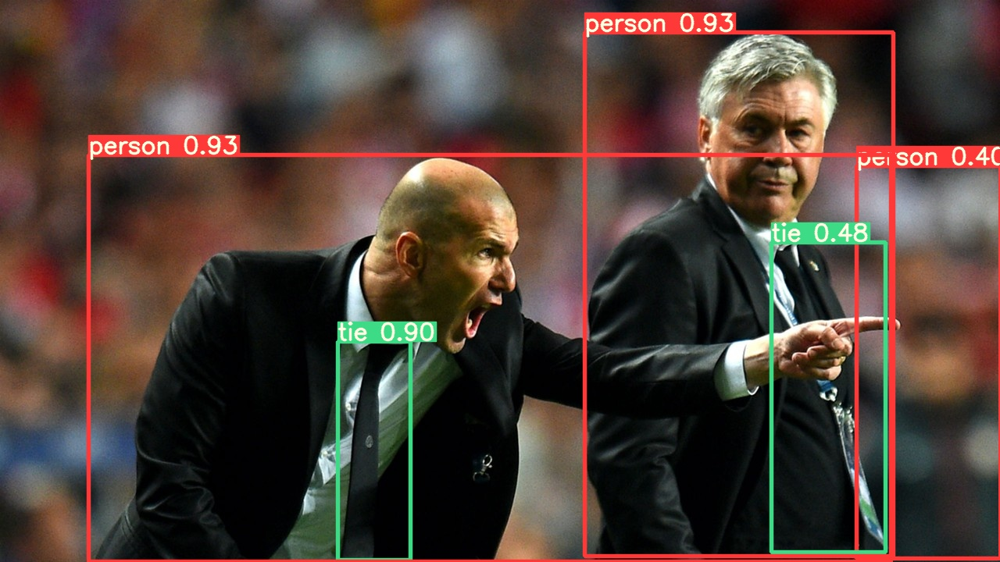

# 一、训练自定义数据集

## 开始之前

    环境：Python>=3.7.0 ，包括PyTorch>=1.7，模型和数据集从最新的YOLOV5版本自动下载

```
git clone https://github.com/ultralytics/yolov5  # clone
cd yolov5
pip install -r requirements.txt  # 安装Yolov5所需模块
conda activate yolov5
```

## 准备数据集

### 创建数据集.yaml

### 创建标签

每个图像一个文件（如果图像中没有对象，则不需要文件）。文件规范为：`*.txt``*.txt``*.txt`

* 每个对象一行
* 每一行都是格式。`class x_center y_center width height`
* 框坐标必须采用规范化的 xywh 格式（从 0 - 1）。如果框以像素为单位，请除以图像宽度和图像高度。`x_center``width``y_center``height`
* 类号的索引为零（从 0 开始）。

### 组织目录

修改数据集中的文件 train.txt、val.txt (两者均为指定数据资源所在位置的文件)：修改数据资源所在的绝对路径

/yolov5/data 添加tired.yaml（在yolov5中指明所训练数据集相关信息）

## 选择型号

    选择要从中开始训练的预训练模型。首先选择[YOLOv5s](https://github.com/ultralytics/yolov5/blob/master/models/yolov5s.yaml)，这是可用第二小和最快的模型。


## 训练

1、配置模型。修改yolov5s.yaml文件中的类别数、锚框大小

2、指定数据集、批量大小、图像大小以及预训练。train.py文件

* weight：权重设置
* cfg：选择模型设置
* data：数据集选择
* epochs：迭代设置，一个完整的数据集通过了神经网络一次并且返回了一次，这个过程称为一次epoch
* batch-size：批大小，每批样本的大小
* imgsz

3、训练

训练执行：

```
python train.py
```

相关内容：

* 添加或加速训练（需要大量 RAM/磁盘资源）

  ```
  --cache ram    --cache disk
  ```
* 始终从本地数据集进行训练
* 所有训练结果都保存到递增的运行目录中：   `runs/train/exp 、runs/train/exp2、runs/train/exp3`

# 二、优化训练

**先使用默认设置进行训练，以建立性能基线 ，这样有助于建立性能**基线并发现需要改进的领域。

## 数据优化

* 每个类的图像。建议每类≥ 1500 张图像
* 每个类的实例数。建议每个类≥ 10000 个实例（标记对象）
* 图像多样性。对于现实世界的用例，我们建议使用一天中不同时间、不同季节、不同天气、不同照明、不同角度、不同来源（在线抓取、本地收集、不同相机）等的图像。
* 标签一致性。必须标记所有图像中所有类的所有实例。部分标记将不起作用。
* 标签准确性。标签必须与对象一一对应。对象与其边界框之间不应存在空格。任何对象都不应缺少标签。
* 标签验证。在***训练启动视图***上查看以验证您的标签是否正确显示。 `train_batch*.jpg`

## 模型选择优化

YOLOv5x 和 [YOLOv5x6](https://github.com/ultralytics/yolov5/releases/tag/v5.0) ：大模型，在几乎所有情况下都会产生很好的结果，但有更多的参数，需要更多的 CUDA 内存来训练，并且运行速度更慢。

* 对于移动部署，通常使用 YOLOv5s/m;
* 对于云部署，通常使用 YOLOv5l/x。

从预训练权重开始：适用于中小型数据集c

```
python train.py --data custom.yaml --weights yolov5s.pt
                                             yolov5m.pt
                                             yolov5l.pt
                                             yolov5x.pt
                                             custom_pretrained.pt
```

从头开始：适用于大型数据集。`--weights ' '`

```
python train.py --data custom.yaml --weights '' --cfg yolov5s.yaml
                                                      yolov5m.yaml
                                                      yolov5l.yaml
                                                      yolov5x.yaml
```

## 训练设置优化

* **Epoch :** 从300开始，如果过早出现过度拟合，可减小epoch值；如果在300个epoch之后没有发生过拟合，则增加迭代次数到600、1200等。
* **Image size:** ***COCO在原生分辨率下训练，尽管由于数据集中有大量的小对象，它可以从更高分辨率的训练中受益，例如。如果有许多小对象，那么自定义数据集将受益于原生或更高分辨率的训练。最好的推理结果是在训练运行时获得的，即在训练的同时进行测试和检测。***

  `--img 640``--img 1280``--img``--img 1280``--img 1280`
* **Batch size :** 在硬件设备允许的情况下尽可能的调大参数，小的batch size 会导致较差的统计数据
* **Hyperparameters :** 首先用默认的超参数训练，然后考虑修改超参数。通常大幅增加超参数将减少和延迟过拟合，从而实现更长的训练和更高的最终 mAP。调整超参数将有助于减少某些特定损失函数的过拟合。

# 三、PyTorch Hub

从 PyTorch Hub 加载预训练的 YOLOv5s 模型，并传递图像进行推理。

## 推理设置

YOLOv5 模型包含各种推理属性，例如 置信度阈值 、IoU 阈值等。通过以下方式设置：

```
model.conf = 0.25  # NMS confidence threshold
      iou = 0.45  # NMS IoU threshold
      agnostic = False  # NMS class-agnostic
      multi_label = False  # NMS multiple labels per box
      classes = None  # (optional list) filter by class, i.e. = [0, 15, 16] for COCO persons, cats and dogs
      max_det = 1000  # maximum number of detections per image
      amp = False  # Automatic Mixed Precision (AMP) inference

results = model(im, size=320)  # custom inference size
```

## 设备

模型在被创建后可以移植到任何设备

```
model.cpu()  # CPU
model.cuda()  # GPU
model.to(device)  # i.e. device=torch.device(0)
```

模型可以在设备里直接被创建。`device`

```
model = torch.hub.load('ultralytics/yolov5', 'yolov5s', device='cpu')  # load on CPU
```

* 在推理之前，输入图像会自动传输到正确的模型设备

## 默认输出

模型可以静默加载 `_verbose=False`

```
model = torch.hub.load('ultralytics/yolov5', 'yolov5s', _verbose=False)  # load silently
```

## 输入通道

要加载具有 5 个输入通道而不是默认 4 个输入通道的预训练 YOLOv3s 模型。

```
model = torch.hub.load('ultralytics/yolov5', 'yolov5s', channels=4)
```

在这种情况下，模型将由预训练权重组成。但第一个输入层除外 ，该输入层的形状不再与预训练输入层相同。输入层将通过随机权重初始化。

## 类数量

加载预训练的YOLOv5s模型，其中包含10个输出类，而不是默认的80个:

```
model = torch.hub.load('ultralytics/yolov5', 'yolov5s', classes=10)
```

## 强制重新加载

如果在执行上述步骤时遇到问题，会通过丢弃现有缓存并强制从 PyTorch Hub 全新下载最新的 YOLOv5 版本进行处理

```
model = torch.hub.load('ultralytics/yolov5', 'yolov5s', force_reload=True)  # force reload
```

# 四、多GPU训练

在yolov5中合理的运用多GPU进行数据集的训练

### 单GPU

```
python train.py  --batch 64 --data coco.yaml --weights yolov5s.pt --device 0
```

### 多GPU数据并行模式（不推荐）

在数据并行模式下使用多个 GPU

```
python train.py  --batch 64 --data coco.yaml --weights yolov5s.pt --device 0,1
```

这种方法很慢，与仅使用 1 个 GPU 相比，几乎无法加快训练速度。

### 多GPU分布式数据并行模式

```
python -m torch.distributed.run --nproc_per_node 2 train.py --batch 64 --data coco.yaml --weights yolov5s.pt --device 0,1
```

`--nproc_per_node`指定要使用的 GPU 数量。在上面的示例中，它是 2。

`--batch `必须是 GPU 数量的倍数。

batch-size 将平均分配给每个 GPU。在上面的例子中，每个 GPU 是 64/2=32。`--batch `

`--device 0,1` 上面的代码将指定GPU .`0... (N-1)`

### 使用 SyncBatchNorm

只需传递如下命令，`--sync-bn`

### 结果

***在具有 2 个 A4 SXM8-100GB 的 [AWS EC4 P40d 实例](https://github.com/ultralytics/yolov5/wiki/AWS-Quickstart)上为 5 个 COCO 周期的 DDP 分析结果。***

| GPUs A100 | batch-size | CUDA_mem device0 (G) | COCO train | COCO val |
| ---------- | ---------- | -------------------- | ---------- | -------- |
| 1x         | 16         | 26GB                 | 20:39      | 0:55     |
| 2x         | 32         | 26GB                 | 11:43      | 0:57     |
| 4x         | 64         | 26GB                 | 5:57       | 0:55     |
| 8x         | 128        | 26GB                 | 3:09       | 0:57     |

# 五、模型集成

在模型集成之前，建立一个单一模型的性能基线。这个命令在COCO val2017上以640像素的图像大小测试YOLOv5x（是现有的最大和最准确的模型）。

```
$ python val.py --weights yolov5x.pt --data coco.yaml --img 640 --half
```

输出结果：

```
val: data=./data/coco.yaml, weights=['yolov5x.pt'], batch_size=32, imgsz=640, conf_thres=0.001, iou_thres=0.65, task=val, device=, single_cls=False, augment=False, verbose=False, save_txt=False, save_hybrid=False, save_conf=False, save_json=True, project=runs/val, name=exp, exist_ok=False, half=True
YOLOv5 🚀 v5.0-267-g6a3ee7c torch 1.9.0+cu102 CUDA:0 (Tesla P100-PCIE-16GB, 16280.875MB)

Fusing layers... 
Model Summary: 476 layers, 87730285 parameters, 0 gradients

val: Scanning '../datasets/coco/val2017' images and labels...4952 found, 48 missing, 0 empty, 0 corrupted: 100% 5000/5000 [00:01<00:00, 2846.03it/s]
val: New cache created: ../datasets/coco/val2017.cache
               Class     Images     Labels          P          R     mAP@.5 mAP@.5:.95: 100% 157/157 [02:30<00:00,  1.05it/s]
                 all       5000      36335      0.746      0.626       0.68       0.49
Speed: 0.1ms pre-process, 22.4ms inference, 1.4ms NMS per image at shape (32, 3, 640, 640)  # <--- baseline speed

Evaluating pycocotools mAP... saving runs/val/exp/yolov5x_predictions.json...
...
 Average Precision  (AP) @[ IoU=0.50:0.95 | area=   all | maxDets=100 ] = 0.504  # <--- baseline mAP
 Average Precision  (AP) @[ IoU=0.50      | area=   all | maxDets=100 ] = 0.688
 Average Precision  (AP) @[ IoU=0.75      | area=   all | maxDets=100 ] = 0.546
 Average Precision  (AP) @[ IoU=0.50:0.95 | area= small | maxDets=100 ] = 0.351
 Average Precision  (AP) @[ IoU=0.50:0.95 | area=medium | maxDets=100 ] = 0.551
 Average Precision  (AP) @[ IoU=0.50:0.95 | area= large | maxDets=100 ] = 0.644
 Average Recall     (AR) @[ IoU=0.50:0.95 | area=   all | maxDets=  1 ] = 0.382
 Average Recall     (AR) @[ IoU=0.50:0.95 | area=   all | maxDets= 10 ] = 0.628
 Average Recall     (AR) @[ IoU=0.50:0.95 | area=   all | maxDets=100 ] = 0.681  # <--- baseline mAR
 Average Recall     (AR) @[ IoU=0.50:0.95 | area= small | maxDets=100 ] = 0.524
 Average Recall     (AR) @[ IoU=0.50:0.95 | area=medium | maxDets=100 ] = 0.735
 Average Recall     (AR) @[ IoU=0.50:0.95 | area= large | maxDets=100 ] = 0.826
```

## 集成测试

通过简单地将多种模型添加到现有的val.py或detect.py命令的参数中，可以在测试和推理时将多个预训练模型集成在一起使用。`--weights`

```
python val.py --weights yolov5x.pt yolov5l6.pt --data coco.yaml --img 640 --half
```

输出结果：

```
val: data=./data/coco.yaml, weights=['yolov5x.pt', 'yolov5l6.pt'], batch_size=32, imgsz=640, conf_thres=0.001, iou_thres=0.6, task=val, device=, single_cls=False, augment=False, verbose=False, save_txt=False, save_hybrid=False, save_conf=False, save_json=True, project=runs/val, name=exp, exist_ok=False, half=True
YOLOv5 🚀 v5.0-267-g6a3ee7c torch 1.9.0+cu102 CUDA:0 (Tesla P100-PCIE-16GB, 16280.875MB)

Fusing layers... 
Model Summary: 476 layers, 87730285 parameters, 0 gradients  # Model 1
Fusing layers... 
Model Summary: 501 layers, 77218620 parameters, 0 gradients  # Model 2
Ensemble created with ['yolov5x.pt', 'yolov5l6.pt']  # Ensemble notice

val: Scanning '../datasets/coco/val2017.cache' images and labels... 4952 found, 48 missing, 0 empty, 0 corrupted: 100% 5000/5000 [00:00<00:00, 49695545.02it/s]
               Class     Images     Labels          P          R     mAP@.5 mAP@.5:.95: 100% 157/157 [03:58<00:00,  1.52s/it]
                 all       5000      36335      0.747      0.637      0.692      0.502
Speed: 0.1ms pre-process, 39.5ms inference, 2.0ms NMS per image at shape (32, 3, 640, 640)  # <--- ensemble speed

Evaluating pycocotools mAP... saving runs/val/exp3/yolov5x_predictions.json...
...
 Average Precision  (AP) @[ IoU=0.50:0.95 | area=   all | maxDets=100 ] = 0.515  # <--- ensemble mAP
 Average Precision  (AP) @[ IoU=0.50      | area=   all | maxDets=100 ] = 0.699
 Average Precision  (AP) @[ IoU=0.75      | area=   all | maxDets=100 ] = 0.557
 Average Precision  (AP) @[ IoU=0.50:0.95 | area= small | maxDets=100 ] = 0.356
 Average Precision  (AP) @[ IoU=0.50:0.95 | area=medium | maxDets=100 ] = 0.563
 Average Precision  (AP) @[ IoU=0.50:0.95 | area= large | maxDets=100 ] = 0.668
 Average Recall     (AR) @[ IoU=0.50:0.95 | area=   all | maxDets=  1 ] = 0.387
 Average Recall     (AR) @[ IoU=0.50:0.95 | area=   all | maxDets= 10 ] = 0.638
 Average Recall     (AR) @[ IoU=0.50:0.95 | area=   all | maxDets=100 ] = 0.689  # <--- ensemble mAR
 Average Recall     (AR) @[ IoU=0.50:0.95 | area= small | maxDets=100 ] = 0.526
 Average Recall     (AR) @[ IoU=0.50:0.95 | area=medium | maxDets=100 ] = 0.743
 Average Recall     (AR) @[ IoU=0.50:0.95 | area= large | maxDets=100 ] = 0.844
```

## 集成推理

将额外的模型附加到参数即可使用集成推理。`--weights`

```
python detect.py --weights yolov5x.pt yolov5l6.pt --img 640 --source data/images
```

输出结果：

```
detect: weights=['yolov5x.pt', 'yolov5l6.pt'], source=data/images, imgsz=640, conf_thres=0.25, iou_thres=0.45, max_det=1000, device=, view_img=False, save_txt=False, save_conf=False, save_crop=False, nosave=False, classes=None, agnostic_nms=False, augment=False, update=False, project=runs/detect, name=exp, exist_ok=False, line_thickness=3, hide_labels=False, hide_conf=False, half=False
YOLOv5 🚀 v5.0-267-g6a3ee7c torch 1.9.0+cu102 CUDA:0 (Tesla P100-PCIE-16GB, 16280.875MB)

Fusing layers... 
Model Summary: 476 layers, 87730285 parameters, 0 gradients
Fusing layers... 
Model Summary: 501 layers, 77218620 parameters, 0 gradients
Ensemble created with ['yolov5x.pt', 'yolov5l6.pt']

image 1/2 /content/yolov5/data/images/bus.jpg: 640x512 4 persons, 1 bus, 1 tie, Done. (0.063s)
image 2/2 /content/yolov5/data/images/zidane.jpg: 384x640 3 persons, 2 ties, Done. (0.056s)
Results saved to runs/detect/exp2
Done. (0.223s)
```



# 六、模型修剪/稀疏度

在模型修剪之前，建立一个单一模型的性能基线。之后在COCO val2017上测试YOLOv5x，图像大小为640像素

```
$ python val.py --weights yolov5x.pt --data coco.yaml --img 640 --half
```

输出结果：

```
val: data=/content/yolov5/data/coco.yaml, weights=['yolov5x.pt'], batch_size=32, imgsz=640, conf_thres=0.001, iou_thres=0.65, task=val, device=, workers=8, single_cls=False, augment=False, verbose=False, save_txt=False, save_hybrid=False, save_conf=False, save_json=True, project=runs/val, name=exp, exist_ok=False, half=True, dnn=False
YOLOv5 🚀 v6.0-224-g4c40933 torch 1.10.0+cu111 CUDA:0 (Tesla V100-SXM2-16GB, 16160MiB)

Fusing layers... 
Model Summary: 444 layers, 86705005 parameters, 0 gradients
val: Scanning '/content/datasets/coco/val2017.cache' images and labels... 4952 found, 48 missing, 0 empty, 0 corrupt: 100% 5000/5000 [00:00<?, ?it/s]
               Class     Images     Labels          P          R     mAP@.5 mAP@.5:.95: 100% 157/157 [01:12<00:00,  2.16it/s]
                 all       5000      36335      0.732      0.628      0.683      0.496
Speed: 0.1ms pre-process, 5.2ms inference, 1.7ms NMS per image at shape (32, 3, 640, 640)  # <--- base speed

Evaluating pycocotools mAP... saving runs/val/exp2/yolov5x_predictions.json...
...
 Average Precision  (AP) @[ IoU=0.50:0.95 | area=   all | maxDets=100 ] = 0.507  # <--- base mAP
 Average Precision  (AP) @[ IoU=0.50      | area=   all | maxDets=100 ] = 0.689
 Average Precision  (AP) @[ IoU=0.75      | area=   all | maxDets=100 ] = 0.552
 Average Precision  (AP) @[ IoU=0.50:0.95 | area= small | maxDets=100 ] = 0.345
 Average Precision  (AP) @[ IoU=0.50:0.95 | area=medium | maxDets=100 ] = 0.559
 Average Precision  (AP) @[ IoU=0.50:0.95 | area= large | maxDets=100 ] = 0.652
 Average Recall     (AR) @[ IoU=0.50:0.95 | area=   all | maxDets=  1 ] = 0.381
 Average Recall     (AR) @[ IoU=0.50:0.95 | area=   all | maxDets= 10 ] = 0.630
 Average Recall     (AR) @[ IoU=0.50:0.95 | area=   all | maxDets=100 ] = 0.682
 Average Recall     (AR) @[ IoU=0.50:0.95 | area= small | maxDets=100 ] = 0.526
 Average Recall     (AR) @[ IoU=0.50:0.95 | area=medium | maxDets=100 ] = 0.731
 Average Recall     (AR) @[ IoU=0.50:0.95 | area= large | maxDets=100 ] = 0.829
Results saved to runs/val/exp
```

对修剪后的模型重复上述测试，更新YOLOv5x到0.3稀疏度 `torch_utils.prune()val.py`

30%修剪后的输出：

```
val: data=/content/yolov5/data/coco.yaml, weights=['yolov5x.pt'], batch_size=32, imgsz=640, conf_thres=0.001, iou_thres=0.65, task=val, device=, workers=8, single_cls=False, augment=False, verbose=False, save_txt=False, save_hybrid=False, save_conf=False, save_json=True, project=runs/val, name=exp, exist_ok=False, half=True, dnn=False
YOLOv5 🚀 v6.0-224-g4c40933 torch 1.10.0+cu111 CUDA:0 (Tesla V100-SXM2-16GB, 16160MiB)

Fusing layers... 
Model Summary: 444 layers, 86705005 parameters, 0 gradients
Pruning model...  0.3 global sparsity
val: Scanning '/content/datasets/coco/val2017.cache' images and labels... 4952 found, 48 missing, 0 empty, 0 corrupt: 100% 5000/5000 [00:00<?, ?it/s]
               Class     Images     Labels          P          R     mAP@.5 mAP@.5:.95: 100% 157/157 [01:11<00:00,  2.19it/s]
                 all       5000      36335      0.724      0.614      0.671      0.478
Speed: 0.1ms pre-process, 5.2ms inference, 1.7ms NMS per image at shape (32, 3, 640, 640)  # <--- prune mAP

Evaluating pycocotools mAP... saving runs/val/exp3/yolov5x_predictions.json...
...
 Average Precision  (AP) @[ IoU=0.50:0.95 | area=   all | maxDets=100 ] = 0.489  # <--- prune mAP
 Average Precision  (AP) @[ IoU=0.50      | area=   all | maxDets=100 ] = 0.677
 Average Precision  (AP) @[ IoU=0.75      | area=   all | maxDets=100 ] = 0.537
 Average Precision  (AP) @[ IoU=0.50:0.95 | area= small | maxDets=100 ] = 0.334
 Average Precision  (AP) @[ IoU=0.50:0.95 | area=medium | maxDets=100 ] = 0.542
 Average Precision  (AP) @[ IoU=0.50:0.95 | area= large | maxDets=100 ] = 0.635
 Average Recall     (AR) @[ IoU=0.50:0.95 | area=   all | maxDets=  1 ] = 0.370
 Average Recall     (AR) @[ IoU=0.50:0.95 | area=   all | maxDets= 10 ] = 0.612
 Average Recall     (AR) @[ IoU=0.50:0.95 | area=   all | maxDets=100 ] = 0.664
 Average Recall     (AR) @[ IoU=0.50:0.95 | area= small | maxDets=100 ] = 0.496
 Average Recall     (AR) @[ IoU=0.50:0.95 | area=medium | maxDets=100 ] = 0.722
 Average Recall     (AR) @[ IoU=0.50:0.95 | area= large | maxDets=100 ] = 0.803
Results saved to runs/val/exp3
```

在结果中我们可以观察到，在剪枝后，我们的模型达到了30%的稀疏性，这意味着30%的模型在层中的权重参数等于0。推理时间基本不变，而模型的AP和AR分数略有降低。
