# Word 转 PDF

## 目录中显示：错误未定义书签

全选后按住ctrl+F11或者Ctrl+Shift+F9即可

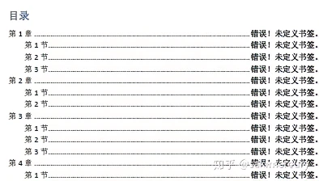

Distribution Focal Loss的公式如下：

$$
\begin{aligned}
L_{DFL}(p_i, t_i) &= -\alpha_t (1 - p_i)^{\gamma_t} \log(p_i) \
&\quad\quad -\alpha_f p_i^{\gamma_f} \log(1 - p_i) \
&\quad\quad -\beta_t \log(\hat{p}_i) - \beta_f \log(1 - \hat{p}_i),
\end{aligned}
$$

其中，$p_i$表示预测框$i$中包含目标的概率，$t_i$表示$i$框的真实类别标签，$\alpha_t$和$\alpha_f$是正负样本的平衡参数，$\gamma_t$和$\gamma_f$是Focal Loss中的调节因子，$\hat{p}_i$表示预测框$i$中目标的分布概率密度函数，$\beta_t$和$\beta_f$是[Distribution Focal Loss]()中的调节因子。

具体来说，该损失函数中的第一项和第二项分别是Focal Loss中的正样本损失和负样本损失，用于加强对难分类样本的学习。而第三项和第四项是Distribution Focal Loss中的正样本损失和负样本损失，用于约束预测框中目标的分布概率密度函数，以更好地衡量目标检测中边界框的不确定性。

需要注意的是，以上公式中的各个参数需要根据具体的任务和数据集进行调节和优化。

# 批量复制指定文件

## 1.生成文件清单

点击主页工具栏上的复制路径图标

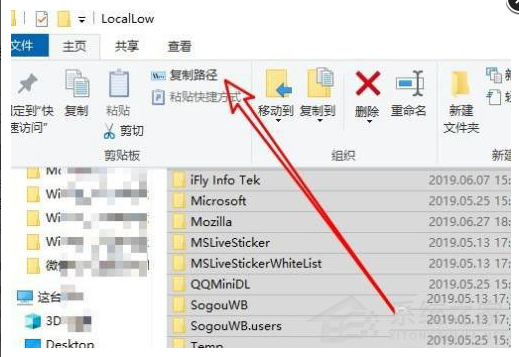

粘贴到空白文件中

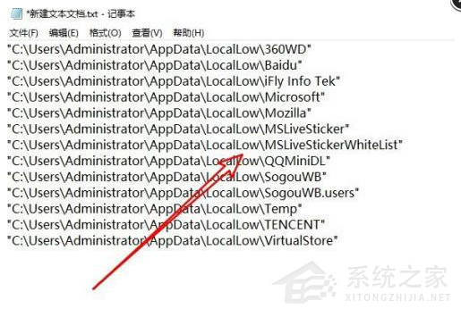

## 批量复制

将已知的文件名复制到excel中第一列的位置

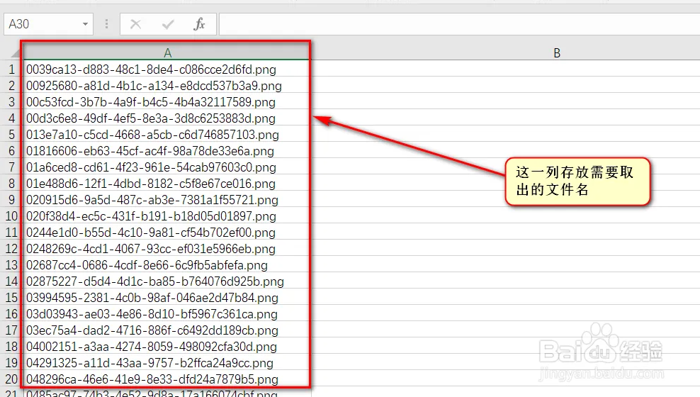

="copy D:\IMAGE\FAIL\"  & A1 & " D:\IMAGE\test"。其中“D:\IMAGE\FAIL\”与“D:\IMAGE\test”替换成自己对应的源文件路径名和目标路径

再复制一次粘贴为值

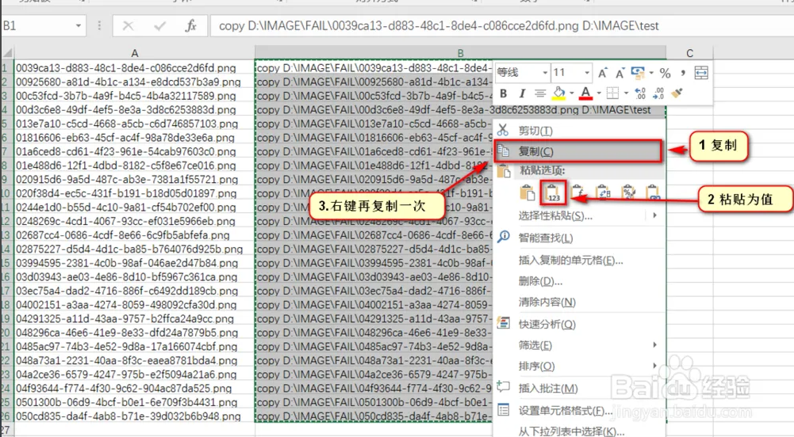

新建一个记事本复制copy...的内容

最后把“.txt”修改为“.bat”执行该文件

# Git

## Git Bash安装

### 1.下载git for windows并安装，除了以下步骤其他不用管。

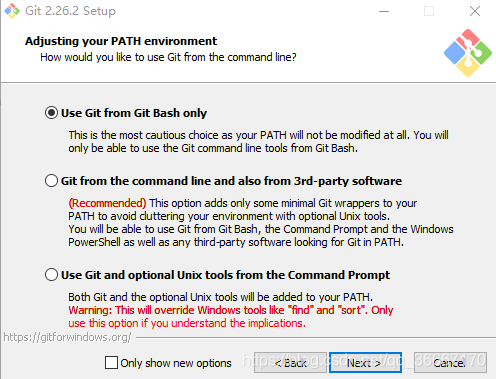

### 2.设置用户

打开git bash，输入以下命令

```
git config --global user.name "Your Name"（注意前边是“- -global”，有两个横线）
git config --global user.email "email@example.com"
```

### 3.初始化本地仓库

在本地仓库中打开 git bash

```
git init  //本地仓库初始化
```

### 4.新建远程仓库

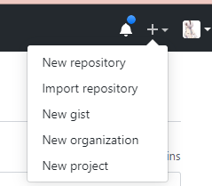


### 5.配置Git SSH Keys

 `~/.ssh`检查是否有SSH Keys

如果没有，打开Git Bash，创建SSH Key：`ssh-keygen -t rsa -C "你的邮箱"`。

然后显示：

```
Generating public/private rsa key pair.
Enter file in which to save the key (/c/Users/16627/.ssh/id_rsa):
//操作1：这是输入文件名用来保存 SSH Key代码，直接回车使用默认。
Enter passphrase (empty for no passphrase):
Enter same passphrase again:
//操作2：设置密码，直接回车不设置密码
Your identification has been saved in /c/Users/…/.ssh/id_rsa
Your public key has been saved in /c/Users/…/.ssh/id_rsa.pub
//3.表明已经设置好了
```

打开github

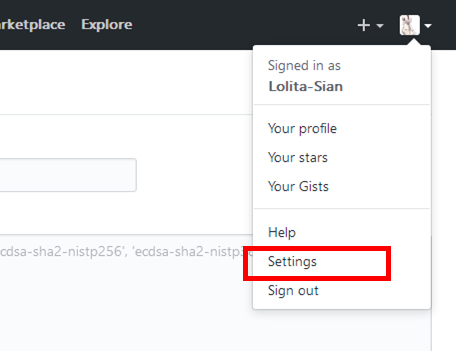

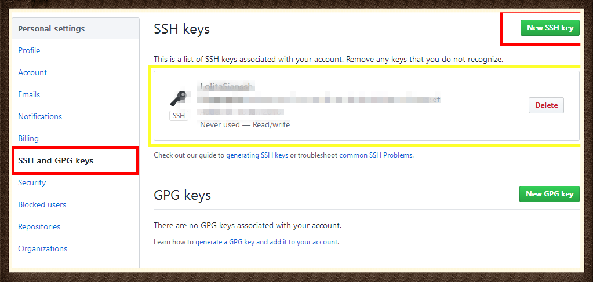

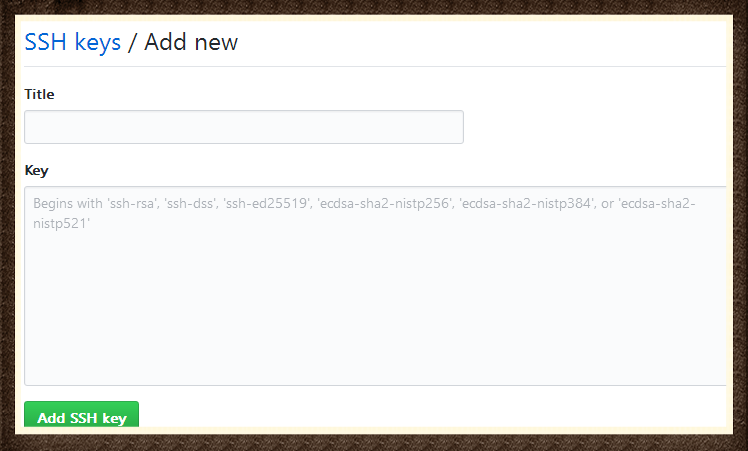

`~/.ssh`查看路径

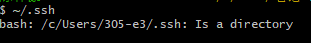

打开id_rsa.pub文件，全选其中的内容粘贴到网页的Key中。

在git bash中输入 `ssh -T git@github.com`查看是否设置成功，成功的输出

```
Hi “用户名”! You’ve successfully authenticated, but GitHub does not provide shell access.
```

### 6.本地端仓库配置

```
git init
git remote add + 仓库名字 + 连接地址  //连接远程仓库，例如：git remote add Cplus_Study git@github.com:RightOff/Cplus_Study.git

git remote -v	//查看是否添加成功，输出结果如下  //Cplus_Study     git@github.com:RightOff/Cplus_Study.git (fetch)//Cplus_Study    git@github.com:RightOff/Cplus_Study.git (push)
git remote remove + 仓库名字	//删除连接
```

本地仓库是master 分支，需要修改成和远程仓库的main分支相同的名字

```
git branch -m master main
```

### 7.文件上传

主要最后一条就可以了。

```
$ git add +文件名.文件类型 ，将某个文件加到缓存区
$ git add +文件名.文件类型 ... 文件名.文件类型 ，将n个文件添加到缓存区
$ git add xx文件夹/*.html，将xx文件夹下的所有的html文件添加到缓存区。
$ git add *hhh ，将以hhh结尾的文件的所有修改添加到暂存区
$ git add Hello* ，将所有以Hello开头的文件的修改添加到暂存区
git add -u ，提交被修改(modified)和被删除(deleted)文件，不包括新文件(new)
git add .，提交新文件(new)和被修改(modified)文件，不包括被删除(deleted)文件
…
git add -A，提交所有变化。git add前几条都可以记不住，这个必须记住！！！
```

给add的东西加一个备注，你上传到远程仓库之后，修改的文件后边会显示这个备注

```
git commit -m "修改注释"		//不加-m会进入vim编辑器模式，对新手不友好
```

上传操作：

```
git push -u 仓库名称 分支 -f	//第一次上传需要-f,由于本地和远程第一次存在差异，会报错，因此需要强制覆盖远程仓库的数据
git push -u 仓库名称 分支	//之后就不需要加 -f
```

### 8.文件下拉

方法1：`git pull 仓库名称`

方法2：

```
git fetch	//将数据拉下来，但是没修改本地的commit和文件   
git merge	//改变本地数据
```

### 9.文件克隆

```
git clone 地址
```

## VScode中配置git


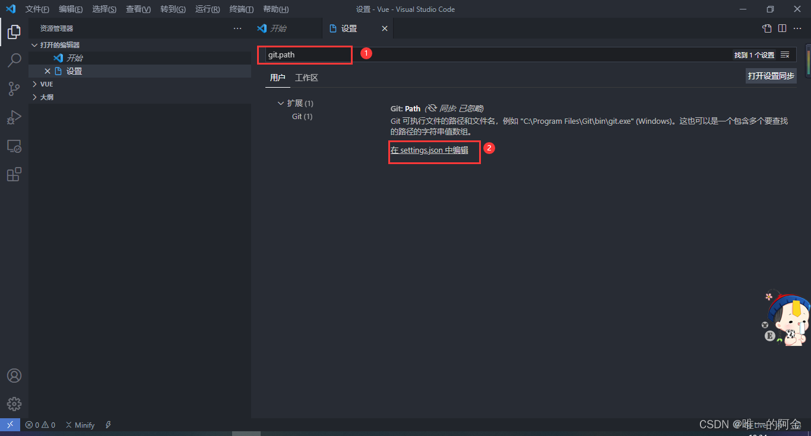

将安装目录下cmd/git.exe的路径写入

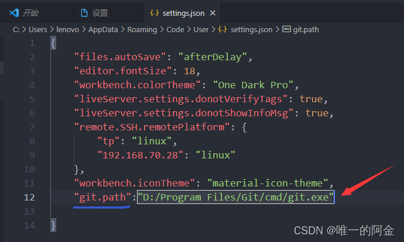

重启VScode后查看以下内容表示正确安装。

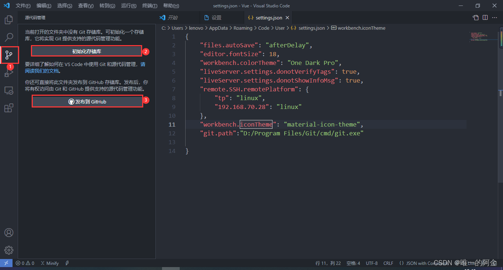

### git很慢解决方法

在提交的时候填写一下提交信息。

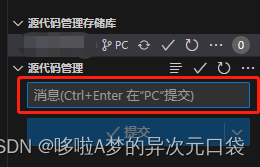
